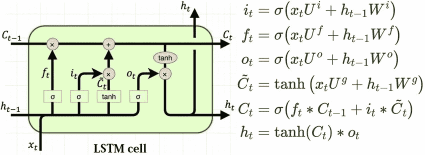
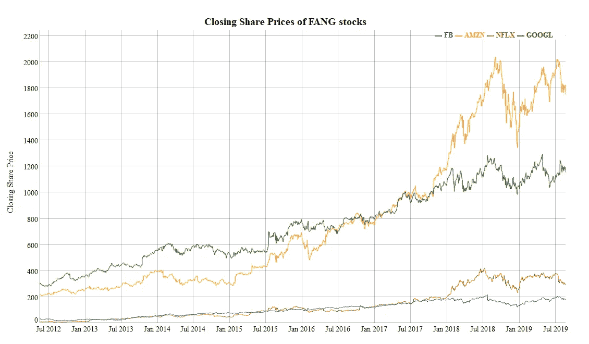
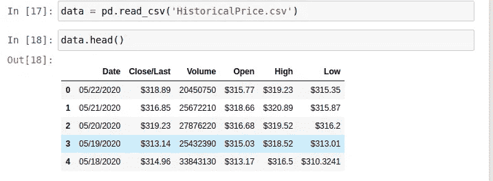
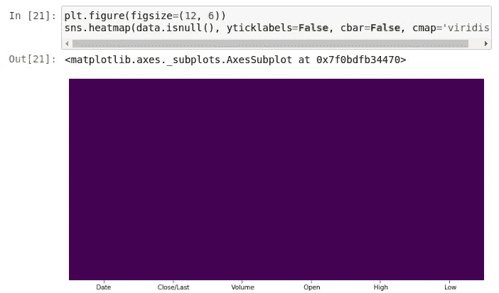
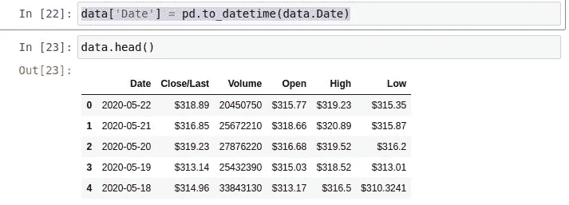
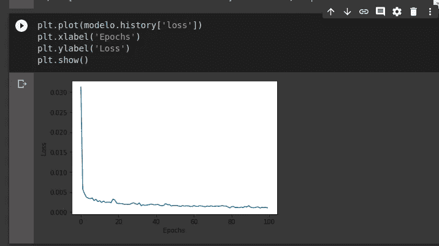
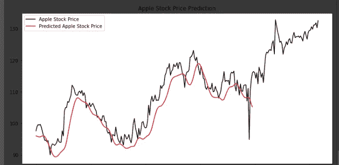

# 用 LSTM 和张量流预测苹果股票价格

> 原文：<https://medium.com/analytics-vidhya/forecasting-apple-stock-prices-using-lstms-and-tensorflow-e070f8c80723?source=collection_archive---------1----------------------->

作为奖励，变得富有！开个玩笑，兄弟。


来源[此处](https://www.google.com/url?sa=i&url=https%3A%2F%2Fgiphy.com%2Fgifs%2Fwatch-most-important-FAxPrWrvKDPji&psig=AOvVaw0XQ9PkZscxhGNuqT42-u7I&ust=1590435657749000&source=images&cd=vfe&ved=0CAIQjRxqFwoTCJjyitagzekCFQAAAAAdAAAAABAD)

在本帖中，我们将使用 Tensorflow 建立一个 *LSTM 模型来预测苹果股票价格*！

***股票价格预测*** 是机器学习中一个非常有趣的领域。我个人一直对这个领域的应用很感兴趣。

**机器学习**在过去几年里对 ***股市预测*** 变得非常有用，如今，许多投资公司都在使用机器学习在**股市**中做决策。

而且不像很多人认为的那样，我们不需要有一个惊人的**机器学习模型**才能真正赚钱。

> **警告:**这篇文章的目的只是调查和展示机器学习模型如何在股票市场中工作，这不是一个投资建议！股市变化快，不推荐给没有经验的新手！

现在，我们可以继续了！

# **LSTM 的作品如何？**

基本上， ***LSTM 型号的*** 可以随时间存储信息。当我们想要处理时间序列或顺序数据时，这非常有用。

**LSTM 模型**与人类大脑非常相似。当有人对你说:

> **“马克和简正在街上踢足球”**

你已经知道什么是足球，谁是马克和简，什么是街道，所以你可以更容易地处理和理解这些信息。

假设你什么都不知道，那将会非常复杂，而且很可能你不会在第一时间理解这些信息。

LSTM 的作品是这样的，在储存信息后，他们可以解决更复杂的问题，而先前的信息是重要的。

在这篇文章的问题中，当我们想预测价格时，我们需要以前的信息。这就是为什么 LSTM 的非常有用！

LSTM 的另一个重要特征是，我们可以决定哪些信息将被存储，哪些信息将被丢弃。我们使用门来做到这一点，这有助于我们避免像[消失梯度问题](https://www.superdatascience.com/blogs/recurrent-neural-networks-rnn-the-vanishing-gradient-problem/)这样的问题。

在下图中，我们有一个 LSTM 细胞结构和她的功能:



来源[此处](https://www.google.com/url?sa=i&url=https%3A%2F%2Fwww.researchgate.net%2Ffigure%2FStructure-of-the-LSTM-cell-and-equations-that-describe-the-gates-of-an-LSTM-cell_fig5_329362532&psig=AOvVaw0Do5ORi7-ZJs1WJw1YyWZG&ust=1590437056825000&source=images&cd=vfe&ved=0CAIQjRxqFwoTCLjC0PClzekCFQAAAAAdAAAAABAI)

基本上，在这个功能中出现了遗忘、更新和存储信息的魔力。

如果你想更多地了解 LSTM，我推荐[这篇文章](https://machinelearningmastery.com/gentle-introduction-long-short-term-memory-networks-experts/)。

现在，让我们来解决我们的问题吧！

# 理解问题

正如你之前看到的，预测股票价格是关于使用序列数据，过去的数据对我们的预测有直接影响。

这是一个股票价格序列数据的例子:



来源[此处](https://www.google.com/url?sa=i&url=https%3A%2F%2Ftowardsdatascience.com%2Fpredicting-fang-stock-prices-ecac4ddd27c1&psig=AOvVaw15J6cxN184rRMay4sF5GLm&ust=1590440932417000&source=images&cd=vfe&ved=0CAIQjRxqFwoTCNCm-6m0zekCFQAAAAAdAAAAABAD)

我们想做的是:给我们的模型一个苹果的股票价格历史，他将在这些数据中识别模式，并进行大量的计算，然后，给我们预测！

***还有我为什么选择苹果股票？***


事实上，我就是喜欢苹果！GIF [此处](https://www.google.com/url?sa=i&url=https%3A%2F%2Fgiphy.com%2Fexplore%2Fstock-market&psig=AOvVaw1IKov4A4KXCiwQ9L026hJc&ust=1590435580504000&source=images&cd=vfe&ved=0CAIQjRxqFwoTCLDRn7agzekCFQAAAAAdAAAAABAD)

所以首先，我们需要下载我们的数据。对于这个项目，我使用了一个直接从纳斯达克导出的数据集，你可以在这里下载这个数据[。](https://www.nasdaq.com/market-activity/stocks/aapl/historical)

我们正在使用神经网络，所以数据越多越好，我使用了过去 5 年的价格，这对我们来说很好。

下载完数据后，我们要做任何数据科学家或机器学习工程师最糟糕的部分，适应！

> 已经格式化的数据在这篇文章的资源库中，在这篇文章的末尾。

但是首先调整我们的数据，我们需要看看我们将调整和格式化什么。如果我们看一下数据，看起来是这样的:



我们数据集的头

现在，我们想知道我们的数据集是否有空值，一个好的方法是使用 Seaborn 的 ***heatmap()*** 来可视化它。



感谢上帝，我们没有空数据！

但是正如你之前看到的，我们的“日期”栏使用了“/”，这会干扰我们的工作，所以我们需要格式化它！

> 实际上，对于我们的模型，我们只想使用开放列，但是这个“日期”列的格式很好，我们可以在以后的其他项目中使用相同的数据。

要格式化我们的“日期”列，我们可以使用来自熊猫的 ***到 _datetime()*** :

```
data[‘Date’] = pd.to_datetime(data.Date)
```

现在，我们的日期列是日期时间格式！



更好，对吗？

现在，我们需要格式化我们的价格，它们是字符串格式。这很容易做到，我们可以用 ***替换掉 String 类中的()*** 。

```
data[‘Open’] = data[‘Open’].replace({‘\$’:’’}, regex=True).astype(float)
data[‘High’] = data[‘High’].replace({‘\$’: ‘’}, regex=True).astype(float)
data[‘Close/Last’] = data[‘Close/Last’].replace({‘\$’: ‘’}, regex=True).astype(float)
data[‘Low’] = data[‘Low’].replace({‘\$’: ‘’}, regex=True).astype(float)
```

数据中最后一个要改变的是删除列名中的空格，我们可以使用 Pandas 中的***【rename()***来完成。

```
data.rename(columns={‘ Close/Last’: ‘Close/Last’, ‘ Volume’: ‘Volume’,
 ‘ Open’: ‘Open’, ‘ High’: ‘High’, ‘ Low’: ‘Low’},
 inplace=True)
```

现在，我们的数据集已经格式化，可以进行分割了。

我们的数据集有 1258 行，我们希望将 1000 行用于训练，258 行用于测试:

```
# Split into train and test:data_to_train = data[:1000]
data_to_test = data[1000:]
```

现在，我们可以保存 2 个 csv 文件，进行训练和测试。

```
data_to_train.to_csv(‘train_data.csv’)
data_to_test.to_csv(‘test_data.csv’)
```

***该做机器学习了，宝贝！***

# 构建我们的模型

这个架构是基于 [Derrick Mwiti 模型](https://github.com/mwitiderrick/stockprice/blob/master/TATA%20.ipynb)的，我测试过，结果太好了！

我们想在我们的模型中使用“开放”列，所以我们可以使用 ***iloc*** 来获取他的值。

```
training_set = train_data.iloc[: , 3:4].values
```

我们想定义一个变量 real_stock_price 来存储我们的真实数据，以便稍后与我们的模型预测进行比较！

```
real_stock_price = test_data.iloc[: , 3:4].values
```

从“Open”列中取出值后，我们需要对它们进行缩放。这使得我们的模型表现更好！

要缩放数值，我们可以用 ***sklearn*** ！

```
# Normalizing data, scale between 0 and 1:from sklearn.preprocessing import MinMaxScalersc = MinMaxScaler(feature_range=(0, 1))training_data_scaled = sc.fit_transform(training_set)
```

缩放训练数据后，我们需要将其格式化为 3D 数组，以输入到我们的 LSTM 模型中。我们通过创建 60 个时间戳来做到这一点。

```
X_train = []y_train = []for i in range(60, 1000): X_train.append(training_data_scaled[i-60:i, 0]) y_train.append(training_data_scaled[i, 0])X_train, y_train = np.array(X_train), np.array(y_train)
```

这样做之后，我们的数据就可以输入到我们的模型中了！

我们的模型将使用以下架构:

```
# Building Model:model = tf.keras.models.Sequential()model.add(tf.keras.layers.LSTM(units=50, return_sequences=True,input_shape=(X_train.shape[1], 1)))model.add(tf.keras.layers.Dropout(0.2))model.add(tf.keras.layers.LSTM(units=50, return_sequences=True))model.add(tf.keras.layers.Dropout(0.2))model.add(tf.keras.layers.LSTM(units=50, return_sequences=True))model.add(tf.keras.layers.Dropout(0.2))model.add(tf.keras.layers.LSTM(units=50))model.add(tf.keras.layers.Dropout(0.2))model.add(tf.keras.layers.Dense(units=1))model.summary()
```

我们使用丢弃层来避免过拟合问题，此外，我们使用参数***【return _ sequences】***来确定该层是否将返回与 LSTM 兼容的序列。我们用***【return _ sequences = True】***当我们有了 LSTM 层之后！

在构建我们的模型之后，我们希望用以下代码来编译它:

*   [***亚当优化器***](https://machinelearningmastery.com/adam-optimization-algorithm-for-deep-learning/)
*   [***均方误差损失函数***](https://www.statisticshowto.com/mean-squared-error/)

现在，是时候适合我们的模型了！

```
modelo = model.fit(X_train, y_train, epochs=100, batch_size=32)
```

在训练我们的模型之后，我们可以绘制损失图来可视化它有多好:



惊人的损失 S2

# **做出预测**

为了进行预测，我们需要使用我们的测试数据集，并像我们之前在训练数据集中所做的那样格式化他。

```
dataset_total = pd.concat([train_data[‘Open’], test_data[‘Open’]], axis=0)inputs = dataset_total[len(dataset_total) — len(test_data) — 60:].valuesinputs = inputs.reshape(-1,1)inputs = sc.transform(inputs)X_test = []for i in range(60, 259): X_test.append(inputs[i-60:i, 0])X_test = np.array(X_test)X_test = np.reshape(X_test, (X_test.shape[0], X_test.shape[1], 1))
```

格式化测试数据后，我们可以在 X_test 中进行预测。

```
predicted_stock_price = model.predict(X_test)
```

但是在绘制我们的预测之前，我们需要在预测数组中做一个***【inverse _ transform()***，因为我们使用标度做预测，所以我们的预测在 0 和 1 之间。

```
predicted_stock_price = model.predict(X_test)
```

现在，是时候绘制预测图了，看看我们的模型与真实股票价格相比表现如何。



不错吧？

如你所见，我们的模型表现得太好了！

你可以在任何价格预测中使用本文的相同方法，让我们赚钱吧宝贝！

你可以在[这里](https://github.com/gabrielmayers/apple_stocks_forecasting)访问这个帖子的资源库。

目前，这就是全部！

下次见！

***我的社交媒体:***

***领英:****[https://www.linkedin.com/in/gabriel-mayer-779b5a162/](https://www.linkedin.com/in/gabriel-mayer-779b5a162/)*

****GitHub:*【https://github.com/gabrielmayers】***

****Instagram:***[https://www.instagram.com/gabrielmayerl/](https://www.instagram.com/gabrielmayerl/)*

# *参考*

*[1] Derrick Mwiti，[股价预测教程](https://github.com/mwitiderrick/stockprice)的数据和笔记本(2018)，Github*