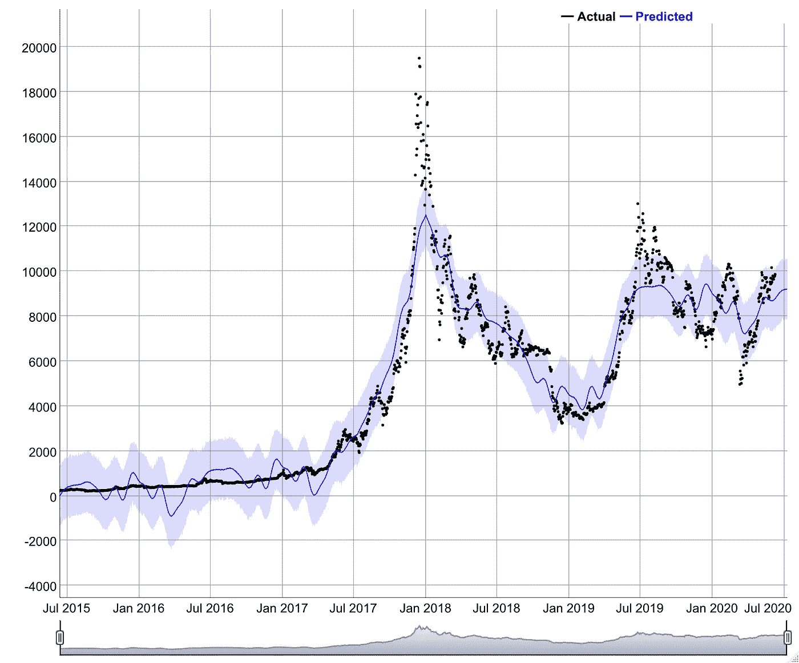
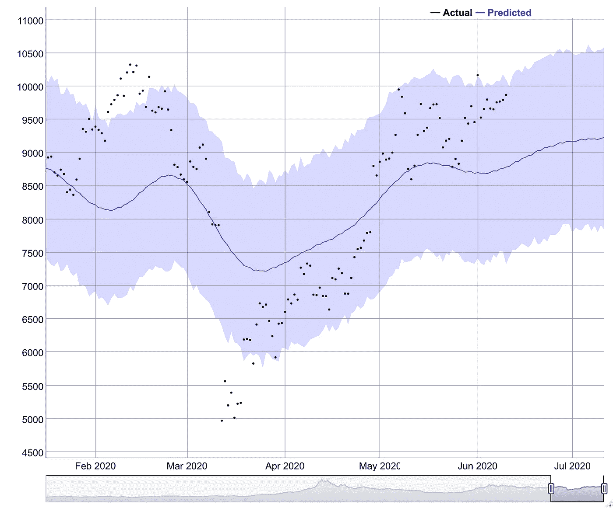
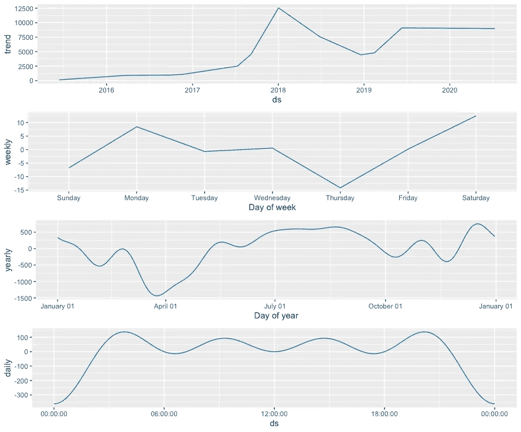

# 使用 Prophet in R 预测比特币价格

> 原文：<https://medium.com/analytics-vidhya/forecasting-bitcoin-prices-using-prophet-in-r-858e10cfb942?source=collection_archive---------7----------------------->



使用 Prophet 进行动态预测

预测可能是相当令人生畏的，特别是考虑到能够识别预测策略所需的知识，这可能涉及带有严格数学基础的沉重概念。幸运的是，脸书聪明的开发者开发了一个简单的预测库，叫做 Prophet，它让预测新手看起来也像专家。我想先说一下，先知模型并不完美，在大多数情况下也不能被认为是最好的。它通常用于带有相当多季节性、趋势和漂移的模型。这就是商业销售数据的情况，其中与常规季度或工作日相比，在假日季度或周末可能会看到更高的值。

首先，我们需要**在 r 中安装 prophet 库**，这涉及到使用 *install.packages()* 命令。

```
install.packages('prophet')
```

然后**使用*库()*命令调用**这个包。

```
library(prophet)
library(tidyverse)
```

对于这个例子，我们将使用可以在雅虎财经获得的*每日比特币调整收盘值*。可以在这里找到数据集的链接，它位于名为 Prophet Forecasting with Prophet 的文件夹中

[https://drive . Google . com/drive/folders/11 max h0 trxjuf 1y _ yh-AJXgxulHQwcBEn](https://drive.google.com/drive/folders/11mAXh0trxjuf1y_yh-AJXgxulHQwcBEn)

```
bitcoin <- read.csv(file.choose())
head(bitcoin)
tail(bitcoin)
```

我们使用 *read.csv()* 命令导入数据集。 *file.choose()* 命令打开对话框，您可以选择数据集。我们创建了一个名为比特币的对象来存储数据集。 *head()* 命令显示前几行，而 *tail()* 命令显示最后几行。注意，ds 列包含日期，y 列包含比特币收盘价。按照惯例，prophet 将 ds 列读取为日期，将 y 列读取为序列。因此，您可能需要重命名列以符合这一约定。此外，您可能需要将日期设置为 *YYYY-mm-dd* 格式，因为这是 prophet 识别的格式。

```
Model1 <- prophet(bitcoin)
Future1 <- make_future_dataframe(Model1, periods = 31)
```

我们现在将**构建模型**。我们使用 *prophet()* 命令来创建一个动态预测模型。我们将这个模型存储为一个名为 Model1 的对象。之后，我们将使用*make _ future _ data frame()*命令向样本添加 31 个周期。这将在下一步中用未来预测值填充。

```
Forecast1 <- predict(Model1, Future1)
tail(Forecast1[c('ds','yhat','yhat_lower','yhat_upper')])
```

我们将使用 *predict()* 来**预测**预测值，并创建一个对象预测 1 来存储这些值。 *tail* 命令将列出最后几个预测观测值，其中包含日期(ds)、预测值(that)和估计值置信区间的详细信息。

```
dyplot.prophet(Model1, Forecast1)
```

我们使用 *dyplot.prophet()* 命令来**绘制预测图**，这为我们提供了本文开头的数字。我们还可以使用绘图区底部的滑块来调整跨度。



预测值

正如我们所见，下个月比特币价格似乎有上升趋势。您可以通过悬停在该区域或打印 r 中的值来查看具体值。我们还可以使用*prophet _ plot _ components()*命令来查看某些季节性或一周中的某一天的影响。

```
prophet_plot_components(Model1, Forecast1)
```



分解预测序列

我希望您能够看到使用 prophet 函数进行预测是多么容易，并且非常适合生成需要简单分析的快速报告。为了更好的实践，我制作了一个视频，详细介绍了下面的所有命令。