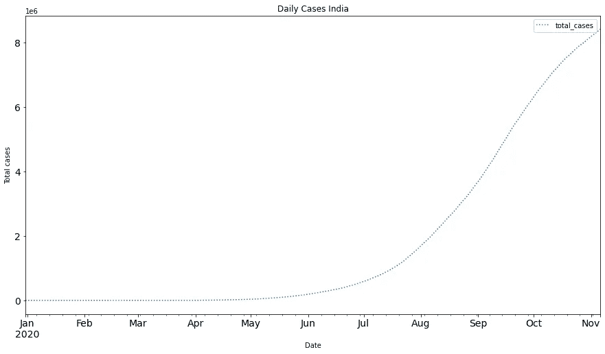

# 实时预测不同国家的新冠肺炎病例

> 原文：<https://medium.com/analytics-vidhya/forecasting-covid-19-cases-in-realtime-for-different-countries-d1d06fd1f1ec?source=collection_archive---------12----------------------->

# 如何预测一个国家或地区新冠肺炎病例的上升/下降？

2020 年 2 月 11 日，世卫组织宣布了一种新型冠状病毒疾病的名称:新冠肺炎。

这种病毒席卷了全世界。冠状病毒在中国首次被发现后，现在已经在大约 212 个国家传播。全球每个国家的病例总数都呈指数增长。截至 2020 年 12 月 15 日，报告的病例总数达到 7300 万，其中 160 万已经死亡。

在目前新冠肺炎的疫情情况下，感染人数和死亡人数都在上升。鉴于目前的增长速度，如果不采取具体的预防措施，这些病例预计在未来几天会到达哪里？

下图显示了一些国家从 2020 年 1 月到 2020 年 10 月发现的病例总数。


2020 年 1 月至 10 月 4 个国家的病例总数

这个想法是为了了解冠状病毒感染的模式并预测其传播

1.  预测未来几天的病例总数
2.  确定每天病例的增加和热点
3.  我们的时间序列分析如何帮助当前的情况？

我们可以做一个 ***时间序列*** 分析来创建一个有助于预测的模型。我们使用 Python 编程进行分析。我们加载必要的包并附加数据集。

让我们探索数据集并执行预处理步骤。数据集可以在这个网站上找到。该数据集每天更新。您可以直接从 URL 获取数据集，也可以使用下载版本。

```
import itertoolsimport pandas as PDimport NumPy as npimport matplotlib.pyplot as pltfrom sklearn.metrics import mean_squared_errorfrom math import sqrtfrom statsmodels.tsa.API import ExponentialSmoothing, SimpleExpSmoothing, Holtimport statsmodels.api as sm#From URLurl = 'https://covid.ourworldindata.org/data/owid-covid-data.csv'full_data = pd.read_csv(url)#Import downloaded dataurl = r"…..\Covid19Data\owid-covid-data.csv"full_data = pd.read_csv(url)
```

如果你看一下数据，它包含从 2019 年 12 月 31 日开始的国家数据。

它包含总病例数、新病例、总死亡数和新死亡数。我们可以忽略其余的列。

我们将执行预处理步骤，从数据集中选择特定的国家和相应的列。

下面的函数也将数据转换成时间序列数据。你可以说出任何你想预测的国家名称。这里我考虑对" total_cases "列进行分析。在 [github](https://github.com/rucha80/Covid19-Predictions) 链接中上传了从四列中选择一列的通用代码(‘total _ cases’，‘new _ cases’，‘total _ deaths’，‘new _ deaths’)。

```
country = “India”def data_for_country(country,data): data = data[["location","date","total_cases"]] #select location,date and no of cases column data = data[data["location"] == country] #select particular country data = data[data["total_cases"] != 0] #remove null values data.reset_index(inplace = True) #covert to time series data data.Timestamp = pd.to_datetime(data.date,format='%Y-%m-%d') data.index = data.Timestamp data=data.drop('index',1) data=data.drop('location',1) data=data.drop('date',1) data = data.resample('D').mean() data.total_cases=    data.total_cases.fillna(method='bfill').fillna(method='ffill') return datadata = data_for_country(country, full_data)data.head(6)Out[16]: 
            total_cases
date                   
2019-12-31          1.0
2020-01-01          1.0
2020-01-02          1.0
2020-01-03          1.0
2020-01-04          1.0
2020-01-05          1.0
```

现在，我们将绘制这些数据来了解趋势。

```
def plot_Data(df,country):
    ts = df.iloc[:,0]
    ts.plot(figsize=(15,8), title= 'Daily Cases '+country, fontsize=14,linestyle='dotted')
    plt.xlabel("Date",fontsize = 10)
    plt.ylabel('Total cases',fontsize = 10)
    plt.legend(loc='best')
    plt.show()

plot_Data(data,country)
```



印度病例总数图表

为了评估模型，我们需要将数据分为训练集和验证集。在时间序列数据的情况下，随机分割是不可能的。我们使用上个月的总天数作为验证集。

```
today = date.today()
today = str(today)
today = today.replace(today[:8], '')
today = int(today)
split_index = len(data) - today
train=data[0:split_index] 
test=data[split_index:]train.head(6)Out[28]: 
            total_cases
date                   
2019-12-31          1.0
2020-01-01          1.0
2020-01-02          1.0
2020-01-03          1.0
2020-01-04          1.0
2020-01-05          1.0test.head(6)Out[29]: 
            total_cases
date                   
2020-10-31    8137119.0
2020-11-01    8184082.0
2020-11-02    8229313.0
2020-11-03    8267623.0
2020-11-04    8313876.0
2020-11-05    8364086.0
```

我使用了 ARIMA 模型来预测这些数据。我们需要找到 ARIMA 模型的趋势和季节性参数。这些参数是 p，d，q。

p- AR 参数

差分的 d 阶

q- MA 参数

我们可以从新冠肺炎的数据推断，我们没有季节性。因此，我们可以将模型的季节性参数保持为 0。

对于预测，我们正在考虑不同的国家。如图 1 所示，每个国家的图表都有不同的趋势。因此，使系列平稳，然后选择每个国家的 p，d，q 值将是一项繁琐的任务。为了解决这个问题，我采用了网格搜索技术，自动选择最佳的 p、d、q 值，给出最低的 RMSE 分数。

```
p = d = q = range(0, 4)pdq = list(itertools.product(p, d, q))seasonal_pdq = [(0,0,0,0)]params = []rms_arimas =[]for param in pdq:params.append(param)for param_seasonal in seasonal_pdq:try:y_hat_avg = test.copy()mod = sm.tsa.statespace.SARIMAX(train.iloc[:,0],order=param,seasonal_order=param_seasonal,enforce_stationarity=False,enforce_invertibility=False)results = mod.fit()y_hat_avg['SARIMA'] = results.predict(start=test.index[0],end=test.index[-1], dynamic=True)rms_arimas.append(sqrt(mean_squared_error(test.iloc[:,0], y_hat_avg.SARIMA)))except:continuedata_tuples = list(zip(params,rms_arimas))rms = pd.DataFrame(data_tuples, columns=['Parameters','RMS value'])minimum = int(rms[['RMS value']].idxmin())parameters = params[minimum]parametersOut[40]: (3, 3, 2)
```

根据国家和日期的不同，您可能会得到不同的参数值。现在我们将测试我们的模型。

```
y_hat_avg = test.copy()fit1 = sm.tsa.statespace.SARIMAX(train.total_cases, order=parameters,seasonal_order=(0,0,0,0),enforce_stationarity=False,enforce_invertibility=False).fit()y_hat_avg['SARIMA'] = fit1.predict(start="2020-10-31", end="2020-11-07", dynamic=True).astype(int)plt.figure(figsize=(16,8))
plt.plot( train['total_cases'], label='Train')
plt.plot(test['total_cases'], label='Test')
plt.plot(y_hat_avg['SARIMA'], label='SARIMA')
plt.title("ARIMA Forecast")
plt.legend(loc='best')
plt.show()rms_arima = sqrt(mean_squared_error(test.total_cases, y_hat_avg.SARIMA))print(rms_arima)5312.48714956429
```


训练、测试和预测数据图表

正如你在图表中看到的，测试数据和我们的预测数据几乎是重叠的。我用这个模型将结果与实际数据进行了比较。


实际案例与预测案例的比较

结果非常相似。这些模型预测是在 2020 年 10 月 20 日做出的。

我已经创建了同样的通用模型。下面是通用模型的片段。您可以在此[链接](https://github.com/rucha80/Covid19-Predictions)中获得通用模型的完整代码，并以不同国家作为输入进行实验，然后查看结果。


根据用户选择的国家和天数预测即将到来的日子

# 结论

在本教程中，我用 python 编程语言解释了不同国家新冠肺炎病例的时间序列预测。我试图用代码来解释。

**以下是实施模式的特征**

1.  数据直接从网站上实时获取(每天更新)
2.  国别分析
3.  预测从今天开始的未来天数
4.  在对实时数据进行训练的过程中，可以捕捉到数据趋势的任何变化

*感谢您的阅读。我真诚地希望它对你有所帮助，并且一如既往地欢迎建设性的反馈。*

在 rsawarkar80@gmail.com 给我寄封信

你可以在[领英](https://www.linkedin.com/in/rucha-sawarkar-714644a0/)上找到我。