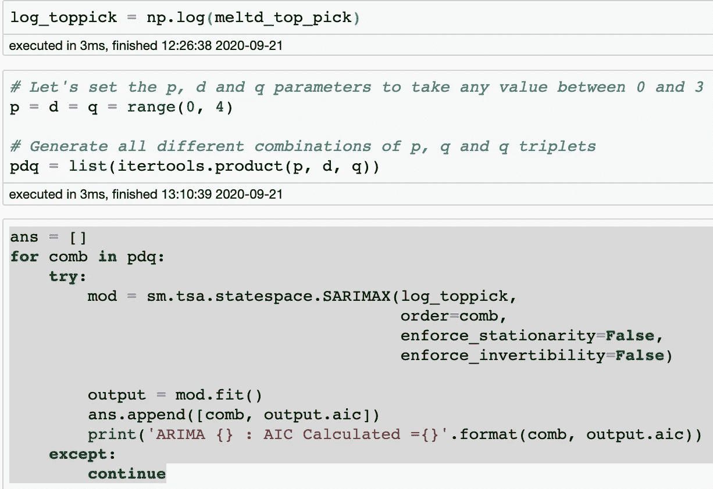
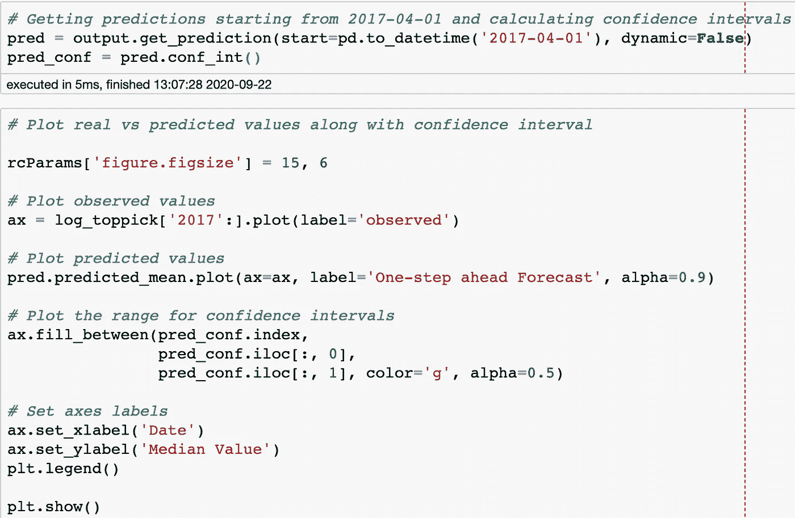
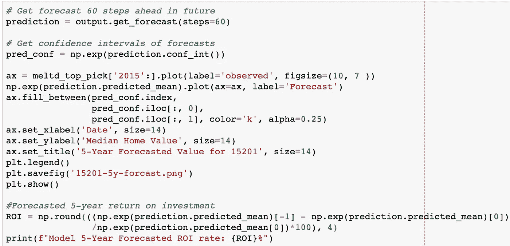

# 用时间序列模型预测房地产价值

> 原文：<https://medium.com/analytics-vidhya/forecasting-real-estate-value-with-time-series-modeling-8c986d39c300?source=collection_archive---------9----------------------->

使用 statsmodels 的 SARIMA 来模拟邮政编码的中值房价。

在 [Unsplash](https://unsplash.com?utm_source=medium&utm_medium=referral) 上由 [Breno Assis](https://unsplash.com/@brenoassis?utm_source=medium&utm_medium=referral) 拍照

想象你和你的家人准备迈出下一步，搬到一个新家。如果能知道哪些地区的房价预计会涨得最多，不是很好吗？你可以通过这种方式进行更合理的投资，并加强家庭的财务安全。

在这篇文章中，我将介绍如何建模、预测和预报房地产价值，使用时间序列机器学习方法，并增加一些技术含量。我最初被分配了一个项目-为一家房地产投资公司挑选前 5 个邮政编码，以进行最佳投资。要做到这一点，我必须定义我们的“最佳”邮政编码的含义，然后使用这些指标将 14，000 多个邮政编码缩小到 5 个，以便使用时间序列建模做出可靠的投资决策。

好吧，我就不跟你说从 14，000 个邮政编码中筛选的方法了，只关注我们如何预测我们的首选。

使用 Zillow Research 1996 年至 2018 年的数据绘制我们的首选 15201。

*时间序列建模极速总结:*

时间序列建模可能有点棘手和混乱，所以我将尝试快速总结一下。时间序列建模的目标，以及机器学习的其他常见假设(正态分布等。)就是让你的趋势静止不动。因为这就是时间序列模型解释方差的方式，所以您需要去除时间序列的趋势。有几种方法可以去趋势化。例如，减去滚动平均值将得到您想要的多个过去值的平均值，并从当前观察值中减去该值。你最终会得到围绕一个恒定平均值的峰值。另一种常用的技术叫做“差值法”，即用当前值减去指定时间段(也称为滞后)的过去实际值。

趋势基本上是减少的，直到它们有一个恒定的平均值和恒定的方差。本质上，这可以归结为“噪音”——时间上的随机性。

statsmodels SARIMA 模型是多种模型的非常有效的组合:自回归(AR)模型、移动平均(MA)模型和积分(I)。

**赶紧解释:**

AR 模型从时间序列中获取一个值，并基于同一时间序列中以前的值对其进行回归。AR 公式如下所示:

今天=恒定均值+斜率×昨天+噪声

MA 模型基于今天和昨天的噪声或误差的加权和进行回归。MA 公式略有不同:

今天=恒定均值+噪声+斜率×昨天的噪声

现在 ARMA 模型结合了这两个概念和方程，但是有几个注意事项。1)他们假设您已经对数据进行了去趋势化处理。2)他们假设没有季节性(总体趋势中的微观趋势循环)。

这就是季节性 ARIMA 发挥作用的地方。SARIMA 将季节性考虑在内，对其过去值有重大依赖的趋势，并为我们做去趋势化！是啊！节省时间。

# 准备我们的首选邮政编码

我们要做的第一件事是确保我们的数据格式正确。它以宽格式呈现给我们，每个月的房屋价值中值是一个单独的列。我们需要长格式的数据，其中时间在一列中，日期是索引，每个月的值作为一个新行。为此，我们使用下面的帮助函数将宽格式数据分解成长格式。

然后接下来几行删除我们的 zipcode 列并设置新的索引:

# **基线萨里玛模型**

SARIMA 模型有几个需要输入的参数:

**p** ':自回归项的数量(模型的 AR 部分)，结合过去的趋势值来提供预测。

**d**’是我们的模型从当前观察值中减去的差异数(I，积分)。

**q’**是移动平均项(MA 部分)的数量，它将误差设置为从先前时间点观察到的误差值的线性组合。

这三个属于“顺序”参数。然后是第二组 p、d、q 和‘s’——同样的概念，但是考虑到季节性，在‘季节性顺序’下。我们要做的是为 3 个参数中的每一个定义一个范围，并使用 itertools 生成所有可能的组合。然后，我们将编写一个 for 循环，对潜在参数的每个组合运行模型，看看什么给我们最好的 AIC 值。AIC 代表 Akaike 信息标准，是一个给定数据集的统计模型相对于其他模型的质量估计值。*(*注意:也可以使用其他指标来确定最佳性能模型。*)我们想要最低的 AIC 值，因为使用更多参数来拟合数据的模型将比使用更少参数实现拟合的模型获得更高的 AIC 值。合身的话越简单越好！

现在，我们使用一个嵌套的 for 循环来遍历每个组合，将它们全部插入到一个 SARIMA 模型中，并输出它们各自的 AIC 值。

注意:“enforce_stationarity”和“enforce _ inversibility”= False。这些与转换 AR 和 MA 参数有关。不需要这个！

根据您设置的参数值的范围，尤其是季节性，计算类型可能会完全耗尽您的 CPU。所以要小心！现在，我只是将结果放入一个新的数据框中，并调用最小 AIC:

最佳 AIC 检查。现在，我将把这些值插入到一个新模型中，并打印出汇总统计数据。

最佳参数被插入“订单”和“季节性订单”

这里要注意两件事:

1.  coef 值是系数；每个特征的重要性值。
2.  P>|z|是我们的 p 值；是每个特征权重的重要性。

ar。妈妈。s 和 sigma 值(针对季节性)高于 0.05，这意味着模型拟合得不好，需要进行一些调整。

让我们打印出诊断可视化图，并检查我们是否违反了模型的假设:

在左上角，我们可以看到残差图。这是我们的模型完全去趋势化后剩下的东西。请注意，2013 年之后，最终会出现峰值。这可能是由于价值增长率的变化。

右上图:核密度估计曲线和我们的数据分布与正态分布的对比。我们的 KDE 曲线和直方图显示，我们的数据大部分是正态分布的，只是标准偏差不是 1[在 N(0，1)]中。

左下角:残差的有序分布(蓝点)表明，我们并没有真正很好地遵循从正态分布中提取的样本的线性趋势。

右下角:相关图显示我们的残差与 9 和 10 的滞后版本有轻微的相关性。

现在，让我们获得去年(2017 年)预测的基准均方根误差，以比较我们即将进行的调整:

我必须将真实值转换并压缩成一个序列，因为预测值是一个序列，以便进行兼容计算。

好吧，RMSE 现在是 958，我们的模型不太适合。我们的季节性参数尤其超出了 p 值的范围。让我们尝试去除季节性参数化，并拓宽 p、d、q 值的范围:

现在，让我们将最佳参数(2，2，2)代入新模型:

所有组件似乎都在检查中，p 值低于 0.05，这是个好兆头！让我们画出诊断图，看看假设是否成立。

在这里，没有那么多变化。我们的 KDE 曲线有点接近正态分布曲线(注意 y 轴)，但还没有达到我们想要的程度。Q-Q 残差图更接近，但仍然有点偏离正常线。与滞后值仍有一定的相关性。让我们检查一下 RMSE:

更好的 RMSE！

我们的调整实际上降低了我们的 RMSE 相当多！这是朝着正确方向迈出的一步。然而，我们的模型的假设仍然被违反，所以我们不能使用这个模型。

让我们尝试将我们的数据转换到对数标度，并运行相同的参数(没有季节性)。这将通过将中值房屋价值的指数曲线降低到线性比例来减少趋势的方差，这可能是最近残差变得疯狂的原因。

这里的最佳参数是 2，0，3。

让我们将最佳参数插入新模型，并加载摘要。

太好了！我们的 p 值现在都低于 0.05 显著性阈值。让我们再次绘制诊断图。

这里的重大改进。我们的标准化残差已经按比例缩小(比较 y 轴)。我们的 KDE 曲线现在非常符合正态分布曲线。我们的残差有序分布非常接近正态分布。这些都是很好的迹象，表明我们的数据现在正态分布。轻微的滞后相关性在 10，但是我们也许可以让我们的模型保持原样。

由于该模型验证了所有假设，因此让我们获得测试集预测，但这次实际绘制它们，看看它们有多接近:

模型验证:根据实际值绘制 2017 年的预测值(提前一步预测)。

看起来很好。请注意，我们已经绘制了用于验证的对数转换集。这是可以的，但是现在要得到 RMSE，最好是用我们原来的比例。我们将只获得 np.log 的倒数，即 np.exp，作为我们的预测值，并使用原始集作为我们的真实值(*使用' np.exp(log_toppick)'也可以)。

有趣的是，我们的 RMSE 低于我们的基线(958)，这很好，但是高于我们的上一次迭代。在这一点上，因为我们的模型的假设是有效的，这是更强的模型。让我们用这个来绘制这个模型的 5 年预测！

我们将使用 60 个步骤，因为每个步骤在我们每月(60 个月-5 年)的数据中占一个值。

使用我们的最佳模型，我们能够预测我们的邮政编码的 5 年投资回报率为 82.2%！该走了。

不过说真的，请注意灰色的置信区间。随着对未来的预测，这个度量变得更大。很难在如此遥远的未来获得这种确定性，所以我建议继续制造一个新的模型进行验证。这里的另一个重要注意事项是，我们的数据集只持续到 2018 年，因此没有考虑当前新冠肺炎疫情的影响。未来的探索需要更新的数据集，但是本练习旨在引导您完成时间序列建模、预测/验证和预测的过程。

我希望你能从这篇文章中学到一些东西，当然，如果你有任何问题，或者关于我的过程或方法的建议，给我发消息！