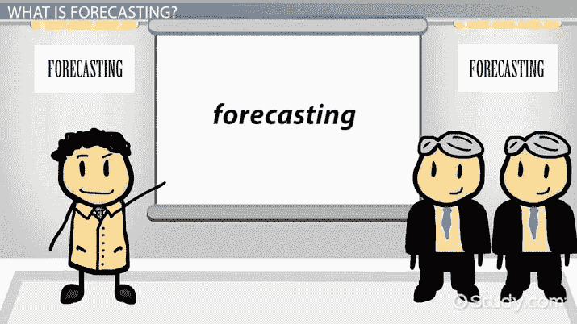

# R 中多季节模式的时间序列预测

> 原文：<https://medium.com/analytics-vidhya/forecasting-time-series-with-multiple-seasonal-patterns-in-r-9ecaf1b685d2?source=collection_archive---------9----------------------->

输入法序列可能包含多个不同长度的季节性周期。例如，我们这里要使用的数据集是从美国的一个区域传输组织 PJM 互联获得的每小时能耗数据(数据可以在这里找到 [**和**](https://www.kaggle.com/robikscube/hourly-energy-consumption?select=DUQ_hourly.csv) )。PJM 是东部互联电网的一部分，运营着一个为所有人服务的输电系统