# 利用 python 机器学习预测雅加达综合指数股票，准确率达到 72.4%

> 原文：<https://medium.com/analytics-vidhya/forecasting-unilever-stock-in-jakarta-composite-index-using-python-machine-learning-and-achieve-5f3b90e21b17?source=collection_archive---------17----------------------->

对于那些不熟悉印尼股市的人来说，雅加达综合指数(股票代码:雅虎财经^JKSE)有 678 只股票可供选择。我选择联合利华是因为它的市值、流动性和良好的公司治理是基金经理最广泛选择的股票之一，它是雅加达综合指数中上市时间最长的股票之一，也是 LQ45(相当于标准普尔 500)的股票之一

首先，我们需要导入必要的包来执行所需的功能:

```
import numpy as np
import pandas as pd
import datetime as dt
import pandas_datareader.data as web
import talib as tlb
import talib
from sklearn.metrics import confusion_matrix
```

接下来，我们需要定义数据的时间范围:

```
start = dt.datetime(2014,1,1)
finish = dt.datetime.today()
source = ‘yahoo’
```

由于经济周期的原因，我选择了 5 年左右的数据，但这取决于你，你可以自由选择时间框架

现在我们提取数据:

```
df = web.DataReader(‘UNVR.JK’, source, start, finish)
df.head()
```

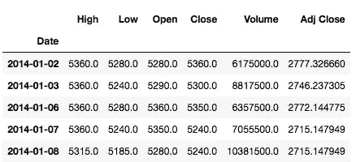

简单看一下我们的数据，如下所示

出于我们的目的，我将使用“Adj Close”数据。至于每天预测股票的准确价格，很难用机器学习来做，所以我会预测股票的运动，无论股票是下跌还是上涨。为此，我将计算今天的股票价格相对于昨天的百分比变化，以此类推，如果是正数，将标记为+1.0，反之亦然。为此，我们只需编写这些代码:

```
data = pd.DataFrame(index=df.index)
data[‘Today’] = df[‘Adj Close’]
data[‘pct change’] = data[‘Today’].pct_change()
data[‘direction’] = np.sign(data[‘pct change’])
```

接下来，我们将使用 talib 软件包的技术分析进行一些特征工程，并通过将结果除以调整后的收盘价来归一化结果，使其在相同的范围内:

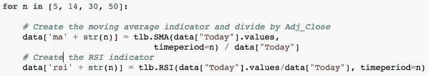

特征工程结果移动平均和相对强度指数

上面的代码主要做的是创建 5、14、30 和 50 天的简单移动平均线和相对强弱指数。当然，我们可以使用其他技术分析指标和其他时间段进行更好的预测。你可以随意摆弄它。

接下来，我们再简单看一下使用 data.head(10)进行特征工程后的数据。

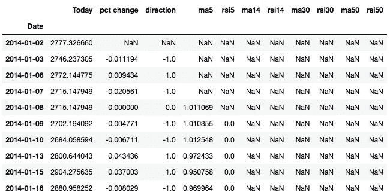

我们需要删除丢失的数据

看起来我们的数据由于技术分析包中周期的计算有很多缺失的数据。为此，我们只需这样做:

data.dropna(inplace = True)

如果我们重新检查我们的数据，现在它是干净的，可以进行机器学习了。这很重要，因为大多数机器学习无法接受缺失数据和无限数量。

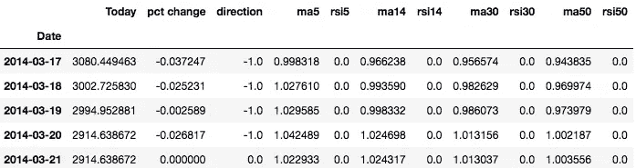

现在它干净了

接下来，我们要删除“今天”和“百分比变化”列，因为我们在预测中不需要它，因为我们只预测股票的方向。为此，我们编写了以下简单的代码:

`data.drop([‘Today’, ‘pct change’], axis = 1, inplace = True)`

现在我们开始我们的目标预测和机器学习所需的数据:

```
y = data[‘direction’]
x = data.drop(‘direction’, axis = 1)
```

接下来，我们将把数据分成训练集和测试集。我使用 80%的比率作为 80%的训练集，20%的测试集，但你可以使用不同的比率。

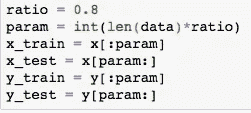

我将使用 3 个机器学习包，看看哪一个性能更好。即 **KNN、逻辑回归和支持向量机**。让我们导入这些包:

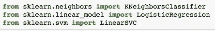

KNN、逻辑回归和支持向量机

现在我们将做 **KNN** 并检查我们模型的准确性:

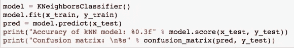

结果是:

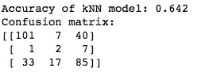

准确率为 64.2%

接下来，我们将尝试**逻辑回归**:

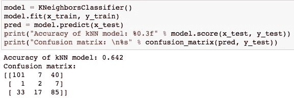

准确率为 64.2%

现在，我们试试**支持向量机**:

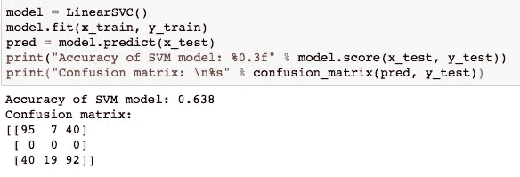

准确率 63.8%

看起来所有 3 个不同的机器学习包产生了相同的结果，但是我们可以超参数调整我们的机器学习包和稍微不同的包之一以达到更好的结果吗？我将使用常规 SVC 而不是 LinearSVC，并使用超参数对其进行调整:

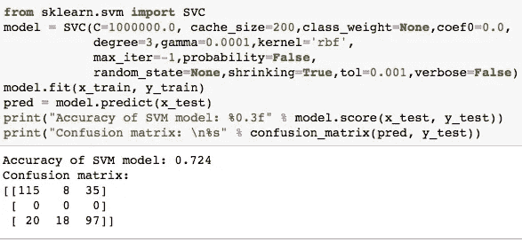

准确率为 72.4%

准确率提高到 72.4%。

**结论:**

有许多处理预测的机器学习包，这篇文章是为了学习和学术目的，它不是为了实际投资，因为有许多问题我没有处理，例如，前瞻偏差和测试过度拟合等。我希望这篇文章对那些想进一步研究机器学习与股市预测或其他应用的人有用。感谢阅读。

你可以在这里查看我的代码

如果你有任何问题或批评，随时联系我:henryhermawan09@gmail.com