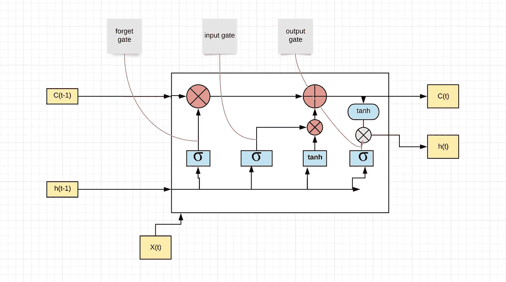
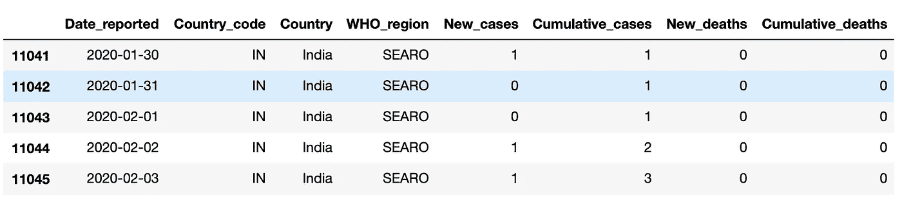
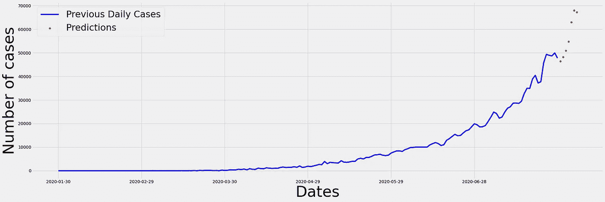

# 使用 LSTMs 进行预测

> 原文：<https://medium.com/analytics-vidhya/forecasting-using-lstms-61bc273d3c2e?source=collection_archive---------18----------------------->

用 LSTMs 预测**新冠肺炎**病例**印度**为**例**。

# 简短的描述



LSTM 代表'**长短期记忆，**是由[**hoch Reiter&schmid Huber**](http://www.bioinf.jku.at/publications/older/2604.pdf)在 1997 年提出的。LSTMs 是一种特殊类型的 RNNs(递归神经网络)，有助于解决**长期依赖性问题**。正常的 RNN 面临**消失梯度**的挑战，这使得网络难以学习长序列。这就是 LSTMs 介入并帮助解决上述问题的原因。

# 构建 LSTM 模式

我将使用 **TensorFlow 2.0** 来创建模型。

## 加载所需的库

```
import pandas as pd
import numpy as np
import matplotlib.pyplot as plt
import tensorflow as tf
from sklearn.preprocessing import MinMaxScaler
from tensorflow.keras.layers import Input, Dense, LSTM
from tensorflow.keras.models import Model
from tensorflow.keras.optimizers import SGD, Adam
```

## 正确构建培训数据



这是数据框的外观

我们只想预测每天的新病例，所以我们将只从上面的数据框架中提取相关数据。

```
y_tot = df_new[' New_cases'].values
data_train = np.array(y_tot)
X_train = []
Y_train = []***#We want to use the last 7 days of data to predict for the next 7 days***for i in range(7, len(data_train)-7):
    X_train.append(data_train[i-7:i])
    Y_train.append(data_train[i:i+7])***#The shape of X_train is (168, 7)***X_train, Y_train = np.array(X_train), np.array(Y_train)
scaler_x = MinMaxScaler()
scaler_y = MinMaxScaler()
X_train = scaler_x.fit_transform(X_train)
Y_train = scaler_y.fit_transform(Y_train)
X_train = X_train.reshape(168, 7, 1)
```

在上面的代码单元格中，我们创建了' **X_train** ，其中包含第**天**天之前**七**天的案例数，以及' **Y_train** ，其中包含第天**天**之后**七**天**的案例名(包括第 I 天的实例数)，之后我们进行了缩放**

## 构建模型

LSTM 模型的构建是一个高度**迭代**的过程。必须添加具有不同**参数**的不同类型的**层**，用 **dropou** t 层进行实验以最终确定模型，该模型适当地符合它们的数据。

```
model = tf.keras.models.Sequential()
model.add(tf.keras.layers.LSTM(60, activation = 'relu', input_shape=(7, 1)))    
model.add(tf.keras.layers.Dense(7))
model.compile(loss = 'mse', optimizer='adam')
model.fit(X_train, Y_train, epochs=100)
```

我们使用“**均方误差**作为损失函数，使用“ **Adam** 作为优化函数。

## 预言

我保留了最后七个值，用于预测接下来的七个天**。在这个特殊的例子中，它们也作为测试集。**

```
X_test = list(y_tot[-7:])
X_test = np.array(X_test)
X_test = X_test.reshape(1, 7)
X_test = scaler_x.transform(X_test)
X_test = X_test.reshape(1, 7, 1)pred = model.predict(X_test)
```

## 结果

作为结果，我们得到的一系列预测并不完全是预测，因为模型和预测已经使用了**缩放的**数据，所以输出本身也是缩放的，所以它必须被改变以显示实际值。

```
y_true = scaler_x.inverse_transform(pred)
y_true.astype(int)
```

**输出**

接下来**七**天的案件数量如下:

```
46456, 48228, 50931, 54741, 62993, 68006, 67171
```



截至 7 月 28 日的数据，以及截至 8 月 4 日的预测

**注**:预测可能**也可能**不正确，因为病例数取决于各种**外部因素**。LSTM 预测是为了对未来的病例数有一个大概的了解，并做相应的准备。本文**旨在**以印度新冠肺炎数据为例，展示一个简单 **LSTM** 的**构造**。

# 密码

上述 LSTM 模型的代码已经上传到下面的 GitHub [**库**](https://github.com/rahulks9/COVID_PRED) 。

# 数据

数据取自以下 [**网站**](https://covid19.who.int/info/) 。

谢谢你，如果你能走到这一步。请在下面的回复部分提出任何建议。