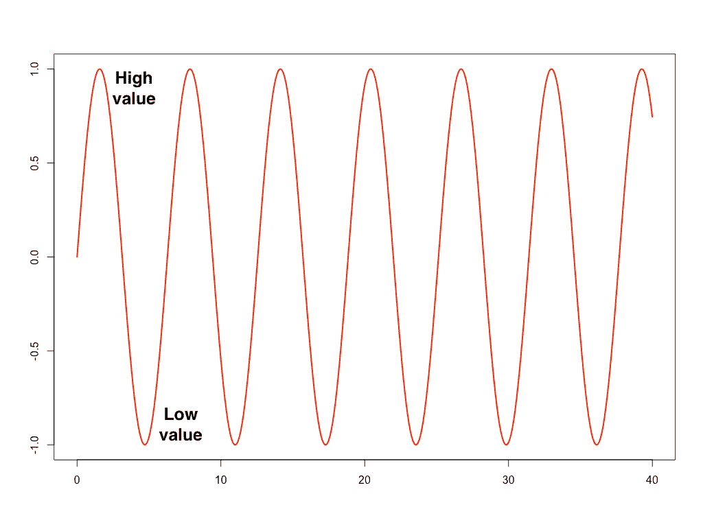
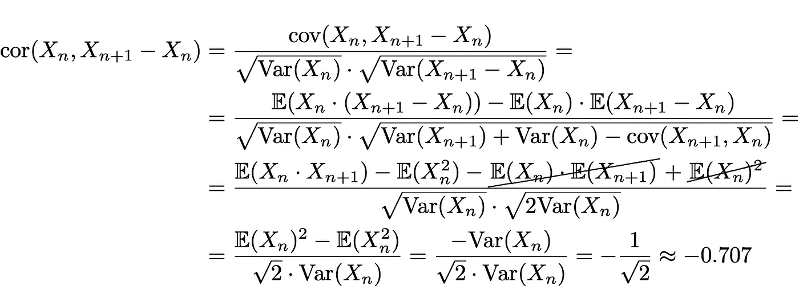
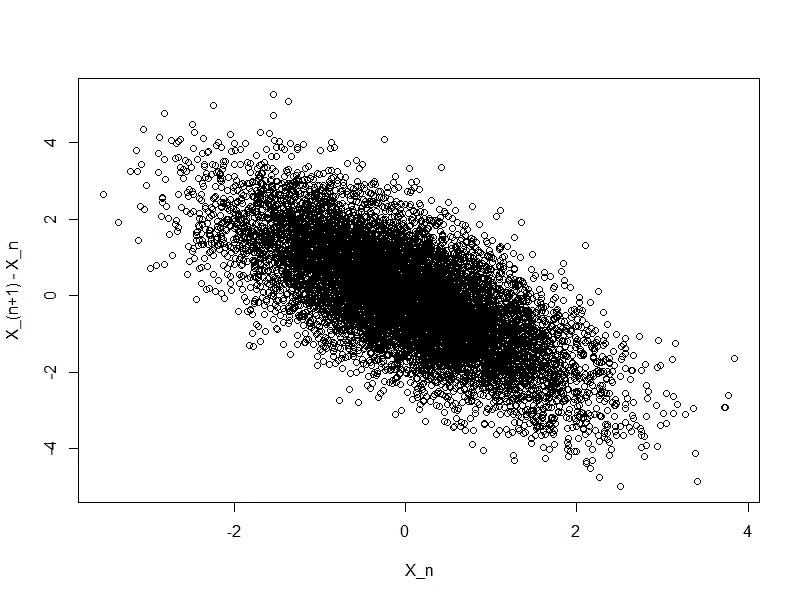

# 证明我们的生活是正弦曲线

> 原文：<https://medium.com/analytics-vidhya/formal-mathematical-proof-that-our-life-is-sinusoidal-6f5b9187e430?source=collection_archive---------32----------------------->

# 介绍

> 黑夜过后是白天，暴风雨过后是平静

这是布德卡·苏弗勒拉的波兰歌曲合唱，原名是“Jest taki samo tny DOM”([链接到原文并翻译成英文](http://www.tekstowo.pl/piosenka,budka_suflera,jest_taki_samotny_dom.html))。我想引用这句话，因为我想用严格的数学方法从这句话中激发隐喻。对某些人来说，这可能有点争议和荒谬，但我会用数学方法来证明。

实际上，我将说明，当我们的生活或世界中有一些过程时，如果这个过程的当前值是“高”的，那么在下一步中，这个值很可能会减少，如果我们有“低”值，那么在下一步中它会减少。

换句话说，我将展示我们的生活是正弦曲线，如下图所示。

sin 函数的示例图，它代表了我们生活中的许多过程

# 让我们开始学数学吧

*注意:我将在这里使用一些数学对象，如果你不熟悉它们，请在评论中告诉我(我将尝试直观地解释它们，或者也许我会写另一篇关于它的文章)。*

我已经说过“我们生活中的过程”，那么让我们把它定义为一个随机变量序列( *X* ₁， *X* ₂， *X* ₃，…)。我们假设这些变量是独立同分布的。

现在让我们来计算进程的当前状态(姑且称之为 *X* _ *n* )和相对于当前值的下一个值的增加(因此*X*_(*n*+1)-*X*_*n*)之间的相关性。因此，我们有以下计算:

我在这里使用了关于独立性的假设，所以我可以去掉 cov( *X* _ *n* ， *X* _( *n* +1))，它等于“0”，我还可以假设

# 解释

相关性告诉我们，如果我们在一个轴上绘制 *X* _ *n* ，在另一个轴上绘制*X*_(*n*+1)-*X*_*n*)，数据的方向是什么(对于所有的 *n* =1，2，3，…)。下面是我们现在已经证明的东西的样本可视化。

可视化当前状态和增长之间的关联。N(0，1)分布产生的样本( *X* ₁， *X* ₂，*x*₃……)

这里我们得到的是当前步骤和相对于下一步骤的增加之间的相关性是负的(大约等于-0.707)。这意味着如果 *X* _ *n* (X 轴)为正，那么下一个值很可能会更低(Y 轴上的*X*_(*n*+1)-*X*_*n*的值为负，所以这意味着 X_(n+1) < X_n)。此外，更高的值意味着更高的降幅。类似地， *X* _ *n* 的负值意味着下一个值很可能会更高(并且更低的值也意味着下一步中更高的增加)。

现在我们可以看到，基于这一证明，当我们生活中的特定情况非常好时，那么在不久的将来就有可能会减少和恶化。这很可悲，但却是事实(数学证明了这一点:)。

正如我之前说过的，这有点争议，但对于数学来说是真的。请让我在评论中知道你对这种考虑的看法…