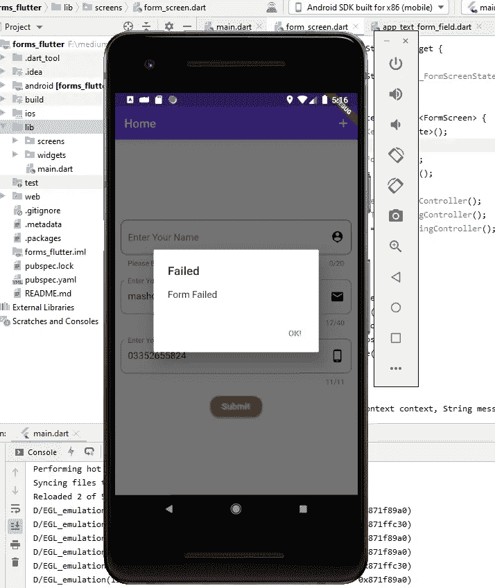
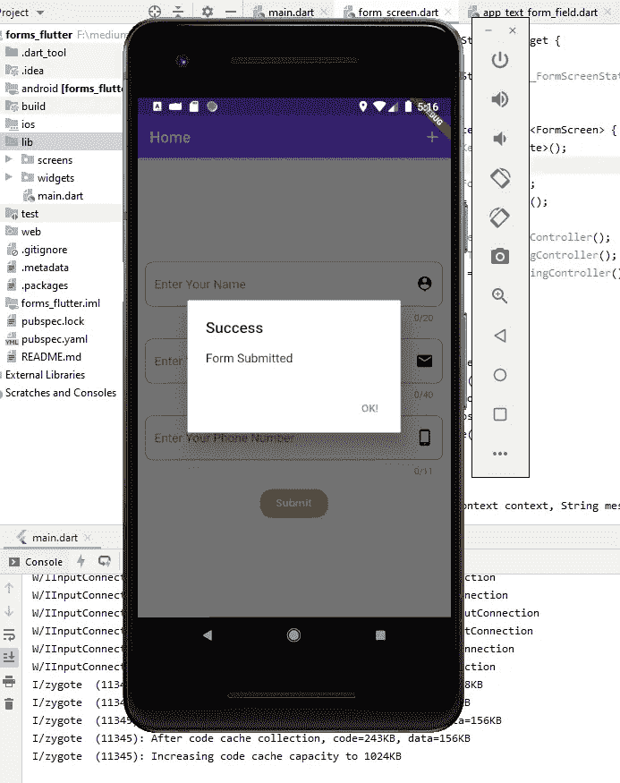

# 颤振中的形式及其验证

> 原文：<https://medium.com/analytics-vidhya/forms-and-its-validation-in-flutter-1c2b3f9c985c?source=collection_archive---------11----------------------->

大家好，我希望你们都做得很好，今天我们将讨论 flutter 应用程序中的表单，这篇文章包括如何使用表单和以简单的步骤验证表单:

第一步:首先创建一个全新的 flutter 项目，和我一起学习如何创建表单并验证它们。

步骤 2:现在创建项目结构，就像我正在做的那样，如下图所示:


步骤 3:现在在 Screens 文件夹中创建一个名为 form_screen.dart 的新文件，并将以下代码复制粘贴到其中

```
**import 'package:flutter/material.dart'**;

**class** FormScreen **extends** StatefulWidget {
  @override
  _FormScreenState createState() => _FormScreenState();
}

**class** _FormScreenState **extends** State<FormScreen> {
  @override
  Widget build(BuildContext context) {
    **return** Scaffold(
      appBar: AppBar(
        title: Text(**'Home'**),
        actions: [
          IconButton(icon: Icon(Icons.*add*),
          onPressed: (){},
          splashColor: Colors.*deepOrange*,
          ),
        ],
      ),
    );
  }
}
```

步骤 4:现在删除 main.dart 中的所有代码，并将以下代码复制粘贴到 main.dart 中:

```
**import 'package:flutter/material.dart'**;
**import './screens/form_screen.dart'**;**void** main()=>runApp(
  Settings());

  **class** Settings **extends** StatelessWidget {
    @override
    Widget build(BuildContext context) {
      **return** MaterialApp(
        theme: ThemeData(
          primaryColor: Colors.deepPurpleAccent,
          accentColor: Colors.amber,

        ),
        home: FormScreen(),
      );
    }
  }
```

第 5 步:让我们转到 form_screen 并在其中创建一个表单。

a)首先，创建一个窗体状态的全局键，不管窗体的当前状态是否有效，它都会照看窗体。

```
**final _formkey** = GlobalKey<FormState>();
```

b)现在在 form_screen 中创建一个表单:

```
**import 'package:flutter/material.dart'**;

**class** FormScreen **extends** StatefulWidget {
  @override
  _FormScreenState createState() => _FormScreenState();
}

**class** _FormScreenState **extends** State<FormScreen> {
  **final _formkey** = GlobalKey<FormState>();

  @override
  Widget build(BuildContext context) {
    **return** Scaffold(
      appBar: AppBar(
        title: Text(**'Home'**),
        actions: [
          IconButton(
            icon: Icon(Icons.*add*),
            onPressed: () {},
            splashColor: Colors.*deepOrange*,
          ),
        ],
      ),
      body: Form(
        key: **_formkey**,
        child: SingleChildScrollView(
          child: Column(
            mainAxisAlignment: MainAxisAlignment.**spaceEvenly**,
            children: [],
          ),
        ),
      ),
    );
  }
}
```

当我们将 _formkey 传递给表单的参数键时，这意味着该键将保存表单的所有状态，或者输入所有字段，即表单是否经过验证等等。如果我们在表单中使用 Column，有一个子滚动视图作为 Column 的父视图会很好，因为屏幕尺寸问题，你可以根据你的需要使用 MediaQuery 来管理它，但是因为我正在讨论表单，所以我不会把重点放在 MediaQuery 上。

步骤 6:现在在小部件文件夹中创建一个名为 app_text_form_field.dart 的文件，并复制粘贴以下代码:

```
**import 'package:flutter/material.dart'**;

**class** AppTextFormField **extends** StatelessWidget {
  **final titleLabel**;
  **final maxLength**;
  **final icon**;
  **final controller**;
  **final inputType**;
  **final** Function **fieldSubmit**;
  **final focusnode**;
  **final validator**;
  **final inputAction**;

  AppTextFormField(
      {@required **this**.**titleLabel**,
      @required **this**.**maxLength**,
      @required **this**.**icon**,
      @required **this**.**validator**,
      @required **this**.**controller**,
      @required **this**.**inputAction**,
      **this**.**focusnode**,
      **this**.**fieldSubmit**,
      @required **this**.**inputType**});

  @override
  Widget build(BuildContext context) {
    **return** Padding(
      padding: **const** EdgeInsets.all(10.0),
      child: TextFormField(
        maxLength: **maxLength**,
        controller: **controller**,
        keyboardType: **inputType**,
        validator: **validator**,
        textInputAction: **inputAction**,
        onFieldSubmitted: **fieldSubmit**,
        focusNode: **focusnode**,
        decoration: InputDecoration(
          labelText: **titleLabel**,
          suffixIcon: Icon(
            **icon**,
            color: Colors.*black*,
          ),
          border: OutlineInputBorder(
            borderRadius: BorderRadius.circular(10),
            borderSide: BorderSide(color: Colors.*black*),
          ),
        ),
      ),
    );
  }
}
```

在这个文件中，我们创建了一个文本表单字段，我要告诉你的一些要点是关于字段提交、焦点节点、验证器、文本输入动作、键盘类型。

1.  onFieldSubmitted:当我们按下手机键盘上的 enter 键时，这个方法就会被触发并执行其中的代码。
2.  焦点节点:焦点节点只是每个文本字段的焦点。
3.  validator:在这个 validator 中，它采用一个带有参数值或任何您喜欢的名称的函数，该函数检查值是否为空，然后返回一个字符串值，或者当值不为空时返回 null。例如:

验证器:(value){
**if**(value . isempty){
**返回‘请提供一个值。’**；
}
**返回 null**；
}，

4.文本输入动作:文本输入动作描述了当你按下键盘的回车键时，你想执行什么类型的动作，或者你想进入下一个字段，或者你已经完成了所有的字段，等等。

5.键盘类型:它定义了什么类型的输入，你想要文本输入类型或数字输入类型或电子邮件等。

6.你可以看到，在 AppTextFormField 的构造函数中，我有两个不需要的属性，这是因为在表单的末尾，我们不想调用下一个字段，根据我的场景，如果我们想做任何操作，比如保存或做其他事情，我们可以使用它。最后，我们希望完成表单，这就是为什么我们没有按要求放置它。同样，在第一个表单字段中，我们不需要焦点节点，因为我们希望转到另一个文本表单字段，所以我们的第一个表单字段不需要任何焦点节点。

第 7 步:现在让我们回到 form_screen，在 form_screen.dart 中导入 app_text_form_field:

```
**import '../widgets/app_text_form_field.dart'**;
```

步骤 8:在 form_screen.dart 中创建 6 个属性 3 个焦点节点和 3 个文本编辑控制器:

```
**final nameFocusNode** = FocusNode();
**final emailFocusNode** = FocusNode();
**final PhoneNoFocusNode** = FocusNode();

**final nameController** = TextEditingController();
**final emailController** = TextEditingController();
**final phoneNoController** = TextEditingController();
```

步骤 9:在表单小部件的列中创建 3 AppTextFormField，或者复制粘贴以下代码:

```
AppTextFormField(
  titleLabel: **'Enter Your Name'**,
  inputAction: TextInputAction.**next**,
  validator: (value) {
    **if** (value.isEmpty) {
      **return 'Please Enter name.'**;
    }
    **return null**;
  },
  inputType: TextInputType.*text*,
  icon: Icons.*person_pin*,
  maxLength: 20,
  fieldSubmit: (_) {
    FocusScope.*of*(context).requestFocus(**emailFocusNode**);
  },
  controller: **nameController**,
),
AppTextFormField(
  titleLabel: **'Enter Your Email'**,
  inputAction: TextInputAction.**next**,
  validator: (value) {
    **if** (value.isEmpty) {
      **return 'Please Enter Email.'**;
    }
    **return null**;
  },
  inputType: TextInputType.*emailAddress*,
  icon: Icons.*email*,
  maxLength: 20,
  focusnode: **emailFocusNode**,
  fieldSubmit: (_) {
    FocusScope.*of*(context).requestFocus(**PhoneNoFocusNode**);
  },
  controller: **emailController**,
),
AppTextFormField(
  titleLabel: **'Enter Your Phone Number'**,
  inputAction: TextInputAction.**done**,
  validator: (value) {
    **if** (value.isEmpty) {
      **return 'Please Enter Phone Number.'**;
    }
    **return null**;
  },
  inputType: TextInputType.*number*,
  icon: Icons.*phone_android*,
  maxLength: 20,
  focusnode: **PhoneNoFocusNode**,

  controller: **phoneNoController**,
),
```

现在，每个 AppTextFormField 都有一个标题，它是一个字符串，一个可以是 next 或 done 的输入操作，一个检查是否提供了值的验证器，一个描述我们需要什么类型输入的输入类型，一个文本字段上的图标，一个文本字段的最大长度，我们希望在一个文本字段中插入多少个字符， 一个控制器，它控制文本表单字段的数据和重要的焦点节点，它告诉我们在每个字段提交方法上，我们都请求焦点在该文本字段上，即在第一个表单字段中，我们已经提交了字段方法，它请求焦点在电子邮件文本表单字段上，这就是为什么我们使用文本输入操作转到另一个文本字段，如果没有找到，那么我们将 done 作为文本输入操作传递。

步骤 10:在表单小部件的列中创建一个凸起的按钮:

```
RaisedButton(
  focusColor: Theme.*of*(context).**primaryColor**,
  child: Text(
    **'Submit'**,
    style: TextStyle(
      color: Colors.*white*,
      fontWeight: FontWeight.*w700*,
      fontSize: 18
    ),
  ),
  color: Theme.*of*(context).**accentColor**,
  splashColor: Colors.*deepOrangeAccent*,
  onPressed: () {},
  shape: RoundedRectangleBorder(
    borderRadius: BorderRadius.circular(15),
  ),
)
```

现在让我们在按下的方法内部工作:

```
onPressed: () {
  **if** (**_formkey**.**currentState**.validate()) {
    _showErrorDialog(context, **'Form Submitted'**, **'Success'**);
    **nameController**.clear();
    **phoneNoController**.clear();
    **emailController**.clear();
  } **else** {
    _showErrorDialog(context, **'Form Failed'**, **'Failed'**);
  }
},
```

在这里，我们检查表单是否经过验证，这意味着如果所有值都不为空，则显示一个成功对话框，如果任何字段为空，则显示一个失败对话框，并突出显示该字段。

第 10 步:这是最重要的一步，因为我们要处理所有的文本编辑控制器和焦点节点，所以如果我们销毁屏幕，它不会占用之前占用的内存并释放空间，调用 dispose 方法 inside _formScreenState 类并复制粘贴以下代码:

```
@override
**void** dispose() {
  **super**.dispose();
  **emailController**.dispose();
  **nameController**.dispose();
  **phoneNoController**.dispose();
  **PhoneNoFocusNode**.dispose();
  **emailFocusNode**.dispose();

}
```

这就是现在让我们运行应用程序，看看❤的颤振形式的魔力

1.  让我们检查一下，如果我们没有在名称文本表单字段中输入任何值，然后按“提交”按钮，您将得到以下输出:



如您所见，它弹出了一个失败对话框，在后面您可以看到它也突出显示了该字段。

2.现在，让我们输入所有字段数据，并按提交按钮，这将是输出:



正如你所看到的，出现了一个成功的弹出窗口，后面的所有字段也变空了。

这就是颤动的力量，一点点编码，最大输出❤。

我希望这篇文章能让你明白在 flutter 中使用表单以及如何验证它们。

如果你发现它对你有用，请鼓掌，并跟随我。

Github 回购链接:

[](https://github.com/Mashood97/forms_flutter) [## Mashood97/forms_flutter

### 一个新的颤振项目。这个项目是颤振应用的起点。一些帮助您入门的资源…

github.com](https://github.com/Mashood97/forms_flutter) 

别忘了给我一颗星星，跟我去那里找一个有用的仓库。