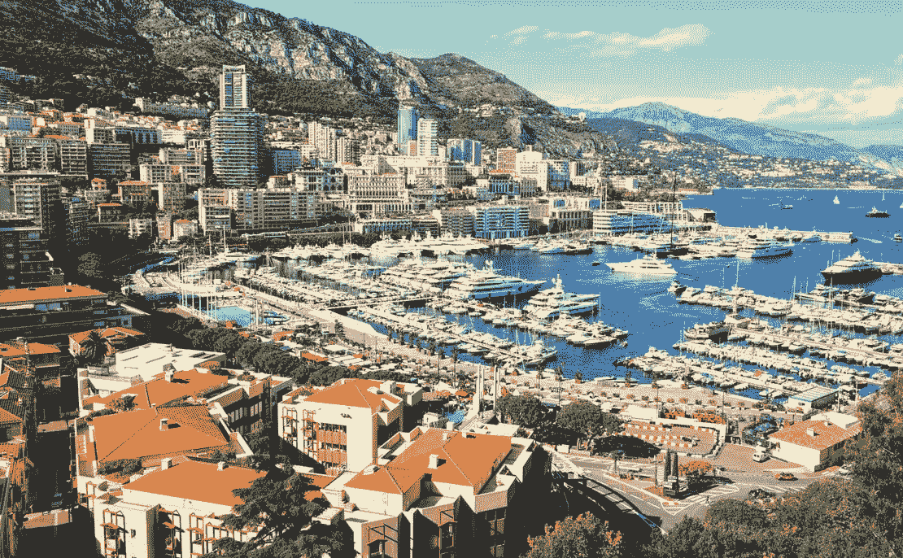
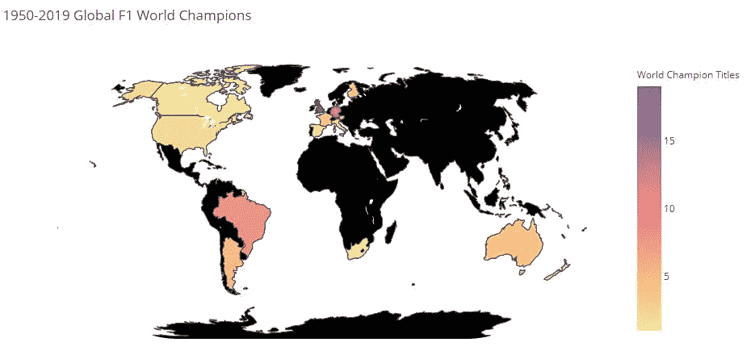
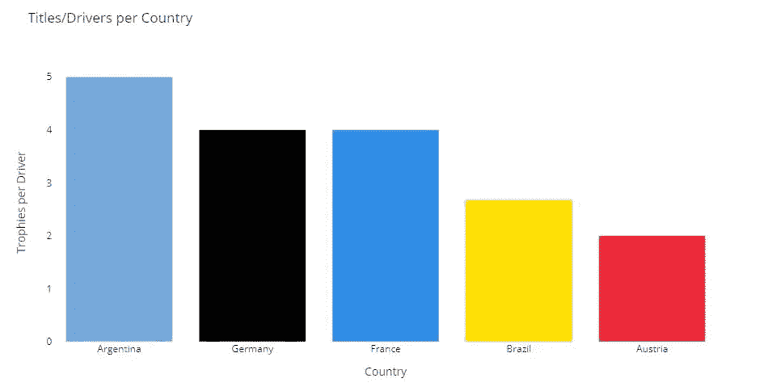
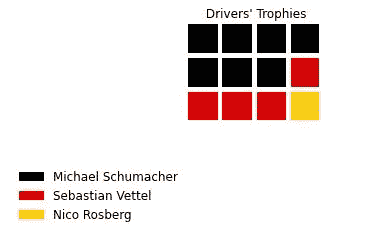
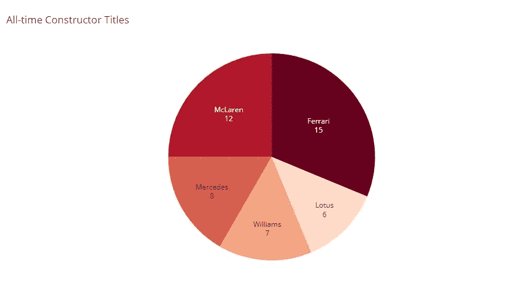
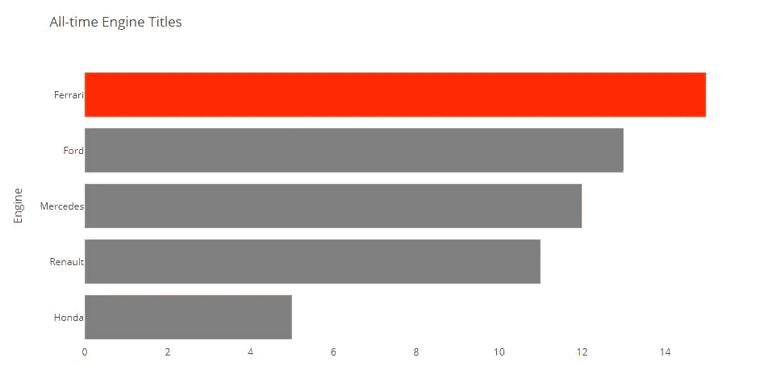
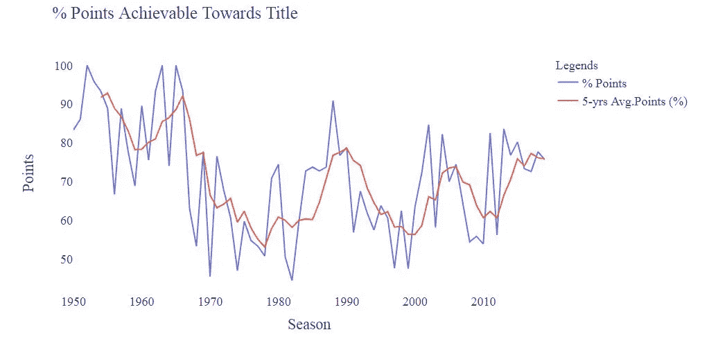
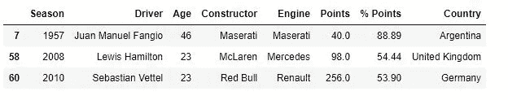
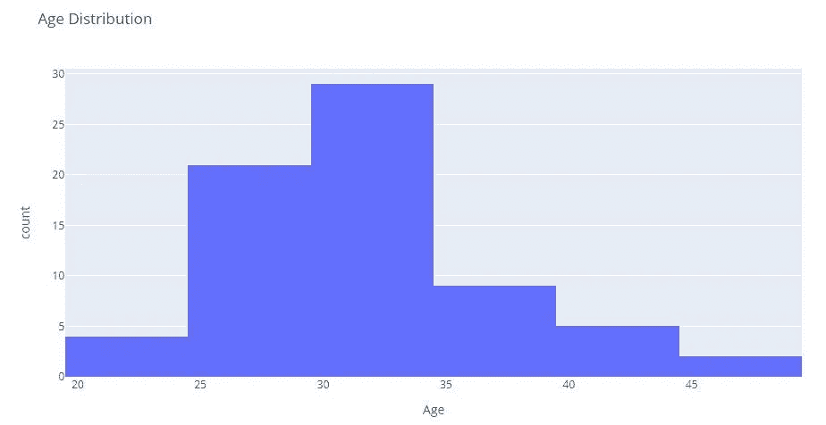

# 方程式 1:成为世界冠军的 5 件事

> 原文：<https://medium.com/analytics-vidhya/formula-1-5-things-to-become-a-world-champion-ac07050e785e?source=collection_archive---------7----------------------->

由 M. Mullie 通过 [Unsplash](https://unsplash.com/photos/HQYA_WugkGg) 拍摄的照片

> 天亮了，我们出发了

摩纳哥今天天气晴朗，非常适合比赛。摩纳哥大奖赛是赛车运动行业中最受欢迎和最具魅力的赛事之一。标志性的“大酒店”发夹的所在地，具有异国情调的海岸，数百万艘游艇停靠在距离赛道几米远的地方。一群酒吧和赌场将在比赛日前后招待您。不幸的是，由于新冠肺炎，摩纳哥将自 1955 年以来首次错过 2020 年的日历比赛，并损失约 1.4 亿欧元的收入。

不要在电视上看，让我们想象一下，你在摩纳哥以 180 英里的时速驾驶一辆超级跑车，登上领奖台，用香槟淋浴，这多酷啊？现在，让我们来看看如何才能获得 F1 席位，在摩纳哥比赛，甚至进一步成为 F1 世界冠军。听起来很酷，不是吗？

现在你在想，怎么过去。好吧，让我们看看从 1950 年到 2019 年的历史赢家数据。

# 1.职业生涯从哪里开始？

一个世界冠军不仅仅是由被称为天赋的单一因素造成的，它还需要时间和良好的技术或非技术环境的培养。让我们假设，一个国家拥有的头衔数量反映了你职业生涯的良好开端。

图 1|每个国家的世界冠军头衔

在上面的世界地图中，自 1950 年以来的数据显示，英国以 19 项冠军领先，而德国和巴西分别位居第二和第三。现在你已经准备好在英国开始新的旅程。

# 2 .一个 Get 导师！(1/2)

老实说，你不可能什么都自学，这意味着你需要一个导师。导师会根据他的知识和经验给你指导和建议。假设你是前 F1 世界冠军的学员。为了确定你的导师，你需要查看“一个国家每位车手获得的最高奖项”的数据。背后的原因是，每个车手的奖杯分数越低，意味着车手的奖杯对国家的冠军积分没有显著的贡献。

图 2|每个驱动因素贡献的标题

现在，你可以选择将导师据为己有。请正确考虑，因为机会不会有两次，走错一步会让你付出很大的代价。

# 2.b 获得导师！(2/2)

经过许多不眠之夜和与家人无休止的讨论，你出于许多原因选择了德国人。如下图所示，我将向您展示该选项。

图 3|德国的头衔

你有三个德国人可以选择，这三个人都很棒。盒子的数量代表奖杯的数量。也许其中一个愿意成为你的导师。

# 3.获取汽车和团队

你已经准备好迎来自己的首秀季了。在此之前，你需要一辆可靠的赛车，因为赛车是你在赛道上战斗的主要武器。一个有着出色成绩记录的成熟车队将会是你最大的目标，许多车手将会争夺这个位置。这是自 1950 年以来排名前五的世界冠军球队。

图-4|建造师职称排名

你得到信号了吗？没有吗？别担心，这不是世界末日。我们会一起想出解决办法，然后带着替代方案回来。

# 4.获取引擎

你感到沮丧和失望，因为 F1 是你的全部梦想。你决定打电话给你在祖国的爸爸，告诉他一切。幸运的是，你出生在一个拥有数百万美元的家庭，所以钱从来不是一个大问题。为了帮助你，你的家人决定购买一个团队，并支付汽车研发费用。现在，你有了汽车和船员，但发动机仍然从整个拼图中缺失。您正在寻找久经考验的发动机供应商来帮助您在赛道上竞争。以下是前五名名单。

图 5|发动机名称排名

现在你已经准备好登场，拥有比赛所需的一切。玩得开心！

# 5.点数百分比

祝贺你令人惊叹的首个赛季和第一次登上领奖台。现在，你在生意上越来越流利，并且瞄准更大的鱼。你正在计算获得世界冠军的最低分数。嗯，实际上这取决于日历上的比赛数量，但事实在于最低的分数百分比。如果你问我，我会展示下图。

图 6|可达到的最低分数

我已经把所有的东西都分享给你了，现在拿些大锅来做实验，创造秘方。永远记得保持谦逊和坚持。

# 奖金:年龄分布

哇，那是令人惊奇的最后一场比赛和美妙的赛季。你是如此优秀的冠军争夺者，加冕只是时间问题。你还年轻，有的是时间。永远记住，胡安·方吉奥在 46 岁赢得了他的最后一个冠军。继续努力，最终你会成功的。

图 7|最年轻和最年长的司机

图 8|驾驶员的年龄分布

就是这样！祝你长途旅行好运。

如果你对代码感兴趣，我留下下面的链接。谢谢你

 [## smurpratomo/F1-数据-视觉

### 此时您不能执行该操作。您已使用另一个标签页或窗口登录。您已在另一个选项卡中注销，或者…

github.com](https://github.com/Smurpratomo/F1-Data-Visual) 

> 免责声明:
> 
> 本材料仅供一般参考，不作为专业建议。提供的信息仅仅是一种观点，而不是事实。