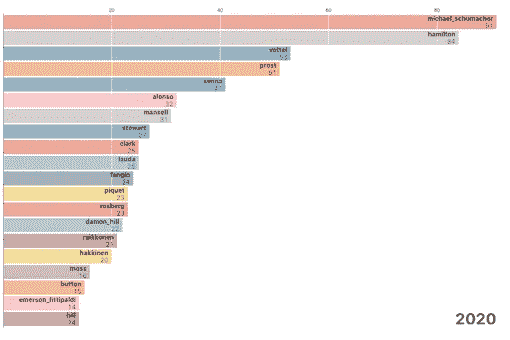

# 一级方程式赛车可视化(第 1 部分)——车手职业生涯获胜

> 原文：<https://medium.com/analytics-vidhya/formula-1-racing-data-visualization-part-1-driver-career-wins-6ef90ae33b8b?source=collection_archive---------23----------------------->

Mac Adornado 在 [Unsplash](https://unsplash.com/s/photos/toy-formula-one?utm_source=unsplash&utm_medium=referral&utm_content=creditCopyText) 上的照片

F**Formula One**是国际汽车联合会(FIA)认可的最高级别的国际汽车赛事，归一级方程式赛车集团所有。(又名一级方程式赛车或 F1)

F1 从 1950 年的第一个赛季开始就已经在世界各地举办。名称中的“formula”一词指的是所有参赛者的赛车都必须遵守的一套规则。一级方程式赛季由一系列比赛组成，这些比赛被称为*大奖赛*，在全球专用赛道和公共道路上举行。

# 一、F1 车手职业生涯获奖

从 1950 年开始，一个赛季中有 7 场大奖赛的次数逐年变化。这一数字一直在增加，最高达到一年 21 个 GP(2019 年)。通常现在一个赛季有 19 到 21 名 GP。

这张图表显示了从 1986 年到 2020 年前 20 名 F1 车手的获胜次数。该排名在整个时间线内都是最新的。你可以把它想象成车手之间的比赛。

[点击此处与图表互动](https://observablehq.com/@wlch/f1-driver-career-wins)

职业赛跑获胜

## 80-90 年代:普罗斯特 vs 塞纳

*   比赛一开始，[阿兰**普罗斯特**](https://en.wikipedia.org/wiki/Alain_Prost) 领先，紧接着[埃尔顿**塞纳**](https://en.wikipedia.org/wiki/Ayrton_Senna) 在 *1987* 崛起。
*   这两位传奇人物之间的竞争成为 F1 在 1988 年**期间的焦点，并一直持续到 1993 年底**普罗斯特**退役。**
*   **塞纳在 1994 年圣马力诺大奖赛的一次严重车祸中去世。他仅在 10 年内就获得了 41 次胜利，而普罗斯特在他 13 年的职业生涯中(1980-1993 年)获得了 51 次胜利。**

## **90 年代——00 年代:有史以来最伟大的**

*   **迈克尔·舒马赫 在 1994 年成为第一个德国世界车手冠军，但这并没有阻止他赢得更多的大奖赛冠军，并创造了一项传奇纪录， **91** 获胜。你可能想点击**重播比赛图表**按钮，看看他从 *1994* 开始的快速上升和从 *2006* 开始的强劲增长。**
*   **他是历史上唯一一位赢得 **7 次一级方程式世界锦标赛**的车手，他连续赢得了其中的五次冠军(2000–2004)，与 [*法拉利*](https://en.wikipedia.org/wiki/Scuderia_Ferrari) 。*(锦标赛每年颁发给在赛季中积累最多冠军积分的车手。)***
*   **同时，阔别十年的**普罗斯特**和**塞纳**分列第二和第三位。**

## **00 后—10 后:最年轻的冠军**

*   **舒马赫的冠军之路在 2005 年 9 月 25 日*结束，费尔南多**阿隆索**成为第一位赢得世界冠军的西班牙 F1 车手，也是他与雷诺*取得成功时最年轻的一次和两次车手冠军(2006)。****
*   ***在阿隆索以 31 胜打破纪录之前，他与其他年轻车手展开了激烈的竞争。与此同时，[刘易斯**汉密尔顿**](https://en.wikipedia.org/wiki/Lewis_Hamilton) 和[塞巴斯蒂安**维特尔**](https://en.wikipedia.org/wiki/Sebastian_Vettel) 正在向领先的车队前进。***

*****汉密尔顿**与 [*迈凯轮*](https://en.wikipedia.org/wiki/McLaren)**维特尔**在 *2010* 打破纪录，在*2010–2013*与 [*红牛车队*](https://en.wikipedia.org/wiki/Red_Bull_Racing) 连续夺冠。***

*   ***塞巴斯蒂安**维特尔**在 *2018* 超越**普罗斯特**的胜利纪录。2015 年从*红牛*离职，加盟*法拉利*。***
*   ***汉密尔顿**是六次一级方程式世界冠军，其中五次获得梅赛德斯*冠军，这使他在冠军和获奖记录上都是有史以来第二多的。******

# ****→距离令人惊叹的舒马赫的 91 场胜利只差 7 场(截至 2020 年 7 月 5 日)****

****汉密尔顿获得了 84 次成功，只比令人惊叹的舒马赫的 91 次成功少了 7 次。****

****尽管如此，由于新冠肺炎疫情，2020 年一级方程式世界锦标赛日历被迫做出重大改变，因为疫情导致最初的 22 场比赛日历被完全改变，许多比赛被取消。****

## ****一级方程式的构造者****

****这将在 f1 赛车可视化的第 2 部分中介绍，其中历史、性能和当前年份的地位将通过数据可视化呈现。给你！****

## ****感谢阅读****

****如果你看了我的帖子后感兴趣或者你已经是 F1 的粉丝，请随时给我留言。更重要的是，如果你想知道更多关于在 R 中通过数据转换创建可视化图表的知识，请告诉我，我会写单独的帖子来分享技术部分。****

******确认******

*   ****[http://ergast.com/mrd/](http://ergast.com/mrd/)****
*   ****[https://observablehq.com/@d3/gallery](https://observablehq.com/@d3/gallery)****
*   ****https://en.wikipedia.org/w/index.phptitle=Formula_One&oldid = 979567975****