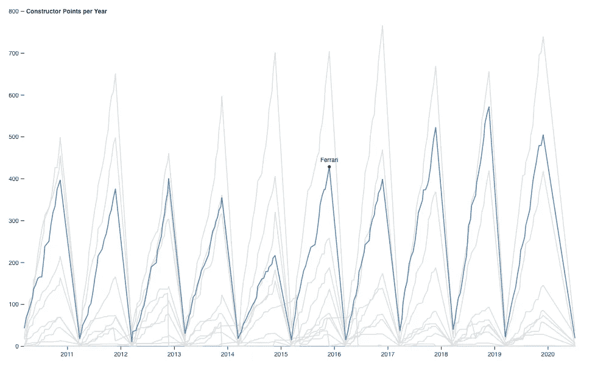
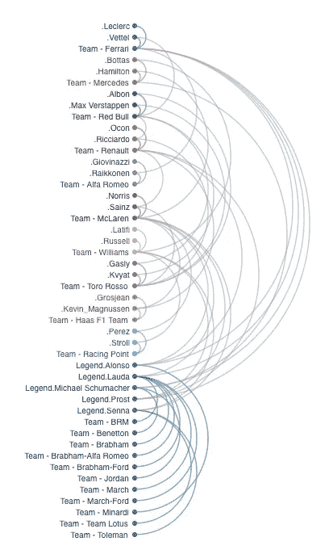
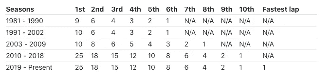

# 一级方程式赛车数据可视化(第二部分)——构造者和车手

> 原文：<https://medium.com/analytics-vidhya/formula-1-racing-visualization-part-2-constructor-and-driver-e14c13dafad8?source=collection_archive---------18----------------------->

米卡·鲍梅斯特在 [Unsplash](https://unsplash.com/?utm_source=unsplash&utm_medium=referral&utm_content=creditCopyText) 上的照片

自 1981 年以来，**一级方程式赛车**车队被要求制造参赛车辆的底盘，因此“*车队*”和“*制造商*”这两个术语多少变得可以互换。

[无论如何，你错过了 f1 赛车可视化**第一部分**(点击此处](/@oransum/formula-1-racing-data-visualization-part-1-driver-career-wins-6ef90ae33b8b))

一级方程式世界制造商锦标赛(WCC)由国际汽联根据大奖赛结果授予一个赛季中最成功的一级方程式制造商。

*   每场*大奖赛*的结果通过*积分系统*进行评估，以确定两个年度世界冠军:一个是车手冠军，另一个是**车队冠军**。
*   车队总冠军积分是通过增加任何一名车手在每场*大奖赛*中为车队获得的积分来计算的。

## 建造师锦标赛的历史

在获得冠军的 62 个赛季中，只有 15 个车队获得过冠军，其中法拉利车队最为成功，获得了 16 个冠军，包括从 1999 年*到 2004 年*的 6 个连续冠军。

车手从 [**迈凯轮**](https://en.wikipedia.org/wiki/McLaren)[**威廉姆斯**](https://en.wikipedia.org/wiki/WilliamsF1)[**雷诺**](https://en.wikipedia.org/wiki/Renault_in_Formula_One) (原贝纳通)，到 [**法拉利**](https://en.wikipedia.org/wiki/Scuderia_Ferrari) ，被戏称为“四巨头”，赢得了从 *1984 年到 2008 年*的每一个世界冠军。这些车队赢得了从 1979 年*到 2008 年*的每一次车队总冠军，并且在 1989 年*到 1997 年*的每个赛季都是车队总冠军的前四名。

下图显示了从 2010 年*到 2020 年*的 11 名建造商的**建造商冠军积分**。目前有 10 支车队活跃在 2020 赛季，其中包括一支传奇车队莲花 F1。

*   鼠标悬停在任何一条线上，您都可以直观地看到这些年来的构造函数性能。

[**点击此处与图形**互动](https://observablehq.com/d/27ab118a7bd65f86)

每年的建造师积分(2000-2020 年 7 月)

**现代的另一个故事**

*   随着汉密尔顿在 [**梅赛德斯**](https://en.wikipedia.org/wiki/Mercedes-Benz_in_Formula_One) 的成功，显然德国建造商在 2015 年*至 2019 年*取得了领先。
*   回到*2010–2013*，领先者 [**红牛**](https://en.wikipedia.org/wiki/Red_Bull_Racing) 与其他车队如**法拉利****迈凯轮**之间展开了紧张的战斗。
*   2010 年，**法拉利**的表现不如过去几十年

# 传奇、车手和建设者的成功

一级方程式赛车的每支车队都必须在一个周末的大奖赛中驾驶两辆赛车，每支车队在一个赛季中最多可以使用四名车手。

弧形图显示了**车手**和**构造者**之间当前和过去的合同，以及总 GP 积分。在前两张图的帮助下，我们可以看到车队和车手之间的贡献。

20 名车手，10 名 2020 赛季的现役建造者，以及 5 名传奇人物及其过去的车队都包含在弧图中。

## 五大传奇(比赛图表中的前 10 名)

*   [阿隆索](https://en.wikipedia.org/wiki/Fernando_Alonso)
*   [劳达](https://en.wikipedia.org/wiki/Niki_Lauda)
*   [迈克尔舒马赫](https://en.wikipedia.org/wiki/Michael_Schumacher)
*   [普罗斯特](https://en.wikipedia.org/wiki/Alain_Prost)
*   [塞纳](https://en.wikipedia.org/wiki/Ayrton_Senna)

彩色曲线表示车手和活跃车队之间的当前合同，而灰色曲线表示他们过去的合同。除了图例之外，灰色曲线表示与活动构造函数的过去关系。

[**点击此处与图形**](https://observablehq.com/@wlch/success-of-legends-drivers-and-constructors) 互动

车手和车队

# 牢固的结合

*   所有的传奇车手都加入了非常相似的大车队。
*   大多数现在的车手只加入了两个车队。
*   按 GP 点排序
*   在比赛图表中，前 10 名车手中有 5 名贡献给了法拉利，这也是法拉利总积分领先的原因之一。
*   前 10 名车手中只有 2 名贡献给了梅赛德斯，汉密尔顿是其中之一。德国制造商牢牢占据第二名的位置。
*   汉密尔顿，作为一名车手，他的职业生涯总积分在车队和其他传奇车手中排名第四。

*关于积分系统的更多信息*

这张表传达了一个信息，即*积分系统*的变化归因于过去二十年来现代建筑商的快速崛起。

# 感谢阅读

如果你看了我的帖子后感兴趣或者你已经是 F1 的粉丝，请随时给我留言。更重要的是，如果你想知道更多关于在 R 或 D3.js 中通过数据转换创建可视化图表的信息，请告诉我，我会写单独的帖子来分享技术部分。

**鸣谢**

[http://ergast.com/mrd/](http://ergast.com/mrd/)

[https://observablehq.com/@d3/gallery](https://observablehq.com/@d3/gallery)

[https://en.wikipedia.org/w/index.php?title=Formula_One&oldid = 979567975](https://en.wikipedia.org/w/index.php?title=Formula_One&oldid=979567975)