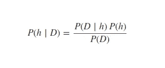

# 贝叶斯学习基础

> 原文：<https://medium.com/analytics-vidhya/foundation-of-bayesian-learning-ba06c8c71a19?source=collection_archive---------7----------------------->

## 学习算法的贝叶斯定理

贝叶斯学习提供了一种概率推理方法。它提供了一种对你的假设进行定量推理的方法。在这篇文章中，我们将在学习算法的背景下理解贝叶斯学习和贝叶斯定理背后的直觉。

由[舒巴姆·莎兰](https://unsplash.com/@shubhamsharan?utm_source=medium&utm_medium=referral)在 [Unsplash](https://unsplash.com?utm_source=medium&utm_medium=referral) 上拍摄的照片

让我们在机器学习的背景下理解贝叶斯定理。在机器学习中，我们经常寻找最佳假设。

在我们继续之前，让我们考虑一个假设的例子。我们已经得到了一个训练数据集(比如 D ),它具有一个人的体重、身高和年龄作为属性，我们必须预测这个人是否适合/不适合，即布尔分类。

设 H 是给定问题所有可能假设的集合。这意味着 H 将拥有所有属性(体重、身高和年龄)的排列和组合，有助于预测一个人是否健康。我们需要在这个集合中寻找最佳假设。

从这组 H 中，我们将选择一个可能的假设‘H’。我们会根据对问题的一些初步认识来选择这个假设。这种关于“h”成为最佳假设的可能性有多大的初始知识被称为**先验概率**。在先验知识不可用的情况下，我们可以给集合 h 中的所有假设分配相同的概率。

我们还需要在不知道数据可能成立的假设的情况下训练数据的概率。这个概率就是 P(D)。

你可能会有一个问题。相信我，这是贝叶斯学习的一个限制。也就是你需要有很多概率的初始知识。这是因为我们试图使用先验来预测后验概率！

P(D|h)将表示可能性。换句话说，根据给定的假设‘h’观察数据的概率。P(h|D)已知为**后验概率**。它给出了给定数据集的假设的概率。

我们有所有必要的工具来构建贝叶斯定理，贝叶斯学习的基石—

贝叶斯定理

这很直观地预期 P(h|D)随着高先验知识即 P(h)和高可能性 P(D|h)而增加。类似地，P(D)的高值将降低 P(h|D ),因为它表示观察到更多独立于假设“h”的数据。

我希望这篇文章能够在贝叶斯定理和学习算法的概念之间建立联系。

我希望你喜欢这篇文章！不断学习，分享知识。关注我[*github*](https://github.com/vaibhawvipul)*[*LinkedIn*](https://www.linkedin.com/in/vipulvaibhaw/)*或*[*Twitter*](https://twitter.com/vaibhaw_vipul)*。**