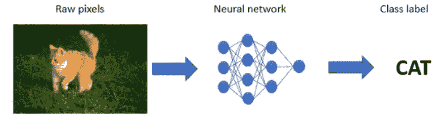

# 深度学习的基础！！！

> 原文：<https://medium.com/analytics-vidhya/foundations-of-deep-learning-7832d4fe5458?source=collection_archive---------12----------------------->

从经验中学习并在面临类似挑战时表现更好的能力是每个聪明人的特质。取决于我们在生活中所处的位置，决定我们走多远的是我们运用一段时间内获得的知识的能力和兴趣。现在被认为是新“电”的人工智能，运行原理非常相似。我们很少看到人工神经…