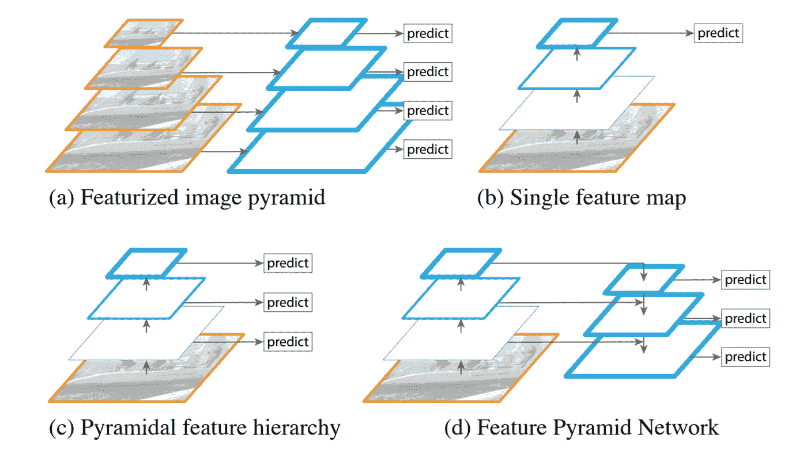
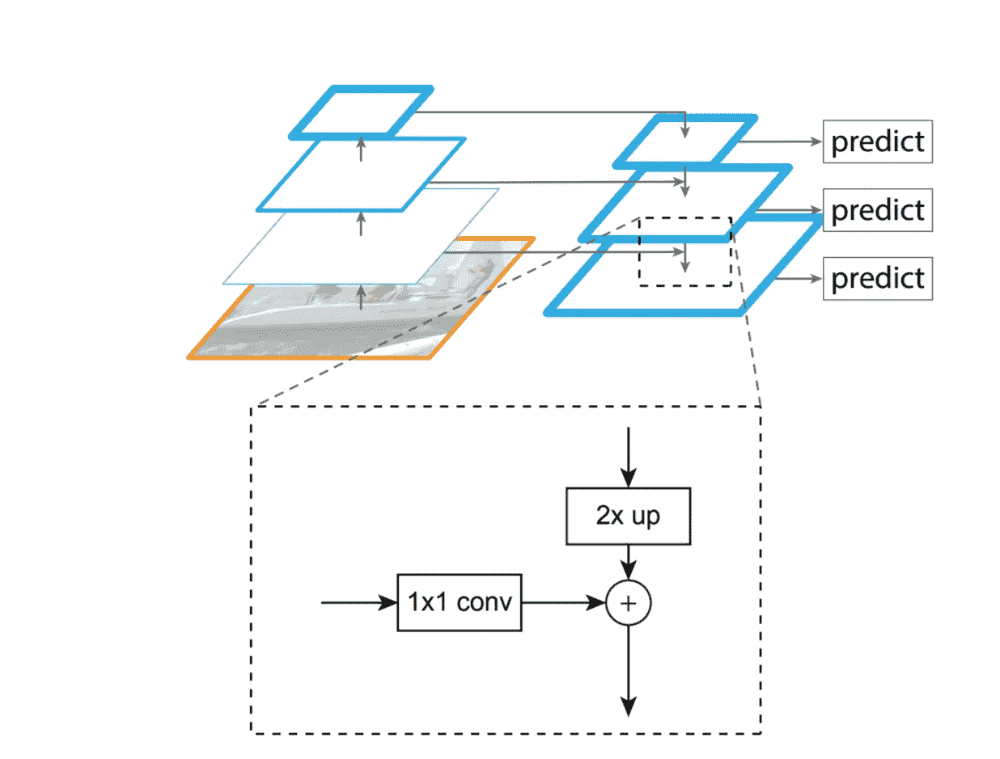
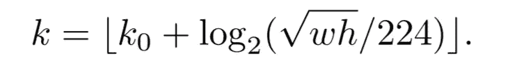

# FPN(要素金字塔网络)

> 原文：<https://medium.com/analytics-vidhya/fpn-feature-pyramid-networks-77d8be41817c?source=collection_archive---------6----------------------->

## 在几乎任何架构上获得免费的精度提升

资料来源:FPN 报纸

我已经计划阅读主要的物体探测论文(虽然我已经浏览了大部分，现在我将详细阅读它们，好到足以写一篇关于它们的博客)。这些论文与基于深度学习的对象检测相关。随时给建议或询问疑惑会尽我所能帮助大家。任何从这个领域开始的人都可以跳过许多这样的论文。当我看完所有的论文后，我也会写下它们的优先顺序/重要性。我写这篇博客是考虑到和我相似的读者仍在学习。虽然我会通过从各种来源(包括博客、代码和视频)深入理解论文来尽力写出论文的关键，但如果您发现任何错误，请随时在博客上指出或添加评论。我已经提到了我将在博客结尾涉及的论文列表。

我们开始吧:)

亚字幕是正确的，FPN 是一个非常简单的方法，可以用于几乎任何模型，以改善结果。我们将很快进入论文的技术细节，但是对于这个博客，有一些先决条件。下面的快速 RCNN，更快的 RCNN，锚盒，SSD 的知识就派上用场了，你应该有个高层次的想法。我也有所有这些论文的博客，你可以查看它们(博客末尾的链接)。如果你很好地理解所有的先决条件，FPN 是一个相对简单的。

影像金字塔(多种比例的多幅影像)通常在预测时使用，以改善结果。但是使用现代深度学习架构计算结果通常在计算和时间方面都是一个昂贵的过程。

*FPN 是基于利用深度 CNN 固有的多尺度金字塔式层级。它类似于 RCNN 和快速 RCNN 之间的差异，RCNN 是一种基于区域的对象检测器，其中我们首先使用诸如选择性搜索的算法来找到 ROI，然后从图像中裁剪这些 ROI(大约 2000 个),并将它们馈送到 CNN 以获得结果，在快速 RCNN 中，CNN 的初始层被共享用于完整图像，ROI 裁剪在提取的特征图上完成，因此节省了大量时间。在 FPN 的情况下，研究是基于开发内部多尺度的性质，和形象金字塔是以某种方式实施的内部架构和共享网络的大部分。我们现在将进入技术细节。*

CNN 基于分层结构，其中特征图的分辨率在每一层之后降低，但是每一个更深的层捕获的语义比前一层更强。由于下采样，语义更强的特征在空间上更粗糙。FPN 创建了一种架构，其中语义更强的特征与来自先前层的特征合并(先前层被二次抽样的次数更少，因此具有更准确的本地化信息)。

该架构由两条路径组成:

1.  自下而上路径(正常前馈 CNN)
2.  自顶向下途径(用于合并功能的新架构)

FPN 建筑资料来源:FPN 报纸

# 自下而上的路径(上图中的左金字塔)

*   这是正常的前馈 CNN 架构。在本文中，作者使用 Resnet 体系结构进行性能评估。我们首先将这些层命名为 C2、C3、C4、C5，它们是 resnet 架构中的 Conv 2、3、4 和 5 层。在应用 C2 后，特征地图的大小为 imagesize/4，并且在每一层后，该空间维度以因子 2 缩减采样。

# 自上而下的路径(上图中的右金字塔)

在这个路径中，使用横向连接将较深的特征与较低的特征合并。由于自底向上路径中的层的通道数量不相同，因此首先应用 1*1 卷积，以获得每层的固定数量的通道(在本文中该维度保持为 256)。空间大小也不同，因此我们对更深的特征进行上采样(2x ),使得该特征的空间大小与自下而上路径中的前一层的更高分辨率的特征地图相匹配。现在，两个特征图的维度是相同的，并且它们通过逐元素添加来合并。

我们可以用一个例子来理解这一点。假设我们的图像尺寸为 512*512，现在每个卷积层(C2、C3、C4、C5)后的特征图尺寸将为[(128*128)，(64*64)，(32*32)，(16*16)]。每层输出通道数为[256，512，1024，2048]。现在，我们对 C2、C3、C4 和 C5 的输出应用 1*1 卷积(输出通道数= 256 ),以获得相等的通道数。我们将用与 S2、S3、S4 相同数量的输出通道来调用这些中间特征，S5 对应于 C2、C3、C4、C5。现在 S5 被上采样为 32*32，并使用元素加法与 S4 合并。现在，这个输出将被上采样为 64*64，并将与 S3 等合并。我们将此阶段的输出称为 T2、T3、T4 和 T5。

为了减少由于上采样引起的混叠效应，对 T2、T3、T4、T5 应用 3×3 卷积，以获得我们的最终特征图 P2、P3、P4、P5，对应于 C2、C3、C4、C5。这些特征用于生成最终的分类和回归得分(bbox)。磁头的参数可以共享，单独的磁头没有额外的好处。

这就是 FPN 的理论。但是我们将会看到 FPN 是如何实现更快的 RCNN 和快速 RCNN 的。

# FPN 为更快的 RCNN

快速 RCNN 采用区域建议网络。RPN 用于生成边界框提议，这些提议稍后用于生成最终预测。RPN 是在最后一层(C5)的提取特征上实现的小型网络。将 3*3 卷积应用于该提取的特征，然后是两个类似的 1*1 卷积层(一个用于分类，另一个用于回归)。

RPN 在这里通过简单地用 FPN 代替单一比例的特征地图来适应。因此，现在 RPN 是为 P2-P5 而不是 C5 单独实施的。对于 RPN 的训练，使用多尺度的锚箱。但是由于多尺度现在是所提取的特征中固有的，所以没有必要在任何级别上具有多尺度锚定框。相反，单个比例锚定框被指定给每个级别。对于{P2、P3、P4、P5 和 P6}，本文中使用的锚盒大小为{32，64，128，256，512 }。此处引入 P6，以便可以使用大型锚箱。P6 是步长为 2 的 P5 的二次抽样。使用纵横比为{1:1，1:2，2:1}的锚盒。

这些锚盒与地面真实盒相匹配，并且模型被端到端地训练。

# 快速 RCNN 的 FPN

在快速 RCNN 中实现 FPN 非常简单。快速 RCNN 使用区域提议技术(如选择性搜索)来生成 ROI，并在单尺度特征图上使用 ROI 池来获得最终结果。通过应用 FPN，我们将有不同比例的多个特征图，我们需要一个策略来分配给定的 ROI 到特征图(现在我们有多个特征图，哪个特征图用于给定的 ROI？).

使用的特征图通过以下方式计算:

这里 224 是 imagenet 数据集中图像的训练大小(使用的 resnet 保留在 imagenet 上)。k0 是尺寸为 224 的 ROI 被分配到的特征图，w 和 h 是 ROI 的宽度和高度。头部具有用于每个特征图的共享参数。

# 参考

1.  [https://github.com/potterhsu/easy-fpn.pytorch](https://github.com/potterhsu/easy-fpn.pytorch)
2.  [用于目标检测的特征金字塔网络。](https://arxiv.org/pdf/1612.03144.pdf)

和平…

# 论文列表:

1.  [OverFeat:使用卷积网络的综合识别、定位和检测](https://arxiv.org/pdf/1312.6229.pdf)。[ [链接到博客](https://towardsdatascience.com/overfeat-review-1312-6229-4fd925f3739f)
2.  [丰富的特征层次，用于精确的对象检测和语义分割(RCNN)。](https://arxiv.org/pdf/1311.2524.pdf) [ [链接到博客](/@sanchittanwar75/rcnn-review-1311-2524-898c3148789a)
3.  [用于视觉识别的深度卷积网络中的空间金字塔池(SPPNet)。](https://arxiv.org/pdf/1406.4729.pdf) [ [链接到博客](/@sanchittanwar75/review-spatial-pyramid-pooling-1406-4729-bfc142988dd2)
4.  [快速 R-CNN](https://arxiv.org/pdf/1504.08083.pdf) [ [链接到博客](/@sanchittanwar75/fast-rcnn-1504-08083-d9a968a82a70)
5.  [更快的 R-CNN:用区域提议网络实现实时目标检测。](https://arxiv.org/pdf/1506.01497.pdf) [ [链接到博客](https://towardsdatascience.com/faster-rcnn-1506-01497-5c8991b0b6d3)
6.  [你只看一次:统一的，实时的物体检测。](https://arxiv.org/pdf/1506.02640.pdf) [ [链接到博客](/@sanchittanwar75/yolo-1506-02640-dbe968e87b46)
7.  [SSD:单次多盒探测器](https://arxiv.org/pdf/1512.02325.pdf)。[博客链接]
8.  [用于目标检测的特征金字塔网络。](https://arxiv.org/pdf/1612.03144.pdf) ←你完成了这篇博客。
9.  [DSSD:解卷积单粒子探测器](https://arxiv.org/pdf/1701.06659.pdf)。[博客链接]
10.  [密集物体检测的焦点丢失(视网膜网)。](https://arxiv.org/pdf/1708.02002.pdf)【博客链接】
11.  YOLOv3:一种渐进的改进。[博客链接]
12.  [狙击手:高效多尺度训练](https://arxiv.org/pdf/1805.09300v3.pdf)。[博客链接]
13.  [标注像素和区域的高分辨率表示。](https://arxiv.org/pdf/1904.04514.pdf)【博客链接】
14.  [FCOS:全卷积一级目标检测](https://arxiv.org/pdf/1904.01355v5.pdf)。[博客链接]
15.  [物为点](https://arxiv.org/pdf/1904.07850.pdf)。[博客链接]
16.  CornerNet-Lite:高效的基于关键点的对象检测。【博客链接】
17.  [CenterNet:用于对象检测的关键点三元组](https://arxiv.org/pdf/1904.08189v3.pdf)。[博客链接]
18.  [CBNet:一种用于目标检测的新型复合主干网络体系结构。](https://arxiv.org/pdf/1909.03625v1.pdf)【博客链接】
19.  [EfficientDet:可扩展且高效的对象检测](https://arxiv.org/pdf/1911.09070v2.pdf)。[博客链接]
20.  [YOLOv4:物体检测的最佳速度和精度](https://arxiv.org/abs/2004.10934)。[博客链接]