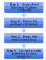
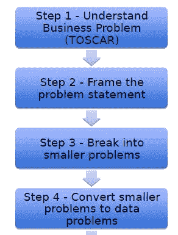
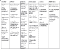
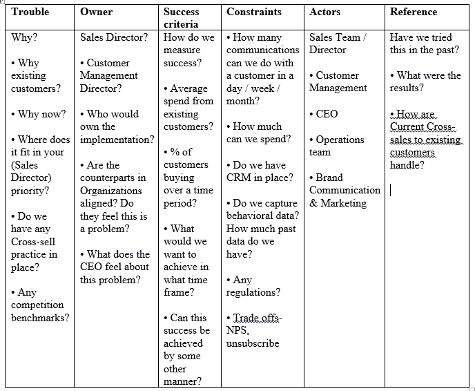
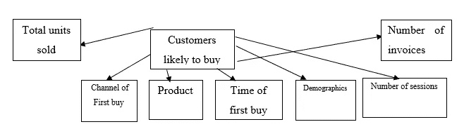
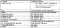
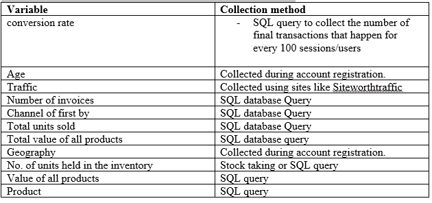

# 将业务问题转化为数据问题的框架——结构化思维

> 原文：<https://medium.com/analytics-vidhya/frameworks-for-converting-business-problem-into-a-data-problem-structured-thinking-d982310e3b6e?source=collection_archive---------7----------------------->

**简介**

数据科学家的职责是将模糊的业务问题转化为数据问题，并使用科学的方法、流程、算法和模型从数据中获得洞察力。在查看数据或分析工具之前，通过将适当的框架和结构应用到他们的思维中，数据科学家通常能够对业务问题形成更深入的见解。下面，我举例说明了我从 Analytics Vidhya 结构化思维课程中学到的将任何业务问题转化为数据科学问题的框架:

**业务问题**:“我想增加现有客户的收入。你能帮我们做到这一点吗？”—某电子商务公司的销售总监

分析 Vidhya

**第一步:**我们应用 **TOSCAR** 框架来识别业务问题是否真的是一个问题，而不是一个解决方案。

**第 2 步:**根据上述框架，根据与风险承担者举行的讨论或会议的结果，制定问题陈述。

**问题陈述:**确定可能从公司购买更多产品的现有客户，从而在下一季度增加 25%的收入。

**第三步:**我们应用分解或 MECE 原理(互斥且集体穷举)将问题陈述分解成更小的问题。

***分解*** :通过转换成方程的方式将问题语句分解。举个例子，

总收入=总流量 x 转化率(%) x 平均购物篮大小 x 平均单位价值

我们专注于:

**转化率(%)** —你得到的每 100 个会话/用户发生的最终交易数就是转化率。会话是访问，用户是访问者。

总流量 —流量本质上是一个网站或一个应用程序定期获得的点击量。这可能是用户或会话的数量。

**平均购物篮大小** —平均购物篮大小是指在一次购买中售出的商品数量。

总销售量/发票数量=平均购物篮大小。

***MECE:*** 我们进行如下图所示的仔细分析，或者生成一个详尽的可量化的解释列表。进一步的解释在我的 youtube 频道。

第四步:我们将较小的问题转换成数据集。这就是我们提出问题的地方，比如基于上述假设，你需要什么样的数据，你需要哪些变量，你将如何收集它们？

关键要点:当你遇到一个需要解决的问题时，不要钻研数据。围绕它放一个结构，确保你涵盖了所有方面，了解什么是最重要的因素，布局可能的假设和数据要求然后解决问题。