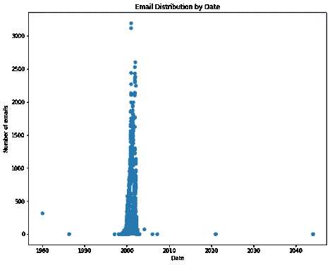
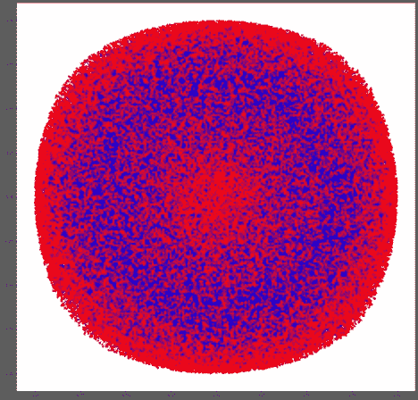
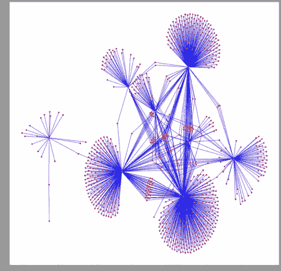
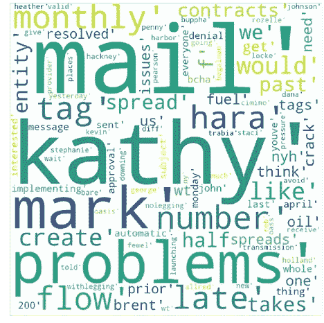
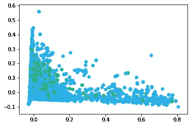
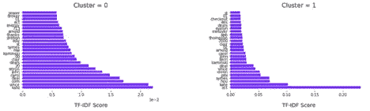

# 安然电子邮件中的欺诈检测

> 原文：<https://medium.com/analytics-vidhya/fraud-detection-in-the-enron-emails-786799234812?source=collection_archive---------5----------------------->

因此，我们都记得或读过安然公司的大规模风险管理失败。它有所有经典的危险信号，但被放大到如此巨大的规模，因为不知何故董事会仍然不知道到底发生了什么。相反，他们依赖于莱，然后斯基林和他们所谓的“专业知识”以及现已解散的阿瑟·安德森的意见。这本来是可以避免的吗？当然可以。正如我提到的，其他风险管理失败的许多危险信号都在那里。忽略定性问题很容易——它们是可以解释的，你可以用自己的方式忽略它们。但是量化…这是一个难以忽视的现实。数字不会像人一样撒谎。

我开始建立一个机器学习模型，让高级经理或董事会成员能够看到可能需要额外审查的人。我使用电子邮件流量对文本进行分类，结果相当准确，可以将人们列入“进一步调查”名单。或许如果董事会被要求审查这些发现，丑闻的规模就不会对能源和金融市场造成近 20 年的影响。在这里，我将详细描述我的过程，尽管对于那些感兴趣的人，你可以在这里找到完整的代码。对于跟随代码的人，请按顺序打开笔记本。数据集的大小要求我把它分成几个不同的笔记本；它使我不必在任何给定时间将大量数据集读入内存。

大部分真题分析会在 NLTK 和 Sklearn 的帮助下完成。然而，准备数据占用了这个模型的大部分时间。电子邮件非常非常乱。这个数据集包含了非常多的电子邮件。将文件解析成数据帧是第一项任务，我最终使用了一个名为 Parser 的库。它允许我循环浏览目录和子目录，将每个电子邮件部分保存到它自己的列表中。然后将它们连接起来，以备使用。

我想看看我是否能够通过绘制任何一天发送的电子邮件数量来回顾丑闻发生的日期。这需要一些认真的擦洗，但我能够达到以下。在现实世界中，你有大量的电子邮件，而不仅仅是与丑闻有关的邮件，人们可以理解，即使数量不断增加的电子邮件也值得调查，特别是如果它不符合以前的模式。

我还想看看数据集的网络图是什么样的。我使用了 NXVIZ，这是一个用于 Network X 的可视化工具包。我使用了三种不同类型的映射来显示个人之间的相互作用。考虑到他们的互动范围，这些地图中心的某些人可能被视为高风险。我之前包括了网络图，但是在我的代码中你也会发现一个弧形图和一个圆形图。

> #绘制网络图
> PLT . fig(figsize =(20，20))
> position = NX . spring _ layout(G，k=.1)
> nx.draw_networkx(G，position，node_size=25，node_color='red '，with_labels=False，edge_color='blue')
> plt.show()

显然，这是荒谬的，当你看着这么大的东西时就会发生这种情况。以下是前 1000 名发送者及其以接收者形式进行的交互的一部分。这些是基于节点权重排序的；那些权重较高的应该对我们正在进行的调查更“重要”。

> top _ edges = sorted(g . edges(data = True)，key=lambda t: t[2]。get('weight '，1))
> top _ edges = top _ edges[:1000]

鉴于数据集的规模，我开始了一些额外的探索，只使用了一个人的电子邮件，凯·曼。我们想看看词频，但标记文本是处理器密集型的，我选择在使用整个方法之前在一个较小的数据集上测试我的方法。这允许我们使用 NLTK 的频率分布来获得热门单词及其使用计数。有了这样一个简单的衡量标准，将热门词汇显示为词云是很自然的一步。WordCloud 库使这变得非常容易，并允许我们使用 Matplot 和 seaborn 进行格式化和显示选项。

> top _ keys = list(top _ words . keys())
> most _ frequency = { }
> for key in top _ keys:
> new = key . lower()
> most _ frequency[new]= top _ words[key]
> 
> #创建 WordCloud 对象
> comment _ words 2 = str(most _ frequency)
> word cloud 2 = word cloud(width = 800，height = 800，
> background_color ='white '，
> stopwords = stopwords_list，
> min_font_size = 10)。生成(注释 _ 单词 2)
> 
> #绘制 WordCloud 图像
> plt.figure(figsize = (15，15)，face color = None)
> PLT . im show(word cloud 2)
> PLT . axis(" off ")
> PLT . tight _ layout(pad = 0)
> PLT . show()

对于那些感兴趣的人来说，这个词云中的一些人在安然丑闻中扮演了非常有趣的角色。我在 github repo 上的代码描述中包含了一些代码。

现在我们有了一些有趣的东西，包括一些我选择不包括在这里的统计数据，分析的下一步是，嗯，分析。我们要做的是采用无监督的机器学习模型，并对数据集进行聚类，以创建将用于监督分类模型的标签。这将给出一个“有待进一步调查”的列表。就资源而言，欺诈分析师可以将他们的时间用于其他任务，或者让企业将这些资源分配到其他地方。

为了做我在这里想做的，我们需要取一个非常大的稀疏矩阵，它是我们当前的独立变量，在我们能使它密集之前对它切片。在个人计算机上使用标准 python 库无法以这种方式压缩如此大的矩阵。这就是我们首先使用稀疏矩阵的原因。我们仍然可以为我们的模型使用非常大的矩阵[40，000 x 40，000]。该矩阵由针对我们的词体的矢量化 TF-IDF 特征组成。我们使用这种方法来解释这样一个事实，即英语中的一些单词只是比其他单词更常见，而不管它们出现在哪个语料库中。

我们将使用什么型号？我决定实现一个 K-Means 聚类算法，用两个集群初始化。希望这将输出一串重要的人和一串重要的单词。这些标签将依次成为我们的监督模型的输入，稍后会有更多的内容。下面是我们使用 Kmeans 集群的模型输出。我们实际上使用了 KMeans mini batch 来节省计算能力，因为它不需要将整个数据集写入内存。

双聚类均值分析

现在有了两个集群，每个集群都保存在自己的数据帧中，我们可以绘制下图。这是我们使用的两个组中每个组的加权前 25 个单词。虽然图没有完全分离，但如果我们使用整个数据集(不知何故！)我们可以推断这里的精确度会更高。无论如何，我很满意使用这些作为监督模型的“真实”标签。

有了可用的标签，注意力就转向了监督模型。我选择 K-最近邻是因为它的分类和懒惰计算特性。我的希望是创建一个模型，输出适当的聚类，这样反过来分析师就能够知道谁可能需要额外的审查。我们使用最近的 3 个邻居实现了 KNN 模型，并在测试数据上获得了 90%以上的准确率。

对我来说听起来不错。

如果我有无限的时间继续努力，我们可以做一些额外的事情。首先，我们可以找到能够在整个数据集上运行算法的必要资源。其次，我们可以将聚类和分类分为两步:找到感兴趣的人，然后继续查看他们在电子邮件中使用的语言，看看这本身是否可能是欺诈的危险信号。最后，我们可以尝试一些不同的集群或邻居，看看是否可以进一步提高模型性能。由于我的时间不是无限的，这些想法将不得不被搁置，以备不时之需。

我在公司金融和风险管理领域工作了十多年，我知道这类算法是欺诈检测和金融取证的前沿。希望这个应用程序能够为社区提供一些额外的见解，帮助他们了解如何在未来防止这类风险管理失败。当然，这是从历史中学习的一种方式，这样我们就不会犯过去的错误。快乐造型！