# 欺诈预测；机器学习算法面临的挑战

> 原文：<https://medium.com/analytics-vidhya/fraud-prediction-a-challenge-for-machine-learning-algorithms-60164342bda?source=collection_archive---------12----------------------->

**简介**

欺诈是一个价值数十亿美元的行业，并且每年都在快速扩张。成千上万的人成为它的受害者。欺诈总是包括虚假陈述、误解或欺诈行为。常见的欺诈犯罪包括身份盗窃、保险欺诈、信用卡/借记卡欺诈和邮件欺诈。

普华永道 2018 年全球经济犯罪调查(PwC，2018)发现，在 7200 家被调查的企业中，约有一半已经经历了某种欺诈。这与普华永道在 2016 年进行的调查(PwC，2016)相比有所增加，在该调查中，略多于三分之一的受访组织经历过经济犯罪。根据 Infosecurity 杂志(Infosecurity，2018)，2018 年，欺诈使全球经济损失了近 4 万亿美元。对于许多企业来说，欺诈造成的损失超过了总支出的 10%。如此巨大的损失促使公司寻找更有效的解决方案来检测和防止欺诈。

控制欺诈是一个令人头痛的问题，尤其是对银行和商业行业而言。由于各种在线支付选项，如信用卡或借记卡、智能手机支付应用程序、在线支付网站等，交易数量有所增加。与此同时，网络犯罪分子已经变得善于发现和利用在线支付系统的模糊性或不足之处。因此，企业认证和批准交易变得越来越困难。

机器学习是最有希望对抗金融诈骗的技术武器。随着大数据处理能力的提高和统计建模的进步，机器学习(ML)的采用已经加快。得益于机器学习科学的快速发展，数据科学家可以缓解这个问题，并做出及时准确的预测。由机器学习驱动的自动化欺诈检测系统可以帮助企业大幅减少欺诈。

在本文中，机器学习模型是在一个具有挑战性的大规模在线交易数据集上进行基准测试的。本研究选择的机器学习模型来自 SAP 预测分析商业智能软件(SAP，2020)、SciKit-Learn 开源库(Sklearn，2020)和 Microsoft LightGBM 框架(LGBM，2020)。来自包括欺诈交易在内的真实在线购买的数据集被用于训练所有机器学习算法。

**目标**

该研究涉及一个二元分类问题，即目标变量是一个二元属性，将在线交易描述为欺诈性或非欺诈性。在进行用于训练和评估的机器学习之前，对数据进行预处理和分析。预处理对于解决原始输入数据的典型问题是必要的，例如拒绝空数据行、修复缺失值、一键编码、异常检测以及要素缩放和归一化。干净的数据然后通过管道传输到机器学习算法进行训练和评估。结果通过受试者工作特征曲线下的面积(AUC-ROC)来解释，该曲线是使用真阳性(TP)率作为分类算法的可变阈值的假阳性(FP)率的函数来构建的。该指标最终用于比较本研究中涉及的算法的性能。

**数据**

该数据集由 Vesta Corporation (Vesta，2020 年)提供，描述了真实世界的匿名电子商务交易(IEEE-CIS，2019 年)。*590，540 个数据条目中的每一个都包含从设备类型到产品特性的广泛特性，因此提供了创建新特性和改进训练结果的机会。更具体地，每笔交易由 200 个特征表征，包括关于交易和支付方的信息(见* **表 1** *)。数据列细分为 35 个分类列和 165 个数字列。此外，数据以特定日期-时间基准的时差格式传递有关交易的时间信息。*

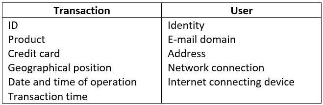

**表 1** 欺诈交易数据集的主要特征类别。

给定数据集中的欺诈率被测量为 3.53%，表明分类问题是高度不平衡的。因此，重点放在避免一个训练有素的模型，假设而不是检测实际的欺诈签名。

**随机森林**

随机森林被训练用于生成预测。它们是一种基于集成学习方法的监督学习算法。在集成学习技术中，不同类型的算法或同一算法的多个版本被组合在一起，以形成更强大的预测模型。可以通过在训练时构造大量决策树来训练随机森林算法用于分类或回归任务，从而产生森林树。虽然深度决策树可能遭受过度拟合，但随机森林通过在随机子集上创建决策树来防止过度拟合。以计算速度慢为代价，随机森林适用于不平衡分类问题，因为它们不太容易受到较大方差的影响。随机森林也极其稳定；该算法不受在数据集中引入新数据的太大影响，并且在缺失或异常值的情况下表现良好。此外，它们可以很好地处理未缩放和未标准化的数据。算法配置总结在**表** **2** 中，该表显示了使用 Sckikit-Learn 套件的随机森林算法的主要训练超参数。

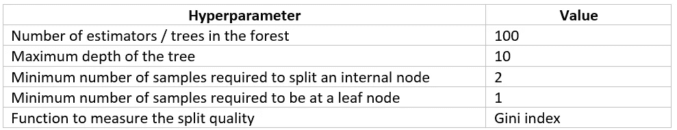

**表 2** 用于训练随机森林算法的调谐参数

在训练随机森林之前，执行元变换器算法来选择重要性权重上的特征。这是一个特定于树的特征重要性度量，计算由于每个特征导致的森林中所有树的杂质平均减少量。重要性分数小于 0.002 的特征，即倾向于分裂远离树根的节点的特征，被认为是不重要的，因此从算法训练中去除，因为它们可能妨碍获得有效和准确的预测建模的过程。

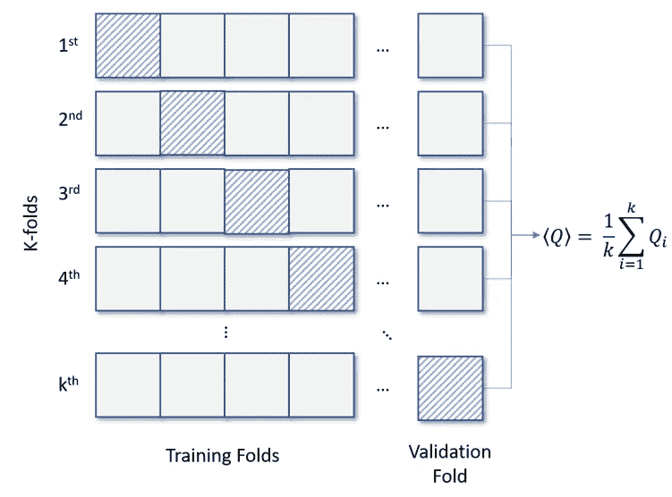

**图 1** 使用 k 个折叠进行数据划分的分层交叉验证方法。在每次迭代中，k-1 个折叠用于训练模型，剩余的“保持”折叠用于验证其训练的能力。通过保留每个类别的样本百分比来建立折叠。对于每个性能量 Q，例如准确度或 AUC-ROC，平均值是基于在 k 倍迭代过程中获得的值计算的。

Scikit-Learn 的 k-Fold 交叉验证器用于将标记数据分成训练集和测试集。数据集被分成 k=5 个连续的分层折叠，从而保留了每类样本的相等部分。然后，每个折叠被用作一次验证集，而剩余的 k-1 个折叠形成训练集。训练后，计算 ROC 和 AUC-ROC。曲线下的面积越大，获得的模型越好，因为最大化 TP 速率和最小化 FP 速率是理想的。**图 2** 展示了随机森林 5 重训练的 ROC。发现平均 AUC-ROC 和准确度分别为 0.886 和 0.974。在仔细比较了训练和验证会议的表现之后，没有观察到模型过度训练的迹象。

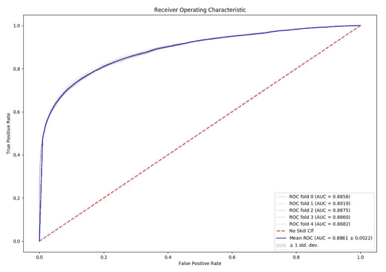

**图 2** 随机森林算法 5 重训练的接收机工作特性曲线。每个训练期的 ROC 用不同的颜色表示，如下面的图例所示，并带有 ROC 曲线下的面积(AUC-ROC)。对角线中的红色虚线显示了 AUC-ROC 等于 0.5 的随机和非熟练预测者的 ROC 曲线。

当二元问题的类别很不平衡时，精确召回是预测成功的重要度量。精确度是对结果相关性的一种度量，而召回率是对返回多少真正相关的结果的一种度量。**图 3** 展示了当前欺诈分类问题的精确召回曲线，显示了不同分类阈值的两个数量之间的权衡。高精度与低 FP 率相关，高召回率表示低假阴性率(FN)。两个度量的高分表明分类器正在返回准确的结果(高精度)，以及返回大多数肯定的结果(高召回)。另一个有用的量是 F1 分数，它被定义为精确度和召回率的调和平均值。F1 分数由图 3 中**的等高线表示，在 1 处达到最佳值，在 0 处达到最差分数。**

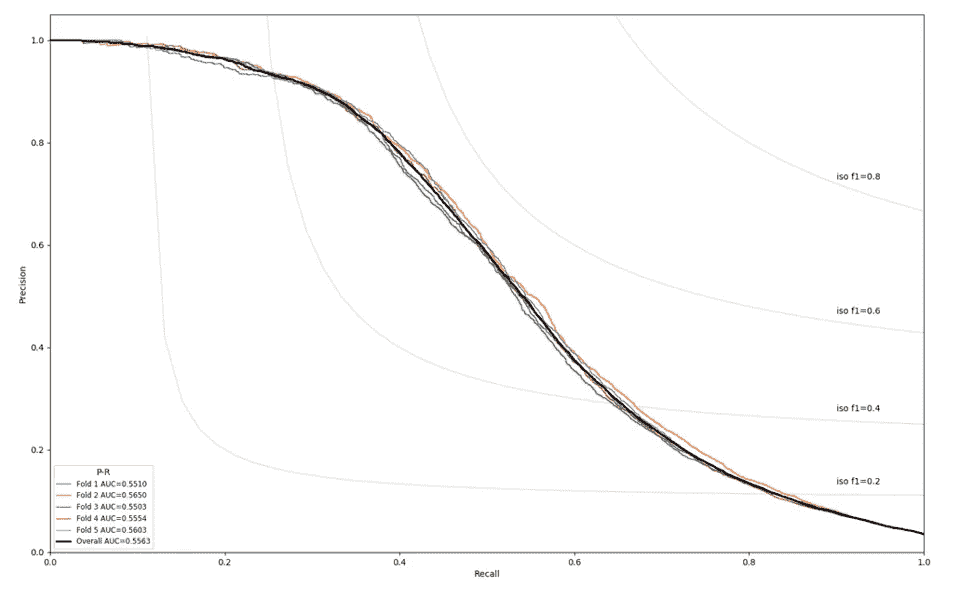

**图 3** 欺诈二进制分类的 5 重训练随机森林预测器的精确召回曲线。等高线代表 F1 分数。

培训中最具影响力的功能是 C1，它记录了在线客户发起的交易流程的特征之一。**图 3** 显示了 C1 可获取的不同值的分布。欺诈交易事件往往与位于该交易特征的最右侧箱中的值相关联。

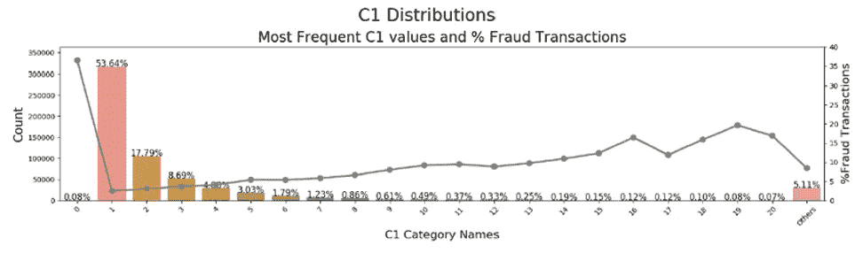

**图 4**C 特征分布示例。C1 变量捕获交易过程的特征之一，并且被发现在随机森林分类器的训练期间排名第一。左边的轴计算实际的在线交易，而与右边的轴相关联的实线示出了每个箱中欺诈性交易的百分比。高 C1 值的交易更容易受到网上欺骗。

**SAP 预测分析**

SAP 预测分析是 SAP 的一款商业智能软件，旨在帮助企业分析大型数据集并预测未来的结果和行为。SAP Predictive Analytics 可帮助在机器学习和数据处理方面没有深厚背景的用户通过完全托管的数据挖掘程序来分析数据。用户可以执行复杂的数据分析，并可视化他们的模型，以图形方式表示数据中的要素。此外，该软件套件还可以自动进行数据准备、预测建模和评分，这有助于业务用户在无需人工干预的情况下分析数据。SAP Predictive Analytics 可以自动对未知数据进行推理，并在实时业务环境中部署训练有素的运营模型。

一旦数据被输入 SAP 预测分析的数据管理器，前者将基于两个主要指标迭代训练分类或回归算法:

**KI 预测能力**定义为“训练模型曲线(=验证或估计样本)和随机模型曲线之间的面积与完美模型曲线和随机模型曲线之间的面积之比”

**KR 置信度**定义为“估计曲线和验证曲线之间的面积与完美模型曲线和随机模型曲线之间的面积之比”

这些量在**图 5** 中有图解说明。

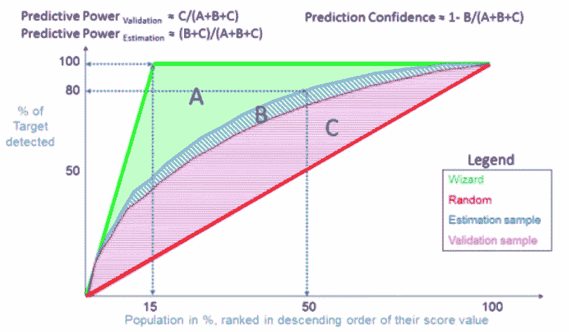

**图 5**SAP Predictive Analytics 的 Modeler 服务执行模型训练期间，交叉验证图中预测能力(KI)和预测可信度(KP)的定义。

通过迭代过程，当 KI 和 KR 之和最大化时，SAP 预测分析的建模者认为训练的模型是最优的。对于检测欺诈交易的任务，建模者执行了五次迭代以获得最佳训练模型，如图**图 5** 所示。

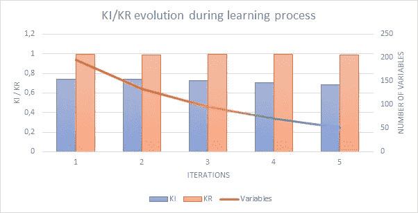

**图 6** 基于 KI 和 KP 数量，通过迭代程序开发训练模型。当 KI+KR 之和最大时，SAP 预测分析的建模器选择训练模型。

通过递归地考虑越来越小的特征集，递归特征消除被自动应用于选择特征。在每次迭代中，建模器自动从训练会话中删除重要性排名最后的特性，最终得到 51 个特性。训练模型后，在图 6 中测量的 AUC-ROC 和准确度分别为 0.875 和 0.961。

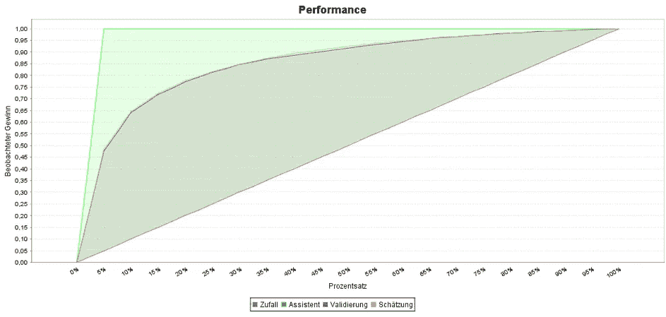

**图 7**SAP 预测分析训练中使用的训练集(橙色)和验证集(蓝色)的 ROC 曲线。非熟练分类器的预测由红色对角线表示，而绿色阴影区域表示向导模型的 ROC。

培训中最重要的功能是 V54，它记录了在线客户发起的交易流程的特征之一。

**LightGBM**

LightGBM 是一个梯度推进框架，使用基于树的学习算法。它被设计成在计算上是分布式的，并且有效地提供精确的预测。它以较低的内存使用率处理大规模数据，并支持基于 CPU 和 GPU 的模型学习加速。**表 3** 总结了用于训练增强决策树模型的超参数及其最佳值。

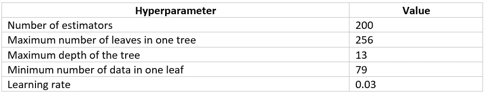

**表 3** 优化 LightGBM 分类算法的最重要的超参数。

通过减去平均值并缩放到单位方差来标准化输入训练数据集是许多机器学习估计器的常见要求。如果一个特征与其他特征相比具有相当高的方差，则它可能支配学习算法的目标函数，并使估计器不能如预期的那样正确地从其他特征中学习。因此，对于增强决策树，单个特征通过标准化过程。当特征接近正态分布时，学习算法也可以更快地收敛。

与随机森林的情况一样，使用 5 重交叉验证重采样程序来评估 LightGBM 在看不见的数据上的技能。此外，以类似于随机森林模型训练的方式执行特征选择。重要性分数小于 10 的特征被认为是不重要的，因此从算法训练中移除。交叉验证也是针对过度拟合危险的一种强有力的预防措施。将数据分成 k=5 倍后，发现 k-1 训练和维持折叠的 AUC-ROC 相似。训练 LightGBM 树后的平均 AUC-ROC 和准确度分别为 0.979 和 0.985。

培训中最重要的功能是 Card1，它保存了客户在在线订购时使用的信用卡特征之一。**图 8** 显示了该数字特征可以记录的不同值的分布。欺诈交易事件往往与这一信用卡特征的更核心价值相关联。

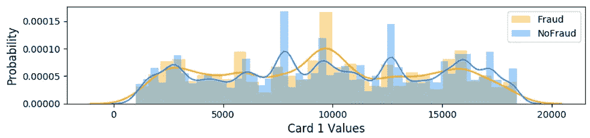

**图 8** 欺诈与非欺诈的 Card1 特征分布。发现 Card1 是 LightGBM 算法训练中最有影响力的特征。分布被标准化为单位面积。

**可变排名**

可变排序是通过某个评分函数值对特征进行排序的过程，该评分函数值通常测量特征相关性，并且特定于每个算法。**表 4** 显示了在使用 Scikit-Learn(左)、SAP Predictive Analytics(中)和 LightGBM(右)对随机森林进行算法训练期间，按重要性排序的前十个变量的比较。C、D 和 V 特征描述了在线交易购买订单。ID 分类特征包含关于在交易期间运送到在线购买系统的客户的身份的信息。例如，ID 特征可以记录关于操作系统、浏览器、屏幕分辨率、登录连接等的信息。卡特征保存关于用于在线购买的信用卡的信息，Amt 表示花费的金额，并且“Addr1”和“Pemail”分别包含关于地理位置和客户的电子邮件域的信息。

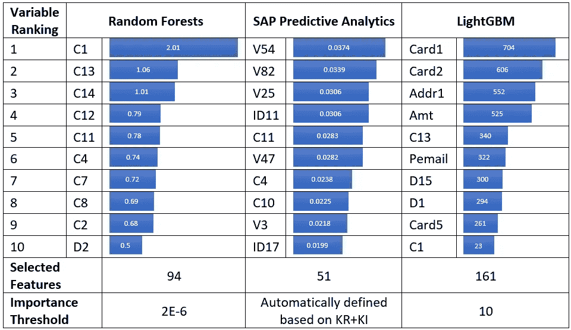

**表 4** 在随机森林、SAP 预测分析和 LightGBM 的培训过程中，按重要性排序的前 10 个变量。特征重要性计算是特定于算法的。随机森林的要素重要性乘以 100。

**性能对比**

**表 5** 按照 AUC-ROC 和准确性定义的升序排列，总结了三个预测程序获得的主要结果。相对于 SAP 预测分析，随机森林的训练期更短，准确性和 AUC-ROC 更高。以高计算时间为代价，LightGBM 优于 SAP 预测分析和随机森林，提供了具有更高准确性和 AUC-ROC 的明显更好的结果。二进制分类问题中的另一个关键度量是 FP 率。FP 是检查单个条件的测试，并且错误地给出肯定(肯定)的决定。标记为 FP 的交易可能会导致持卡人的交易被拒绝或账户被锁定，从而给客户和组织带来额外的不便。对于本研究中涉及的所有算法，FP 率被测量为位于 2-3.5%的范围内。

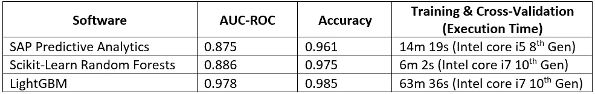

**表 5** 用于预测欺诈性在线交易的三个预测软件套件的性能总结。LightGBM 还支持可扩展模型训练的 CPU-GPU 加速(指定了 4 个 CPU 内核)。

**结论**

交易欺诈是最常见的在线金融欺诈类型之一，通常发生在使用偷来的支付卡或数据生成未经授权的采购订单时。零售商、商家、银行和其他企业越来越关注预测和防止欺诈性交易。有效的保护依赖于使用机器学习技术实时准确地区分合法客户和欺诈者。因此，预测的准确性和及时性是有效防止欺诈交易发生的关键价值。欺诈事件的预测对于机器算法来说是一项具有挑战性的任务，因为这些算法面临着解决相当不平衡的分类问题的挑战。

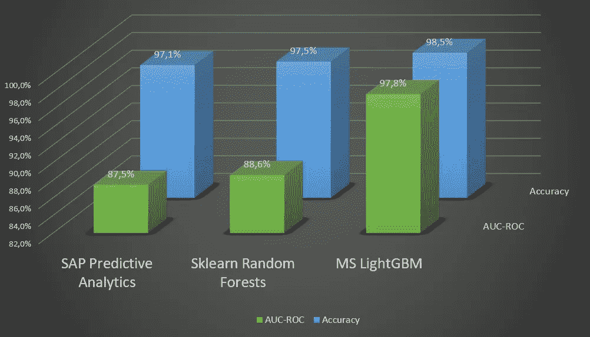

**图 9** 机器学习算法在欺诈数据集挑战基准测试中的性能总结。

在这项研究中，在描述在线欺诈交易的基准数据集上训练和测试了不同的算法。由于这是一个受监督的机器学习任务，数据被标记，从而提供了测量每个算法性能的可能性。在测试的算法中，就 AUC-ROC 和准确性而言，LightGBM 在预测欺诈交易方面表现最佳。

**学分**

感谢克里斯特斯·康斯坦蒂尼蒂斯对这项工作的技术支持。

**参考文献**

IEEE-CIS。(2019).来自[https://www.kaggle.com/c/ieee-fraud-detection](https://www.kaggle.com/c/ieee-fraud-detection)

信息安全。(2018).*信息安全*来自[https://www . info security-magazine . com/news/global-fraud-hits-32-万亿/](https://www.infosecurity-magazine.com/news/global-fraud-hits-32-trillion/)

LGBM。(2020).*微软 LightGBM* 。来自[https://www.microsoft.com/en-us/research/project/lightgbm/](https://www.microsoft.com/en-us/research/project/lightgbm/)

普华永道。(2016).来自[https://www . PwC . com . au/publications/cyber-global-economic-crime-survey-2016 . html](https://www.pwc.com.au/publications/cyber-global-economic-crime-survey-2016.html)

普华永道。(2018).*将欺诈拉出阴影；全球经济犯罪和欺诈调查。*检索自[https://www.pwc.com/fraudsurvey:](https://www.pwc.com/fraudsurvey:)[https://www . PwC . com/GX/en/forensics/global-economic-crime-and-fraud-survey-2018 . pdf](https://www.pwc.com/gx/en/forensics/global-economic-crime-and-fraud-survey-2018.pdf)

闷棍。(2020).*预测分析软件*。来自[https://www.sap.com/products/predictive-analytics.html](https://www.sap.com/products/predictive-analytics.html)

Sklearn。(2020). *Scikit-learn* 。来自 Python 中的机器学习:[https://scikit-learn.org/](https://scikit-learn.org/)

灶神星。(2020).维斯塔公司。来自[https://trustvesta.com/](https://trustvesta.com/)