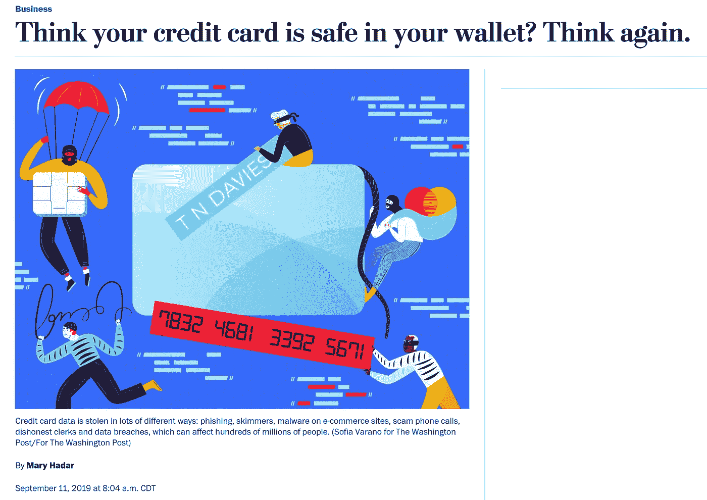
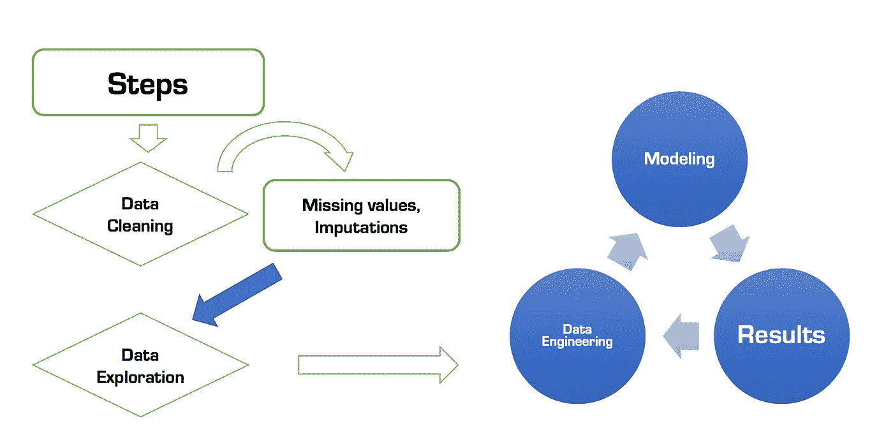
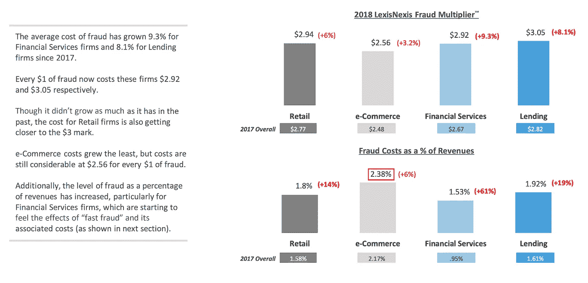
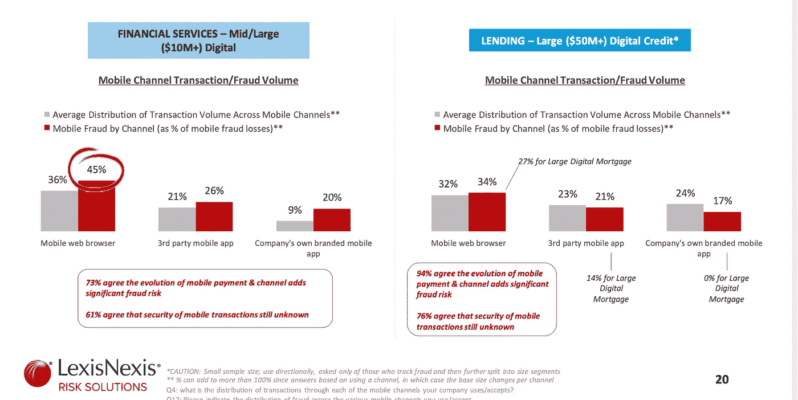
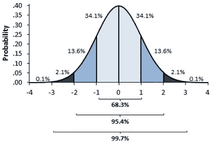
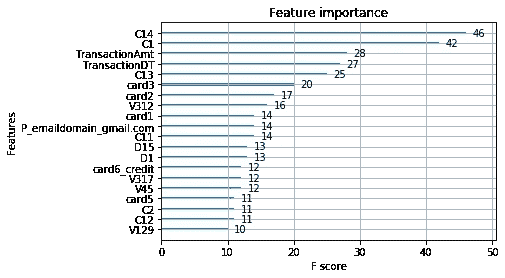
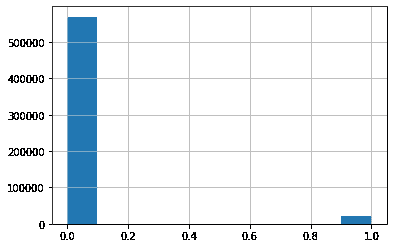
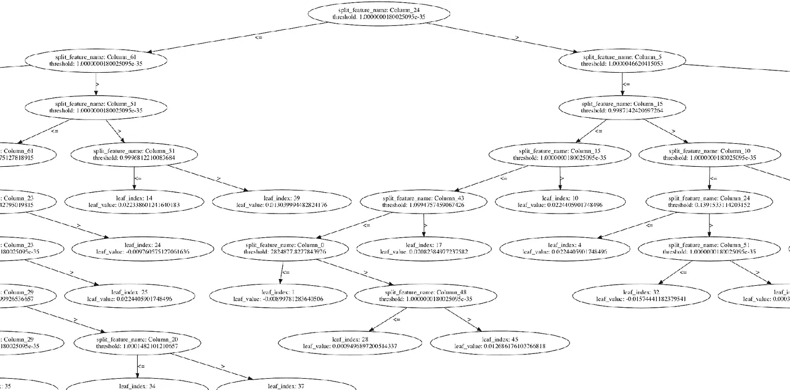
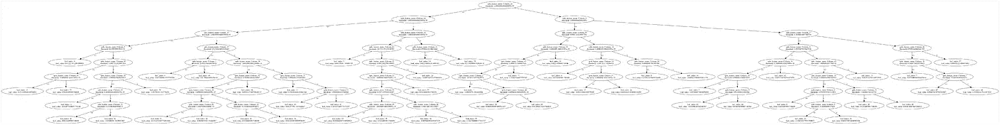

# 欺诈交易预测

> 原文：<https://medium.com/analytics-vidhya/fraudulent-transaction-prediction-6888c4ca8031?source=collection_archive---------14----------------------->

## **目标** : **识别&预测欺诈交易**

根据《福布斯》的数据，2015 年，银行和商户因全球发行的所有信用卡、借记卡和预付费通用支付卡和自有品牌支付卡而遭受的欺诈损失达到 218.4 亿美元，其中美国占 84.5 亿美元，占总数的近五分之二(38.7%)。但到 2020 年，如果全球增长率达到 45%，欺诈损失可能超过 120 亿美元..

# **数据集:**

*   来源[Kaggle.com](https://www.kaggle.com/c/ieee-fraud-detection/overview)；Vesta 提供的数据
*   形状(大小):590540 条记录，433 个特征
*   更多信息([https://www.kaggle.com/c/ieee-fraud-detection/data](https://www.kaggle.com/c/ieee-fraud-detection/data))
*   问题:二元分类

**代码:**https://github.com/aabdygaziev/capstone-project

**挑战:**大数据集，大量缺失值，不平衡数据，特征选择。

**我解决问题的方法:**

**使用的工具:**

*   大蟒
*   熊猫，scikit-learn，imblearn，mlxtend，lightgbm

**方法学:**

*   合成少数过采样技术— SMOTE
*   插补方法—简单插补器
*   特征选择

**问题的相关性**

1 美元欺诈的成本(来源:LexisNexis)

**最大的输家**

LexisNexis 的研究

**数据清洗:**清洗过程非常重要。在你做分析和建立模型之前，清理你的数据。在我的例子中，我为缺失值设置了 20%的阈值水平。如果某个要素的缺失值超过 20%，则该要素将被丢弃。其余符合要求的，其值是估算的。此外，位于 0.025 和 0.975 分位数的异常值将被移除。捕获了 99.5%的数据。

正态分布曲线

**功能选择:**

在实施特征选择方法后，这些特征被证明是重要的特征:

*   C1-C14(计数，例如找到多少地址与支付卡相关联，等等。实际意义被掩盖)
*   交易金额
*   TransactionDT(给定参考日期时间的时间增量)
*   card1 — card6(支付卡信息，如卡类型、卡类别、发行银行、国家)
*   D1-D15:时间差值，如前一次事务处理之间的天数
*   vxxxx:Vesta 设计了丰富的功能，包括排名、计数和其他实体关系。

**不平衡数据集:**这个数据集非常不平衡。只有 3.5%被标注为 1(诈骗)，96.5%为 0(非诈骗)。

不平衡的目标数据

对你的目标数据进行重采样是很重要的，否则你的模型会过度适应多数类，性能会很差。

SMOTE——合成少数过采样技术。这是一种过采样方法，其中通过创建“*合成*”示例对少数类进行过采样，而不是通过替换进行过采样。

如果您想了解更多关于 SMOTE 的信息:[https://www . cs . CMU . edu/AFS/cs/project/Jair/pub/volume 16/chawla 02 a-html/node 6 . html # section 0004200000000000](https://www.cs.cmu.edu/afs/cs/project/jair/pub/volume16/chawla02a-html/node6.html#SECTION00042000000000000000)

# **造型**

在这个项目中，我试图适应几个模型:

1.  RandomOverSampler，LinearSVC(重采样，模型)AUC 0.52
2.  BalancedRandomForestClassifier，— AUC 0.54
3.  SMOTE，RandomForestClassifier — AUC 0.71
4.  SMOTE，XGBClassifier — AUC 0.63
5.  SMOTE，堆叠概化器(2 级)— AUC 0.73
6.  SMOTE，GridSearch，LightGBM。LGBMClassifier — AUC .97

最佳模型: **SMOTE，GridSearch，LightGBM。LGBMClassifier — AUC .97**

模型的决策树: **LightGBM。LGBMClassifier**

树的快照

树的全景

## **本项目的主要收获:**

1.  有一个明确的目标。你在解决什么问题？
2.  研究你的问题:当其他人试图解决这个问题时，他们面临的挑战是什么？(例如，“不平衡数据集”)
3.  了解您的数据集；研究你有什么信息，你能用它做什么
4.  检查你的数据:丢失的值，不相关的功能，重复等…
5.  数据工程:努力降低数据的维数
6.  总是试图用最少的特征来构建你的模型
7.  检查你的结果；调整参数以获得更好的结果，并进行测试