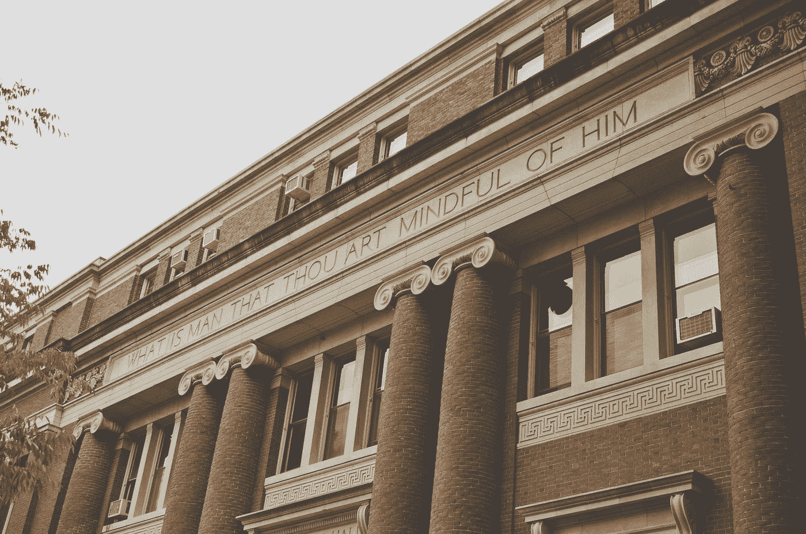

# 剑桥大学免费高级机器学习博士学位

> 原文：<https://medium.com/analytics-vidhya/free-advanced-machine-learning-phd-at-cambridge-60bbca893d1a?source=collection_archive---------3----------------------->

## 以及为什么值得花时间。

凯利·西克玛在 [Unsplash](https://unsplash.com?utm_source=medium&utm_medium=referral) 上的照片

剑桥是一所世界级的大学，目前被《T4 时报高等教育》列为全球第六大大学，高于耶鲁和普林斯顿。

剑桥拥有许多世界闻名的校友，包括查尔斯·达尔文、艾伦·图灵和斯蒂芬·霍金。