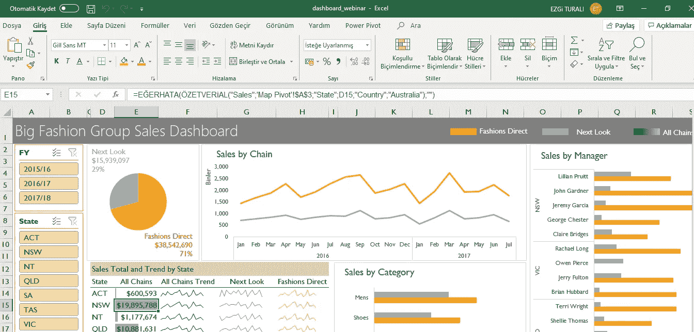
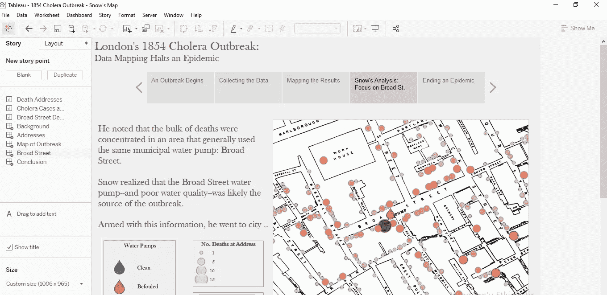
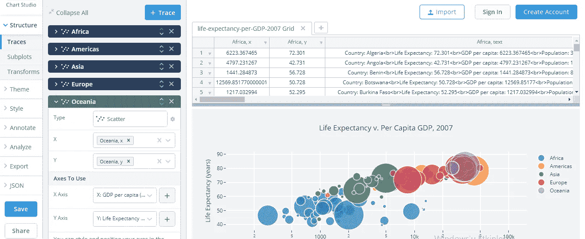
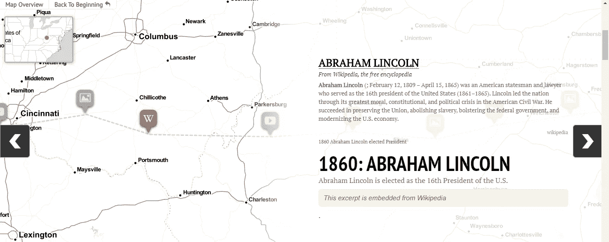

# 免费数据可视化工具-1

> 原文：<https://medium.com/analytics-vidhya/free-data-visualization-tools-1-a2734ddf45b6?source=collection_archive---------29----------------------->

如今，数据素养已经成为一种需求。对我来说，数据扫盲最简单、最有趣的方式之一就是数据可视化。数据可视化，特别是由于数据量的不断增加以及使这些数据有意义的需要；已经成为近年来越来越重要的学科和技能。

下图是根据谷歌趋势的数据制作的。在过去的 5 年里，你可以看到数据可视化这个词的流行。另外，根据谷歌的信息，中国是这个词被搜索最多的国家。

数据取自谷歌趋势

有许多工具可以用来研究一个如此热门和重要的话题。除了基于代码的(Python，R，D3.js)和基于 web 的(Flourish，Palladio 等。)可视化工具，像 Tableau 这样的独立程序也是可用的。在这篇文章中，我将谈谈我尝试过的基于网络的免费工具和程序。

## **谷歌工作表和微软 Excel**

由于接口和使用机制没有太大的不同，所以我将两者放在一起评估。这两个工具可以基于网络工作。从工作表进行实时协作是可能的，但 Excel 没有实时功能。Google Sheets 最重要的特性之一是提供了在网络上合作的机会。此外，它还提供了交互式数据可视化的可能性和嵌入网站的选项。有一些这样的差异。

除了是数据可视化的首选之外，它们还是常用于数据分析的有用工具。我习惯性使用 Excel 的次数比较多。所以，我可以说，专业的视觉效果是很容易准备的。您还可以快速分析数据，而不需要宏。

谷歌工作表

微软优越试算表

## （舞台上由人扮的）静态画面

你可能会说，Tableau 是如何免费的。Tableau Public 是 Tableau 的限量版，而且是免费的。还有一个无限制的免费学生舞台。如果你是学生，你一定要抓住这个机会。Tableau 是一种数据可视化工具，广泛用于商业智能，但不限于 it。它帮助您以仪表板和工作表的形式创建交互式图表和图形，以获取与业务相关的信息。这一切都可以通过拖放来实现。

这是我用过的最简单、最专业的工具之一。用非常简单的动作做你能想到的几乎任何事情都是可能的。

（舞台上由人扮的）静态画面

## 草图

RAWGraphs 是一个开放的 web 工具，用于创建自定义的基于矢量的可视化。它允许您从 url 获取数据。加载数据后，您可以选择一个复杂的图形或自己创建一个图表。您可以在页面底部找到您用拖放方法创建的图形。

这个基于网络的可视化工具的美妙之处在于，你可以下载你以 svg、png、html 或 json 格式创建的图像。

草图

## Plotly 图表工作室

这种基于网络的应用程序使得用任何编程语言创建、分发和共享交互式网络应用程序、图形和可视化变得容易。

加载数据后，可以选择 Python 中使用的 Plotly 包的不同主题。不要害怕提到 Python 这个词，因为没有编码。你只需要选择。

除了 Plotly 之外，还可以从 Ggplot2 和 Seaborn 包中进行可视化。正如我上面提到的，这个包的优点是它为您提供了通常由编码产生的可视化效果。

## 骑士实验室

在这个基于 web 的应用程序中，它的界面比其他的稍微复杂一点，您可以创建精彩的讲故事的例子。虽然讲故事和数据可视化很相似，但并不相同。如果你想创建一个故事线，虚拟现实场景，内嵌音频，故事地图和时间线，这是一个方便的工具。

我希望这是一篇有用的文章。如果你有建议，我可以回顾并补充到这个系列中。不要忘记和我分享你的观点！