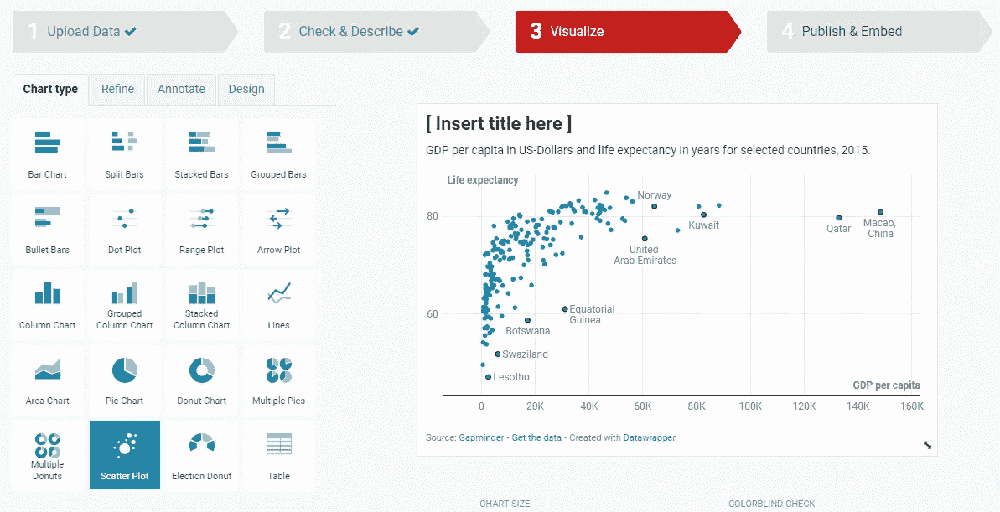
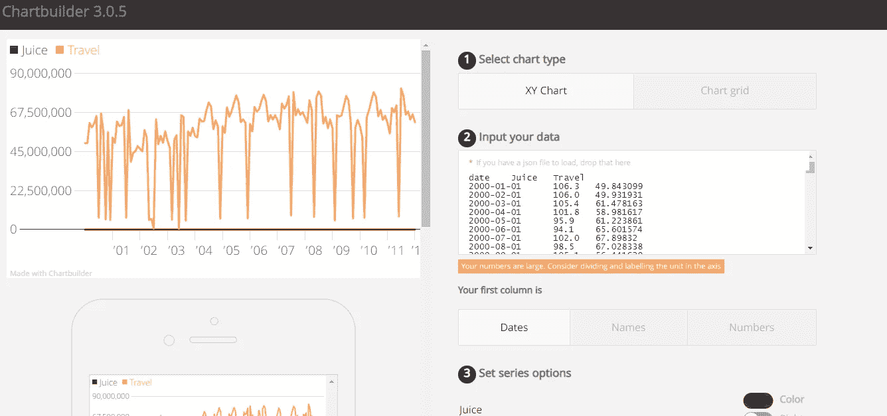
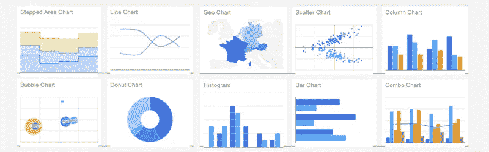
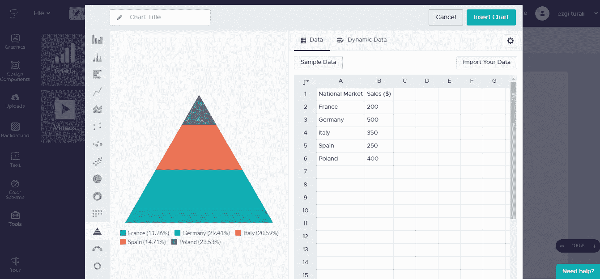

# 免费数据可视化工具-2

> 原文：<https://medium.com/analytics-vidhya/free-data-visualization-tools-2-baa5781b71b3?source=collection_archive---------26----------------------->

在这个系列中，我将回顾免费使用的数据可视化工具。你可以点击[这里](/analytics-vidhya/free-data-visualization-tools-1-a2734ddf45b6)阅读我系列的第一篇文章。

# 数据包装器

它是由来自许多欧洲国家和美国的设计师、开发商和记者组成的团队建造的。它也有可以免费使用的内容和公司付费的内容。这个工具是完全基于网络的，还包括一个区域，您可以在那里在线学习如何使用 Datawrapper。用户可以上传数据或使用示例数据创建可视化效果。下图是我使用示例数据创建的一个视觉效果。

# 图表生成器

这种基于网络的可视化工具在 2013 年由一家金融新闻网站公开，对记者很有吸引力。一个工具，使可视化数字数据变得容易。我要补充一点，从用法上来说不是很有用。该工具的另一个限制是它只能生成静态图形。

# 谷歌图表

Google Charts 虽然没有 Tableau 那么深入，但是在图形的多样性方面还是中规中矩的。你可以把你创建的图形作为 JavaScript 和 HTML 嵌入到你的网站中。你可以从 18 个可用图形中选择一个，或者在社区作品中搜索一些更独特的图形。你需要一些基本的 HTML 知识来定制你的图表。但是，如果你没有任何 HTML 或 JavaScript 的经验，不要担心，简单易懂的教程将帮助你在几分钟内创建一个完全定制的图表。

# 皮克托哈特

我认为这是一个很棒的类似 Canva 的工具，我通常用它来制作信息图。在处理小数据时，您可以为客户准备简单易懂的图表。模板分为 4 类:信息图、报告、海报和演示。免费帐户提供无限制的创作和下载，以及完整的编辑器功能。只需 29 美元，你就可以升级你的账户。不过，我觉得没必要。

如果你有建议，我可以回顾并补充到这个系列中。不要忘记和我分享你的观点！