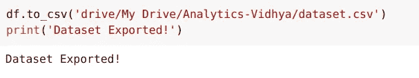

# 免费 GPU 给大家！开始使用 Google Colab 进行机器学习和深度学习

> 原文：<https://medium.com/analytics-vidhya/free-gpus-for-everyone-get-started-with-google-colab-for-machine-learning-and-deep-learning-a886b5dac09c?source=collection_archive---------25----------------------->

# Google Colab——现在在您的机器上构建大型深度学习模型！

“内存错误”——当我们试图在大型数据集上执行机器学习或深度学习算法时，这是 Jupyter 笔记本上非常熟悉的可怕信息。我们大多数人都无法在自己的机器上获得无限的计算能力。让我们面对现实吧，从现有的云提供商那里获得一个像样的 GPU 需要一大笔钱。

那么，我们如何在不烧穿口袋的情况下建立大型深度学习模型呢？

站出来——Google Colab！这是一个令人难以置信的基于浏览器的在线平台，允许我们免费在机器上训练我们的模型！听起来好得难以置信，但多亏了谷歌，我们现在可以处理大型数据集，建立复杂的模型，甚至与他人无缝共享我们的工作。这就是 Google Colab 的强大之处。


老实说，与 Colab 合作为我开辟了许多我以前认为不可能的途径。我们不再受机器计算能力差的限制。免费的 GPU 唾手可得，所以你还在等什么？

如果你是深度学习领域的新手，我有一些优秀的资源可以帮助你以全面和结构化的方式开始:

*   [深度学习基础](https://courses.analyticsvidhya.com/courses/fundamentals-of-deep-learning?utm_source=blog&utm_medium=google-colab-machine-learning-deep-learning)
*   [深度学习文章](https://www.analyticsvidhya.com/blog/category/deep-learning/?utm_source=blog&utm_medium=google-colab-machine-learning-deep-learning)
*   [神经网络简介](https://courses.analyticsvidhya.com/courses/Introduction-to-Neural-Networks?utm_source=blog&utm_medium=google-colab-machine-learning-deep-learning)
*   [利用深度学习的计算机视觉](https://courses.analyticsvidhya.com/courses/computer-vision-using-deep-learning-version2?utm_source=blog&utm_medium=google-colab-machine-learning-deep-learning)

# 目录

*   Google Colab 是什么？
*   Colab 上的 GPU 和 TPU
*   Google Colab 入门
*   Google Colab 运行时
*   在 Google Colab 上使用终端命令
*   克隆 Google Colab 中的存储库
*   上传文件和数据集
*   保存您的笔记本
*   从 Google Colab 导出数据/文件
*   共享您的笔记本
*   下一步是什么？

# Google Colab 是什么？

> ***Google co laboratory****是一个免费的基于云的在线 Jupyter 笔记本环境，允许我们在 CPU、GPU 和 TPU 上训练我们的机器学习和深度学习模型。*

这就是我真正喜欢 Colab 的地方。你拥有哪台计算机，它的配置是什么，它可能有多古老，都无关紧要。还可以用谷歌 Colab！你只需要一个谷歌账户和一个网络浏览器。最棒的是——你可以免费使用[GPU](https://www.analyticsvidhya.com/blog/2017/05/gpus-necessary-for-deep-learning/?utm_source=blog&utm_medium=google-colab-machine-learning-deep-learning),比如**特斯拉 K80** ,甚至 TPU！

TPU 比 GPU 贵很多，你可以在 Colab 上免费使用。它值得一遍又一遍地重复——这是独一无二的产品。

您是否仍在您的系统上使用相同的旧 Jupyter 笔记本来训练模型？相信我，你会喜欢 Google Colab 的。

# Google Colab 上的 GPU 和 TPU

问问任何使用 Colab 的人为什么喜欢它。答案是一致的——免费 GPU 和 TPU 的可用性。训练模型，尤其是深度学习模型，需要在 CPU 上花费大量时间。我们在本地机器上都面临这个问题。另一方面，GPU 和 TPU 可以在几分钟或几秒钟内训练这些模型。

*如果你还需要一个使用 GPU 的理由，看看 Faizan Shaikh 的这个精彩解释*[](https://www.analyticsvidhya.com/blog/2017/05/gpus-necessary-for-deep-learning/?utm_source=blog&utm_medium=google-colab-machine-learning-deep-learning)**。**

*无论是[数据科学黑客马拉松](http://datahack.analyticsvidhya.com/?utm_source=blog&utm_medium=google-colab-machine-learning-deep-learning)还是深度学习项目，我总是更喜欢 GPU，而不是任何其他 CPU，因为纯粹的计算能力和执行速度。但是，并不是每个人都买得起 GPU，因为它们很贵。这就是 Google Colab 发挥作用的地方。*

***免费给你一个像样的 GPU，可以连续运行 12 个小时。**对于大多数数据科学人士来说，这足以满足他们的计算需求。尤其是如果你是初学者，那么我会强烈推荐你开始使用 Google Colab。*

*Google Colab 为我们的笔记本提供了三种类型的运行时:*

*   *CPU，*
*   *GPU，以及*
*   *TPUs*

*正如我提到的，Colab 给了我们 12 小时的连续执行时间。之后，整个虚拟机被清空，我们必须重新开始。**我们可以同时运行多个 CPU、GPU 和 TPU 实例，但是我们的资源在这些实例之间共享。***

*让我们来看看 Google Colab 提供的不同运行时的规范:*

**

*从市场上买一个 GPU 或者 TPU 会花你很多钱。为什么不省下这笔钱，在自己的机器上舒适地使用 Google Colab 呢？*

# *Google Colab 入门*

*你可以使用[这个链接](https://colab.research.google.com/)去 Google Colab。这是你打开 Colab 时看到的屏幕:*

**

*点击**新建笔记本**按钮创建一个新的 Colab 笔记本。您也可以通过单击上传按钮将本地笔记本上传到 Colab:*

**

*你也可以从 Google Drive 或 GitHub 导入你的笔记本，但是它们需要一个认证过程。*

**

*您可以通过单击笔记本名称来重命名您的笔记本，并将其更改为您想要的任何名称。我通常根据我正在做的项目给它们命名。*

# *Google Colab 运行时—选择 GPU 或 TPU 选项*

*选择不同类型的运行时的能力使得 Colab 如此流行和强大。以下是更改笔记本运行时间的步骤:*

***第一步:**点击顶部菜单上的“运行时间”并选择“更改运行时间类型”:*

**

***第二步:**在这里您可以根据需要更改运行时间:*

**

*一位智者曾经说过:“权力越大，责任越大。”我恳求您在完成工作后关闭笔记本，以便其他人可以使用这些资源，因为各种用户共享它们。您可以像这样终止笔记本:*

**

# *在 Google Colab 上使用终端命令*

*您可以使用 Colab 单元格来运行终端命令。大多数流行的库默认安装在 Google Colab 上。是的， [Python](https://courses.analyticsvidhya.com/courses/introduction-to-data-science?utm_source=blog&utm_medium=google-colab-machine-learning-deep-learning) 库像[熊猫](https://courses.analyticsvidhya.com/courses/pandas-for-data-analysis-in-python?utm_source=blog&utm_medium=google-colab-machine-learning-deep-learning)，NumPy， [scikit-learn](https://courses.analyticsvidhya.com/courses/get-started-with-scikit-learn-sklearn?utm_source=blog&utm_medium=google-colab-machine-learning-deep-learning) 都是预装的。*

*如果你想运行一个不同的 [Python 库](https://www.analyticsvidhya.com/blog/2019/07/dont-miss-out-24-amazing-python-libraries-data-science/?utm_source=blog&utm_medium=google-colab-machine-learning-deep-learning)，你可以像这样把它安装在你的 Colab 笔记本里:*

```
*!pip install **library_name***
```

*很简单，对吧？一切都与它在常规终端中的工作方式相似。我们只是你要放一个**感叹号(！)**在编写每个命令之前，喜欢:*

```
*!ls*
```

*或者:*

```
*!pwd*
```

# *克隆 Google Colab 中的存储库*

*您还可以在 Google Colaboratory 中克隆 Git repo。只需转到您的 [GitHub 库](https://www.analyticsvidhya.com/blog/category/github/?utm_source=blog&utm_medium=google-colab-machine-learning-deep-learning)并复制库的克隆链接:*

**

*然后，只需运行:*

```
*!git clone [https://github.com/analyticsvidhya/Complete-Guide-to-Parameter-Tuning-in-XGBoost-with-codes-in-Python.git](https://github.com/analyticsvidhya/Complete-Guide-to-Parameter-Tuning-in-XGBoost-with-codes-in-Python.git)*
```

**

*这就对了。*

# *上传文件和数据集*

*这是任何数据科学家都必须了解的一个方面。将数据集导入 Colab 的能力是数据分析之旅的第一步。*

*最基本的方法是将数据集直接上传到 Colab:*

**

*如果您的数据集或文件非常小，您可以使用这种方法，因为这种方法的上传速度非常低。我推荐的另一种方法是将你的数据集上传到 Google Drive，然后在 Colab 上安装你的驱动器。您只需点击一下鼠标就可以做到这一点:*

**

*您还可以将数据集上传到任何其他平台，并使用其链接进行访问。我倾向于采用第二种方法(如果可行的话)。*

# *保存您的笔记本*

*Colab 上的所有笔记本都存储在你的 Google Drive 上。Colab 最好的一点是，你的笔记本在一定时间段后会自动保存，你不会丢失你的进度。*

*如果需要，您可以在两个*中导出和保存笔记本。py 和*。ipynb 格式:*

**

*不仅如此，你还可以直接在 GitHub 上保存笔记本的副本，或者创建一个 GitHub Gist:*

**

*我喜欢我们得到的各种选择。*

# *从 Google Colab 导出数据/文件*

*您可以将文件直接导出到 Google Drive，也可以将其导出到 VM 实例并自行下载:*

**

*当您有较大的文件或多个文件时，直接导出到驱动器是更好的选择。当您在 Colab 中从事更大的项目时，您会发现这些细微差别。*

# *共享您的笔记本*

*Google Colab 还为我们提供了一种与他人分享工作成果的简单方式。这是 Colab 最棒的地方之一:*

**

*只需点击**分享**按钮，它让我们选择创建一个可分享的链接，我们可以通过任何平台分享。您也可以使用其他人的电子邮件 id 邀请他们。这和分享一个谷歌文档或者谷歌表单是完全一样的。谷歌生态系统的复杂和简单令人震惊！*

**

# *下一步是什么？*

*Google Colab 现在还提供一个名为 **Google Colab Pro、**的付费平台，定价为每月一次。在这个计划中，你可以获得**特斯拉**T4 或**特斯拉 P100** GPU，以及选择 27 GB 左右高 RAM 的实例的选项。此外，您的最大计算时间增加了一倍，从 12 小时增加到 24 小时。多酷啊。*

*如果你需要高计算能力，你可以考虑这个计划，因为与其他云 GPU 提供商如 AWS，Azure，甚至 GCP 相比，它仍然非常便宜。*

*我还在写另一篇文章，我会给你掌握 Google Colab 所需的所有技巧和窍门。如果你觉得这篇文章信息丰富，那么请与你的朋友分享，并在下面评论你的反馈或疑问。你也可以在分析 Vidhya 的 Android 应用上阅读这篇文章*

**原载于 2020 年 3 月 22 日 https://www.analyticsvidhya.com*[](https://www.analyticsvidhya.com/blog/2020/03/google-colab-machine-learning-deep-learning/)**。***