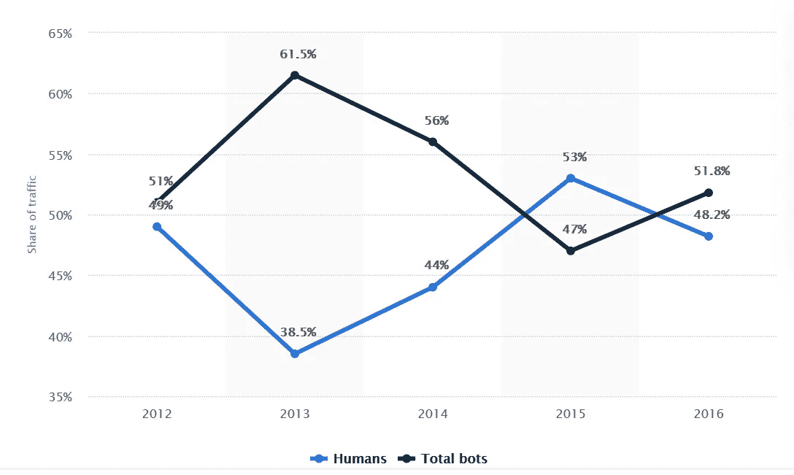
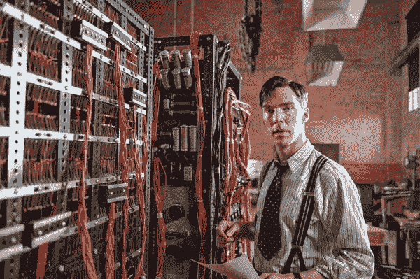
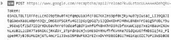
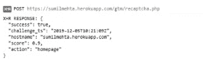
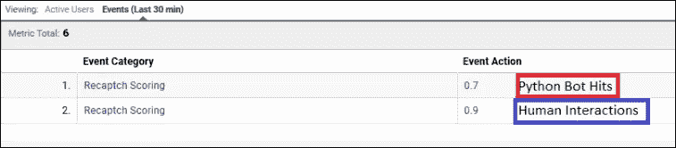

# 谷歌 reCAPTCHA v3 的无摩擦机器人检测

> 原文：<https://medium.com/analytics-vidhya/friction-less-bot-detection-with-googles-recaptcha-v3-a1885cd64beb?source=collection_archive---------10----------------------->

在进入解决方案之前，让我们先了解一下互联网机器人的基础知识，这样我们才能决定哪个解决方案是最好的，为什么。

# **什么是互联网机器人？**

互联网机器人基本上是在网站上执行自动化任务的计算机程序。这些任务可以是从网站上抓取信息，也可以是通过大量点击向网站发送垃圾信息，从而使真正的观众无法访问网站。

**例子:**搜索引擎使用爬虫来浏览网站进行索引。另一个例子是通过从其他网站获取信息来比较产品或不同产品价格的网站。

# **网络机器人有什么影响？**

大约一半的互联网流量由 Bot 活动组成。通过“ [statista](https://www.statista.com/statistics/670782/bot-traffic-share/) ”查看这一趋势。

2012 年至 2016 年 bot 流量占总在线流量的百分比

就像我最关心的事情(胆固醇)一样，机器人也有好坏之分。

**好家伙**

通常，声誉好的公司会大规模部署“好的机器人”。这些机器人尊重由网站管理员创建的规则，以规范他们的爬行活动和索引率。这些规则被定义在网站的 [robots.txt](https://www.techinasia.com/talk/robotstxt-secure-website-content) 文件中，以供爬虫查看。我们还可以阻止特定的爬虫来阻止索引网站。比如在中国不专注的商家可以屏蔽百度的爬虫。

其他一些常见的机器人还包括社交网络机器人、网站监控机器人、反向链接检查机器人(如 [SEMRushBot](https://www.semrush.com/bot/) )、聚合机器人(如 [Feedly](https://www.feedly.com/fetcher.html) )等等。

**坏男孩**

坏机器人还被用于许多原因，如窃取内容、抓取评论和新闻标题、提交表格、评论帖子等。

其中最有害的目的之一就是 DDOS 攻击。当对网站的大量点击使其服务饱和时，就实现了分布式拒绝服务攻击。这可能会导致服务的暂时中止，托管服务的巨额费用，糟糕的搜索引擎优化和坏名声。

从分析的角度来看，这些恶意访问的数据被存储起来，并被谷歌分析，Adobe 分析等看到。尽管 Google Analytics 确实提供了[僵尸过滤功能](https://support.google.com/analytics/answer/1010249?hl=en)来从视图中过滤掉“僵尸流量”，但它仍然会留下相当数量的流量。

因此，我们应该有一个解决方案，防止我们基于不正确的数据做出决策。

# **利用 reCaptcha v3**

“验证码”是区分人类和机器人的图灵测试。这对于人类来说很容易解决，但对于“机器人”和其他恶意软件来说却很难解决。

**说起图灵:**

你有没有注意到这个家伙总是扮演一个聪明人

不久前，谷歌推出了其著名的 reCaptcha 服务的第三版。它继承了第一个版本，其中使用了混乱的文本，第二个版本要求用户在一些图像中识别某些物体。

最新的一个帮助我们区分人类和机器人的行为，而不需要实际要求用户进行测试。与过去版本相比，这是一个巨大的改进，在过去的版本中，reCaptcha 测试会给用户流量带来严重的问题。相比之下，早期版本如《蝙蝠侠与罗宾》(1997)，第三版为诺兰的《蝙蝠侠三部曲》。

它是如何工作的？

当用户在网站上输入时，会生成一个范围从 0(最有可能是机器人)到 1(最有可能是人类)的分数。随着时间的推移，reCaptcha 了解到网站上的用户通常是如何行动的，从而帮助其背后的机器学习算法生成更准确的风险分数。

这个分数可以存储在变量(自定义维度/eVars)中，以过滤掉 Google 或 Adobe 套件中的 bot 流量。

除此之外，在恶意机器人/用户的登录或其他高安全性事件期间，他们可以被定向到双因素身份验证或其他保证措施。

这是一个两步过程:

1.  **令牌创建**
2.  **计分**

**令牌创建:**

一个库和代码片段嵌入在站点代码中。这段代码创建一个用户响应令牌，并将其发送到后端。代码创建可以由我们选择的事件触发，无论是表单提交、登录还是页面查看。

以下是加密形式的用户响应令牌的快照:

用户响应令牌

**评分**

第一步生成的响应通过后端的 API 调用发送给 Google。然后，reCaptcha 的自适应风险分析引擎发送一个响应，从中可以提取分数。

来自 reCaptcha 的适应性风险分析引擎的响应

我写了一个基于 Python 的程序，打开我的投资组合页面，从中抓取一些信息。以下是人类与网站互动和机器人互动的案例结果:

测试案例

# **结束游戏:**

谷歌没有确切透露它如何创建一个行为档案来防止骗子模仿人类行为。[根据多伦多大学研究 reCaptcha 的两名安全研究人员](https://arxiv.org/pdf/1903.01003.pdf)的说法，分数很大程度上取决于你的浏览器是否安装了谷歌 cookie。另一位消息人士称，reCaptcha 的 API 收集并发送软件和硬件信息，包括应用程序和设备数据，以供谷歌分析。

谷歌从未解决任何潜在的隐私问题。我们可以将 reCaptcha v3 视为一种确保安全、无摩擦的在线体验的方式。

来源:登记册