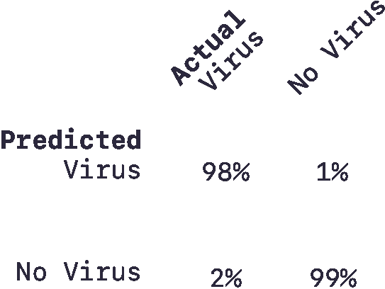
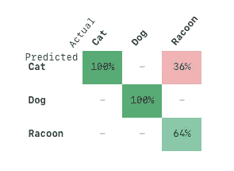
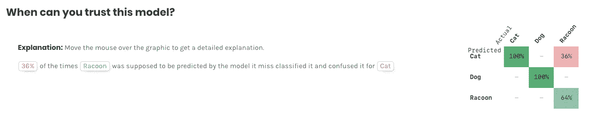

# 从一个混乱的矩阵到另一个不那么混乱的矩阵。

> 原文：<https://medium.com/analytics-vidhya/from-a-confusion-matrix-to-another-not-so-confusing-matrix-8f17b1777aee?source=collection_archive---------34----------------------->

如果你是预测机器学习的新手，你听到术语“混淆矩阵”或“错误矩阵”的几率相当高。如果你没有，维基百科将混淆矩阵定义为:

> “…一种特定的表格布局，允许算法性能的可视化，通常是[监督学习](https://en.wikipedia.org/wiki/Supervised_learning)算法(在[非监督学习](https://en.wikipedia.org/wiki/Unsupervised_learning)中，它通常被称为**匹配矩阵**)。矩阵[的每一行](https://en.wikipedia.org/wiki/Matrix_%28mathematics%29)代表预测类中的实例，而每一列代表实际类中的实例(反之亦然)。该名称源于这样一个事实，即它可以很容易地看出系统是否混淆了两个类别(即通常将一个类别错标为另一个类别)。”

思考混淆矩阵的另一种方式是举例。让我们假设你感觉有点不舒服，所以你去了医生的办公室，医生给你开了验血的处方，以确定你是否感染了病毒。

在你得到结果之前，他们会告诉你假阳性的几率很小，但这意味着什么呢？好吧，让我们看看测试混淆矩阵就明白了！

你能猜出这个矩阵在哪里显示假阳性吗？(右上角)

换句话说:测试告诉我们你有病毒的可能性很小，但你没有。现在想象一下下面的情况:测试结果告诉医生你没有感染病毒，而实际上你已经感染了。可怕、危险的东西…

如果你已经跟了这么远，我们已经走了一半了。但是我们仍然有一些关于 AutoML 中混淆矩阵的问题。

现在你会问，“嘿，里奇，如果我预测了两件以上的事情呢？”— *在前一种情况 1。感染了病毒。没有病毒*——嗯，我的朋友，这变得有点棘手，因为你和模型可能会变得更加混乱。

让我们换个例子，假设你试图预测一张图片是猫、狗还是浣熊。训练后，你会得到以下混淆矩阵:

在这种情况下，该模型非常擅长区分狗和猫，但不太擅长区分猫和浣熊。注意混淆矩阵是如何解释你的模型的许多行为的，告诉你它的优点和缺点。暂时想象这个矩阵来预测整个动物王国——它将无处不在！这使得很难提取关于如何改进模型和数据集的见解。

在为新 MindsDB 的图形用户界面重新设计混淆矩阵时，我们必须考虑所有这些因素，并寻找一种更合理的方法来呈现结果。

# MindsDB 混淆矩阵-新功能。

## 颜色编码

通过对混淆矩阵进行颜色编码，就像热图一样，我们可以直接决定是否信任一个模型。基本上，绿色空间将告诉您模型准确预测该标签的正确次数的百分比，相反，红色空间将告诉您模型何时出错并被另一个标签混淆。

但这还不够，信不信由你。在解释了这个矩阵很多后，我们知道实际/预测的轴位置可能会令人困惑，这就是为什么使这个矩阵互动。

## 解释图形。

我们的团队花了太多的会议讨论模型的结果，用这样的句子:“模型准确地预测了一只猫，但它对一只浣熊和一只狗的误判率为 36%，或者等等，实际上是 36%的浣熊，实际上让我再检查一下……”

因此，我们决定让 MindsDB Scout (GUI)告诉您每个值的确切含义。如果你将鼠标悬停在模型的任何交叉点上，无论模型在做什么，它都会变得冗长。

也就是说，如果该模型有 36%的时间应该预测“浣熊”,但它失败了，并将其误认为“猫”,结果将如下所示:

左边是对混淆矩阵的交互和冗长的解释。右边是混淆矩阵。

我们鼓励您去[试试新的 MindsDB 版本](http://mindsdb.com/product)，并让我们知道您的想法。如果你有什么想法可以解释，请告诉我们。

**奖励**:关于混淆矩阵，还有一个问题需要考虑:数值预测！