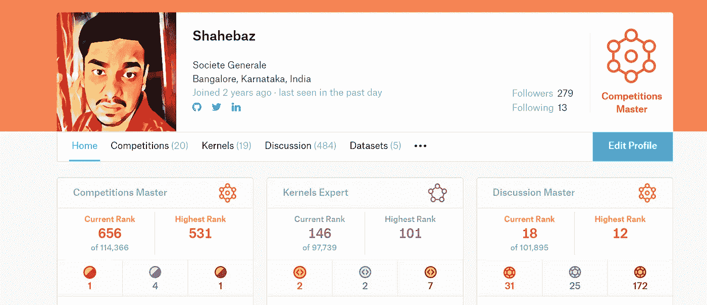

# 从新手到最年轻的 Kaggle 竞赛大师之一，并登陆财富 500 强！

> 原文：<https://medium.com/analytics-vidhya/from-a-novice-to-the-youngest-kaggle-competition-master-and-landing-in-a-fortune-500-cc8acf49de?source=collection_archive---------1----------------------->

有各种各样的文章谈论进入数据科学世界所需的技能，或者分享关于数据科学职业的面试经验和观点。但是我很少找到文章强调他们开始旅行的时间。

步入数据科学的强烈感觉和最初的体验没有得到充分讨论；也许，因为这个领域对每个人来说都比较新。毕竟，“机器学习”和“数据科学”这两个术语是几年前才被引入的。以前，它都被称为“计算统计学”。

流行人工智能互联网模因

在这篇文章中，我想分享我在数据科学方面的所有经历。让我们开始吧😺

刚开始的时候，我不太擅长。老实说，数学从来都不是我最喜欢的科目。然而，今天我钦佩这一领域正在进行的研究，它正在帮助我们揭开谜团。

这篇文章是一篇十分钟的文章。如果您使用 VPN 或任何专用网络，您可能看不到动画 GIF 内容。享受阅读😃

# 关于我🎈

我的名字是沙赫巴兹。我是刚从 T2 国立大学电子与通信工程专业毕业的学生。我最近在*比赛*中获得了 **4 枚银牌**和 **1 枚金牌**并获得了大约 **31 枚** *枚金牌* **枚**令我惊讶的是，我现在是我国最年轻的 21 岁卡格尔 x2 大师。

我的 Kaggle 个人资料页面

在从事数据科学之前，我大部分时间都花在了道德黑客、逆向工程包和软件开发上。我也是一名技术作家，Android ROM 和堆栈开发者，T21。

今天，我有幸在印度班加罗尔的 ***法国兴业银行全球解决方案中心与创新者、人工智能研究人员、数据科学家和最具创造力的数据科学团队一起工作。***

法国兴业银行全球解决方案中心，班加罗尔

# 未选择的道路🚵

我最近才开始参加比赛，在过去的 9 个月里，我在各种比赛中赢得了一堆奖牌。听起来可能很奇怪，我太害怕参加卡格尔比赛了，因为——它们太难了！

那么，这一切是从哪里开始的呢？

在 2017 年为 Oppia.org 做贡献时，我是其中的一名成员和积极的贡献者，我开始学习 *Python 2.7*

> *我以为我已经学会了所谓的* ***【过时】*** *版本 Python 2.7，不得不从头再学 Python 3*😅

我几乎不会列清单或者添加/连接字符串。一定要清楚——我当时是什么样的程序员新手。

正是在我的开源贡献中，我学到了编程的艺术，使用 git 的软件版本控制，以及良好结构化和文档化代码的重要性。

有一天，我在搜索 Python 2.7 还能用来做什么，在网上浏览时，我登陆了 Kaggle。著名的 Kaggle 声明正盯着我看，在读完问题声明后，我惊讶地盯着屏幕！

> **“在这个挑战中，我们要求你完成对什么样的人有可能生存下来的分析”**

当我读到这个的时候。我是追星族。预测**活下来的人？**这是什么样的 ***巫术*** ？我立即检查了 Kaggle 网站的真实性😜第二个惊奇的时刻是当我意识到—

> 数据科学听起来像科幻技术，但在 21 世纪却非常真实！

这就像一部科幻电影来到了我的现实生活中，它的概念对我来说完全陌生。就这样。我怎么能回头看？

我决定让自己加入。数据科学学习热席卷了我。(老实说，直到今天它还没有磨损，🕺)

# 我是怎么学的？推荐资源？📚

选择的悖论——多即是少

今天外面有成吨的课程。如此之多，以至于在谷歌上搜索“如何成为一名数据科学家”，很容易陷入*的选择悖论。这种感觉就像在餐馆里从过多的选项中选择一道美味的开胃菜。就本文的范围而言，我将列出我最喜欢的几本书。*

## *Python 推荐*

*如果你用 Python 编程，并且你的技能是中级的，那么这本书应该放在你的书架上。**期。***

*   *《Python 中的数据结构和算法》，作者:[迈克尔·t·古德里奇](https://www.wiley.com/en-us/search?pq=%7Crelevance%7Cauthor%3AMichael+T.+Goodrich)，[罗伯托·塔玛西亚](https://www.wiley.com/en-us/search?pq=%7Crelevance%7Cauthor%3ARoberto+Tamassia)，[迈克尔·h·戈德瓦瑟](https://www.wiley.com/en-us/search?pq=%7Crelevance%7Cauthor%3AMichael+H.+Goldwasser)*

**

*Python 中的数据结构和算法*

*这本书深入探讨了 Python 中 OOPs、数据结构和算法的概念。我喜欢这一章末尾的练习。当我制作需要优化和格式化编码的车库项目时，我仍然带着它作为日常参考。*

## *动手机器学习基础*

*在学习完 Python 基础知识之后。我带来了几本关于机器学习的书，我推荐其中的一些；*

**

*我[用 Python 介绍机器学习](https://g.co/kgs/re2Xvr)*

*   *[用 Python 介绍机器学习](https://g.co/kgs/re2Xvr)作者 **Andreas C. Müller** 和 **Sarah Guido***

*它涉及机器学习的基本内容，由 scikit-learn 的创始人亲自撰写，是一本完全初学者的必备书籍。*

> *阅读这本书让我对 scikit-learn 如此熟悉，以至于我最终在官方 scikit-learn 存储库中推出了一些 PRs。永远不要说永远。*

*然而，如果你熟悉数据科学，并在任何机器学习竞赛中名列前 20%，你会发现上述书籍完全无聊。(⚠️，你已经被警告过了)但是，如果你通读一遍，肯定有一些方便的技巧和方法会帮助你在竞争中获得优势。*

*另一个我比任何 MOOC 都更有价值的资源是[R](http://www-bcf.usc.edu/~gareth/ISL/)中的统计学习应用介绍*

*如果我是面试官，我会寻找一个在理论和实践上都了解 ISLR 的人。*

**

*ISLR 图书*

*这本书是用 R 语言写的。但是，我仍然推荐它。*

## *为更多的吉安而淬火？🌎*

*通常在研究背景下，对于那些想要深入挖掘并触及统计学核心的人来说,[统计学习要素](http://web.stanford.edu/~hastie/ElemStatLearn/)是一个推荐。ISLR 和 ESL 都是免费的。所以，你不必倾家荡产，相反，你可以免费获得大量的机器学习知识*

**

*统计学习的要素*

*经常有人问我— ***你拿了哪些 MOOCs 学机器学习？****

*答案是`None`。我不认为在线课程是有效的。至少，我报名参加的那些。很少有理由是；*

*   *与书相比，很难在视频中找到一个概念性的参考*
*   *书本深入足够多的细节，而课程遵循一个议程*

*这并不意味着我讨厌 MOOCs。事实上，我计划今年做一些。我建议让你的基础足够强大，而不是专注于观看视频的奢侈，仅仅满足于单一课程的内容。阅读书籍和资源无疑扩展了我对某些概念的知识，我现在可以从不同的角度解释这些概念。*

# *新手的生活🦄*

*我经常在 LinkedIn 上收到想涉足数据科学的人发来的消息。但是，根据你以前做过的事情，在陡峭的学习曲线上，痛苦的现实是很少的。我会让你从我的经历中走出来*

*以下是我当时的问题:*

1.  *数据科学如何入门？*
2.  *我已经完成了一堆算法。下一步做什么？*
3.  *如何找到工作并通过数据科学面试？*
4.  *做 Kaggle 值得吗？比赛会有所不同吗？*

*我也非常渴望得到这些问题的答案！*

*现在，我已经通过体面的学习，我可以告诉你一行答案。事情没那么简单。真是 ***复杂****

*部分原因是因为数据分析师、数据科学家和 ML 工程师是三个不同的头衔。工作的性质因公司而异。*

1.  *数据分析师有时只能执行 SQL 查询，或者构建模型或进行业务分析。有时，他们也会扮演项目经理的角色。*
2.  *数据科学家有时制作基本模型，其他角色需要博士学位。研究工作和少数其他工作需要在大规模系统上进行模型调整和部署*
3.  *ML 工程师是融合了数据科学知识的软件工程专家*

*事情是这样的…*

> *你梦想的数据科学工作没有固定的工作描述。*

*许多公司仍然在搞清楚“数据科学到底属于什么，以及应该关注什么样的问题”。在这种情况下，你的学习是持续的，而不是受 MOOC 课程时间限制的，这变得非常重要。*

*追随你的激情，解决问题。从你的 Android 手机收集数据，[流推文，研究你最喜欢的演员的追随者](https://github.com/shaz13/tweagle)，在《复仇者联盟无限战争》上应用怪异的[机器学习案例](/analytics-vidhya/introduction-to-image-caption-generation-using-the-avengers-infinity-war-characters-6f14df09dbe5?source=your_stories_page---------------------------)。*

**

***我的图像字幕项目***

*想象力是无限的，ML 的可能性也是无限的。现在，让我们来探索成为一名更好的数据科学家需要具备哪些能力技能*

# *数据科学野心家☑️的遗愿清单*

*该列表适用于数据科学家角色，但是 ***如果您申请特定领域的角色，您可能需要更多技能*** 。*

***1。掌握统计和概率**😎 **:** 轻松，数据科学领域的面包和黄油。我强烈推荐面包第一的方法，除非你在写研究论文或者在学术界工作。*

*在现实世界中，虽然您不会像编写代码那样经常使用统计知识。但是，对统计数据的深刻理解不仅会让你成为更好的数据科学家，还会帮助你做出关键决策*

***2。参加数据科学竞赛**🎯 **:** 参与学习不赢。我知道赢钱和标价听起来很有利可图。轻松开始。我输了 100 多场比赛才第一次进入 50 强排行榜。没有人从第一天开始就是赢家。这场比赛将帮助你在竞争激烈的世界中回顾自己。*

***3。您的项目为您代言**🌟 **:** 让你的 GitHub profile 充满活力，完成至少 2-3 个包含文档的端到端实现项目。虽然，竞赛是应用你技能的一种方式，但是对它们有巨大的反弹。*

> *竞赛并不等同于真实世界的数据科学任务。他们就像在 5-star⭐️的餐馆里端上一盘现成的拼盘*

*从零开始参与或从事一个项目将让你在被认为是最重要的现实世界数据科学任务中获得经验。*

# ***数据科学&多方面**😨*

*如果你正在寻找一个角色，工作描述要求你是任何人，从*“rock star”*数据科学家到在“spark”有 8-10 年经验。*

> *快跑！(Spark 是 2011 年推出的！)*

*有很多公司只是因为炒作而试图推动数据科学。*

> *有时候你需要的只是。groupby()而不是机器学习*

*展望未来，这些角色将会大相径庭。想好你要成为数据科学家的领域。 ***瞄准你那个领域的项目和比赛*** 。*

> *招聘人员倾向于雇佣已经从事过公司目前正在从事的工作的人*

*假设你要去一家餐馆吃海得拉巴比亚尼。你会更喜欢一个刚刚在 YouTube 上看过菜谱的新厨师，还是更喜欢一家专门制作正宗海德拉巴比亚尼的餐厅？公司也是如此。他们希望有人有经验，已经煮过一些印度炒面。纠正一下，正宗的海得拉巴迪比里亚尼！*

> *例如:我经常坚持金融领域和 NLP 驱动的竞争。这是我几个月前接受面试时最大的优势。我可以问更多与领域相关的问题，知道公司目前正在做什么项目，以及我认为自己适合做什么。*

*毕竟，比每周一早上做你最喜欢的项目更令人兴奋的是，☀️*

# *我们已经到了最后阶段。不要太激动🔚*

*我遇到了这个奇妙的场景，实际上是一个激烈的场景。试想一下，如果 Tensorflow 被擦干净，没有了？*

> *你意识到你不再是一个数据科学家和 ML 工程师！*

*很有趣。但是合法的。未来可能会出现一些工具和数据科学库。我敢打赌他们是。曾几何时，XGBoost 是商业秘密算法，今天它是完全开源的。明天，一些其他工具将改变数据游戏。*

*AutoML 已经引领下一代数据科学解决方案。我个人觉得 [H2O.ai](https://medium.com/u/9aea625dfc27?source=post_page-----cc8acf49de--------------------------------) 的无人驾驶 AI 很神奇！*

**

*H2O 无人驾驶 AI 被点亮🔥*

*行业中总会有一个重复任务实现自动化的时刻。让自己见多识广，学习核心技能而不是几个库的语法。探究*

*   ***甘斯***
*   ***强化学习***
*   ***机器学习的可解释性***

*让自己掌握知识和趋势。如果不*。transform()* 和*。fit()* **你自己**随着进步，你将是一个不适合的分类器。*

## *致谢和提及👼*

*我想借此机会感谢一些人，他们是我生命中的照明向导。教会了我很多东西，纠正了我的错误，并一直指导和激励着我，直到今天。*

*[***苏达莱·拉杰库马尔***](https://medium.com/u/f8c797ef7eaa?source=post_page-----cc8acf49de--------------------------------) ***、*** [什瓦姆·班萨尔](https://medium.com/u/ace3dd58ab8a?source=post_page-----cc8acf49de--------------------------------)、 ***库纳尔·贾恩、*** [***苏尼勒雷***](https://medium.com/u/4be29faab438?source=post_page-----cc8acf49de--------------------------------) ***、卡扎诺娃、拉古·卡良、巴蒂·库克雷贾、阿米特·亚达夫、阿西夫·穆罕默德、拉图尔我希望我能更多地感谢他们。****

*向我的曼梯·里兄弟们问好——卡纳瓦·阿南德、桑亚姆·布塔尼、里什和阿迪蒂亚·索尼，感谢他们在许多比赛中陪伴和支持**我**！*

*就这些了。请务必打我的社交电话联系我。我将很乐意回答，并有你的熟人。*

***我们来连线一下**[**LinkedIn**](http://www.linkedin.com/in/shaz13)**📘还有** [**碎碎念**](http://www.twitter.com/byteshaz) **❤️.如果你觉得这篇文章有用，请分享，并表示你的支持👏***