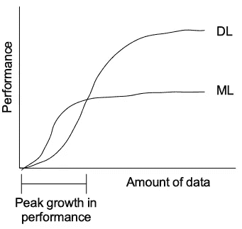

# 从 AI 到 ML 再到 DL 的革命

> 原文：<https://medium.com/analytics-vidhya/from-ai-to-ml-to-dl-e59369d08325?source=collection_archive---------23----------------------->

# 人工智能

一个 **人工**和**智能**。意思是制造具有智能行为的人工物品或执行需要一些智能的任务。我们在讨论什么是智能？它可以是机器、手机、汽车、轮椅、医疗分析系统、编程或语言处理系统，任何东西。

> **“AI”由约翰·麦卡锡(Jhon McCrathy)于 1956 年首次提出。**

****

**现在有了概念。但问题是如何使之成为可能，或者如何实现这种技术。所以，主要的问题是，**

> **机器会思考吗？机器能做决定吗？机器**能学会**吗？**

**这些问题是术语**“机器学习”**发明的基础。**

> ****“ML”最早是由亚瑟·塞缪尔在 1959 年提出的。****

# ******机器学习******

****机器学习是人工智能的一部分，它使用一些算法进行自我学习。根据这一概念，有一种算法或程序，机器将根据这种算法或程序学习达到预测的输出或生成自己以前无法正确预测的输出。****

****现在 AI 有一个 ML 的平台，用来执行正常编程做不到的任务，需要自己的智能。****

****例如，Gmail 会自动识别邮件是真的还是垃圾邮件？再比如找这个人是男是女？对于普通编程来说，这是一项非常复杂的任务。但是对于机器学习来说并不复杂。****

****另一个例子，目前我正在写这篇文章，并使用[语法](https://app.grammarly.com/?network=g&utm_source=google&matchtype=e&gclid=CjwKCAiAzJLzBRAZEiwAmZb0ajG42WPfUSD-wunZZ4N-xmiYBV4RvtaPvE8qAnk1SInfuR839oPcFBoCkv0QAvD_BwE&placement=&q=brand&utm_content=76996511046&utm_campaign=brand_f1&utm_medium=cpc&utm_term=grammerly)应用程序来检查拼写和句子是否正确。现在想一想，如果这个任务必须由正常的编程来完成。太复杂了。但是使用机器学习，它可以通过一小部分代码来解决。****

****但是，仍然有一些更复杂的任务很难或不可能通过正常的机器学习算法来解决。****

****作为一个例子，我认为我们必须使用 ML 算法来识别任何类别的任何类型的对象。世界上有数以百万计的物体。想想需要多大的数据量，算法要如何高效。所以，我们可以考虑这个过于复杂的问题。所以，这里的**深度学习**是为了这个角色而来。****

> ****注意，AI 是主要概念，其中 ML 是 AI 的子集，DL 是 ML 的子集。****

> ******【DL】**2000 年由伊戈尔·艾岑贝格(Igor Aizenberg)首次提出。****

# ****深度学习****

****D 深度学习是算法产生的概念，必须像人脑的功能一样工作。通常与神经元的功能有关。****

****很容易理解为什么神经元？可以参考我的文章，[https://medium . com/@ dhavaltrivedi _ 56634/ai-lets-reveal-in-terms-in-terms-of-biomedical-47d 8 b 789 ABA 6](/@dhavaltrivedi_56634/ai-lets-reveal-in-terms-of-biomedical-47d8b789aba6)。****

****对于深度学习，有一种非常强大高效的算法叫做“神经网络”。神经网络算法也有很多种。****

*****我们这里有一个问题，在问题过于复杂的情况下，是什么区别让 DL 比 ML 更有用？让我们看看。*****

****第一个关键区别是学习的**表现。我们可以认为这个问题对于学习算法来说太复杂了，因为它必须处理大量的数据。现在，如果我们使用下图检查性能和数据量，结果将是这样的。******

********

******性能与 ML 和 DL 中的数据量******

****上图我们可以清楚地看到，当数据量较低时，学习的性能在 ML 中较高，在 DL 中较低。但是随着数据量的增加，DL 的性能更高，ML 的性能更低。****

****数据多了，训练时间就多了。所以 DL 比 ML 花更多的时间训练。但是性能更高。****

****另一个关键区别是**特征提取**。****

# ****特征抽出****

****“特征”和“提取”。任何机器学习算法都需要先输入数据的特征，然后按照自己的方式提取出来。这些特征通常以向量的形式出现，称为**特征向量**。特征向量用于表示单个**特征**的**数字或符号** **特征**。这些特征可以如下:****

*   ****如果我们使用图像处理，这些特征可以是 RGB 值、灰度强度、边缘、梯度幅度等。****
*   ****如果我们以垃圾邮件过滤器为例，这些特征可以是邮件中特定单词的频率、电子邮件标题、文本结构、IP 位置等。****
*   ****如果我们看到语音识别，特征可以是波长、频率、噪声比、噪声水平等。****

****在机器学习中，我们需要手动将这些特征输入到算法中。但是对于很多数据来说，太复杂了。所以，在深度学习中，我们不必手动输入这些特征。它自己根据给定的数据生成特征。这些特征称为**高阶特征。**因为那些特征能够预测期望的输出。****

****另一个差异是**输出差异，** ML 模型产生数字输出，DL 算法的输出范围可以从图像到文本甚至音频。****

****因此，它现在可以理解为什么当问题太复杂时要使用 DL。****

*****最后让我们看看人工智能现在的位置，以及根据人工智能的革命有哪些主要类别。*****

# ****人工智能类别****

## ****人工狭义智能****

> ****专注于一项狭窄的任务。****

****例如:自然语言处理，比如谷歌助手，Siri，Alexa****

********

****这是目前唯一存在的人工智能。它包括所有类型的机器智能。****

## ****人工通用智能****

> ****和人类一样能干。****

********

****它仍然是一个新兴领域。因为人脑是创造一般智力的模型，因为缺乏对人脑功能的全面了解。****

## ****人工超级智能****

> ****比人类更有能力。****

****这种类型的人工智能将能够在艺术、决策和情感关系等方面表现出色。这是当今世界最难理解的概念之一，也可能对人类构成威胁。****

****如果你看过《我，机器人》电影，或者记得《复仇者联盟》或《拉贾那纳姆爵士》中的奥创(Lol..)在机器人电影里。****

********

****感谢阅读这篇文章。我喜欢听到你的反馈:)。随意问任何问题。****