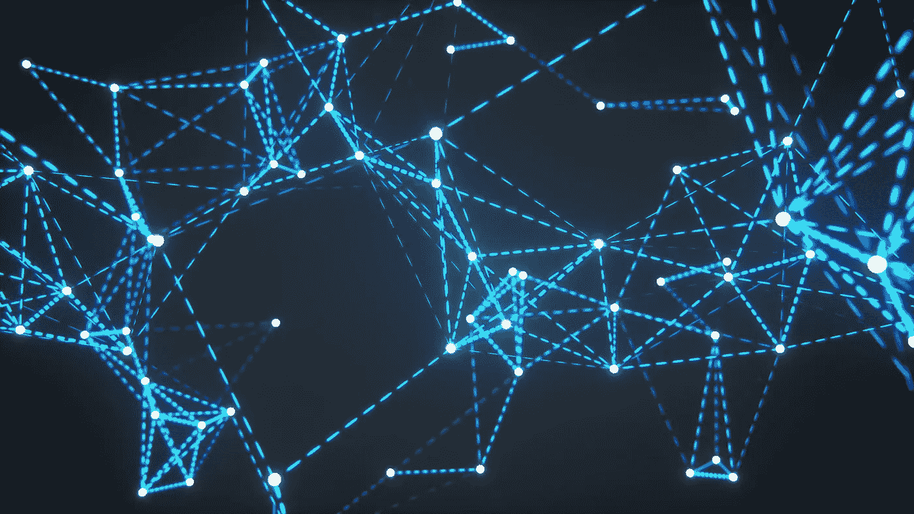

# 从卷积神经网络到变分自动编码器

> 原文：<https://medium.com/analytics-vidhya/from-convolutional-neural-network-to-variational-auto-encoder-97694e86bb51?source=collection_archive---------4----------------------->

生成式深度学习(如 auto-encoder)最吸引人的地方在于，机器可以自学创造。该算法只是模仿人类学习和创新的方式。当第一次遇到一个新概念时，你需要读、听、记重要的东西，然后练习。一个人经历的训练越多，他的创造力就变得越有凝聚力和…