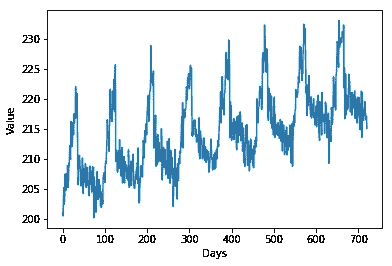
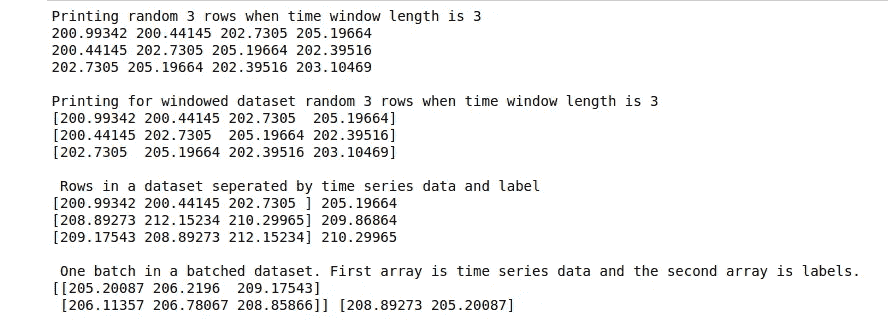
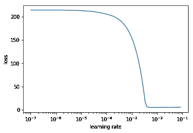
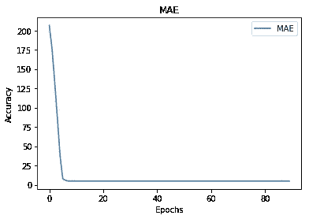

# 从数据准备到参数调整使用 Tensorflow 进行 RNNs 训练

> 原文：<https://medium.com/analytics-vidhya/from-data-preparation-to-parameter-tuning-using-tensorflow-for-training-with-rnns-24610783aeb1?source=collection_archive---------18----------------------->

来源:https://www.liberaldictionary.com/forecast/

这个笔记本让你自信的重点是使用 Tensorflow 进行数据准备和参数调优。

当涉及时间序列数据时，递归神经网络是一种强有力的预测工具。当我开始第一次阅读它们时，我看到一篇博客文章说:“学习 RNNs 的最好方法是使用它们。”直接进入 RNNs 的数学方面可能是相当令人生畏的。虽然数学是必不可少的，但能够将 RNNs 与 Tensorflow 等工具结合使用确实会建立信心，我建议这样做。

在本文中，我们将介绍:

1.  数据生成
2.  使用 Tensorflow 进行数据准备
3.  模型训练和参数调整
4.  预言；预测；预告

开始吧！[完整的代码可以从这里访问。](https://github.com/padmaja-kulkarni/MachineLearningMadeFun/blob/master/RNNTutorial/RNNTutorial.ipynb)

1.  **数据生成**

在生成数据集之前，让我们编写导入。

在这篇文章中，我使用了我在下面的代码中创建的时间序列数据。这个数据是以 90 天为周期的季节性数据，我也添加了一些噪声。让我们分开训练和测试数据。

时间序列数据

**2。数据准备**

一旦我们有了数据，让我们从 RNN 开始准备。

RNN 体系结构考虑了时态数据，并可以用它来预测未来值。我们这里有一个单变量时间序列，只有一个变量，值！有了这些数据，现在我们要创建一个时间序列数据，用过去的 m 个值来预测最近的未来值，即在 m+1 时间。这里，一个数据点是一系列(m×1)值。让我们用下面的代码来做这件事。对于这个例子，让我们使用 30 的窗口大小。我们将在这里学习如何使用 Tensorflow 的数据函数。但在此之前，以下要点必不可少。

1.  为了确保算法不会从数据排序中学习，请始终打乱数据。
2.  尝试几个窗户尺寸，选择一个合适的。
3.  这里，我们知道数据的季节性是 90 天，这个窗口大小或任何比这个更大的窗口大小都可以。

下面是使用 Tensorflow 将我们的数据转换成时间序列数据格式的代码。让我们先来看看 TensorFlow 的各种数据 API 是如何处理我们的数据的。

了解 Tensorflow 的数据 API

注意，在函数 timeSeriesDataset()中，我们给窗口大小加 1。这是为了让额外的数据点以后用作未来的预测值，如下面几行代码所示。这里，我们将数据集分成几批。建议批量大小为 2 的倍数，因为考虑到您电脑的内存设计，这样可能会有更好的结果。我使用 32，因为我们的数据集不是很大。

现在，我们已经准备好了我们的训练数据集！

**3。模型训练和参数调整**

让我们训练一个基本的 RNN 模型。这里我们使用两层 RNN，每层 64 个单位。请注意，数据集最后一层的大小与我们的输出变量大小相同，即 1。在代码中，我调用了一个函数 LearningRateScheduler，它根据纪元编号改变学习速率。

让我们看看学习率与损失的关系图是什么样子，这样我们就可以选择最佳的学习率。

图形学习率与损失

现在，选择图形看起来稳定的学习率值，我们再次训练模型。在这里，我选择 3 X10–3。

让我们写一个代码，看看我们的损失是如何演变的！

我们可以绘制图表，看看在最佳学习率下，我们的损失是如何下降的。

我们模型训练的平均绝对误差

**4。预测**

使用测试系列来预测和测试模型。

测试集上的平均绝对误差为:4.3656874

恭喜你！您已经成功构建并评估了您的第一个 RNN 模型。

现在，你应该在一个真实的数据集上尝试一下，例如，[太阳耀斑数据](http://archive.ics.uci.edu/ml/datasets/Solar+Flare)，看看你能否使用我在本文中使用的类似模型进行预测。祝你好运！