# 使用 DASH 在数小时内讲述您的数据故事，而不是数天

> 原文：<https://medium.com/analytics-vidhya/from-hello-world-to-quantum-computing-of-dashboard-in-python-part-1-of-3-f9f5565a64a7?source=collection_archive---------9----------------------->

卢克·切瑟在 [Unsplash](https://unsplash.com?utm_source=medium&utm_medium=referral) 上的照片

《T4 纽约时报》平均每个周日包含的信息比文艺复兴时期的人一生所能获得的信息还要多。我们在收集数据方面做得越来越好，但在利用数据方面却落后了。很多数据都在那里，但是它们没有发挥出最大的潜力，因为它们没有被很好地可视化。

正如传说中的那样，超过 90%的数据科学项目没有看到曙光，ML 模型在 jupyter 笔记本中慢慢死去。数据科学家和业务利益相关者之间缺乏一个甜蜜的交集点，阻碍了双向沟通，并且*“我们会再联系您”*会议从未实现。如果会议以一个良好的基于数据的故事开始，利益相关者不断询问后续问题，并在那里得到正确的答案，让双方都参与进来，会怎么样？我不止一次注意到，一个好故事能给人留下深刻的第一印象。一个好的故事需要袖手旁观本身，应该是自私的，应该让观众大吃一惊。现在，一个好的故事不能在红移表或 jupyter 笔记本上肯定地讲述，因为它们有共享能力的问题，并且对于商业受众来说有陡峭的学习曲线。商界人士可能会带着 N 回来！来自纽约出租车费用数据集([https://www.kaggle.com/c/new-york-city-taxi-fare-prediction](https://www.kaggle.com/c/new-york-city-taxi-fare-prediction))的 6 列最小数据集的问题——ID、费用、行程时间、乘客和位置。他们的问题可能包括:

> *1。票价如何逐年变化？*
> 
> *2。这些年来旅行的次数增加了吗？*
> 
> *3。人们喜欢独自旅行还是有人陪伴？*
> 
> *4。随着人们变得更加懒惰，小距离骑行增加了吗？*
> 
> *5。人们想在一天中的什么时间和一周中的哪一天去旅行？*
> 
> 6。除了常规的机场接送外，最近这个城市是否出现了新的热点？
> 
> 7。人们是否在进行更多的城市间旅行？
> 
> 8。交通流量的增加是否会导致相同距离的更多费用/时间？
> 
> 9。是否有大量的接送点或交通繁忙的区域？
> 
> 10。数据中是否存在异常值，例如 0 距离和 100 美元以上的票价等等？
> 
> *11。假期和机场旅行期间的需求变化会增加吗？*
> 
> *12。天气(如下雨或下雪)与出租车需求有关联吗？*

然而，如果我们提供一个好的讲故事平台，也就是 Webapp 上的仪表板，他们将有一个辅助平台来消除所有这些好奇，即使是在面对面的会议之后。

在强大的故事讲述的影响下，有一些仪表盘从一开始就产生了涟漪:

1.  《纽约时报》描绘了冠状病毒如何传播——可视化展示了冠状病毒在美国的生命周期，从首次感染到数百万人，病毒轨迹清晰，以及无限制的人员流动如何导致局势失控。这为在家订单提供了一个令人信服的理由，并有助于拉平曲线。

 [## 病毒是如何获胜的

### 无形的爆发到处涌现。美国无视警告信号。我们分析了旅行模式…

www.nytimes.com](https://www.nytimes.com/interactive/2020/us/coronavirus-spread.html) 

2.一个美国人的日常生活:这幅图像描绘了一个美国人从早上 4 点到午夜的日常生活，中间穿插着睡觉、工作、休闲、家务等等。这个动画很好地建立了生活模式，对于技术公司来说非常有用，可以接触到他们的目标群体，例如晚上 7 点网飞的推送通知。

 [## 美国人生活的一天

### 到目前为止，我们已经从两个角度看到了美国人是如何度过他们的一天的，但是我们的视野是宽广的，而我们的视野是有限的…

flowingdata.com](https://flowingdata.com/2015/12/15/a-day-in-the-life-of-americans/) 

在这篇文章的 3 个部分中，我们将永远不会离开 python 生态系统，也不会部署基于 Plotly 的 Dash WebApps 向世界展示。下面的一系列动画/截图代表了我过去两年在 Dash 上工作时亲手挑选的组件。在接下来的几周内，我们将在开源数据集中一起构建这些仪表板。

1.  **集成张量板投影仪:**

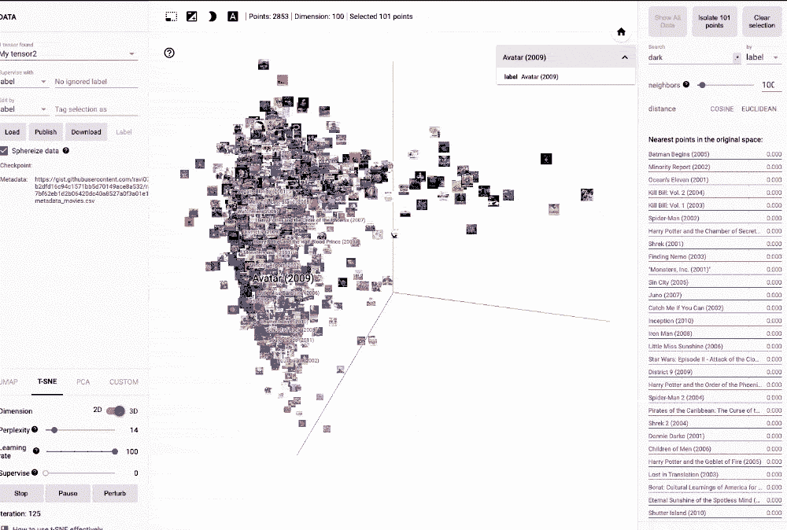

我写了一篇博文，详细博文如下:

 [## 使用深度学习构建浮动电影推荐——在<10 Mins

### Recommendations served on your own Webapp.com, Watch on Netflix.com

medium.com](/towards-artificial-intelligence/build-floating-movie-recommendations-using-deep-learning-diy-in-10-mins-26f585821697) 

2\. Creating network diagram using [Pyvis](https://github.com/WestHealth/pyvis) 中 DIY:

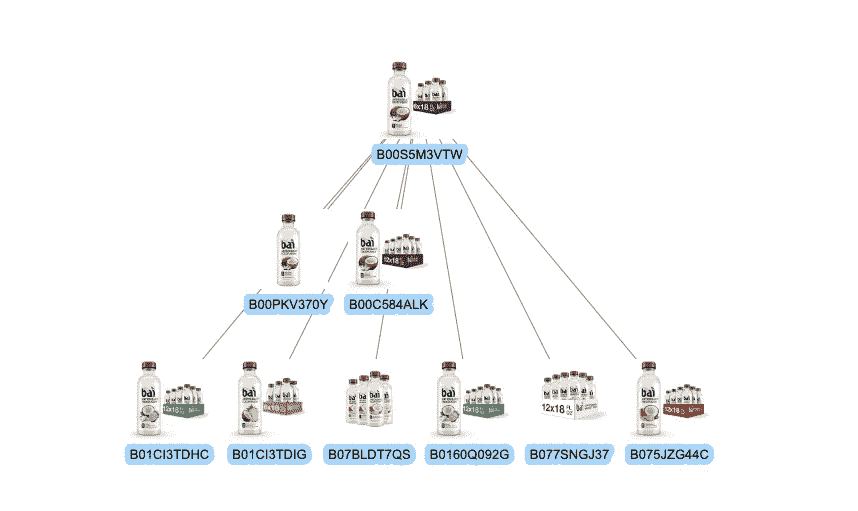

3.Wordcloud

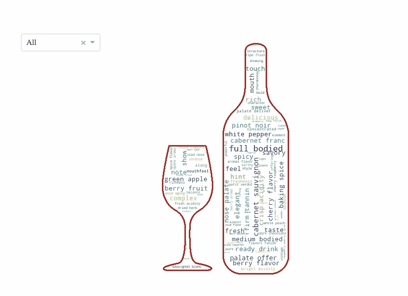

生成 wordcloud 的代码

**4。旅行推销员问题**

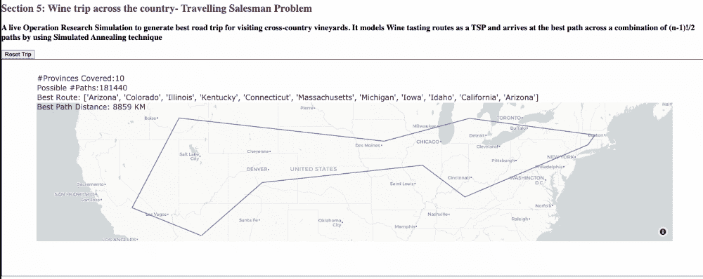

**5。播放 Youtube 视频直播**

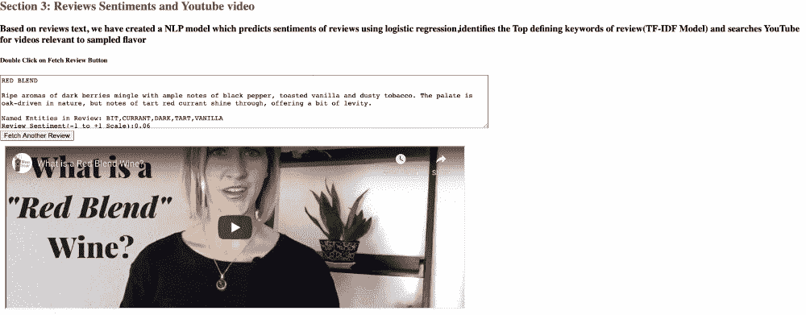

在 Dash 中附加 YouTube 视频的代码

6.**深入细分的树形图:**

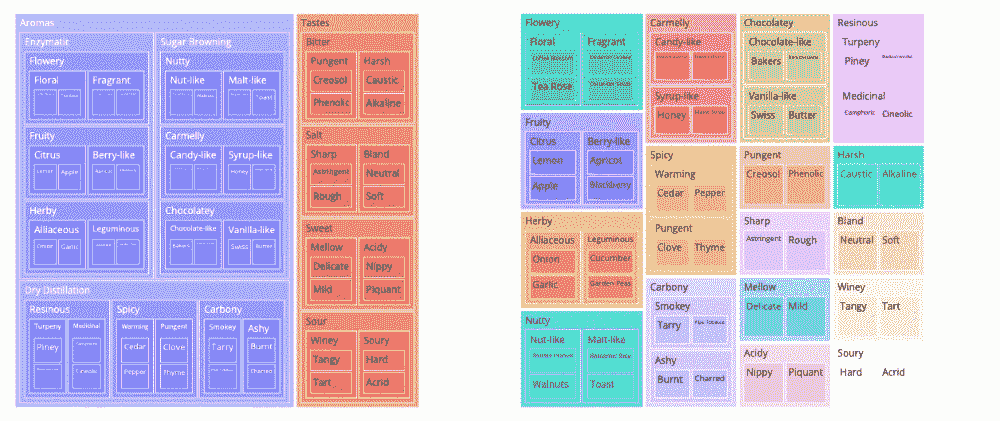

代码:

**8。整合谷歌趋势数据:**

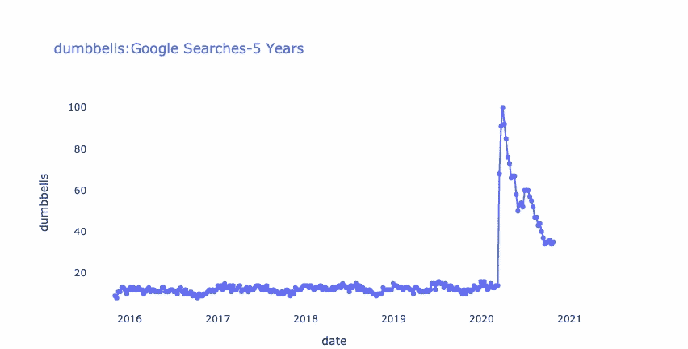

**9。使用仪表盘表和单选按钮进行动态下钻:**

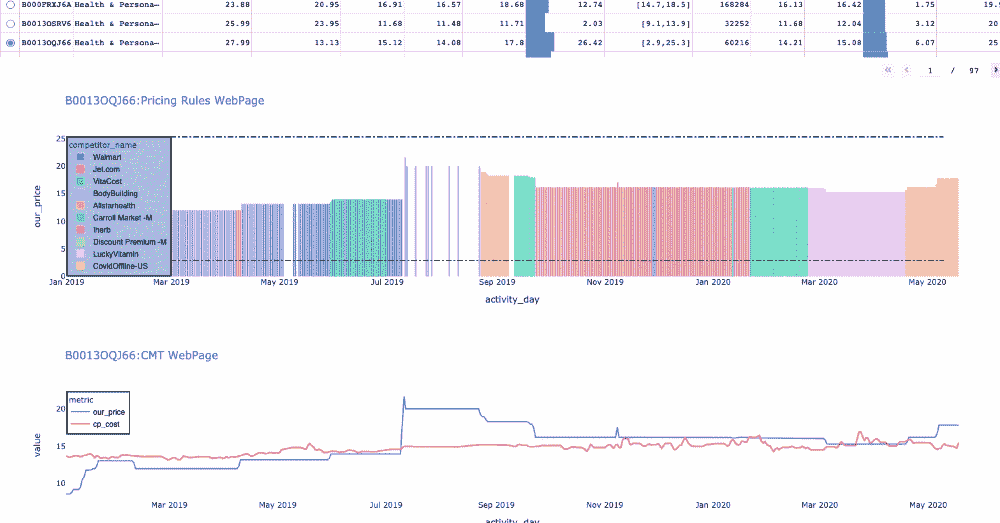

**10。仪表板中的图像显示和汇总信息:**

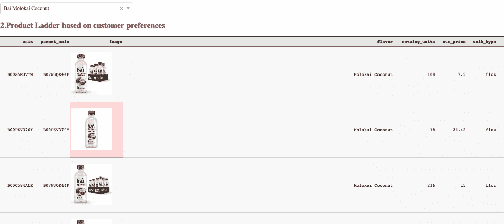

我喜欢讲故事，从过去 6 年以来，我一直在寻找完美的仪表板工具包，旅程在 Dash 停了下来，我在那里找到了一切的甜蜜组合。我与仪表盘幽会的时间顺序:

**2014- Excel 仪表盘:**开始摆弄电子表格、宏和数据透视表。因为这是常规 excel 数据分析的扩展，所以学习曲线是平滑的。但是，excel 将数据大小限制为 1Mn 行，并且跨表的数据连接速度很慢。因为报告是临时的，所以仪表板不能与静态数据共享。
**2015 年——Shiny:**Shiny 是一个 R 包，它可以轻松地直接从 R 构建交互式 web 应用。它将 R 的计算能力与现代 web 的交互性结合在一起。然而，由于最新的开发受限于 python，在 linux 服务器上启动 R studio 的困难，以及更好的社区和我的公司对 Python 的支持，我开始面临 R 中数据扩展的挑战。
**2016–17-Tableau:**我被仅仅通过拖拽 N 次就可以实现的丰富的可视化所震撼。事实上，我非常喜欢 tableau，所以我的整个简历都是用 tableau 制作的。传说中，我的 tableau 简历在网上疯传，并被亚马逊邀请参加面试(在另一篇文章中分享)。我可以在 tableau 中连接 Redhsift/CSV 文件，图表会根据更新的数据自动更新，就像魔术一样。然而，如此丰富的功能也是有代价的(不仅仅是 Salesforece 以 155 亿美元收购 Tableau)。除了在共享能力(TWBX 文件或 tableau online)上的困难之外，该试验是昂贵的。免费版本由 tableau public 提供，但是仪表板不能保存在本地机器上。我在这里维护我的 tableau 公共档案，希望得到反馈。

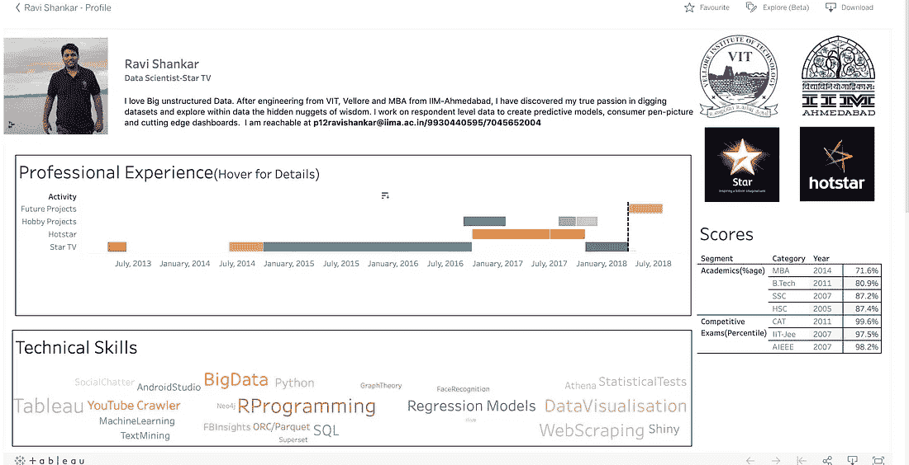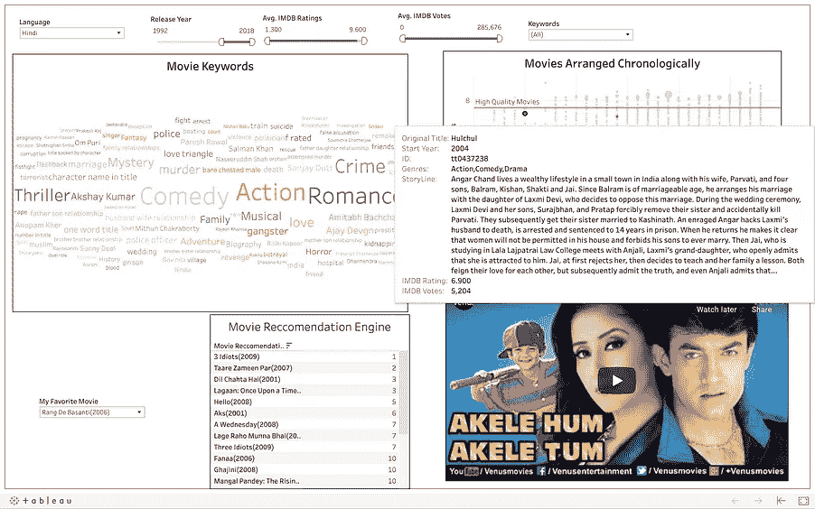

Tableau 中的 CV 和推荐引擎

**2017–18-**[**Apache 超集:**](https://superset.apache.org/) 由于 tableau 很难创建计算列，并且每次都必须获取整个数据，我开始探索可以与基于云的数据仓库无缝集成的开源工具。超集的主要优点是易于在本地主机和 linux 上部署，在 flask 生态系统上有清晰的图表。因为它在后端运行 SQL 查询，所以使用基于企业的仓库(Redshift/Big Query/Athena)计算列是轻而易举的事情。然而，图表的数量是有限的，需要在 python & sql 生态系统之间重新洗牌，以实现高级数据可视化。
**2019-进行中- Dash:** *“我就是这样遇到了我 dashboarding 人生的挚爱”*即 Dash。自去年 1.5 年以来，我将大约 25%的工作时间花在 Dash 上，它不仅帮助我在 jupyter 笔记本上为自己创建了可扩展的解决方案，还让我从仅仅在 jupyter 笔记本上构建模型发展到将项目投入使用。

对比汇总表:

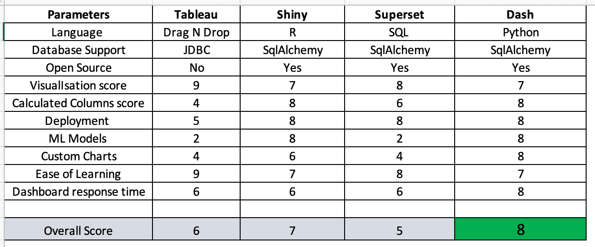

**仪表板部署流程图:**

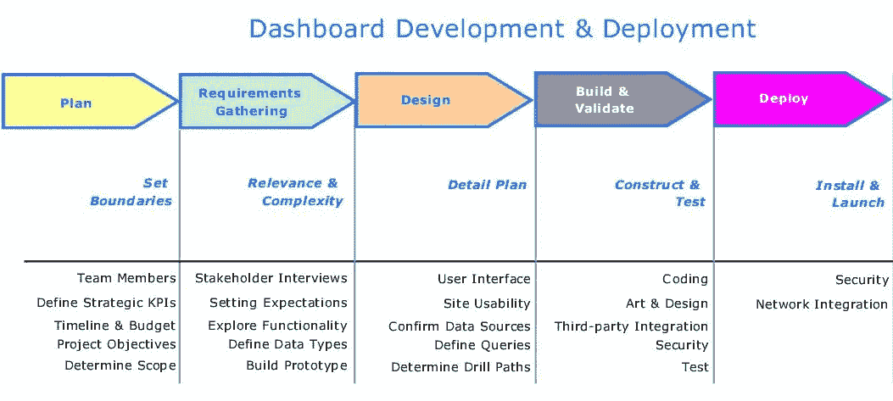

1.  资源和利益相关者——通过清晰的交付成果、时间表和检查点，确定推动仪表板的核心团队。
2.  设计——总是从纸上的草图开始，因为它给创造力和在开始时随意涂写仪表板组件提供了更多的空间。

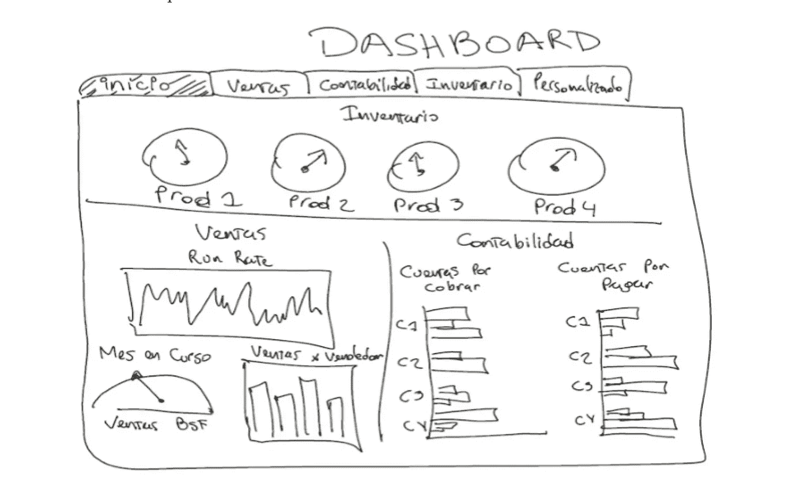

3.以模块化的方式创建组件，并不断获得反馈。此外，考虑编码最佳实践，如代码注释和适当的类和模块的可伸缩性，因为仪表板必须比组织任期更长。

4.创建一个可扩展的管道来更新数据(连接到红移，代码由 DJS 运行，批处理)，最大限度地减少人工干预。它是一个经常被忽略的组件，但是一旦依赖关系在仪表板上建立起来，它就开始制造麻烦。

5.在本地主机/非生产服务器上进行测试，并与同事一起进行试运行，以防止它在生产系统上中断

6.使用服务器部署(EC2、Heroku、Elastic Beanstalk)

7.可选-取一个专业的名字，每个人都喜欢像 www.buyyourbunny.com vs www.ec2jjjdxxrrr.com:8080 这样的名字

总结:

1.  我们需要一个好的故事来讲述
2.  通过引人注目的可视化提高数据科学项目成功率的潜力
3.  仪表板的共享能力，使利益相关者成为寻求项目额外资金的力量倍增器
4.  过去 6 年我与仪表盘的个人约会以及我最喜欢的 Dash 作品