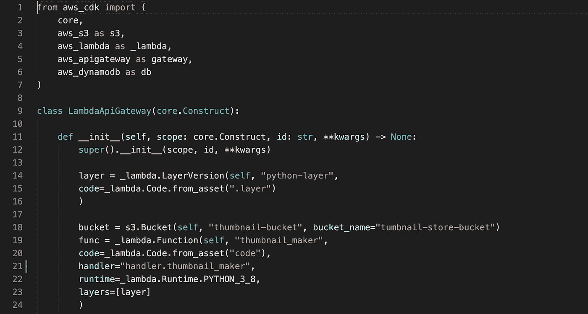
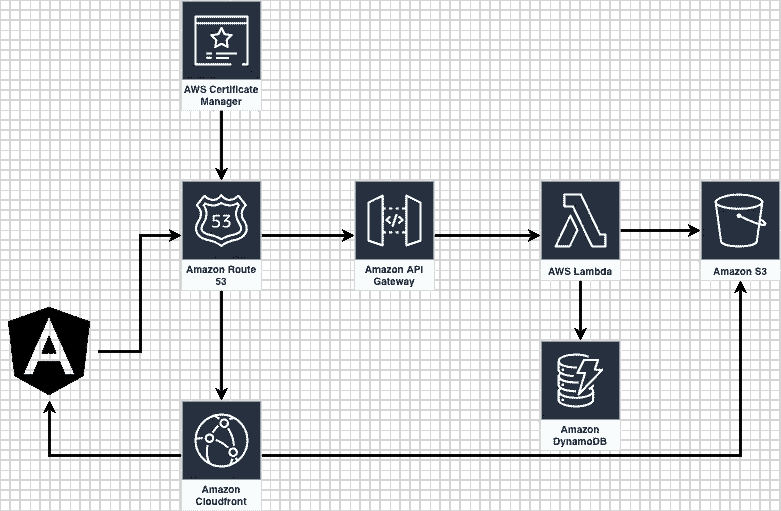

# 从基础设施作为代码到基础设施是 AWS CDK 的代码

> 原文：<https://medium.com/analytics-vidhya/from-infrastructure-as-code-to-infrastructure-is-code-with-aws-cdk-6f942af4eb87?source=collection_archive---------24----------------------->



> 在我不得不维护 1000 多条 YAML 线路来部署 AWS 基础设施之前，我一直认为我喜欢 YAML。

在平台变得复杂之前，声明性形式是定义和部署云基础设施的最佳方式。随着基础设施的复杂化，这将成为最大的噩梦。是时候对我们如何定义云基础架构进行某种抽象了。

AWS CDK 使我们能够将基础设施作为应用程序代码的一部分。支持增量更改并与 CI/CD 管道集成。在应用程序开发、部署和维护的不断变化的所有权模型中，这可以使应用程序开发团队能够以更有意义的方式管理其基础架构。

> YBYO——你建造它，你拥有它

YBYO 是在应用程序的快速开发和维护中拥有一个小而有效的团队的方法。AWS CDK 使团队能够轻松地用熟悉的开发语言对基础设施和监控进行编码。尤其是不再有巨人 YAML。

本文将演示在 AWS 中构建一个图片上传应用程序，如下图所示，并使用 Cloudwatch 进行监控。



静态网站托管在 S3，并通过 Cloufront 分发上传图像，API 通过 API 网关公开，通过 Route53 DNS 路由，由 AWS Lamda 监听，将图片保存到 S3，并将元数据保存到 DynamoDB。最后，用 Cloudwatch 进行监控。

让我们从项目结构开始

```
cdk init -l python #Generate CDK files
ng new ThumbnailMaker --style scss #Generate Angular front-end
mkdir code #Directory for labmda code
mkdir .layers #Directry to keep external dependecies for lambda function to create layers#Some git clean up
cat ThumbnailMaker/.gitignore >> .gitignore
rm ThumbnailMaker/.gitingore#Open VSCode
code .#active venv 
source .env/bin/activate
pip install -r requirement.txt
```

在 setup.py 中添加以下依赖项

我们可以为每个服务建立独立的结构。在这种情况下，web _ construct lambda _ API _ construct 和 route53。

网页制作:

这将为 Angular 内容创建 s3 静态 web 托管。从 angular 项目中获取二进制文件并上传到 S3。连接 Cloudfront CDN for S3 source，附加证书，最后在 Route53 中创建 are record。

_ api _ construct

CDK 使得使用 Lambda 函数变得很容易。特别是环境变量和对其他 AWS 资源的授权。一行代码就可以创建所有 IAM 角色和策略。

其中一个关键特性是如何将第三方库注入运行时环境。在这种情况下，我使用 Lambda 层为运行时环境创建依赖关系。

```
pip install request -t .layerslayer = _lambda.LayerVersion(self, “python-layer”, code=_lambda.Code.from_asset(“.layer”) )
```

最后是 lambda 函数。这是一个简单的功能，从 API 网关接收二进制数据，并将图像保存到 S3。

需要注意的是，LambdaRestApi 在 API Gateway 中创建了一个代理。即使 CORS 配置已被添加到 CDK 堆栈，lambda 函数仍应返回代理 API 网关类型的 CORS 标头。

在代码中，我们可以将基础设施的状态作为应用程序代码的一部分来处理。它可以进行版本控制和管理，并且可以根据应用程序的需要引入增量更改。不再有累赘的 YAML。应用程序和基础设施自动化可以是同一个 CI/CD 管道的一部分，使开发人员的生活更容易，更快地适应新的变化。

然后是堆栈

最后，让我们部署堆栈。

对于第三方库，我们可以在。层目录，并运行以下命令来生成所有第三方库

```
pip install -r .layer/requrements.txt -t .layers
```

然后运行构建 angular 项目

```
ng build
```

如果在 AWS 配置中有多个配置文件，请使用-profile 来指定 CDK 将使用哪个配置文件。

```
cdk deploy --profile myprofile
```

我们将在下一篇文章中讨论如何为这个应用程序构建监控。玩得开心点:)。

源代码:[https://github.com/sumedha1101/cdk-stack-demo](https://github.com/sumedha1101/cdk-stack-demo)

谢谢

苏梅达