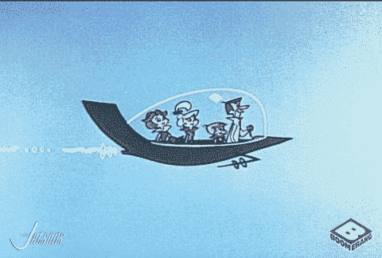
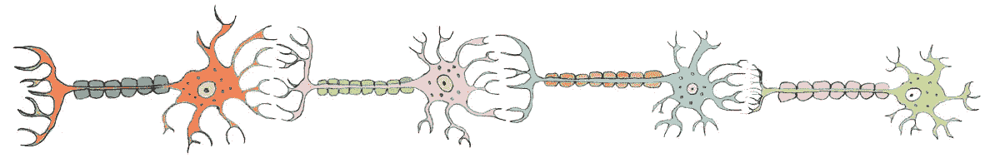
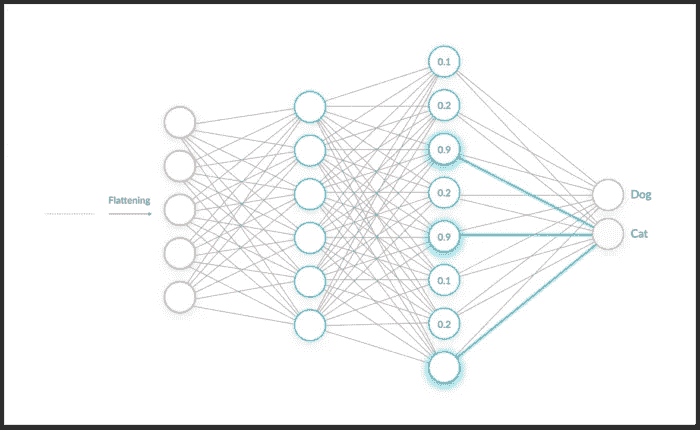

# 从神经元到卷积神经网络

> 原文：<https://medium.com/analytics-vidhya/from-neuron-to-convolutional-neural-network-94948dd88ce0?source=collection_archive---------39----------------------->

Gif 来自 Giphy.com

现在是 2020 年，变化太大了，虽然我们还没有像杰特森那样生活在我们的飞行汽车中，但已经取得了很多进步。看看你的周围:从无人驾驶汽车，使用面部识别来解锁你的智能手机，以及自动 facebook 标签。图像分类得到了充分利用。我们甚至使用图像分类来识别疾病，如肺炎或癌症。计算机是如何做到这一点的？答案在于卷积神经网络或 CNN。

# 但是在我们开始之前，让我们先谈谈人类神经元。

图片来自[https://ex-m.eu/alessandra-spada](https://ex-m.eu/alessandra-spada/)

*你的人类神经元速成班是这样的:*

神经元是身体中的特殊细胞，使用电脉冲将化学信号从大脑发送到身体的其他部位。它们是你能做几乎任何事情的原因。如上图所示，多个神经元连接在一起，这些信号从一个神经元跳到下一个神经元。神经元有一部分叫做受体。这些受体接收信息，处理信息，然后将信息传递给下一个神经元。这意味着每一条信息都不一定向前移动，而只是会对身体产生影响的重要信息。(如果你有兴趣，可以查一下抑制剂和兴奋性神经递质。)那么这和卷积神经网络有什么关系呢？

# 许多

卷积神经网络的处理方式与我们大脑中的神经元非常相似。神经网络被构造成不同的层，这些层接收需要传递到每一层的输入。在 CNN 的例子中，它是一个图像。图像的每个部分都有一个特定的权重，权重越高，信号就越强，信号就会被传递到下一层。在下面的图片中，你看到了一个神经元是如何向卷积神经网络输入信息的吗？在这种情况下，它是一辆汽车的图像。

图片来自帖子末尾引用的来源

第二层或“神经元”是卷积层。这一层一次读取图像的一部分(通常大小为 3x3 或 5x5)，并向右移动，直到它完成图像的宽度。然后向下移动一行，完成相同的过程，直到读取整个图像。

你可能会注意到在上面的汽车图像中，有一个以上的卷积层。这些层的操作类似，除了较早的层将捕获低级特征，如颜色、边缘和渐变方向。随着我们进入下一个卷积层，细节变得更加复杂。卷积层可能会出现错误，包括图像收缩或边缘变得不太清晰。为了帮助对抗这种情况，数据科学家可以使用一种叫做填充的东西。填充基本上是在图像边缘添加一层像素，以便在卷积发生时保持图像的真实大小。

图片来自 researchgate.net

接下来我们可以看到池层。该层用于减小前一卷积层的空间大小。通过对卷积层进行下采样，有助于降低执行模型所需的计算能力，并有助于防止模型过拟合。两种不同类型的池是最大池和平均池。如上所示，最大池返回图像每个部分的最大值。在图中，我们可以看到 Max pooling 返回 100、184、12 和 45，这些都是各自部分中的最高数字。平均池取图像每个部分中所有值的平均值。如果我们把绿色的数字加起来除以 4，我们会得到 36。Max pooling 是最受欢迎的池版本，因为它的成功率更高。

在池中要讨论的重要参数是池的大小和步幅。池大小是“取最大值的窗口大小(2，2)将取 2 x 2 池窗口的最大值。如果只指定了一个整数，所有维度将使用相同的窗口长度。(tensorflow.org)Stride 指定“每个汇集步骤的汇集窗口移动的距离”(tensorflow.org)。

图片来自 [https://missinglink.ai](https://missinglink.ai/wp-content/uploads/2019/06/The-Role-of-a-Fully-Connected-Layer-in-a-CNN-700x430.png)

最后但并非最不重要的是我们的全连接层。现在我们已经运行了卷积层和池层，我们需要将我们的图像展平成一个列向量。这个展平的向量被输入到神经网络中，并应用反向传播。CNN 现在已经查看了图像中的高级和低级特征，并且可以开始区分图像或物体。如上所述，CNN 使用展平来预测图像显示的是一只猫而不是一只狗。

卷积神经网络在未来有着巨大的潜力。从汽车、电话、医药和银行安全的进步，我们可以研究无数的项目。长话短说，我们和杰森一家一起飞行的日子可能不会太久了。

**来源:**

[https://medium . com/forward-artificial-intelligence/convolutionary-neural-networks-for-dummies-AFD 7166 cd9e](/towards-artificial-intelligence/convolutional-neural-networks-for-dummies-afd7166cd9e)

[https://towards data science . com/a-comprehensive-guide-to-convolutionary-neural-networks-the-Eli 5-way-3bd2b 1164 a53](https://towardsdatascience.com/a-comprehensive-guide-to-convolutional-neural-networks-the-eli5-way-3bd2b1164a53)

[https://learn . co/tracks/module-4-data-science-career-2-1/appendix/卷积神经网络/卷积神经网络](https://learn.co/tracks/module-4-data-science-career-2-1/appendix/convolutional-neural-networks/convolutional-neural-networks)

https://www . quora . com/What-is-max-pooling-in-convolutionary-neural-networks

[https://www . tensor flow . org/API _ docs/python/TF/keras/layers/maxpool 2d](https://www.tensorflow.org/api_docs/python/tf/keras/layers/MaxPool2D)