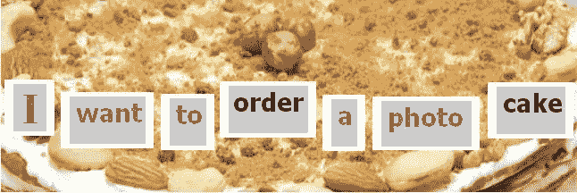
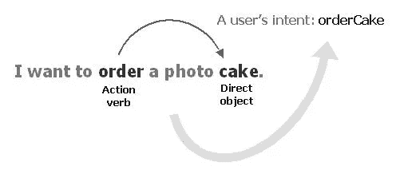

# 从 NLP 到聊天机器人

> 原文：<https://medium.com/analytics-vidhya/from-nlp-to-chatbots-1dd76c9537dd?source=collection_archive---------13----------------------->



照片由伊戈尔·沙巴林拍摄

这在今天很常见，当打电话给银行或其他公司时，听到电话另一端的机器人如下问候你:“你好，我是你的数字助理。请提出你的问题。”是啊，机器人现在不仅能说人类语言，还能用人类语言与用户交流。这是由于自然语言处理(NLP)——任何数字助理的核心技术，允许它以编程方式理解和生成自然语言。

本文通过一个例子说明了如何使用 spaCy 从用户输入中提取含义，spaCy 是领先的用于 NLP 的开源 Python 库。

# 如何从用户输入中提取含义

以编程的方式从用户输入中提取含义可能非常具有挑战性，但并非不可能。很明显，你不能依赖句子中单个单词的意思——同一个单词可能表达不同的意思，这取决于它在特定句子中的句法功能。这可以通过例子得到最好的理解。看下面两句话:

```
I’d like to order a cake.
I want to cancel my order.
```

在这两种说法中，你都可以看到“秩序”这个词。然而，在每种情况下，它都有不同的句法功能和不同的含义。在第一种情况下，“顺序”是一个动作(及物)动词，作用于名词“蛋糕”——句子的直接宾语。相比之下，第二个话语中的“顺序”是一个接受句子动作的名词——也就是说，它充当句子的直接宾语，其中“取消”是及物动词。

句子中单词的语言特征——比如上例中的及物动词或直接宾语——也被称为语言特征。spaCy 自动为应用 spaCy 的文本处理管道的句子中的每个标记分配语言特征。然后，分析语言特征可以帮助识别这个特定句子中单词的意思。我们将在本文后面的在 NLP 中使用语言特征一节中讨论如何使用语言特征来完成含义提取任务。

# 准备您的工作环境

为了遵循本文提供的代码，您需要在您的机器上安装以下软件组件:

[Python 2.7+∕3.4+](https://www.python.org/downloads/)

[spaCy v2.0+](https://spacy.io/usage/)

[为 spaCy](https://spacy.io/models/) 预培训的英国模特

您可以在相应的网站上找到安装说明。为了确保您的环境准备就绪，您可以在 Python 会话中输入以下代码行:

```
import spacy
nlp = spacy.load('en')
```

如果一切正常，您应该看不到错误消息。

# 在自然语言处理中使用语言特征

诸如词性标签和句法依存标签之类的语言特性是专门为开发能够智能处理原始文本的应用程序而设计的。以下脚本说明了如何使用 spaCy 来提取句子中每个单词的语言特征:

```
import spacy
nlp = spacy.load('en')
doc = nlp(u'I have to send them a notification.')
for token in doc:
  print(token.text, token.pos_, token.tag_, token.dep_)
```

在这个脚本中，您为提交的句子中的每个标记提取并输出粗粒度的词性标签(pos_)、细粒度的词性标签(tag_)和句法依赖标签(dep_)。因此，该脚本应该给出以下输出(为了便于阅读，以表格形式列出):

```
I            PRON   PRP  nsubj
have         VERB   VBP  ROOT
to           PART   TO   aux
send         VERB   VB   xcomp
them         PRON   PRP  dative
a            DET    DT   det
notification NOUN   NN   dobj
.            PUNCT  .    Punct
```

如果你是 spaCy 的新手，那么上面第三列和第四列分别输出的细粒度词性标签和句法依赖标签可能会让看起来有点混乱。要了解这些列中的值的含义，您可以查看位于 https://spacy.io/api/annotation/[的 spaCy 文档，或者使用 spacy.explain()函数，该函数返回给定语言特性的描述。在下面的循环中，您将输出示例句子中每个标记的细粒度词性标记的描述:](https://spacy.io/api/annotation/)

```
for token in doc:
  print(token.text, spacy.explain(token.tag_))
```

这将为您提供以下输出:

```
I            pronoun, personal
have         verb, non-3rd person singular present
to           infinitival to
send         verb, base form
them         pronoun, personal
a            determiner
notification noun, singular or mass
.            punctuation mark, sentence closer
```

类似地，您可以使用 spacy.explain()函数来获取粗粒度词性标签和语法依赖标签的描述。

# 从话语中提取意图

现在让我们看一个例子，看看如何利用语言特征从用户输入中提取意思。假设您需要从提交的话语中提取意图。例如，点餐聊天机器人的用户提交以下话语:

```
I want to order a photo cake.
```

显然，“订单”和“蛋糕”这两个词最能描述这句话的意图。在这种特殊情况下，这些词分别代表及物动词和直接宾语。事实上，在大多数情况下，及物动词/直接宾语对在确定请求话语中表达的意图时是最具描述性的。

从图表上看，这可能如下所示:



在许多请求话语中，及物动词及其直接宾语最能描述短语的意图。

图中描述的操作可以在采用空间的 Python 脚本中轻松执行，如下所示:

```
import spacy
nlp = spacy.load('en')
doc = nlp(u'I want to order a photo cake.')
for token in doc:
  if token.dep_ == 'dobj':
    print(token.head.text + token.text.capitalize())
```

在这个脚本中，您将文本处理管道应用于示例句子，然后遍历标记，查找依赖标签为 *dobj* 的标记。当找到它时，你通过获得直接宾语的句法中心来确定相应的及物动词。最后，您将及物动词和它的直接宾语连接起来，以单个单词的形式表达意图(这通常是处理脚本的要求)。

因此，该脚本应该生成:

```
orderCake
```

在真实的应用程序中，用户可能会为每一个意图使用大量的短语。这意味着真正的应用程序必须识别用户输入中的同义短语。关于这些细节，你可以看看我的新书《使用 Python 的自然语言处理[](https://nostarch.com/NLPPython)*，里面有很多使用 spaCy 完成不同 NLP 任务的例子。*

*此外，在我最近为 Oracle 杂志撰写的文章[为 Oracle 数字助理技能生成意图和实体](https://blogs.oracle.com/oraclemagazine/generating-intents-and-entities-for-an-oracle-digital-assistant-skill)中，可以找到意图提取技术在实践中可能应用的真实示例。*