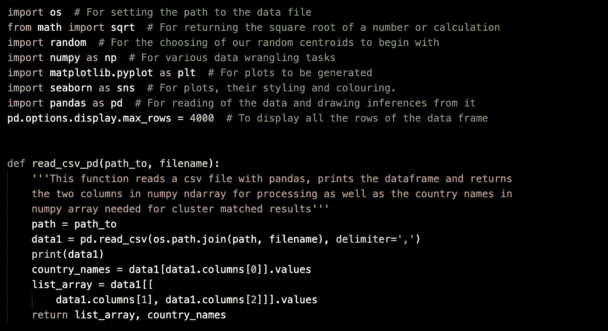
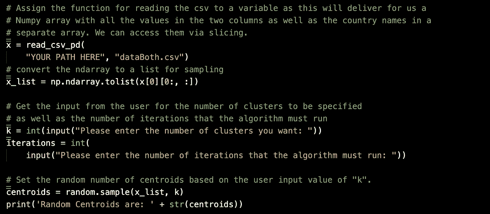
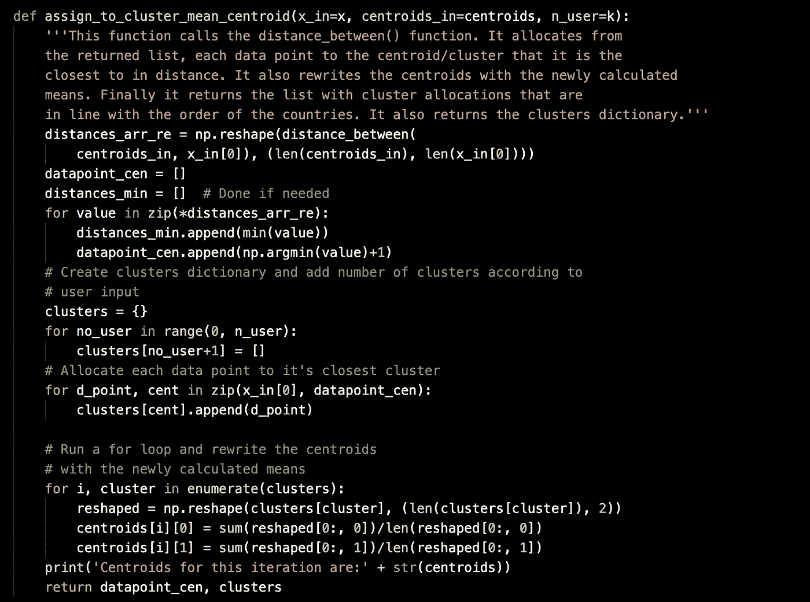
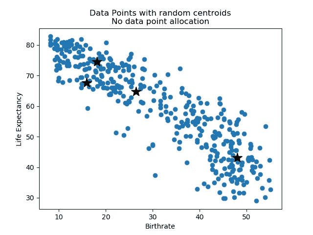
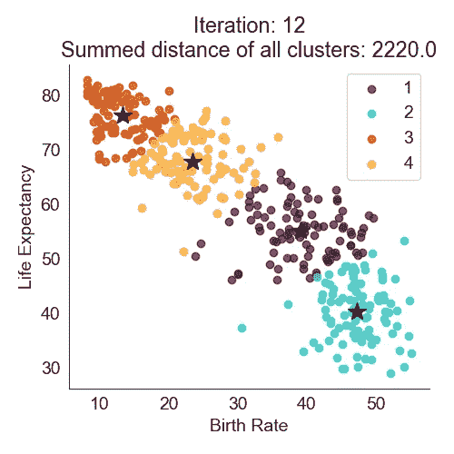

# 从伪代码到 Python 代码:K-Means 聚类，从零开始

> 原文：<https://medium.com/analytics-vidhya/from-pseudocode-to-python-code-k-means-clustering-from-scratch-2e32aa469bef?source=collection_archive---------3----------------------->


情节和设计:e .鲍彻

在数据科学的多学科领域，作为一名新手准备面试可以很容易地暴露出你知识库中需要重新访问、加强和/或扩展的领域。面试准备过程中的一个分支是做“带回家的任务”。如果你有导师，他们可以给你提供几个，如果没有，你可以在网上搜索任务，那里有很多可以找到。不过，一定要挑战自己，挑一些让你感觉有点不舒服的任务。这样你就能很好地挑战你的知识库。

为他们的学生提供毕业后支持，HyperionDev 确实会带你经历这个过程，并在这个过程中的某个地方为你提供带回家的挑战。我接受了从零开始编写 K-Means 聚类算法的任务，并通过各种练习返回基于数据集应用的某些推论。虽然伪代码很简单，但将其翻译成编程代码却是另一回事。接到这个任务后，我想在不研究互联网上的任何例子的情况下从头开始编写算法，而仅仅利用伪代码和我的 Python 知识(我在互联网上搜索了一些 Python 相关问题的答案)。这篇文章，将向你展示这一点；我对无监督机器学习算法的解释，Python 编程语言中的 K-Means 聚类。

由于有各种可用的聚类算法，每种算法都有自己的标准来执行数据划分。K-Means 作为划分聚类算法也不例外，简单来看一些是怎么定义算法的。

关于 [**的 K-Means 聚类定义的一部分在维基百科**](https://en.wikipedia.org/wiki/K-means_clustering) 中指出*“K-Means 聚类旨在将****【n’****个观察值划分为****【K’****个聚类，其中每个观察值属于具有最近均值的聚类，作为聚类的原型。”*。

我的《带回家》一书的作者本杰明·穆雷尔指出:

*“k-means 算法背后的关键假设:*

*1)每个聚类的中心是属于它的所有数据点的平均值(因此得名“k-means”)。*

*2)每个数据点属于中心点最近的聚类。*

*这两个假设其实足以描述整个算法。k-means 算法所做的只是迭代两步，每一步都试图满足其中一个条件！"*

现在，为了将每个数据点分配到最近的聚类质心/均值，必须进行数据点和每个聚类质心之间的距离测量。根据测量方法，在此过程中，每个数据点被分配到一个聚类中。虽然有一些不同的距离度量可用，并且它们对聚类的影响也不同(有关更多信息，请参见 https://arxiv.org/pdf/1405.7471**的白皮书)，但我被指示在这个特定的任务中使用欧几里德距离度量。两个数据点之间的欧几里德距离测量非常简单。你取两个数据点的平方差之和的平方根。这是 x，y 平面上两个数据点之间的最短距离。然后，利用该距离度量，将数据点分配给具有最短度量的聚类平均值。**


现在，让我们继续将算法应用于我们的问题，它的概要和实际编码。我们的问题包含一个数据集，该数据集由世界上两个国家的两个数据集组成，分别包含 1953 年和 2008 年的“出生率”和“预期寿命”统计数据。我们希望通过 K-Means 聚类并使用欧几里德距离作为其距离度量，来了解国家如何根据用户指定的聚类数*“K”*以及用户指定的迭代次数聚类在一起。最后要做到类内相似度高，类间相似度低。

首先，我必须编写一个将数据集读入内存的函数。为此，我使用 Pandas 作为导入的库之一。下面我包括了这个函数的快照，以及我在这个任务中使用的所有导入，每个导入旁边都有一个注释，说明它的用例。



导入和 CSV 文件读取功能

为了正确初始化算法，这也允许将每个数据点分配到其最近的聚类，必须指定从我们的数据集中随机选择的多个质心。质心的数量也是由算法形成的聚类*“k”*的数量，并且如前所述由用户指定。

该算法还必须在数据中迭代一定次数(也由用户指定),然后才能收敛，找到一组稳定的值，使质心不再移动。对于上述所有内容，我包括下面的代码。注意，通过将 **read_csv_pd()** 函数赋给一个变量，我可以很容易地将数据转换成一种我可以在各种情况下使用的格式。



将 CSV 读取功能分配给变量。创建用户输入和随机质心。

现在再次引用我们的距离度量，我需要写一个函数来计算两个数据点之间的欧几里德距离。这个函数接收两个参数，上一步中建立的质心 *(cent)* ，以及我们的数据集*【x】*的数据点( *data_points)* ，我通过 index 调用它(显示在 assign _ to _ cluster _ mean _ centroid()函数中)。below 函数迭代地将数据集中每个数据点和每个质心之间的欧几里德距离追加到一个列表中，然后返回它。


计算两个数据点之间的距离函数

有了距离列表，我们现在必须创建聚类，我们可以根据计算的最小欧几里得距离(从返回的列表中提取)将属于每个聚类的所有数据点附加到这些聚类中。一旦分配了所有的数据点，还必须用新计算的每个聚类的平均值重写质心。让我们快速浏览一下这个函数(如下所示)。

该函数接收三个参数；a)保存所有数据点和国家名称的数据框*“x”*，b)用户指定的*“质心”*和 c)值*“k”*。该函数首先对由 **distance_between()** 函数生成并返回的列表进行整形。这是因为我们返回的列表保存了每个数据点和每个质心之间的所有距离测量值。这使得它在实例数量上大于我们的数据集中找到的实例数量。我们希望从列表中提取数据点和任意质心之间的最短距离，以及它的索引。索引值将告诉我们特定数据点属于哪个聚类。这是在第一个“for”循环中完成的，在这个循环中，我们向两个列表添加各自的值。我们将最小距离添加到*“distance _ min[]”*列表(如果稍后可能需要该列表)中，并将其索引添加到*“data point _ cen[]”*列表中。在将索引值追加到列表中时，我添加+1 的原因是我已经将它标准化了，以便返回的集群编号从 1 开始，而不是从 0 开始。

函数中接下来的两个“for”循环负责创建聚类本身，还负责将每个数据点分配给相关的聚类。最后一个“for”循环根据每个聚类计算的新平均值重写质心。然后打印出新分配的质心。



给每个聚类分配数据点并重写质心函数。

在我们进入将所有函数和算法片段集合在一起的主循环之前，我已经在编码过程中决定在主循环开始之前打印出一个散点图。该散点图显示了在进行任何距离测量计算或数据点分配之前，具有随机选择的质心的数据点。



我在这里包括情节，然后没有代码。您可以在本文末尾找到我的 GitHub 资源库的链接，python 文件中的完整代码将存放在这个资源库中。如我们所见，随机质心启动是成功的。现在我们进入 K-Means 聚类算法的主循环。

下面，主循环的第一部分。这里，我将**assign _ to _ cluster _ mean _ centroid()**函数赋给一个变量，因为我想在同一个循环中分别调用它的两个返回值。如果我不这样做，函数将在一个循环中执行两次，使它不精确到用户指定的迭代次数。除此之外，循环部分还创建了一个数据框，其中包含两个变量“出生率”和“预期寿命”以及两个额外的列，一个用于每个国家所属的聚类，另一个用于国家本身。请注意我是如何通过索引调用数据的。该循环还返回以下三个推论:

1.  每组国家的数量，
2.  每组的国家清单和
3.  集群的意思是。


主循环，第 1 部分

循环的其余部分返回打印的总距离。该总距离是通过将每个数据点与其相关聚类平均值之间的所有平方距离相加来计算的。在算法的收敛中，总距离应该以低于第一次迭代的总距离的数字结束。循环中的最后一部分还生成了用颜色显示不同编号的簇及其质心的图。参见下面的代码。


主循环，第 2 部分

好了，我们的算法可以执行了！我们将使用 4 个聚类和 12 次迭代来运行该算法。注意，随着循环的重复，每个数据点和每个聚类均值之间的距离测量在每次迭代时进行。这就是如何将数据点重新分配到不同的聚类，以及如何重新计算每个聚类的平均值并将其指定给相关的质心。

在花时间多次运行该算法的过程中，除了打印的推论之外，我还做了一些有趣的观察。当我被告知注意哪些国家聚集在一起，以及一些国家如何从一个集群转移到下一个集群时，我注意到一件事；位于聚类边缘的国家比靠近特定聚类的中心或均值的国家更倾向于移动到下一个。然而，这个观察结果取决于质心从开始到结束移动的量(因为它们是随机选择的)。该观察还排除了数据集外部的聚类的外边缘，在这种情况下，聚类 3 和 2 的外边缘。我最后还注意到，当涉及到“出生率”和“预期寿命”的可变值时，处于某个值范围内的国家往往最终会出现在相同的集群中。尽管每个聚类中这些对的值范围不相等。这种分析符合我们所说的最终应该达到的目标，即高的类内相似度和低的类间相似度。如果您有一个在数据中寻找这些特征的数据集，K-Means 聚类是一个很好的划分研究，可以帮您完成这个任务。请参见最终迭代的下图，该图显示了四个聚类和确定为值 2220.0 的总距离。



对我来说，代码构造的一个很好的检查点是查看每次迭代后打印出来的平均值(记为“推论 3”)是否与新计算的质心匹配，因为它们是同一个东西。然而，它们的编码路径是不同的。我在下面列出了最后一次迭代的质心和聚类平均值的最终打印结果。

正如我们所见，它们是完全相同的:)。

```
ITERATION: 12
Centroids for this iteration are:
[[39.055540816326534, 55.145112244897966], 
[47.2816907216495, 40.28537649484538], 
[13.258812499999998, 76.31897916666664], 
[23.438574257425735, 67.88712871287129]]AVERAGES: 
        Birth Rate  Life Expectancy
label                             
1       39.055541        55.145112
2       47.281691        40.285376
3       13.258812        76.318979
4       23.438574        67.887129
```

要自己尝试算法并进行观察，请访问我的 GitHub 知识库 [**这里**](https://github.com/EtienneBauscher/K-Means-Clustering/tree/master) 。我为您提供了三个不同的数据集和 python 程序文件。您所要做的就是将这些文件复制到您计算机上的本地驱动器，并相应地设置路径和文件名，然后运行程序文件(确保您已经安装了所有的依赖项)。要修改的代码是下面一行。

```
x = read_csv_pd("SET YOUR PATH HERE", "CALL THE DATASET FILE HERE THAT YOU WANT TO RUN.")
```

下面的短片展示了该算法在 4 个聚类中 12 次迭代的收敛性，以及它如何确定提供高类内相似性和低类间相似性的值。

下次再见，科学快乐，黑客快乐！

问候，艾蒂安