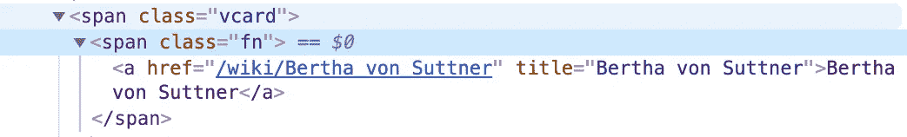
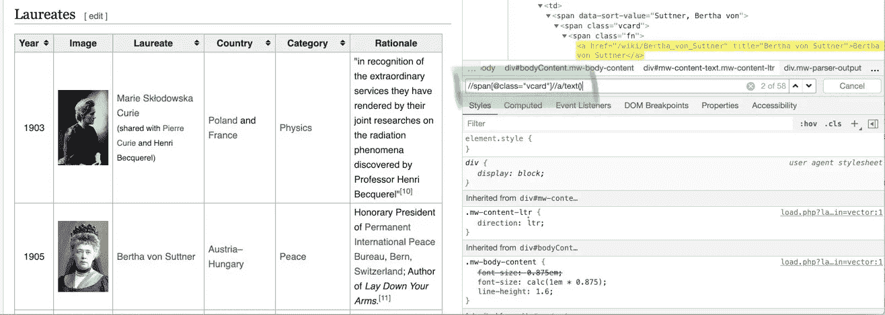

# 从蜘蛛到 R 再回来…

> 原文：<https://medium.com/analytics-vidhya/from-spiders-to-r-and-back-8b2e90a94473?source=collection_archive---------24----------------------->

## 一个面向社会科学家(喜欢计算机，但不知道如何编码)的文本挖掘项目


对于那些对这些新的计算方法和机器学习为这门学科提供了什么感到好奇的人，这里有一个品尝者！在这篇文章的整个过程中，我将带你经历如何开始(并希望完成)一个计算社会科学项目(以及另外 2 个)。

当然，我将带你进入一个非常特殊的研究领域:英国的极左团体，他们是委内瑞拉马杜罗政府的支持者。的确是小众。为了了解委内瑞拉目前的情况(也是为了让你自己得出结论)，我建议你看看 BBC iPlayer 上的纪录片。我不会对这件事发表自己的看法——只能说它离家太近，讨论可能需要几个小时(不过，如果你好奇，你肯定可以问我，因为我已经写了 4 年了！)

在这个分析中，我将关注英国这些群体的在线输出:具体来说，我将关注他们更广泛的*书面*输出——因此为什么文本挖掘和文本分析方法是合适的。在本教程中，我将只关注英国的一个特殊团体，即“不干涉委内瑞拉”运动(HOV)。(如果你想知道的话，实际上在英国有几个*马杜罗支持者团体。很奇怪，我知道。)我也将只关注他们的*博客*输出，而不是他们的脸书，甚至是他们的 Twitter 输出，我将把它们留给另一个项目。*

因此，我们的首要任务是*将*所有 HOV 写的博客输出到一个可爱的表格中。收集这些数据的一种方法是复制并粘贴 HOV 网站上的所有文章。你知道，用鼠标和网络浏览器。但是，我强烈认为，这是一个可怕的想法。它不仅耗时、枯燥、容易出错，而且不可复制。作为一名有抱负的数据科学家，我必须告诉你，不可再现性是绝对不允许的(同样，如果你友好地提出来，我很乐意讨论为什么)。

所以，首先我们必须学会如何从 HOV 的博客中“搜集”这些信息。换句话说，我们已经学会了如何通过一套指令让我们的*计算机*为我们复制和粘贴。你怎么问？进入 Scrapy:一个用 Python 编写的漂亮的小应用程序，我们可以用它来完成这个任务。(参见 Scrapy 的文档[此处](https://docs.scrapy.org/en/latest/intro/overview.html)。)

我将尝试 Scrapy 可以做什么，如果你不太害怕你的计算机控制台(或终端),你可以通过输入如下所示的命令来跟随。用来抓取 HOV 网站的真实蜘蛛就在我在 GitHub 上的仓库里。[在这里](https://github.com/psubbiah/solidarity_data/tree/master/data)你也可以下载我用来进行文本分析的文件，并遵循更高级的说明(你真幸运！你可以完全跳过这个教程！)

一些需要注意的法律问题:网站的条款和条件会注明他们的抓取政策。一些网站非常明确地禁止抓取(例如 IMDB ),而另一些则不那么明确。我们试图捕捉的数据增加了服务器的负载，因此公司有理由希望限制抓取。一个网站的文档应该清楚地说明这一点。您可以通过在网站名称中添加斜杠并键入/robots.txt 来访问这些信息。

现在，让我们建立一个简单的蜘蛛，它会教我们基本的刮擦，嗯…合法的。对于 Scrapy 更全面的介绍，我强烈推荐这些文章:

1.  李彦宏终极[简介](https://www.smashingmagazine.com/2019/07/ultimate-guide-scalable-web-scrapers-scrapy/)
2.  pyimagesearch.com[教程](https://www.pyimagesearch.com/2015/10/12/scraping-images-with-python-and-scrapy/)用于抓取图片和理解如何在不同的页面上爬行。

*如果您想学习如何处理已经拥有的文本数据，请跳过这一节 Python webscraping，转到下一节，在那里我将讨论如何在 r 中进行文本分析。*

要安装 Scrapy，请到您的控制台。随意复制粘贴。我注意到散列后的所有内容都被“注释掉”，控制台并不解释它，尽管我们可以复制和粘贴，但它只对人类有用。

## Windows 操作系统

在这里，我们确保 1)我们的 pip 是最新的，2)我们安装了依赖项(在本例中为“pypiwin32”)，3)然后才安装 Scrapy:

```
# Install pip
python -m pip install --upgrade pip

# Install dependencies
pip install pypiwin32

# Install scrapy
pip install scrapy
```

## Linux 操作系统

在这里，我们安装依赖项，然后确保 pip 是最新的，然后才安装 Scrapy:

```
# Install dependencies
sudo apt-get install python3 python3-dev python-pip libxml2-dev libxslt1-dev zlib1g-dev libffi-dev libssl-dev

# Upgrade pip
pip install --upgrade pip

# Install scrapy
pip install scrapy
```

## 苹果个人计算机

在这里，我们更新 Xcode，然后确保 home-brew 和 python 是最新的，然后才安装 Scrapy(我注意到根据 Python (2，3)的版本设置，你需要使用`pip3`而不是下面的`pip`)。

```
# Xcode update
xcode-select --install

# Install homebrew
/bin/bash -c "$(curl -fsSL https://raw.githubusercontent.com/Homebrew/install/master/install.sh)"

# Update path variable so that homebrew starts before system packages
echo "export PATH=/usr/local/bin:/usr/local/sbin:$PATH" >> ~/.bashrc

source ~/.bashrc

# Make sure brew and python are up to date
brew update; brew upgrade python

# Install scrapy
pip install scrapy
```

## 编码我们的蜘蛛！

首先，为我们的蜘蛛选择一个容易记忆的名字，然后运行下面的命令——你猜对了！— `startproject`:

```
scrapy startproject wikiNobel
```

这将生成一组文件，我们将需要运行我们的蜘蛛。我特别害怕真正的蜘蛛，所以即使拼写和阅读这个词也感觉不好(我是一种视觉动物)。事实上，我写了这么多关于蜘蛛的东西，尽管我对真正的蜘蛛是怎么想的，这也说明了这些小软件版本的效用。他们太棒了！

现在，您应该有一组如下所示的文件夹:

```
wikiNobel
├── scrapy.cfg          --> deploys configuration of scrapy project.
└── wikiNobel           --> this is your scrapy project module.
    ├── __init__.py     --> this initialises the module initializer
    ├── items.py        --> this project item definition py file
    ├── middlewares.py  --> project middleware .py file
    ├── pipelines.py    --> project pipeline .py file
    ├── settings.py     --> project settings .py file
    └── spiders         --> save flaurates.py here!
        ├── __init__.py         
        ├── flaurates.py
```

我们现在将在`/wikiNobel/spiders`文件夹中创建一个新的 Python 脚本，并将其命名为`flaureates.py`。如果您从未创建过 Python 脚本，不要担心，您不需要流利地掌握这种语言，这里的介绍应该足以编写您的蜘蛛。你应该看看 Al Sweigart 著名的[指南](https://automatetheboringstuff.com/)作为这门语言的介绍！这很有趣——我保证。

我确实建议你在开始单飞之前获得一些 Python 编程经验——也就是编写你自己的蜘蛛，因为它们会变得相当复杂，正如你将看到的。

为了创建这个 Python 脚本，我们需要一个文本编辑器。我们可以在任何文本编辑器中写这个——甚至你信任的文本编辑器也可以。但是还有其他一些可爱的代码编辑器，它们突出显示代码并给出条目建议(就像你在智能手机上打字时的建议一样)。我个人对 [Atom](https://atom.io/) 情有独钟。

进入编辑器后，键入:

```
import scrapy

class NobelSpider(scrapy.Spider):
	name = "wikiNobel"
	allowed_domains = ["en.wikipedia.org"]
	start_urls = ["https://en.wikipedia.org/wiki/List_of_female_Nobel_laureates"]
```

## 了解蜘蛛文件

好的。让我们认真对待这一切…

首先，`import scrapy`告诉 Python 访问 Scrapy 脚本，以及它的函数和类。

第二，在`class`中，我们正在创建蜘蛛刺儿头已经提供的`(scrapy.Spider)`的*子集*，我们将其命名为`wikiNobel`。这个名称很重要，因为我们将使用这个名称从命令行调用这个特定的蜘蛛。

然后，我们设置蜘蛛可以访问的网页的限制(在这种情况下，只有维基):

`allowed_domains`列出了蜘蛛可以抓取的域

`start_urls`列出允许蜘蛛开始“爬行”的 url，即它是蜘蛛将“读取”的第一个 URL。

让我们练习提取页面的标题(现在)。缩进第一行(从上一行开始)，键入:

```
def parse(self, response): 
	data = {}
	data['title'] = response.xpath('//h1[@class="firstHeading"]/text()').extract()
	yield data
```

`data = {}`定义了一个空字典，Scrapy 将保存我们提取的标题。这需要连同它下面的所有内容一起缩进！`parse`是蜘蛛的主要功能。注意不要改变这个函数的名字

让我们用非常(非常)直白的术语来剖析下一行代码的含义:

我们已经告诉 Scrapy 去`extract()`，从保存在它的`response`中的整个 HTML 代码，包含属性`class="firstHeading"`的`<h1>`标题的`text()`——所有这些都使用 xpath 符号。

注意:确保你将你的 Python 脚本保存在`/wikinobel/spiders/`目录下，并且作为`flaureates.py`——否则意味着 Scrapy 将无法找到它！

## 运行我们的蜘蛛

完整的小蜘蛛保存后应该是这样的:

```
import scrapy

class NobelSpider(scrapy.Spider):
	name = "wikiNobel"
	allowed_domains = ["en.wikipedia.org"]
	start_urls = ["https://en.wikipedia.org/wiki/List_of_female_Nobel_laureates"]

	def parse(self, response): 
		data = {}
		data['title'] = response.xpath('//h1[@class="firstHeading"]/text()').extract()
		yield data
```

我们去追蜘蛛吧！前往您的控制台(确保您仍然在`wikiNobel/wikiNobel`目录中),并键入:

```
scrapy crawl wikiNobel
```

现在你会在控制台里看到一堆打印出来的文字(吓人的东西吧？？)

在 Scrapy 已提交的信息中，如果一切顺利(日期显然会不同)，您还应该看到类似这样的内容:

```
2020-11-19 11:18:52 [scrapy.core.scraper] DEBUG: Scraped from <200 https://en.wikipedia.org/wiki/List_of_female_Nobel_laureates>
{'title': ['List of female Nobel laureates - Wikipedia']}
```

答对了。您已经构建了第一个蜘蛛，它为女性诺贝尔奖获得者提取了维基百科页面的标题！我承认，还不是很有用。我们会处理的。

## 编写稍微复杂一点的蜘蛛程序

现在……制造一个蜘蛛来提取所有获奖者的名字，然后到他们的维基条目中提取他们的生日，以及他们的诺贝尔奖的类别，这不是很棒吗？

这样的蜘蛛需要:

1.  为每位获奖者获取一个维基条目；
2.  开始一个爬行之旅，访问每个条目并提取出生日期和奖项名称。

## 第一步:获取所有的维基条目

编辑您的`def parse(self, response):`部分，用显示的新代码行保持所有的缩进。

注意:*不要使用任何空格来创建缩进，否则 Python 将不知道如何阅读它！当你复制/粘贴时，文本编辑器有时会将缩进转换成空格，你永远也不会知道发生了什么。代码看起来完全一样。最佳实践是自己键入代码。相信我。我去过那里，一点也不好玩。*

如您所见，xpaths 会变得非常复杂！！

```
def parse(self, response):
        for href in response.xpath('//span[@class="vcard"]//a/@href').extract():
            url = response.urljoin(href)
            print(url)
            req = scrapy.Request(url, callback=self.parse_bday)
            yield req
```

让我们来看看我们的第一个`parse`函数，它比上一个函数有了很大的提高。在这里，`response.xpath('//span[@class="vcard"]//a/@href).extract()`查找 html 中所有的*`//``<span>`元素，这些元素也将`vcard`作为`class`。*

*xpath 指向也包含一个`href`的`<a>`元素(在`<span>`的那个部分内)。`href`HTML 中的 s 其他 URL。在我们的 HTML 中有许多`href`，但是在这种情况下，我们寻找的是获奖者的维基条目*的链接。这些恰好出现在`vcard`类下。**

**

*因为`href`是以缩写形式给出的(即作为`/wiki/Bertha_von_Suttner`而不是作为 https://en . Wikipedia . org/wiki/Bertha _ von _ Suttner)，我们必须让 Scrapy 检查它提取的`href`和`urljoin`的列表。这个方便的 join 函数将为我们提供完整或绝对的地址。*

*我们告诉 Scrapy 打印 URL，这样一旦我们运行蜘蛛，我们就可以在屏幕上看到它，然后我们要求它转到它的第二个任务`parse_bday`，我们在下面定义它。*

## *步骤 2:从*每个*维基条目中获取信息*

*现在我们需要让我们的蜘蛛遍历它找到的每一个`href`，提取获奖者的名字、她的生日以及她获得的诺贝尔奖的类别。*

**还是那句话，这里注意缩进！**

*这是我们的代码:*

```
*def parse_bday(self, response):
        for sel in response.css('html').extract():
            data = {}
            data['title'] = response.xpath('//h1/text()').extract()
            data['bday'] = response.xpath('//span[@class="bday"]/text()').extract()
            data['award'] = response.xpath('//a[contains(text(), "Nobel")]/@title').extract_first()

        yield data*
```

*呀！好吧，让我们来分解一下…*

*我们的新函数是`parse_bday`,但是我们也会给蜘蛛指令来提取其他的东西…*

*对于蜘蛛从主要获奖者摘要中提取的每个链接，它应该:*

1.  *创建一个名为`data`的空字典(把它想象成我们的‘表’)*
2.  *提取“标题”列下的标题(当前条目的`<h1>`标签)*
3.  *在“bday”列下提取生日(在`class="bday"`下的所有 span 元素的`text`)。*
4.  *提取包含`text()`“Nobel”的`<a>`元素的*第一个*(即使用`extract_first`函数代替 Extract)实例。保存在“奖励”栏下。(我们提取第一个给定的每个条目多次提到该奖项。我们从`<a>`元素中提取它(而不是从整个文本中)，因为它包含一个到特定类别的 wiki 条目的链接。从理论上来说，这应该能确保我们不会只提取 Nobel 这个词本身——除非它与阿尔弗雷德·诺贝尔本人有联系，否则我们就需要核实一下。*

*现在我们回到控制台，再次运行蜘蛛。不过这次我们将输出保存为. csv 文件。*

```
*scrapy crawl wikiNobel -o nobels.csv*
```

## *测试 xpaths 的工具*

*Xpath 选择器可能会变得非常复杂。我们仅仅触及了表面。一般来说，我们需要详细研究 HTML 代码，以了解我们希望我们的蜘蛛提取什么，所以很好地理解 HTML 是如何构建的是有用的。现在，你最好考虑一下标签的结构:`<h1>`、`<h2>`等等，信号标题。`href`通常在`<a>`标签下，文字通常在`<p>`下，等等。关于 HTML 和它是如何构建的更多信息，请查看这个关于基础的[课程](https://www.w3schools.com/html/html_basic.asp)。*

*我们可以通过打开 Chrome 的 DevTools 来测试 xpaths。我们选择想要提取的网页部分，右键单击它，然后从选项中选择“Inspect”。这将打开整个 HTML(你会在旁边看到它)。一旦我们在想要抓取的页面旁边有了整个 HTML，按下`⌘F`(Mac 上的 command + F，windows 上的 control + F)。这将打开一个搜索工具，我们可以在其中键入您的 xpathsChrome 将突出显示它在 HTML 文档中找到的内容(见下图)。*

**

*使用 Chrome 开发工具中的搜索工具*

*在这个例子中，你可以看到 Chrome 用我们给它的 Xpath 找到了 58 个名字*

*`//span[@class="vcard"]//a/text()`。您可以按下向下箭头，沿着找到的所有实例移动。在所提供的例子中，Chrome 突出显示了它找到的所有名字的第二个实例，在这种情况下，就是老好人 Bertha von Suttner(58 个名字中的第二个)。这意味着总共有 57 位获奖者——玛丽·居里两次获得诺贝尔奖，是唯一一个在两个不同学科获得诺贝尔奖的人！(说说做一个超水平的人吧！！多传奇啊！！)检查 xpath 返回的实例数量是一个很好的做法，只是为了确保它得到的是您需要的，而不是更多(例如，您可能需要使用`extract_first`)。*

*如果您发现自己在 Xpath 方面有困难，不要绝望！学习曲线很陡。*

*Scrapy 包括自己的“外壳”,也就是说，它有自己的定制终端，你可以直接输入 scrapy 命令。shell 帮助我们在编写选择器代码时检查`response`*；换句话说，我们可以输入`response.xpath('//h1/text()').extract()`，它将返回找到的内容(如果它找到了任何内容的话)。这样，我们就能确保 Scrapy 选择了我们想要的信息，*然后*在我们的文本编辑器中将其“固定下来”。**

*要获得更全面的 xpath 介绍，请查看这篇文章、这篇文章和这篇非常简洁但写得很棒的[文章](http://plasmasturm.org/log/xpath101/)。*

## *一种更复杂的蜘蛛…*

*你可以在这里找到我用来提取 HOV [信息的蜘蛛。](https://github.com/psubbiah/solidarity_data/blob/master/solidarity/solidarity/spiders/solidarity.py)*

*如您所见，路径非常复杂，并且需要大量的试验和错误！*

*在我们的下一个教程中，我们将进入项目的分析部分…我将假设你有你的数据，这将是一个挖掘的问题！*

*如果你是一个编程新手，你会意识到有很多信息可以帮助你处理错误、故障排除和一般的“新手”——把你自己当成一个好伙伴。编程和数据科学社区*对他们的时间非常*慷慨，你可以在[https://stackoverflow.com/](https://stackoverflow.com/)上找到你大部分问题的答案——如果你从未试图在那里找到答案，你就上当了！真的很神奇。*

*当我们开始学习一门完全不同的语言时，再见，我最喜欢的语言(至少在分析方面)R！*