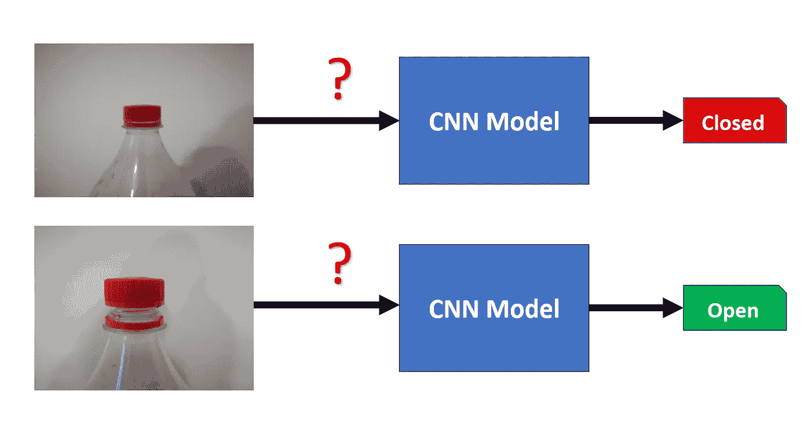

# 用卷积神经网络从零到英雄

> 原文：<https://medium.com/analytics-vidhya/from-zero-to-hero-with-convolutional-neural-networks-d30a5e63a664?source=collection_archive---------14----------------------->

展示如何通过 Python 和 Tensorflow 2.0 轻松使用卷积神经网络(CNN)进行图像分类的实际示例

图像分类是一个起点，也是数据科学想要面对的共同挑战，以便训练模型并让它们像人类智能一样有效。卷积神经网络(CNN)是一种特殊的…