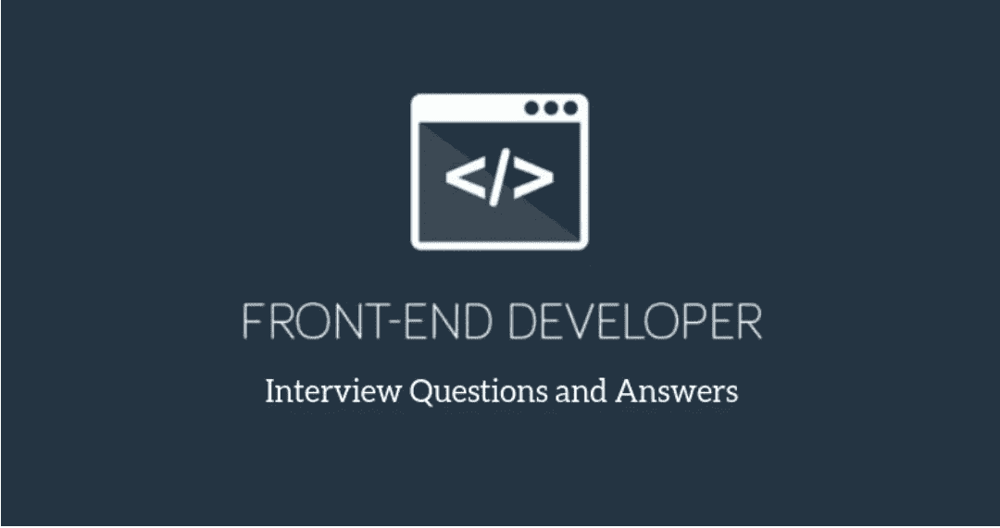

# 前端开发者面试问题(RealLife)不要错过！！

> 原文：<https://medium.com/analytics-vidhya/frontend-developer-interview-questions-reallife-dont-miss-it-92a9dc081a8f?source=collection_archive---------10----------------------->



图片来自谷歌

在这篇文章中，我想和你分享一些我过去的面试问题，这些问题集中在前端领域(HTML，CSS，JavaScript 和 React)。

# **Html**

# **在 HTML5 中定义语义元素？**

**Ans:** 语义元素是 HTML 元素，向浏览器和开发者表示其内容的含义。

**比如** — **p** 标签代表一个段落， **a** 标签代表**锚点标签**，**表单标签**，**表格标签**，**文章标签**等等都是 HTML 中的语义元素。而 **div 标签**、 **span 标签**、 **bold 标签**不是语义元素。

# **HTML 中的行内元素和块级元素是什么？**

**答:**块元素是占据全部可用宽度的块，并且总是从新行开始。它将自己伸展到可用容器宽度的最大可用宽度。块级元素有`<div>, <p>, , <section>`等等。

**行内元素**是那些只占据容器所需宽度的元素。

**例如，**取页面上的文字流向。当文本行占据了容器的整个宽度时，它会自动换行，并以同样的方式再次换行。

然而，内联元素将只占用它们所需的空间或宽度。内联元素有`<span>, <label>, <a>, <b>`等等。

# **说出一些设计页面时常用的列表？**

**Ans:** *有序列表* —有序列表以编号格式显示元素。它由`<ol>`标记表示。

*无序列表* —无序列表以项目符号格式显示元素。用`<ul>`标签表示。

*定义列表* —定义列表以定义形式显示元素，就像在字典中一样。`<dl>, <dt>` 和`<dd>` 标签用于定义描述列表。

# **解释 HTML5 的布局？**

**Ans:** `<header>`:用于定义文件或章节的标题。

`<nav>`:定义导航链接的容器

`<section>`:用于定义文档中的一个节

`<article>`:这是用来定义一个独立的、自成一体的文章

`<aside>`:用于定义内容之外的内容

`<footer>`:用于定义文档的页脚

# **HTML 支持哪种视频格式？**

**Ans:** 视频–MPEG、AVI、WMV、QuickTime、RealVideo、Flash、Ogg、WebM、MPEG-4 或 MP4。

# **CSS**

# 如何在网页上集成 CSS？

**Ans:** 在网页上集成 CSS 有三种方法。

*Inline method* —用于在 HTML 文档中插入样式表

*嵌入/内部方法* —用于为单个文档添加独特的样式

*链接/导入/外部方法* —当您想要在多个页面上进行更改时使用。

# **什么是嵌入式样式表？**

**答:**嵌入式样式表是一种与 HTML 一起使用的 CSS 样式规范方法。您可以使用 STYLE 元素将整个样式表嵌入到 HTML 文档中。

# **CSS 中有多少类型的职位？**

**答:**有五种不同的位置值:

*静态*

*相对*

*固定*

*绝对*

*粘粘的*

# **CSS 中的位置绝对和相对是什么？**

**Ans:***Relative*-元素相对于其正常位置定位。*绝对* —元素绝对定位到其第一个定位的父元素。

# 如何覆盖 CSS？

**Ans:** 通过加这个！重要的可以覆盖 CSS。

# **Javascript**

# **JavaScript 是什么？**

**Ans:** javascript 是一种单线程函数式编程语言。(简而言之)

# **JavaScript 和 Java 有什么不同？**

答:Java 是一种编程语言，而 JavaScript 本质上是一种脚本语言。开发人员使用 Java 构建可以在虚拟机、操作系统或浏览器中运行的应用程序。另一方面，JS 代码只能在浏览器中运行。

# **JavaScript 的一些重要特性？**

**Ans:** 一个轻量级解释了一种编程语言，带有一些面向对象的能力。

一种开放的、跨平台的脚本语言。

补充并集成了 Java 编程语言以及其他后端技术。

专为创建以网络为中心的应用程序而设计。

# **以下代码的输出会是什么？**

```
for (var i = 0; i < 10; i++) {setTimeout(() => {console.log(i);}, 0);}
```

答:九次输出会是 10。如果我们用`let`声明 I 变量，那么输出将是 0 到 9。

# 请解释一下 JavaScript 中的严格模式？

**Ans:** 严格模式给 Javascript 增加了一些强制性。它用于消除一些导致 Javascript 引擎效率下降的代码错误。要启用严格模式，需要在需要以严格模式打开的文件上方添加字符串文字“use strict”。

# **有哪些承诺？**

Ans: 承诺是 JavaScript 中处理异步操作的一种方式。它表示异步操作的值。在承诺我们使用回调之前，我们承诺解决异步代码的执行和处理问题。

# **什么是类？**

**答:**类是 JavaScript 中编写构造函数的新方式。它是使用构造函数的语法糖，它仍然使用原型和基于原型的继承。

# **反转以下代码中的字符串…**

```
function reverse(str) {}console.log(reverse('hello world'));
```

答案如下

```
: function reverse(str) {return str.split('').reverse().join('');}console.log(reverse('hello world')); // dlrow olleh
```

# **ES6 引入了哪些新功能？**

**回答:**ES6 中引入的新功能如下:

Let 和 const 关键字。

默认参数。

箭头功能。

模板文字。

对象文字。

Rest 和 spread 运算符。

析构赋值。

模块，类，生成器。

# **什么是箭头功能，如何创建它？**

**Ans:** 箭头功能是 ES6 中引入的。箭头函数是编写 ES6 函数的简写符号。箭头函数的定义由参数组成，后面是箭头`(=>)`和函数体。箭头功能也被称为“粗箭头”功能**。**

# **讨论 ES6 中的 spread 算子？**

**答:**展开操作符用三个点`(…)` 表示，以获得参数列表。扩展操作符语法类似于 rest 操作符，但功能与之相反。它还用于组合或执行数组之间的连接。

# **做出反应**

# **什么是 React？**

**Ans:** React 是脸书在 2011 年开发的前端 JavaScript 库。它遵循基于组件的方法，这有助于构建可重用的 UI 组件。它用于开发复杂的交互式 web 和移动 UI。

# **React 的主要特点是什么？**

**Ans:**React 的主要特性列举如下:

*它使用虚拟的 DOM 代替真实的 DOM。*

*它使用服务器端渲染。*

*遵循单向数据流或数据绑定。*

# **状态和道具有什么区别？**

**Ans:** 道具和状态都是普通的 JavaScript 对象。属性被传递给组件，类似于函数参数，而状态在组件内被管理，类似于函数内声明的变量。

# **什么时候使用类组件而不是功能组件？**

**答:**如果组件需要状态或生命周期方法，那么使用类组件，否则使用功能组件。然而，从 React 16.8 开始，通过增加钩子，您可以使用状态、生命周期方法和其他只能在函数组件中的类内组件中使用的特性。

# **HTML 和 React 事件处理有什么区别？**

**Ans:** 在 HTML 中，事件名称应该是小写的:

```
<button onclick='activateLasers()'>
```

而在 React 中，它遵循 camelCase 约定:

```
<button onClick={activateLasers}>
```

在 HTML 中，您需要通过追加()来调用函数，而在 react 中，您不应该在函数名后追加()。

# **什么是和解？**

**Ans:** 当组件的属性或状态改变时，React 通过比较新返回的元素和之前呈现的元素来决定是否需要实际的 DOM 更新。当它们不相等时，React 将更新 DOM。这个过程叫做和解。

# 什么是 Jest？

Jest 是由脸书基于 Jasmine 创建的 JavaScript 单元测试框架，它提供了自动化的模拟创建和一个`jsdom`环境。它通常用于测试组件。

# **什么是高阶分量？**

**Ans:** 高阶分量(HOC)是取一个分量，返回一个新分量的函数。这是一种源自 React 组合特性的模式。我们称它们为纯组件，因为它们可以接受任何动态提供的子组件，但不会修改或复制其输入组件的任何行为。HOC 可用于许多用例:

代码重用、逻辑和引导抽象。

*渲染劫持。*

*状态抽象和操作。*

*道具操纵。*

> 就是这样，希望对你有帮助，试着自己给这些问题答案。

快乐编码:)