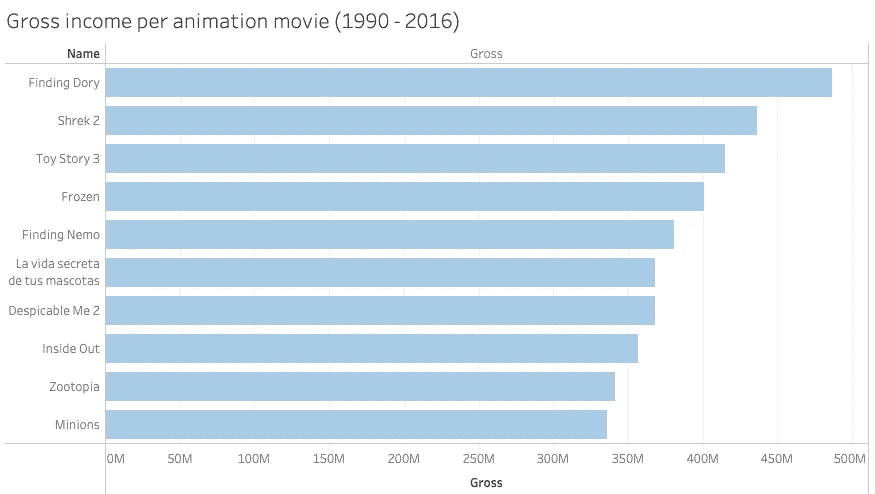
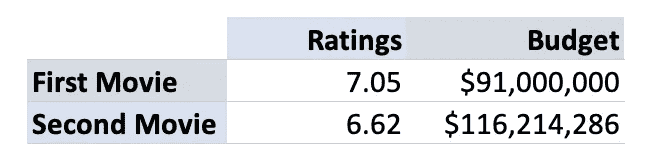
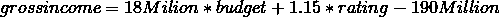
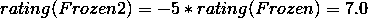
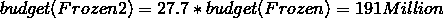
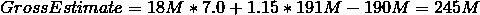

# 冰雪奇缘 2:成功还是失败？

> 原文：<https://medium.com/analytics-vidhya/frozen-ii-success-or-failure-dc43934c7804?source=collection_archive---------20----------------------->

2013 年,《冰雪奇缘》播出后，它迅速成为一种大众现象，并获得了数百万的收入。



从 1990 年到 2006 年的动画电影总收入柱状图——2013 年上映的《冰雪奇缘》,迅速跻身前四。

《冰雪奇缘 2》发布后，现在的问题是:《冰雪奇缘 2》会像第一部一样成功吗？

为了评估它是否会一鸣惊人，我们必须首先定义什么是成功。

出于简化的目的，我们将假设一部**成功的电影**符合以下特征:

*   得分高于 5.0。
*   搬迁产生的收入必须超过投入的预算。

因此，我将研究分数和预算之间是否存在某种关系。

在定义了我的主要问题之后，重要的是说我的分析将基于过去的数据，除了回归线之外，将不使用任何预测工具。

# 续集从来都不好

有传言说'*续集从来都不好*'，因此我们可以估计一下《冰雪奇缘 2》的收视率和预算，考虑到它们从第一部到第二部的变化。

为了做到以上几点，我决定对 1990 年到 2016 年有续集的动画电影进行分析。



包含有续集(第二部电影)的动画电影(1990-2016)的平均评级和预算的表格。

从上图可以看出，第二部电影往往比第一部好，另一方面，预算平均增加了 27.7%。此外，如果你比较第一部电影和第二部电影，收视率会下降 5%。

我们将能够使用这些数字来估计预算和评级的冻结值，因为我现在还不知道它们。

# 预算和毛收入评级之间的关系

这是分析的要点，以探索预算和总收入评级及其强度之间是否存在关系。为了做到这一点，我决定将这一分析局限于 1990 年至 2006 年的动画电影。

我决定用多元线性回归来研究这种关系。



回归线公式。

```
OLS Regression Results                            
====================================================================
Dep. Variable:               gross   R-squared:                0.500
Model:                         OLS   Adj. R-squared:           0.497
Method:              Least Squares   F-statistic:              137.1
Date:             Wed, 27 Nov 2019   Prob (F-statistic):    5.49e-42
Time:                     15:59:36   Log-Likelihood:         -5390.5
No. Observations:              277   AIC:                  1.079e+04
Df Residuals:                  274   BIC:                  1.080e+04
Df Model:                        2                                         
Covariance Type:            nonrobust                                         
====================================================================
             coef    std err          t      P>|t|      [0.025 0.975]
--------------------------------------------------------------------
const      -1.092e+08   3.05e+07     -3.578      0.000   -1.69e+08   -4.91e+07
budget         1.1549      0.074     15.659      0.000       1.010       1.300
score       1.874e+07   4.48e+06      4.181      0.000    9.91e+06    2.76e+07
====================================================================
Omnibus:                       76.104   Durbin-Watson:                   2.165
Prob(Omnibus):                  0.000   Jarque-Bera (JB):              167.787
Skew:                           1.344   Prob(JB):                     3.68e-37
Kurtosis:                       5.705   Cond. No.                     6.37e+08
====================================================================
* **This is an OLS model**
```

如你所见，我决定使用 OLS 模型来研究预算和收视率之间的关系。

根据 OLS 总结，由于系数为正，因此预算和评级之间存在正相关关系。

该模型的唯一问题如下，如果您查看 OLS 快照的 R 平方统计，它相对较低(50%)，这意味着它只能解释 50%的数据。

# 预测时间与现实

在分析了数据之后，我们可以建立一些估计，试图预测冻结 2 总收入的成功。

由于从第一部电影到续集的收视率平均下降 5%，预算平均增加 27.7%，因此冻结值可以随着这些变化而更新。



我将百分比变化应用于冻结评级(7.5)。



我将百分比变化应用于冻结的预算(1 . 5 亿英镑)。

一旦我找到了收视率和预算的估计值，就可以通过在回归线上应用估计的收视率和预算来预测《冰雪奇缘 2》的估计总收入。



《冰雪奇缘 2》的总估价是 2.45 亿英镑。

此时，我能够通过检查现实来检查我的预测是否准确。

事实上,《冰雪奇缘 2》的评分(7.3)比预计值(7.0)高，这部电影迄今为止已经收集了 1.3 亿美元(预计总价值:2.45 亿美元)。无法比较《冰雪奇缘 2》在现实中投入的预算，因为制作方并没有透露这些信息。

这些与我预测的偏差主要是由《冰雪奇缘 2》仍在上映这一事实造成的，因此总收入的总数还没有统计出来，此外还有模型本身的缺陷。该模型的 R 平方为 50%，因此，该模型的预测不会像预期的那样准确。

# 摘要

在这个分析中，我试图评估《冰雪奇缘 2》是成功还是失败，但我遇到了一个很大的限制，那就是我的模型解释力低。