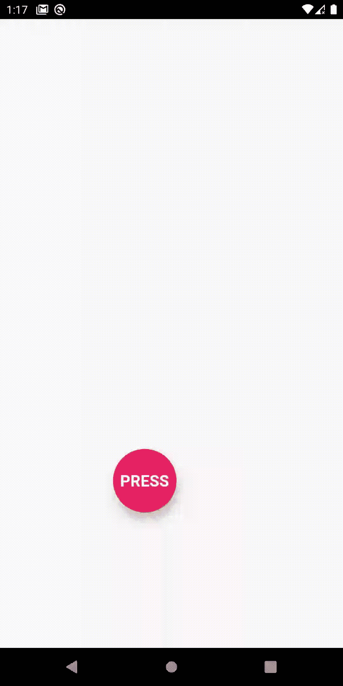
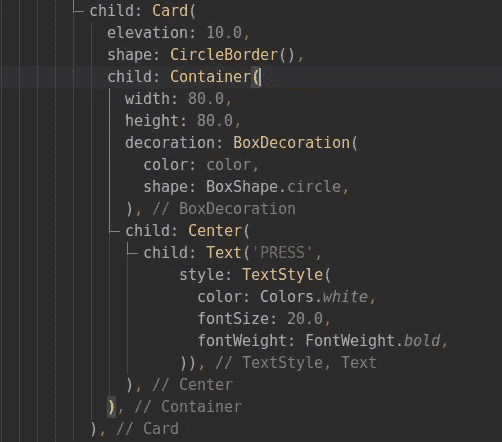
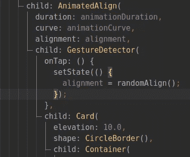
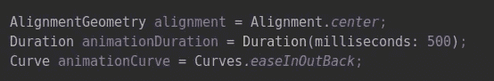
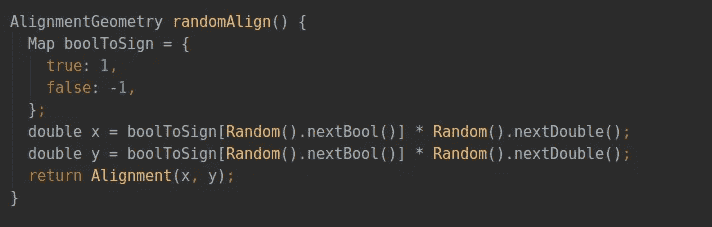
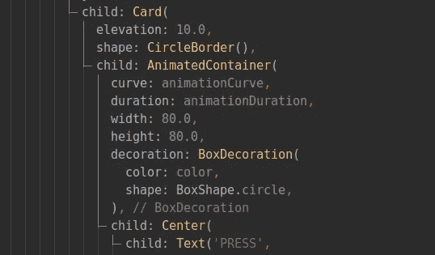
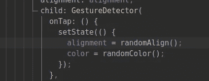
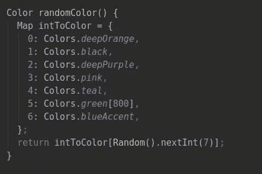

# 有趣的颤动动画—第 1 部分—旋转球动画

> 原文：<https://medium.com/analytics-vidhya/fun-flutter-animations-part-1-carrom-ball-animation-c9d2b6e72528?source=collection_archive---------14----------------------->

我们 **有一个球，点击它会移动到屏幕中的任意位置，并且还会改变它的颜色。**

让我们把它分成几个步骤:

1.  *首先我们需要造球。*
2.  *接下来，我们需要将球移动到一个新的位置。*
3.  *最后，我们还必须改变球被按下时的颜色。*

## 造球

我们使用一个 [**容器**](https://api.flutter.dev/flutter/widgets/Container-class.html) 小部件，为球提供固定的宽度和高度。我们在容器 BoxDecoration 的 shape 参数中传递 Boxshape.circle，使其形状为圆形。我们为***“PRESS”***文本添加一个文本小部件子容器。我们将文本小部件包装在一个中心小部件中，使其在容器中居中。最后，我们将容器包装在一个 [**卡片**](https://api.flutter.dev/flutter/material/Card-class.html) 小部件中，这样我们可以给它一个仰角，使球看起来像是在漂浮。

## 按下时移动球

好了，现在球准备好了，我们如何平稳地移动它呢？

我们将为此使用一个[**animated align**](https://api.flutter.dev/flutter/widgets/AnimatedAlign-class.html)小部件。它类似于 [**Align**](https://api.flutter.dev/flutter/widgets/Align-class.html) 小部件，该小部件采用对齐参数并将子部件相对于父部件对齐。然而，不同的是，如果我们改变小部件的对齐方式，它会将小部件从以前的对齐方式平滑地过渡到新的对齐方式，使小部件看起来像是从一个地方移动到另一个地方。让我们看看这是如何工作的。

首先，我们必须为 AnimatedAlign 小部件提供几个参数:

1.  **持续时间** - > *这是球从一点到另一点所用的时间。*
2.  **曲线** - > *这是球从一点过渡到另一点时所遵循的曲线。默认情况下，它是一条线性曲线。我提供了一个平滑的曲线，让球在移动的时候看起来有点反弹。*
3.  **对准**->-*球的起始对准。*

现在，接下来是我们如何在受压时移动球。很简单，我们将小部件的对齐方式改为新的对齐方式。我们用一个 [**手势检测器**](https://api.flutter.dev/flutter/widgets/GestureDetector-class.html) 小部件包装卡片小部件，并且在它的 OnTap 处理程序中，我们将对齐设置为一个新的对齐，由 randomAlign()函数确定。

现在让我们看看 randomAlign()函数的作用。

每次调用该函数时，我们都返回一个新的 x 和 y 坐标的对齐方式。(x，y)是从-1.0 到 1.0 的双精度值。其中(-1.0，-1.0)是屏幕的左上方，(1.0，1.0)是屏幕的右下方。所以我们需要给 x 和 y 分别赋一个-1.0 & 1.0 之间的随机值。

我们使用 Random()。nextDouble()函数获得一个介于 0 和 1.0 之间的随机 Double 值

然后，我们使用 Random.nextBool()获得一个随机 Bool 值(true 或 false ),然后将它放入 boolToSign 映射中，该映射将 bool 值映射为+1 或-1。

然后将上述两个随机值相乘，我们将得到一个介于-1.0 和 1.0 之间的随机值

## 3.改变颜色

这是容易的部分。

首先用一个 [**动画容器**](https://api.flutter.dev/flutter/widgets/AnimatedContainer-class.html) 小部件替换容器小部件，并填充曲线、持续时间&颜色参数。

接下来，在 onTap 处理程序中，也使用 randomColor()函数将颜色设置为新颜色。

randomColor()函数使用 Random()。nextInt(7)函数获取 0 到 6 之间的随机整数。然后，它将该值传递给 intToColor 映射以获取颜色。

**万岁！！！一切都搞定了。按住球，看它移动。**

> F 或者完整的代码请参考我这里的 github 回购:[https://github.com/realdiganta/fun-flutter-animations](https://github.com/realdiganta/fun-flutter-animations)

要了解更多关于 Flutter 中动画的信息，请参考以下链接:

1.  [*隐式动画中的颤动*](https://flutter.dev/docs/codelabs/implicit-animations)
2.  [*颤动动画库*](https://api.flutter.dev/flutter/animation/animation-library.html)
3.  [*动画简介*](https://flutter.dev/docs/development/ui/animations)

> 如有任何问题，请联系我:digantakalita.ai@gmail.com

## 我会在这个系列中加入新的古怪有趣的颤动动画文章。因此，要获得直接更新，请在 medium 上关注我或在 github 上启动我的回购。谢谢你。