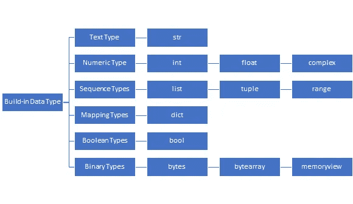
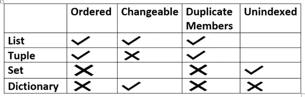
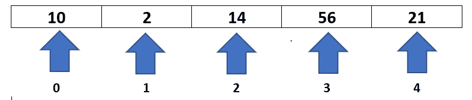
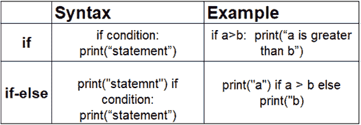

# Python 的乐趣:从零到一

> 原文：<https://medium.com/analytics-vidhya/fun-with-python-from-zero-to-one-915ec0c7898a?source=collection_archive---------14----------------------->

## 从简单的语法开始，让字符串操作充满乐趣。

卢卡斯·布拉塞克在 [Unsplash](https://unsplash.com?utm_source=medium&utm_medium=referral) 上的照片

本文旨在讨论 Python 编程语言基础的所有关键特性。我的目标是保持信息**准确、精确、易懂、简短，并专注于关键点以便更好地理解。**

看完这篇博客后，你将能够非常容易地实现 Python。

你不需要任何 python 编程的先验知识，很容易理解这个概念。

**我为什么选择 python？**

*   为我选择 python 是一个简单的决定，因为我不擅长记住语法。Python 是最容易学习的语言，也容易为复杂的问题编写代码。
*   使用 python 很容易，因为我们可以在 web 开发、数据科学、机器学习、深度学习等领域使用 python。

# 1.python 简介

**Python 的 3w 的& H？**

**python 是谁创造的？**

*   世界上最有影响力的程序员**吉多·范·罗苏姆**在 1991 年创造了 python，强调代码的可读性，它的语法允许程序员用更少的代码行表达概念。

**我们为什么需要学习 python？**

*   Python 是一种高级的面向对象的动态类型脚本语言。
*   Python 是最流行的语言，因为它很容易编写和理解代码。
*   事实上，与 C#/Java 等其他语言相比，将 Python 程序推向市场需要更少的时间。
*   Python 有不同的库，我们可以在机器学习和数据科学中使用。
*   有大量的在线资料和书籍可以用来支持 python 开发人员。

**哪里可以用 python？**

*   开发桌面 GUI 应用程序，
*   web 开发
*   游戏开发
*   web 报废应用程序
*   音频和视频应用
*   商业智能
*   数据分析等

**python 是如何工作的？**

*   这里解释器将高级 python 语言翻译成低级机器语言。
*   在安装库的地方创建一个 python 虚拟机。
*   Python 代码然后被写入一个. py 文件。
*   CPython 将 Python 代码编译成字节码。这个字节码是用于 Python 虚拟机的。

# 2 .基础知识

## 变量

*   简单来说，把变量想象成存储信息。这些信息可以是任何类型的，例如 int、float、string、collection 等。在 python 中，给变量赋值毫不费力。
*   python 的基本概念是，在 python 中，一切都是对象。
*   像任何其他语言一样，我们不需要编写后跟变量名的数据类型，因为数据类型本质上是动态的。
*   现在假设你想在一个名为“x”的变量中存储 10 个数字

让我们看看它是如何做到的:

## **数据类型**

该图表显示了数据类型的构建。

# 3.收藏品

*   简单来说，python 中的集合是存储列表、集合、元组、字典等数据集合的容器。
*   这些是内置的集合。
*   让我们仔细看看列表、元组、集合和字典中的属性。

下面的图表显示了我们可以使用列表、元组、集合和字典的不同属性。

## **列表**

*   列表写在方括号中。
*   列表可以包含多种类型的数据类型元素，如 int、float、string
*   **负索引**意味着元素将从末端(右侧)被选择。
*   -1 表示最后一项，-2 表示倒数第二项。
*   **索引范围**意味着我们可以通过告诉从哪里开始到哪里结束来指定一个索引范围。

下面的代码显示了我们如何通过负索引和正索引以及一系列索引来访问元素。

## 元组

*   元组用圆括号写。我们不能像改变列表一样改变元组。
*   下面的代码显示了我们如何通过负索引和正索引以及一系列索引来访问元素。

我们可以在元组上实现的一些基本功能，如元素的删除、索引、切片。

## 一组

集合写在大括号中。

下面的代码显示了我们如何通过负索引和正索引以及一系列索引来访问元素。

我们可以对集合执行其他功能，包括添加、更新、删除、弹出和删除项目。

*   **add()** 方法将向 set 中添加一个元素。
*   **update()** 方法将向 set 中添加多个项目。
*   方法将从集合中删除一个项目。
*   方法将从集合中删除最后一个元素。
*   方法将清空集合。
*   **del** 关键字将完全删除整个集合。

**字典**

*   字典是键值对的集合。
*   关键是指向值的索引。我们可以通过键访问字典值。

让我们看看它是如何做到的:

我们可以在字典上执行的其他功能有 add()、remove()、change()、clear()、copy()、del 等。

*   **add()、remove()、clear()、del()** 方法具有与上述集合中相同的功能。
*   方法将通过引用一个特定项的键名来改变它。
*   方法将创建一个 dict 的精确副本。

# 4.控制流程:

“if”用于检查给定的条件是真还是假。如果为真，那么它执行 If 语句中的内容。

让我们看看它是如何做到的:

这里条件为真，所以 if 语句将执行。

只有当条件为假时，才会执行**“else”**语句

让我们看看它是如何做到的:

这里的条件为假，因为 10 不大于 20，所以语句将执行。

当有多个条件时，我们也可以使用**“elif”**语句。

让我们看看它是如何做到的:

## 嵌套 if-else

嵌套 if-else 意味着在另一个 if-else 中有 if-else。

为了避免混淆，在嵌套的 if-else 中使用适当的缩进。

让我们看看它是如何做到的:

因为数字是 10，所以首先检查数字是否大于零，然后进入下一个 if 条件，将数字与零进行比较，如果条件为假，则执行 else 语句。

# 5.速记:

*   我们使用速记语句，这样我们可以写更多的逻辑和更少的语句。
*   为了更好地理解，这里有一个表格，其中有如何使用速记的语法和例子。

只有 Python 程序员才懂的专家！

## **6。循环:**

在 python 中，我们可以用不同的形式循环:

**"for"** 循环用于迭代一个序列。

在这里，range()函数默认将值递增 1；如果应用任何其他值，如 3，那么增量将为 3 个值或-1，那么减量将为-1 倍。

让我们看看它是如何做到的:

**“While”**循环将被执行，直到条件变为假。

让我们看看它是如何做到的:

这里记住增加 I 的值，否则循环将永远执行下去。

# 7.字符串函数

下面的代码是内置字符串函数的最常见用法。

*   lower():以小写形式返回字符串
*   upper():以大写形式返回字符串
*   replace():返回替换值的字符串
*   split():将字符串拆分成子字符串
*   capitalize():将第一个字符转换为大写 center()返回一个居中的字符串
*   count():返回指定值在字符串中出现的次数
*   find():在字符串中搜索特定的值，然后返回找到它的位置

## 限幅

*   Python 切片就是从给定的字符串中找到一个子串，从开始到结束分别用。
*   切片有两种方式

1.  **slice()构造函数**

**语法:**

切片(开始、停止、步进)

切片(停止)

**参数:**

*   **开始**:从将要进行切片的地方开始索引。
*   **停止:**从切片位置停止步进
*   **步长:**可选参数，决定切片各指标之间的增量

让我们看看它是如何做到的:

这里借助于切片构造器的起点是 1，终点是 5，增量为 2。

负索引的切片构造函数，起点和终点分别为-1 和-12，步长为-2。

**2。扩展索引**

在 python 中，索引语法可用于切片对象。

语法:string[开始，结束，步骤]

让我们看看它是如何做到的:

# 8.功能

*   该函数是一个有组织的、可重用的代码块，仅在被调用时运行。
*   这个函数是使用 def 关键字定义的，要调用一个函数，只需使用函数名后跟一个括号。
*   函数中可以传递多个参数，用逗号分隔即可。
*   函数有助于将我们的程序分成更小的模块。
*   它还避免了重复，并使代码可重用。
*   语法:

定义函数名(参数):

陈述

*   函数可以有两种类型。

1.  **内置函数:**python 中内置的函数
2.  **自定义功能:**用户自定义的功能

用户定义的函数分为 4 个函数:

1.  **必需参数**

*   必需的参数是按照正确的位置顺序传递给函数的参数。这里，函数调用中的参数数量应该与函数定义完全匹配。

2.**默认参数**

*   默认参数的主要用途是在调用函数时不使用参数的情况下选择默认参数。

让我们看看它是如何做到的:

3 .**基于关键字的参数**

*   如果我们不知道在一个函数中要使用多少个参数，我们可以在函数定义中的参数名前使用' ** '。
*   在 python 中，任意关键字参数通常被缩短为 **kwargs**

让我们看看它是如何做到的:

4.**可变长度参数**

*   在变长参数中，我们需要处理一个函数的参数比你在定义函数时指定的要多。
*   在包含所有非关键字变量参数值的变量名前加一个*

让我们看看它是如何做到的:

这里我们不知道会有多少爱好，所以我们把*放在爱好前面。所以调用这个函数现在很容易了。

# 9.希腊字母的第 11 个

*   最有效的函数是 lambda，因为通过编写更少的代码，问题就解决了。
*   人们可以在需要函数对象的任何地方自由使用 lambda 函数。
*   lambda 的主要用途是当我们在另一个函数中作为匿名函数使用它们时。
*   在 lambda 函数中，我们可以使用任意多的参数，但只能有一个表达式。

让我们看看它是如何做到的:

第一函数值增加 1。

我们只能在一行中将操作赋给多个变量，这只能通过使用 lambda 函数来实现，这有助于最小化编写代码的时间。

**λ函数**

让我们看看它是如何做到的:

这里有两个不同的函数，其中一个函数的 x 值是 4，另一个是 3，但是 a 值没有改变，只有 2。

我们可以在 lambda 函数的帮助下将这两个函数组合成一个函数，这将产生高效的代码并提高速度。

# 地图()

内置函数 map()将函数作为第一个参数，并将其应用于第二个参数的每个元素，int、strings、tuples **。**

map()函数更加灵活和简单。

让我们看看它是如何做到的:

这里使用 map()函数，所有的元素都将转换成大写，而不用为每个函数编写相同的代码。

# 过滤器()

*   该函数应用于特定元素。
*   过滤器传递函数中的每个元素，并且只返回那些具有真值的元素。

# 10.将 lambda()与 map()、filter()一起使用

*   众所周知，lambda 关键字用于创建匿名函数。
*   python 中的 map()函数接受一个函数和一个参数列表。在列表中完成所有修改后，将返回一个新列表。
*   python 中的 Filter()函数接受一个函数和一个参数列表。将返回一个新列表，其中包含具有 true 条件的元素。

在第一个例子中，所有的元素都将在 map()和 lambda()的帮助下转换成小写。

在第二个例子中，只打印奇数元素。

## 就是这样！

**这个博客分为不同的子部分。**

1.  Python 简介
2.  基础
3.  集合(列表、元组、集合、字典)
4.  控制流(if，if-else，if-elif-else，嵌套 if-else)
5.  速记
6.  循环(for，while)
7.  串函数
8.  函数(必需、默认、关键字和变量参数)
9.  λ/贴图/过滤器
10.  将 lambda()与 map()和 filter()一起使用

## 参考

 [## 如何使用 Python Lambda 函数——真正的 Python

### 参加测验“Python 和其他编程语言中的 lambda 表达式源于 Lambda 演算，是一种……

realpython.com](https://realpython.com/python-lambda/#alternatives-to-lambdas)  [## Python Lambda

### lambda 函数是一个小型的匿名函数。lambda 函数可以接受任意数量的参数，但只能有…

www.w3schools.com](https://www.w3schools.com/python/python_lambda.asp)  [## Python lambda(匿名函数)|过滤、映射、归约- GeeksforGeeks

### 在 Python 中，匿名函数意味着函数没有名字。正如我们已经知道的，def 关键字用于…

www.geeksforgeeks.org](https://www.geeksforgeeks.org/python-lambda-anonymous-functions-filter-map-reduce/) 

**我希望你喜欢这个内容。支持我的工作！**