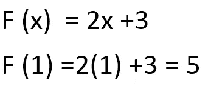
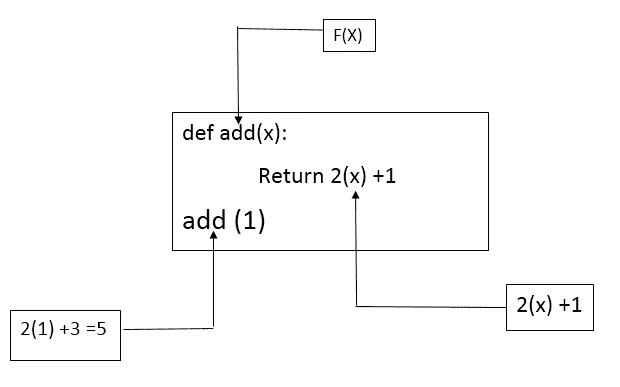
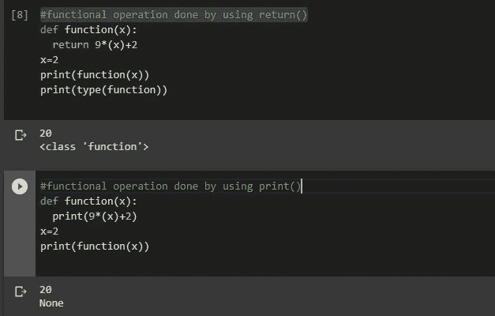
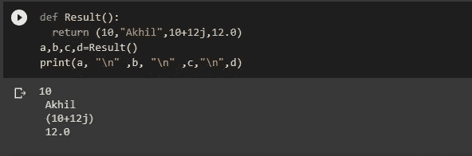
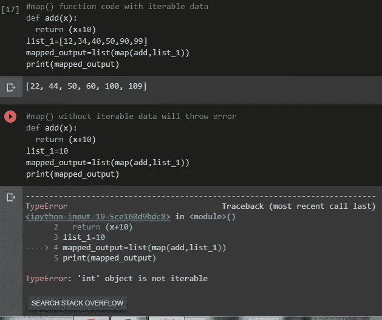
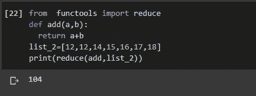
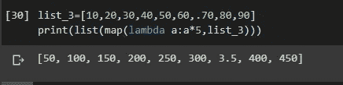
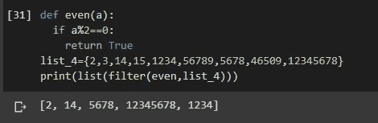

# Python 中的函数

> 原文：<https://medium.com/analytics-vidhya/function-in-python-a73f0b44c3e4?source=collection_archive---------23----------------------->


来源: [-IMGC](https://www.google.com/search?q=writing+code&sxsrf=ALeKk03Q2-IfHz-9SbF0b5ZhgqtX7dwS_A:1596873686321&source=lnms&tbm=isch&sa=X&ved=2ahUKEwi45cuGkovrAhWgzTgGHRubD-MQ_AUoAXoECBAQAw&biw=1366&bih=625#imgrc=74FHDQSF4yhOIM)

> 什么是功能？

功能是一组有组织的可重复使用的代码，用于执行单个相关动作。它在不同的情况下有不同的名字。例如，在 oops 中，它被称为方法，在某些编程语言中，它也被称为子程序。

> 如何定义函数(带自变量的函数)？



图:-1

我在图-1 中取了一个数学方程式，并试图通过与上图相关来理解函数。



图:-2

`def` keyword 是一个内置的关键字，定义了用户将要使用的功能。如果我们看到图:-2，我们将观察到数学方程的`F(x)`隐含着`add(x)` 。数学方程的 `2(x)+1`意味着从函数`return 2(x)+1`返回输出值。数学方程的`F(1)`代表自变量的函数调用，即 `add(1)` 。

```
#understanding code 
def add(x):
    return 4(x)+5
add(4)[out]>> 21
```

> 没有参数的函数？

让我们来看一个数学方程；

## y = 5 ………( 1)

如果我们将看到方程(1)“Y”没有被定义为“x”的函数，这意味着在数学方程“Y”中不存在任何自变量。当我们将这个数学方程写成函数形式时，在 python 函数中不存在任何自变量，python 函数被称为无任何自变量的函数。

```
# coding of function without argument
def Result():
    return 100
Result()[out]>> 100
```

> `print()` vs `return()`哪个应该带功能？

当我们在函数中使用`print()`时，它给出的返回类型是 NoneType，因此我们不能使用`print()`进行原始操作。但是当涉及到`return()`时，它理解用户的数据并返回用户已经采用的相同数据类型，它执行原始操作。



注:-在我看来`return()`是功能操作的最佳选择。

> 返回多值

我们可以使用单个函数返回多个值。



> `map()`、`reduce()`、`lambda()`、`filter()` ？


来源:-[123RF.com](https://www.google.com/search?q=mountain+and+river&sxsrf=ALeKk028uQjaKOYHkm0v_mss8_zHwqGqhA:1596880022621&source=lnms&tbm=isch&sa=X&ved=2ahUKEwiH7PzTqYvrAhVTxzgGHbrsCT8Q_AUoAXoECBUQAw#imgrc=WI2nvdrfeU5doM)

`map(fun,iter)`这里的`fun` 是将要执行操作的函数，`iter`是要执行函数的数据，数据应该是可迭代的。如果我们不接受可迭代数据，它将抛出 TypeError。



`reduce()`它的论证和论证性质也将类似于`map()`函数。它用于聚合操作。



`lambda()`它就是俗称的匿名函数，我们不需要给出函数的名字，只需要做操作就可以了。



从 iterable 对象中过滤出元素。只有当函数(将对其执行操作)应该返回真值时，它才会执行操作。



如果你想知道如何创建你自己的 reduce 和 filter 函数，那么去这个[链接](/@akhilanandkspa/creating-own-reduce-and-filter-function-in-python-7e157c899532)。

参考资料:

[tutorialpoint](https://www.tutorialspoint.com/index.htm) ， [google colab](https://colab.research.google.com/notebooks/intro.ipynb#recent=true) ， [iNeuron](https://ineuron.ai/)