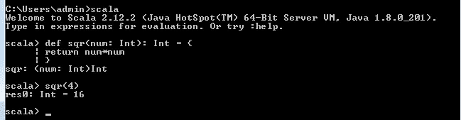

# Scala 中的函数式编程

> 原文：<https://medium.com/analytics-vidhya/functional-programming-aspects-in-scala-3de975f9e3f2?source=collection_archive---------16----------------------->

函数式编程(FP)是一种编写计算机程序的方法，作为数学函数的评估，它避免改变状态或突变数据。这些程序是用纯函数构造的。函数式程序总是声明性的，用声明和表达式而不是语句来编程。


照片由 [Unsplash](https://unsplash.com?utm_source=medium&utm_medium=referral) 上的 [Dmitry Ratushny](https://unsplash.com/@ratushny?utm_source=medium&utm_medium=referral) 拍摄

函数式编程语言分为两类:
**1 .纯函数
2。不纯函数**

> P **ure 功能？**
> 
> 没有副作用的函数叫做纯函数。那么，副作用是什么呢？如果一个函数除了返回一个结果之外，还做了以下任何一个*操作，那么这个函数就被认为有副作用:*
> ·修改一个现有的变量。
> 读取文件或写入文件。
> 修改数据结构(如数组、列表)。
> 修改对象(设置对象中的字段)。
> 纯函数的输出仅取决于传递给该函数的输入参数。pure 函数对于相同的输入参数总是给出相同的输出，不管它被调用了多少次。不纯函数每次被调用时都会给出不同的输出，并且函数的输出不仅仅依赖于输入参数。



我用 [**REPL**](https://codewith.mu/en/tutorials/1.0/repl) 命令来举一个纯函数的例子

**下面是一些纯函数的典型例子:**
数学函数，如加、减、除和
乘。
字符串类方法，如 length、toUpper 和 toLower。

*这些 Scala 字符串方法也是纯函数:
isEmpty
length
substring*
**这是一些不纯函数的典型例子:**
生成随机数的函数。
日期方法，如 getDate()和 getTime()，因为它们根据被调用的时间返回不同的
值。

下面是适合使用纯函数的例子:
*它们不会引起输入的任何隐式变化。
*它们更容易测试。
*它们很容易调试。

> **注意:-** 函数的最后一条语句在 Scala 中始终是一条 return 语句。因此，没有必要显式指定 return 关键字。在 Scala 中，不需要分号来指定语句的结尾。默认情况下，换行符(\n)被视为语句的结尾。但是，如果要在一行中写入多个语句，则需要使用 asemicolon。

**Scala 中的不纯函数？**

所有不纯的函数都是不纯的。这使得不纯函数的定义成为**“一个依赖于 i/o 或其他超出函数范围的值以及参数值的函数。”**

**示例:常数乘数:-**

```
**object** **MyObject** {
    **val** constant **=** **12.4**;
    **def** constantMul(value**:Int**)**:** **Double** = {
        **val** result **=** value*constant; 
        **return** (result);
    }

    **def** main(args**:** **Array**[**String**]) {
        println("The result of constant multiplier is: " + constantMul(**34**))
    }
}
```

**输出:**

```
The result of constant multiplier is: 421.6
```

在上面的代码中，我们创建了一个 *constantMul()* 函数，该函数接受一个乘以对象中定义的值的参数值，即依赖于函数范围之外的值。

感谢阅读我的帖子:)

要理解 Scala 语言的基础，你可以参考我之前的文章

[](/@duke.lavlesh/scala-basics-ace1dccd72f8) [## Scala —基础:-

### 在这一节，我们将回顾 Scala 编程语言的基础。在整个博客中，我们将…

medium.com](/@duke.lavlesh/scala-basics-ace1dccd72f8)