# Python 中的函数很有趣

> 原文：<https://medium.com/analytics-vidhya/functions-44d437906a58?source=collection_archive---------17----------------------->

## Python 编程

在您的程序 中，经常会出现某段代码 ***重复多次的情况。它或者是字面上的重复，或者只有一些小的修改，包括在同一算法中使用其他变量。还会发生这样的情况，程序员无法抗拒简化工作，并开始使用剪贴板和复制粘贴操作来克隆这样的代码片段。当突然发现克隆的代码中有错误时，可能会非常令人沮丧。程序员将有很多苦差事去寻找所有需要改正的地方。更正导致错误的风险也很高。***

我们现在可以定义第一个条件，它可以帮助您决定何时开始编写您自己的函数: ***如果代码的某个特定片段开始出现在多个地方，请考虑以函数*** 的形式将其隔离的可能性，该函数是从之前放置原始代码的地方调用的。

一个好的细心的开发人员**将代码**(或者更准确地说:问题)分成隔离良好的片段，并且**以函数**的形式对它们进行编码。

我们现在可以陈述第二个条件: ***如果一段代码变得太大，以至于阅读和理解它可能会产生问题，那么可以考虑把它分成单独的、更小的问题，并以单独函数的形式实现每一个问题。***

经常发生的情况是，问题是如此之大和复杂，以至于它不能被分配给一个单独的开发人员，一个开发人员团队不得不去解决它。这个问题必须由几个开发人员分担，以确保他们高效、无缝的合作。

这直接把我们带到了第三个条件:如果你要把工作分配给多个程序员， ***分解问题，让产品被实现为一组单独编写的功能，打包在不同的模块中。***

> **函数从何而来？**

通常它来自三个地方，

*   来自 python 本身
*   来自 python 的**预装模块**
*   **直接来自你的代码**

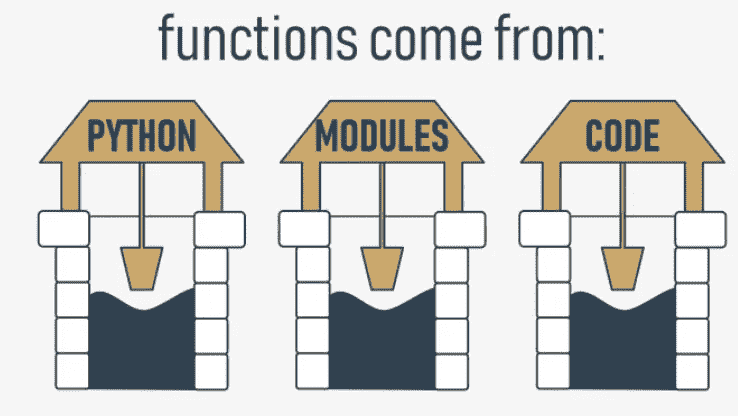

> **怎么做出这样的函数？**

这是最简单的函数定义:

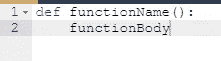

*   它总是以**关键字** `def`开始(对于*定义*)
*   在`def`之后是函数的**名称(命名函数的规则与命名变量的规则完全相同)**
*   在函数名之后，有一对**括号**(这里它们什么也不包含，但是很快就会改变)
*   该行必须以冒号**结尾**；
*   紧接在`def`之后的一行开始**函数体**——一对(至少一个)必要的**嵌套指令**，每次调用函数时都会执行；注意:**函数在嵌套结束**的地方结束，所以你必须小心。

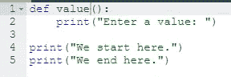

注意:我们根本不使用这个函数——在代码中没有对它的**调用。**

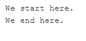

运行它时，您会看到以下输出:

这意味着 Python 读取了函数的定义并记住了它们，但是没有你的允许不会启动它们。

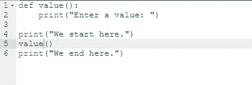

我们现在已经修改了代码——我们已经在开始和结束消息之间插入了**函数的调用**:

现在输出看起来不同了

> **函数如何工作？**

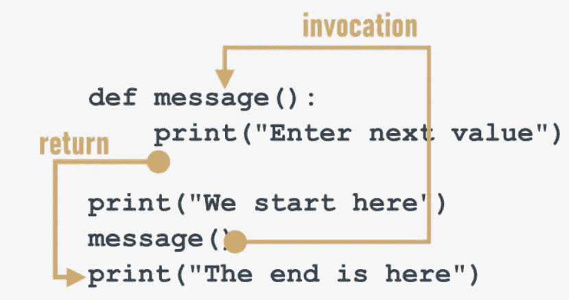

*   当你**调用**一个函数时，Python 会记住它发生的地方，*会跳转到被调用的函数中；*
*   然后执行函数的主体**；**
*   到达函数的末尾会强制 Python 将**返回到调用点之后的位置。**

有两个非常重要的条件。这是其中的第一个:

你不能调用一个在调用时未知的函数。

# 记住——Python 从上到下阅读你的代码。它不会为了找到一个忘记放在正确位置的函数而向前看(“正确”的意思是“在调用之前”)。)

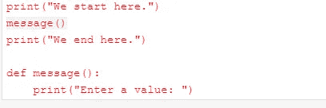

不要试图强迫 Python 去寻找你没有在正确的时间交付的函数。

第二个条件听起来稍微简单一点:

# **不能有同名的函数和变量。**

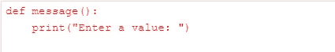

给名称消息赋值会导致 Python 忘记它以前的角色。名为`message`的功能变得不可用。

当该函数可以配备一个能够接受调用者提供的数据的接口时，它的全部功能就显现出来了。这些数据可以修改函数的行为，使其更加灵活，更能适应不断变化的条件。

参数实际上是一个变量，但有两个重要因素使参数不同且特殊:

*   **参数只存在于已经定义了参数的函数内部**，唯一可以定义参数的地方是`def`语句中一对括号之间的空格；
*   **在函数调用**时，通过指定相应的参数来为参数赋值。

记住:**在函数定义**中指定一个或多个参数也是一个需求，您必须在调用期间完成它。您必须**提供与定义的参数**一样多的参数。

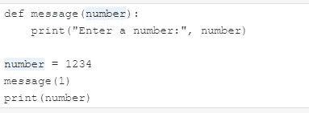

这个片段说明了这种现象

像这样的情况会激活一个叫做**阴影**的机制:

*   参数`x`隐藏任何同名的变量，但是...
*   …仅在定义参数的函数内部。

**名为** `number` **的参数与名为** `number`的变量是完全不同的实体。

一个函数可以有任意多的参数，但是参数越多，就越难记住它们的作用和目的。

前面介绍的所有函数都有某种效果——它们产生一些文本并将其发送到控制台。

当然，函数——就像它们的数学兄弟一样——可能会有结果。

为了让**函数返回一个值**(但不仅仅是为了这个目的)，你可以使用*返回*指令。

**注意:如果一个函数不打算产生结果，使用** `**return**` **指令不是必须的——它将在函数结束时隐式执行。**

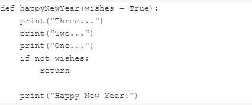

无论如何，在控件到达函数的最后一行之前，您可以用它来按需终止函数的活动。

尝试提供 **False** 作为参数，并查看结果:happyNewYear(False)

**别忘了:**

*   你总是**被允许忽略函数的结果**，并对函数的效果感到满意(如果函数有任何效果的话)
*   如果一个函数想要返回一个有用的结果，它必须包含`return`指令的第二个变体。

> **说几句不关**

下面给大家介绍一个很好奇的值(说实话是一个 none 值)名叫 **None** 。

它的数据不代表任何合理的价值——实际上，它根本不是一个价值；因此，它**不能参与任何表达式**。

只有两种情况下`None`可以安全使用:

*   当你**把它赋给一个变量**(或者把它作为**函数的结果**返回)
*   当你**将其与一个变量**进行比较，以诊断其内部状态。

就像这里一样:

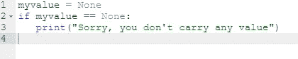

**不要忘记这一点:如果一个函数没有使用 return expression 子句返回某个值，则假定它隐式返回** `**None**` **。**

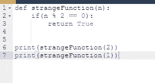

下次你看到函数结果`None`时不要感到惊讶——这可能是函数内部一个细微错误的征兆。

Python 可识别的任何实体都可以扮演函数参数的角色，尽管必须确保函数能够处理它。

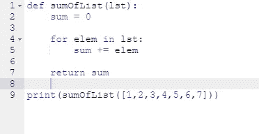

Python 可以识别的任何实体都可以是函数结果。

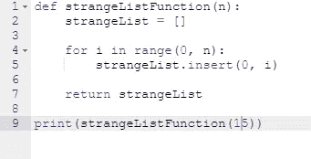

**存在于函数外部的变量在函数体内有一个*作用域*，不包括那些定义同名变量的函数。**

这也意味着存在于函数之外的变量的**范围只有在获取其值**(读取)时才受支持。赋值会强制创建函数自己的变量。

希望你现在已经回答了下面的问题:*这是否意味着一个函数不能修改在它之外定义的变量？*

有一个特殊的 Python 方法可以**扩展一个变量的范围，包括函数体**(即使你不仅想读取值，还想修改它们)。这样的效果是由一个名为`global`的关键词造成的

在带有变量名称(或用逗号分隔的名称)的函数中使用该关键字，可以强制 Python 避免在函数中创建新变量——将使用可从外部访问的变量。

换句话说，这个名字变成了全局的(它有一个**全局范围**，它是 read 还是 assign 的主题并不重要)。

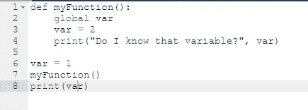

这应该是足够的证据来表明`global`关键字确实实现了它的承诺。