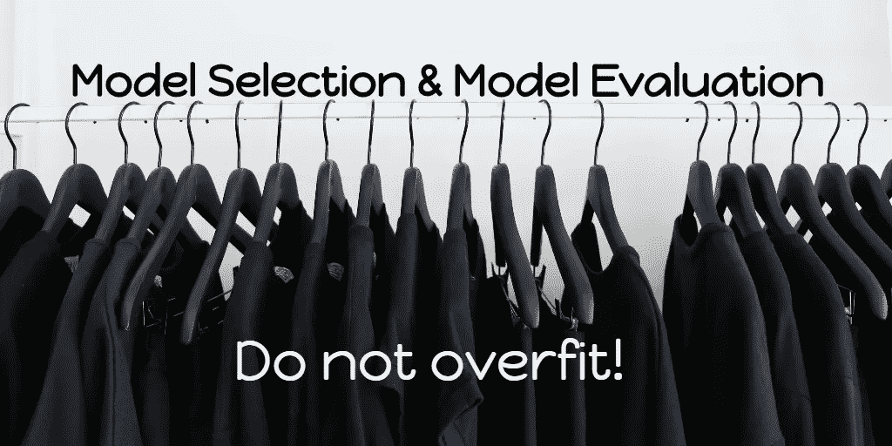
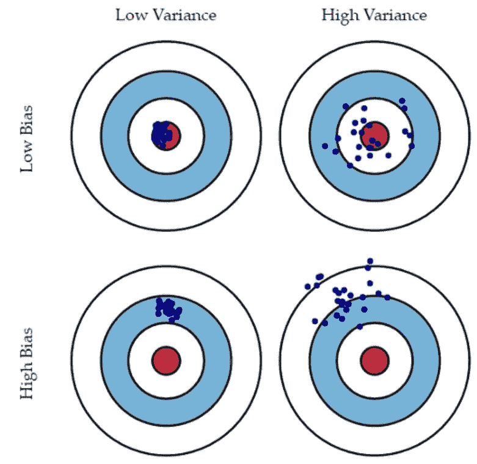
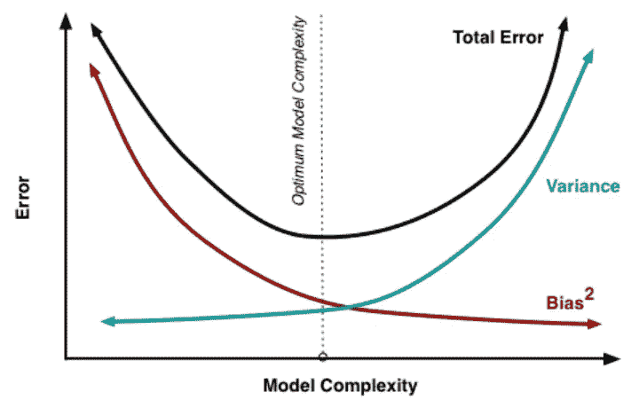
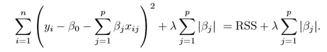

# 模型选择和模型评估的基本概念—第一部分

> 原文：<https://medium.com/analytics-vidhya/fundamental-concepts-for-model-selection-and-model-evaluation-part1-b91f78efaea0?source=collection_archive---------14----------------------->

## 解决机器学习中心问题的核心概念背后的直觉。

Unsplash 上创意交流的照片

本文将涵盖对所有机器学习问题至关重要的基本概念和原则，这些概念和原则可能对每个问题都有用，正确理解这些概念对于解决机器学习中的核心问题是必要的，这个问题就是— ***“如何通过从我们拥有的有限数据中学习来很好地概括看不见的数据。”***

先说— **车型选择&车型评估。**

**模型选择**是在不同的数据建模学习算法之间进行选择的过程，为了解决分类问题，可以在逻辑回归、SVM、基于树的算法等之间进行选择。对于一个回归问题，还需要对线性回归算法的程度进行决策。

**模型评估**旨在检查我们模型的泛化能力，即我们模型在未知数据集上表现良好的能力。评估我们的模型有不同的策略，我们将在本文的下一部分中介绍。

> 模型评估是检查模型性能的过程，以查看我们的模型能够在多大程度上解释数据，而模型选择是查看我们描述数据所需的灵活性水平的过程。

## 我们将在本文中讨论以下概念

*   奥卡姆剃刀原理
*   模型的简单性和复杂性
*   过度拟合
*   偏差-方差权衡
*   正规化

## **奥卡姆剃刀原理**

> 有两个假设(这里是决策边界)具有相同的经验风险(这里是训练误差)，一个简短的解释(这里是参数较少的边界)往往比一个长的解释更有效。

你可以把机器学习中的奥卡姆剃刀原理看作是一条经验法则，它告诉你无论何时你有多种选择的时候，总是选择最简单的一个。

但是选择一个简单的模型意味着什么？

## **简单&复杂**

模型的简单性通常通过定义模型的复杂性来理解。让我们打个比方来理解它们。

假设一个班里有两个学生——学生 A 和学生 B，让我们考虑他们有不同的学习方式，如下所述:

**学生 A** 对掌握概念很感兴趣，他对学科的高层次了解很清楚，并且他能自如地用简单的术语解释概念。但是他记不住，甚至连一个简单的公式也记不住。

学生 B 对得分更感兴趣，他更喜欢记忆而不是理解，他解决了多本书上的所有问题。

我们可以说他们有不同的学习心智模式。

根据他们不同的学习风格，学生 A 比学生 B 更擅长解决新的看不见的问题，而学生 B 更擅长得分，因为他记住了大多数问题/公式，这里学生 A 将很难得分(考虑到考试是有时间限制的，他将如何在推导公式的同时按时解决问题，而不是他可以记住它以节省时间)。

一个理想的学生应该是这样一个人，他的学习风格介于学生 A 和学生 B 之间，这样他就能体面地得分，还能解决看不见的问题。

同样的事情也发生在机器学习模型上，如果我们的模型太简单，那么它没有学习到足够的模式来给你一个好的分数，但我们可以用一个记住所有模式的复杂模型来获得好的分数，但这个复杂模型将无法对看不见的数据进行很好的概括。在机器学习中，我们把这种现象称为 ***过拟合*** (我们很快就会谈到这个话题)

我希望您已经了解了简单和复杂模型的行为方式，但是从技术上讲，我们什么时候可以说一个模型是简单的或复杂的，或者什么因素决定了它们的复杂性？

以下是线性回归的一些例子:

*   完全解释我们的模型所需的参数数量，即在我们有 x1、x2、x3 预测值的情况下预测 y——模型`y = ax1 +bx2`比模型`y = ax1 +bx2 +cx3`简单，后者需要 3 个参数，而第一个模型需要 2 个参数。
*   函数的次数，如果它是多项式，那么与`y = ax1+bx2+cx3`相比，模型`y = ax1² +bx2³`将是更复杂的模型，即使它有 3 个预测变量。
*   模型表示的大小，`(0.552984567 ∗ x 2 + 932.4710001276)`可以被认为比`(2x1 +3x2² +1)`更复杂，尽管后者有更多的术语。

## 过度拟合

我们已经对模型的过度拟合意味着什么有了相当多的了解，当模型通过学习数据中的细节/噪声变得更加复杂时，就会发生过度拟合，结果它无法很好地概括看不见的数据集。在我们的类比中，你可以说学生 B 是过度拟合的情况。简单地说，模型越复杂，过度拟合的可能性就越大。

一个极端过度拟合的模型将从一个给定的数据集完美地学习，或者我们可以说它记忆所有的数据集。它将在训练数据集(即，它已经看到的数据)上给出良好的准确性，但是很明显，它将在看不见的数据集上严重失败。此外，过度拟合的模型被认为具有低偏差和高方差，让我们详细了解这些术语，以理解我们如何处理过度拟合。

## **偏差-方差权衡**

**什么是偏见？**
偏差告诉我们我们的模型正确预测值/标签的能力，如果我们的模型的预测值与目标值相差甚远，这意味着我们的模型具有较高的偏差。换句话说，我们的模型足够简单，可以学习给定数据集中的模式，因此模型的预测与目标值/标签相差甚远。你也可以把它看作是我们的模型做出的平均预测和一个模型的实际目标之间的差异。

*   高偏差—模型简单，无法从数据中学习
*   低偏差—模型足够复杂，能够学习模式，预测接近目标。

**什么是方差？**
这里的方差是指模型本身相对于训练数据变化的变化程度。这意味着模型需要更改其内部表示，以便在新的训练数据中包含该模式。模型中的高方差使其不稳定，并且对数据集中的微小变化敏感。这显然发生在模型变得更加复杂的情况下，即过度拟合的模型将具有高方差。

*   高方差-模型太复杂，对新数据中的模式太敏感。
*   低方差-模型足够健壮和简单，不需要做很多更改就可以在数据中加入新的模式。

> 欠拟合模型将具有高偏差，而过拟合模型将具有高方差

下图是偏差和差异所指的最佳视觉表现之一。

**注意下图中偏差&方差是如何随着模型复杂性而变化的。**

偏差和方差的变化。模型的复杂性

模型中的低方差意味着它太简单而无法捕获模式，低偏差意味着它很复杂并且已经捕获了模式，当模型的复杂性增加时，偏差开始下降，方差开始上升，这就是为什么在它们之间有一个折衷，并且必须有一个平衡来实现期望的概括能力。*请注意上图中的最佳模型复杂度。*

到目前为止，我们已经看到了什么是奥卡姆剃刀，简单和复杂模型意味着什么，复杂模型如何导致过度拟合，我们还看到了偏差和方差之间必须有一个权衡。但是我们还不知道如何在记住这些东西的情况下建立我们的模型，让我们接下来看看。

## 如何减少过拟合？

如果我们专门讨论回归问题，那么有两种方法可以减少模型的过度拟合

*   正规化
*   超参数调谐

## **正规化**

正则化是我们通过添加额外的正则化项来调整误差函数的过程。这一项控制系数的大小，使它们不会取极值。

这里我们试图降低回归函数的复杂性，而不实际降低基础多项式函数的次数。

> 这种技术基于这样的事实，即如果多项式方程中的最高阶项具有非常小的系数，那么该函数将近似表现为更小次数的多项式函数。

**它是如何规范模型的？**
当模型变得复杂时，成本函数中的惩罚项会严重惩罚模型。让我们看看 L1(拉索)和 L2(岭)回归背后的基本思想，其中正则化是通过添加不同的惩罚项来完成的。

*   岭回归或 L2 范数

上面你可以看到我们正在修改成本函数，现在这个函数需要最小化， ***λ*** 这里是一个需要调整的超参数，直观地认为它是一个控制你想要惩罚模型多少的项。此外，我们在这里添加了参数平方和，每当模型学习大参数时，即变得复杂时，这将确保阻止我们的模型学习大参数。这就是我们如何避免模型变得复杂。

*   拉索回归或 L1 范数

这是 Lasso 回归的成本函数，这里我们添加了模型参数绝对值的总和。通过不允许模型学习大的参数，它也将类似地工作。

我强烈推荐[到这里](https://datanice.github.io/machine-learning-101-what-is-regularization-interactive.html)进行交互式可视化，解释很中肯，它会帮助你变得更加清晰。

参考“进一步阅读”部分的链接，了解更多关于岭和套索回归的细节。

我们只看到了一种控制过拟合的方法，在下一篇文章[中，我们将从另一种方法开始——“超参数调谐”。](/@shubhampatel1608/fundamental-concepts-for-model-selection-and-model-evaluation-part2-e72b384f8ab6)

# 摘要

*   我们从模型选择的基本定义&模型评估开始。
*   我们看到了模型简单和复杂的意义。
*   我们了解什么是过度拟合及其后果，我们还看到我们的模型应该具有低偏差和低方差。
*   我们简要地看到了什么是回归问题中的正则化，以及它如何帮助控制我们的模型复杂性。

# 进一步阅读

*   更多示例——[http://scott.fortmann-roe.com/docs/BiasVariance.html](http://scott.fortmann-roe.com/docs/BiasVariance.html)
*   正则化交互可视化—[https://data nice . github . io/machine-learning-101-what-is-regulation-interactive . html](https://datanice.github.io/machine-learning-101-what-is-regularization-interactive.html)
*   岭和拉索回归—[https://towards data science . com/regulation-in-machine-learning-76441 ddcf 99 a](https://towardsdatascience.com/regularization-in-machine-learning-76441ddcf99a)