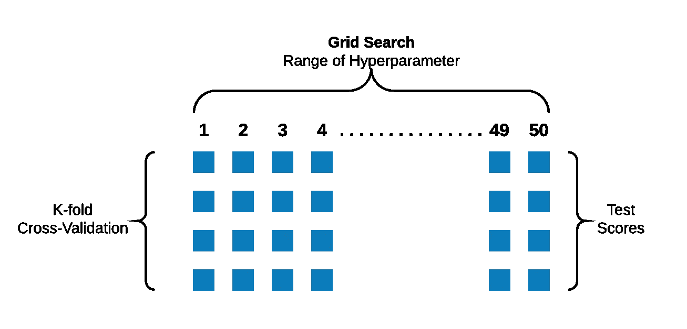

# 模型选择和模型评估的基本概念——第二部分

> 原文：<https://medium.com/analytics-vidhya/fundamental-concepts-for-model-selection-and-model-evaluation-part2-e72b384f8ab6?source=collection_archive---------28----------------------->

## 解决机器学习中心问题的核心概念背后的直觉。

如果你还没有看完第一部分，我建议你先看一遍。在[第一部分](/analytics-vidhya/fundamental-concepts-for-model-selection-and-model-evaluation-part1-b91f78efaea0)中，我们谈到了选择更好的模型类别所需的基本概念。在本文中，我们将首先讨论超参数，然后将重点放在模型评估的概念上。

我把思维导图放在这里是为了直观的总结，但是先浏览一下这篇文章，稍后再回到这里。

模型选择和模型评估概念—思维导图

## 我们将在本文中讨论以下主题。

*   超参数的意义和使用。
*   超参数与模型参数有何不同。
*   超参数调谐。
*   交叉验证策略(K 倍 CV)。
*   GridSearchCV。

# 超参数调谐

正如我们在上一篇文章中讨论的，可以通过正则化和超参数调整来减少模型的过度拟合。我们讨论了正则化，在本文中，我们将看到超参数调整。

超参数调整是寻找超参数的最佳值的过程，用于控制模型复杂性，使其不会过度拟合。我们将看到如何实现这一点，但在前进之前，让我们先明确一些基本概念。

## 参数和超参数

参数是模型进行预测时需要学习的值。例如，在回归的情况下，我们需要学习变量的系数，这些值被称为参数。

但是超参数是不同的，请注意，它不会成为最终模型的一部分，而是学习算法用来建立模型的东西。

让我们来看看不同类别的模型的超参数究竟是什么。

*   对于回归模型，回想一下，它们的复杂性随着变量数量的增加而增加。这里变量的数量是我们的超参数，我们需要找到它的最佳值。
*   对于像决策树这样的树模型，树的深度会影响模型的复杂性。所以这里树的深度是需要优化的超参数。
*   对于神经网络，影响复杂性的是连接的数量，因此使用丢弃，并且需要丢弃的神经元的百分比可以被认为是超参数。

这是超参数的一些例子，请明确，超参数不是可以预先知道的或者它的值是固定的，它必须通过尝试不同的值来找出，看看哪个最适合。

我们强调，我们需要找到一个最佳的超参数值，让我们看看如何优化它。

# 交叉验证策略

维基百科定义

> **交叉验证**，有时也称为**旋转估计**或**样本外测试**，是各种类似的[模型验证](https://en.wikipedia.org/wiki/Model_validation)技术中的任何一种，用于评估[统计](https://en.wikipedia.org/wiki/Statistics)分析的结果如何推广到一个独立的数据集。

让我们通过一个例子来理解它，假设我们正在解决一个线性回归问题，我们希望根据我们拥有的 50 个独立变量来预测“y”。这里，在我们的模型中使用的变量的数量是一个超参数，我们的目标是找出它的最佳值。

对于模型构建，我们需要弄清楚两件事

*   要使用的变量数量。
*   使用哪些变量？
    -为此，我们可以使用 [RFE](https://machinelearningmastery.com/feature-selection-in-python-with-scikit-learn/) ，我们不会在本文中涉及 RFE，但是，你可以通过“进一步阅读”部分的链接。

一种方法是使用坚持策略将数据分成训练集和测试集。并尝试建立不同超参数值的模型。

坚持策略的说明

但是这种方法存在问题。

**问题 1** —我们将打破窥视测试集的基本规则，在相同的测试集上针对不同的超参数值评估我们的模型。

**问题 2** —结果将取决于特定的测试和训练分割，如果我们的数据分布不均匀，即我们的测试分割可能具有与训练集不同的分布，该怎么办。

**问题 3** —我们正在手动执行该过程，需要花费大量精力来测试我们的不同模型的大范围超参数。

让我们看看如何解决这些问题。

## 解决问题 1 **(窥视测试集)** &问题 2(依赖于特定的数据分割)

窥视测试数据的问题可以通过将数据集分成训练、 ***验证、*** 和测试集来避免。因此，我们可以在验证集而不是测试集上迭代地验证我们的模型。但是请注意，通过采用这种方法，我们将最终得到更少的数据用于训练，并且我们很少有丰富的数据可用。因此，我们有另一个问题要解决(记住，只有当我们有更少的数据，否则你可以使用验证集)。

这就是可以使用交叉验证策略来避免更多地消耗训练数据的地方。我们将看看交叉验证中最常见的技术，即 ***K 倍交叉验证*** 。参考“进一步阅读”部分的链接，找到其他的验证策略。

在 *K-Fold 交叉验证* ***，*** 中，我们将数据集只分为训练集和测试集，训练集又进一步分为 K 个 Fold，这里我们取 K 为 4。

K-Fold 交叉验证的说明，请注意，上面显示的测试数据实际上是从训练数据中采样的验证集。

现在，我们可以使用不同的测试集迭代地创建多个模型，而不是使用相同的测试集创建单个模型。k 倍交叉验证运行的结果通常用模型得分的平均值进行总结，如上图所示。

> *窥视是使用测试集性能来选择假设并对其进行评估的结果。避免这种情况的方法是把测试集真正拿出来——把它锁起来，直到你完全完成学习，只是希望获得对最终假设的独立评估。(然后，如果你不喜欢这个结果……如果你想回去找到一个更好的假设，你必须获得并锁定一个全新的测试集。)*

— Jason Brownlee 在他的文章中提到了上述段落，作者:Stuart Russell 和 Peter Norvig，709 页，[人工智能:一种现代方法](http://www.amazon.com/dp/0136042597?tag=inspiredalgor-20)，2009 年(第三版)

使用 K-Fold 交叉验证，我们解决了这两个问题。

*   问题 1——我们通过在训练数据集的多个样本上迭代地训练和测试我们的模型，避免了窥视测试集。
*   问题 2 —我们的模型在不同的数据分割上进行训练和测试，这避免了模型结果对特定数据分割的依赖性。

## 解决问题 3(手动调整超参数)

我们知道如何避免窥视测试集并消除对特定数据分割的依赖，现在我们需要一些方法来自动化超参数调整过程，显然，当我们的变量在 100–150 范围内时，就不可能手动执行这个过程。

这就是我们可以使用 **GridSearch** 技术的地方，它将自动为您的模型找到最佳的超参数值。

GridSearchCV 的插图

GridSearchCV 是一个用来指代 GridSearch 和交叉验证技术的术语，现在我们需要为 GridSearchCV 提供超参数的一系列值。

上图显示了使用 GridSearchCV 在 1–50 的范围内进行超参数调整的过程。

乡亲们，现在我将推荐你们浏览一次视觉总结(思维导图)。

我希望你获得了基本概念背后的直觉，并理解我们如何在解决机器学习问题的同时解决共同的挑战。

# 摘要

*   我们看到了超参数的含义以及它与模型参数的不同之处
*   超参数不是我们最终模型的一部分，但它们将被学习算法用来正则化我们的模型。
*   超参数需要调整，我们看到了如何在避免一些基本问题的同时做到这一点。
*   交叉验证技术可以用来解决窥视测试集的问题。
*   GridSearch 技术可以与交叉验证技术一起使用，以自动化在不同的超参数值上验证我们的模型的繁琐过程。

# 进一步阅读

*   RFE—[https://machine learning mastery . com/feature-selection-in-python-with-scikit-learn/](https://machinelearningmastery.com/feature-selection-in-python-with-scikit-learn/)
*   不同的交叉验证技术—[https://towards data science . com/Cross-Validation-in-machine-learning-72924 a 69872 f](https://towardsdatascience.com/cross-validation-in-machine-learning-72924a69872f)
*   更多深度讲解—[https://sebastianraschka . com/blog/2016/model-evaluation-selection-part 1 . html](https://sebastianraschka.com/blog/2016/model-evaluation-selection-part1.html)
*   有关验证集的详细信息—[https://machine learning mastery . com/difference-test-validation-datasets/](https://machinelearningmastery.com/difference-test-validation-datasets/)