# 机器学习的基础知识

> 原文：<https://medium.com/analytics-vidhya/fundamental-omachine-learning-ada28afa1bd3?source=collection_archive---------7----------------------->

在 [Unsplash](https://unsplash.com?utm_source=medium&utm_medium=referral) 上由 [Gery Wibowo](https://unsplash.com/@gergilgad?utm_source=medium&utm_medium=referral) 拍摄的照片

# 什么是机器学习？

顾名思义，机器学习为机器提供了基于经验、观察和分析给定数据集中的模式进行自主学习的能力，而无需显式编程。当我们为某个特定的目的编写程序或代码时，我们实际上是在编写一组机器将遵循的明确的指令。

而在机器学习中，我们输入一个数据集，通过这个数据集，机器将通过识别和分析数据集中的模式进行学习，并学习根据其观察和从数据集中的学习来自主做出决策。

想想脸书的面部识别算法，每当你上传照片时，它都会提示你给照片添加标签。甚至语音助手也使用机器学习来识别和服务用户的请求。特斯拉的自动驾驶功能是另一个例子。

# 机器是如何学习的？

嗯，简单的答案是，就像人类一样！首先，我们获得关于某件事情的知识，然后把这些知识记在心里，我们就能够在未来识别这件事情。此外，过去的经验有助于我们在未来做出相应的决策。我们的大脑通过识别接收到的知识/数据中的特征和模式来训练自己，从而使自己能够成功地识别或区分各种事物。

# 机器学习时间线

机器学习并不是最近的现象。事实上，神经网络是在 1943 年的一篇研究论文中作为一个概念首次提出的！

虽然在早期，机器学习的进展有些缓慢，因为计算的高成本使得这个领域只能由大型学术机构或跨国公司访问。还有一个事实是，数据本身很难满足公司的需求。

但是随着互联网的出现，我们现在每天都在产生万亿次的数据！

再加上计算成本的降低，我们发现机器学习不仅仅是一个可行的提议。

下面让我们尝试用机器学习历史上一些值得注意的事件来绘制一个时间线:

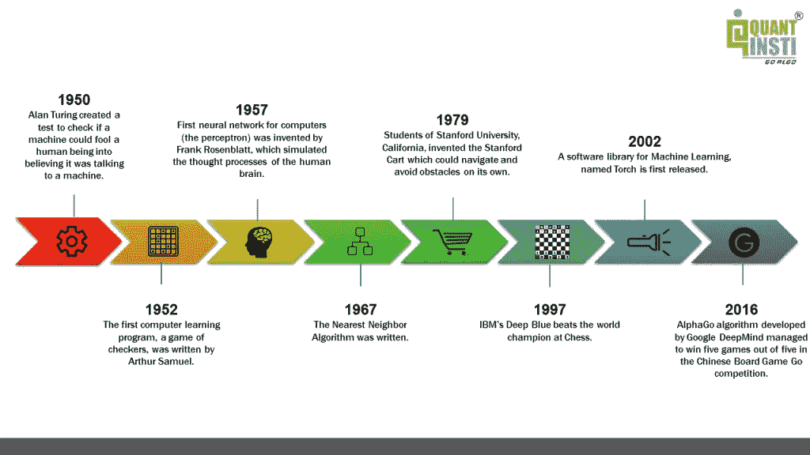

# 机器学习、深度学习、人工智能的区别？

在学习机器学习基础知识时，人们经常混淆机器学习、人工智能和深度学习。下图明确了机器学习的概念。

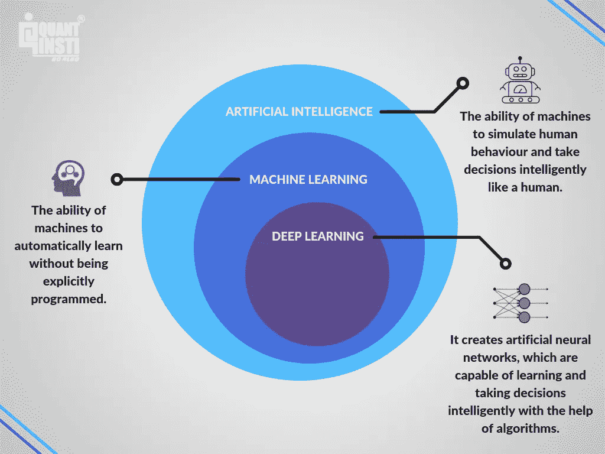

我们希望该图表有助于消除您对这三个学科的任何疑虑。现在我们进入问题的核心。

# 机器学习的组件

我们把机器学习的过程分解一下，这样就可以详细了解了。我们将举一个小例子。

## 收集和准备数据

机器学习基础的第一步是我们向机器提供知识/数据，这些数据分为两部分，即训练数据和测试数据。

假设我们想开发一个软件，只要一显示一个人的照片，它就能识别这个人。我们从收集资料开始。现在在这个阶段，我们必须确保我们的数据是整个人口的代表，即，如果我们只包括 20 -40 岁的成年人，软件将失败，如果它是一个婴儿的照片。

数据通常被分成 80/20 或 70/30，以确保模型一旦经过充分训练，就可以在以后进行测试。

## 选择和训练模型

这是机器学习基础的第二步。我们有各种各样的机器学习算法和模型，这些算法和模型已经被创建和进一步修改，以便它们可以解决特定类型的问题。因此，我们必须根据模型对当前问题的适用性来选择和训练模型。

## 评估模型

机器从训练数据中学习模式和特征，并训练自己做出决策，如识别、分类或预测新数据。为了检查机器做出这些决定的准确性，将根据测试数据对预测进行测试。

在这种情况下，我们将首先处理训练数据，一旦模型得到充分训练，我们就将它用于测试数据，以了解它在识别照片中的人脸方面有多成功。

## 超参数调整和预测

在机器学习术语中，超参数是模型本身无法估计的参数，但我们仍然需要考虑它们，因为它们在提高模型性能方面起着至关重要的作用。

传统上来说，机器学习模型中的超参数是需要由用户指定的参数，以便运行算法。经典参数从数据中学习，超参数可能从数据中学习，也可能不从数据中学习。

例如，在下面显示的决策树中。超参数是

1.  叶节点的数量
2.  树的深度
3.  分割节点所需的最小样本

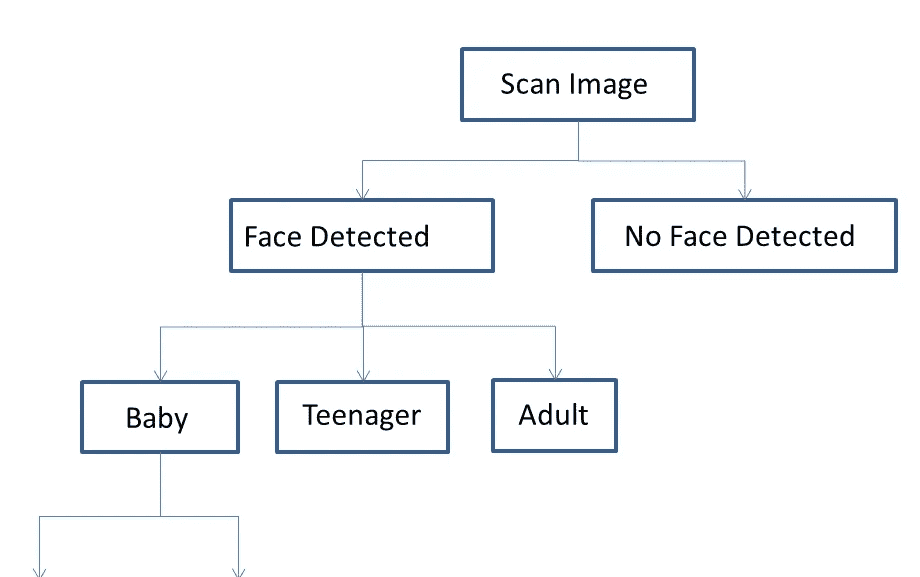

一个模型可以有许多超参数，寻找超参数的最佳可能组合的过程称为超参数调整。用于超参数调整的一些机器学习基础方法包括网格搜索。随机搜索，基于梯度的优化。由于我们正专注于机器学习的基础知识，因此详细讨论这些方法可能有些矫枉过正，但对这些过程有一个大致的了解就足够了。

一旦超参数优化过程完成，我们就可以说机器学习模型建立起来了，取决于它的成功率或者更确切地说，预测能力，我们可以在现实世界中部署它。

因此，以这种方式，我们可以建立一个机器学习算法。

就像每个建筑都需要一个基础一样，我们需要导入 python 库，这将帮助我们构建机器学习算法。现在让我们浏览几个 python 机器学习库。

# 用于机器学习基础的 Python 库

## sci kit-学习

它是基于 SciPy 库构建的 Python 机器学习库，由各种算法组成，包括分类、聚类和回归，可以与其他 Python 库(如 NumPy 和 SciPy)一起用于科学和数值计算。它的一些类和函数是 sklearn。cluster、sklearn.datasets、sklearn.ensemble、sklearn.mixture 等。

## 张量流

TensorFlow 是一个开源软件库，用于高性能数值计算和机器学习应用程序，如神经网络。它允许跨各种平台(如 CPU、GPU、TPU 等)轻松部署计算。由于其灵活的架构。

## 克拉斯

Keras 是一个深度学习库，用于开发神经网络和其他深度学习模型。它可以建立在 TensorFlow、Microsoft Cognitive Toolkit 或 Theano 之上，并专注于模块化和可扩展。

到目前为止，我们已经打下了基础，并且涵盖了大部分机器学习的基础知识。让我们进一步了解几个机器学习算法。

# 机器学习算法的类型

机器学习算法可以分为:

1.  监督算法—线性回归、逻辑回归、KNN 分类、支持向量机(SVM)、决策树、随机森林、朴素贝叶斯定理
2.  无监督算法— K 表示聚类。

*   强化算法

让我们更深入地研究一下这些机器学习基础算法

## 监督机器学习算法

在这种类型的算法中，训练机器的数据集由标记数据组成，或者简单地说，由输入参数和所需输出组成。

让我们以前面的面部识别为例，一旦我们识别出照片中的人，我们将尝试将他们分类为婴儿、青少年、s 或成人。在这里，婴儿、青少年和成人将是我们的标签，我们的训练数据集已经根据某些参数被分类到给定的标签中，通过这些参数，机器将学习这些特征和模式，并根据从这些训练数据中的学习对一些新的输入数据进行分类。

监督机器学习算法可以大致分为两种类型的算法；分类和回归。

**1 —分类算法**

顾名思义，这些算法用于将数据分类到预定义的类别或标签中。我们将讨论一种最常用的分类算法，称为 K-最近邻(KNN)分类算法。

KNN 分类机器学习算法

该算法用于根据数据点之间的相似性将一组数据点分类到特定的组或类中。让我们考虑一个例子，我们需要根据一个人的身高和体重来检查这个人是否健康。假设我们给出下表作为训练数据集:

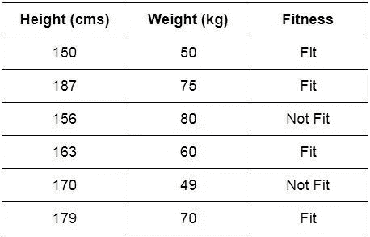

现在考虑一个新人需要被分类为适合/不适合。让我们考虑 K=3 的值，这意味着我们将考虑 3 个最近的邻居。通过确定一个人的身高和体重与表中给出的人的身高和体重之间的欧几里德差，可以找出最近邻。具有 3 个最小差异的人将被认为是最近的邻居。现在我们将检查这 3 个中有多少是合适的。如果 3 个人中有 2 个或更多是健康的，那么我们会把新人归类为健康，反之亦然。万一我们得到相同数量的具有不同结果的邻居，那么我们可以增加 K 的值并再次检查。

**KNN** 边走边学，从这个意义上说，它不需要明确的训练阶段，并开始对由邻居的多数投票决定的数据点进行分类。

该对象被分配到其 k 个最近邻居中最常见的类别。

解释 KNN 机器学习分类算法的另一种方式是以下述方式:

让我们考虑将一个绿色圆圈分类为 1 类和 2 类的任务。考虑基于 1-最近邻的 KNN 的情况。在这种情况下，KNN 会将绿色圆圈归入 1 类。现在让我们将最近邻居的数量增加到 3，即 3 个最近邻居。如图所示，圆圈内有“两个”类别 2 对象和“一个”类别 1 对象。KNN 将把绿色圆圈归类为 2 类物体，因为它占大多数。

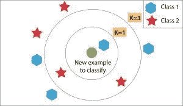

**2 —回归机器学习算法**

这些算法用于确定两个或多个变量之间的数学关系以及变量之间的依赖程度。这些可用于基于两个或更多变量的相互依赖性来预测输出。

例如，一种产品价格的上涨会减少其消费量，这意味着，在这种情况下，消费量将取决于该产品的价格。在这里，消费量将被称为因变量，产品价格将被称为自变量。消费金额对产品价格的依赖程度将帮助我们根据产品价格的变化预测消费金额的未来价值。

我们有两种回归算法:线性回归和逻辑回归

1.  线性回归算法

最初在统计学中开发用于研究输入和输出数值变量之间的关系，它被机器学习社区采用来基于线性回归方程进行预测。

线性回归的数学表示是一个线性方程，它结合一组特定的输入数据(x)来预测该组输入值的输出值(y)。线性方程为每组输入值分配一个系数，这些值称为用希腊字母 Beta (β)表示的系数。

下面提到的等式表示具有两组输入值 x1 和 x2 的线性回归模型。y 代表模型的输出，β0、β1 和β2 是线性方程的系数。

y = β0 + β1x1 + β2x2

当只有一个输入变量时，线性方程代表一条直线。为简单起见，假设β2 等于零，这意味着变量 x2 不会影响线性回归模型的输出。在这种情况下，线性回归将表示一条直线，其方程如下所示。

y = β0 + β1x1

线性回归方程模型的图表如下所示:

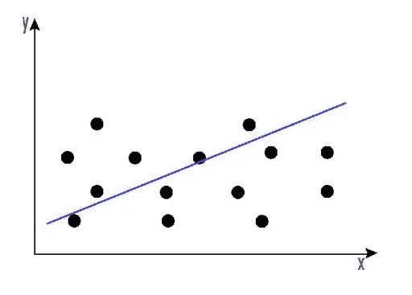

线性回归可以用来找出股票在一段时间内的总体价格趋势。这有助于我们了解价格变动是积极的还是消极的。

你可以在这篇博客中详细了解线性回归以及如何用它来预测股票价格。

2.逻辑回归算法

在逻辑回归中，我们的目标是产生一个离散值，1 或 0。这有助于我们为我们的场景找到一个明确的答案。

逻辑回归在数学上可以表示为:

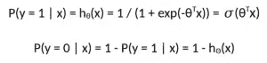

与线性回归类似，逻辑回归模型计算输入变量的加权和，但它通过特殊的非线性函数(逻辑函数或 sigmoid 函数)运行结果，以生成输出 y。

sigmoid/logistic 函数由下式给出。

y = 1 / (1+ e-x)

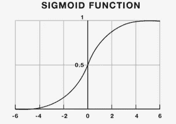

简单来说，逻辑回归可以用来预测市场的走向。

到目前为止，上面解释的机器学习算法仅仅是基于分类或回归的算法。现在，我们将看看某些监督机器学习算法，这两者都可以。

## 支持向量机(SVM)学习算法

支持向量机最初用于数据分析。最初，一组训练样本被输入到 SVM 算法中，属于一个或另一个类别。然后，该算法建立一个模型，开始将新数据分配给它在训练阶段学习的类别之一。

在 SVM 算法中，创建一个超平面作为类别之间的分界。当 SVM 算法处理一个新的数据点时，根据它出现的方向，它将被分类到其中一个类别中。

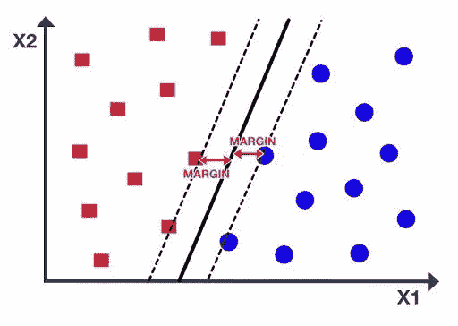

当与交易相关时，可以建立 SVM 算法，该算法将股票数据分类为有利的买入、卖出或中性类别，然后根据规则将测试数据分类。

## 决策树

决策树基本上是一种树状的支持工具，可以用来表示原因及其结果。因为一个原因可能有多种影响，我们把它们列出来(就像一棵树有它的分支)。

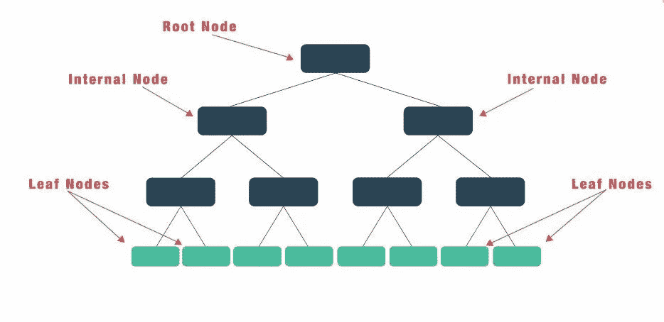

我们可以通过组织输入数据和预测变量，并根据我们将指定的一些标准来构建决策树。

构建决策树的主要步骤是:

1.  检索金融工具的市场数据。
2.  引入预测变量(即技术指标、情绪指标、广度指标等)。)
3.  设置目标变量或所需输出。
4.  在训练数据和测试数据之间拆分数据。
5.  生成训练模型的决策树。
6.  测试和分析模型。

决策树的缺点是，由于其固有的设计结构，它们容易过拟合。

## 随机森林

设计了随机森林算法来解决决策树的一些限制。

随机森林由决策树组成，这些决策树是表示其行动过程或统计概率的决策图。这些多棵树被映射到称为分类和回归(CART)模型的单棵树。

为了根据对象的属性对其进行分类，每棵树都给出一个分类，即所谓的“投票”给该类。然后，森林选择票数最多的分类。回归，它考虑不同树的输出的平均值。

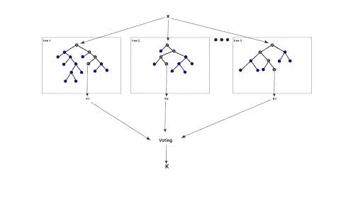

随机森林的工作方式如下:

1.  假设案例数为 N，将这 N 个案例的样本作为训练集。
2.  考虑 M 是输入变量的数目，选择一个数 M，使得 m < M 和 M 之间的最佳分裂用于分裂节点。随着树的生长，m 的值保持不变。
3.  每棵树都长得尽可能大。
4.  通过聚合 n 棵树的预测(即分类的多数票，回归的平均值)，预测新数据。

## 朴素贝叶斯定理

现在，如果你还记得基本概率，你会知道贝叶斯定理是以这样一种方式表述的，即我们假设我们有与前一事件相关的任何事件的先验知识。

例如，为了检查你上班迟到的概率，人们想知道你在路上是否遇到交通堵塞。

然而，朴素贝叶斯分类器算法假设两个事件彼此独立，因此，这在很大程度上简化了计算。起初，朴素贝叶斯被认为仅仅是一种学术练习，但它已经证明了它在现实世界中也非常有效。

朴素贝叶斯算法可用于在没有完整数据的情况下找到不同参数之间的简单关系。

我们现在将看看下一种类型的机器学习算法，即无监督的机器学习算法。

## 无监督机器学习算法

与监督学习算法不同，在监督学习算法中，我们处理用于训练的标记数据，对于非监督机器学习算法，训练数据将是未标记的。根据变量之间的相似性将数据聚类成特定的组。一些无监督的机器学习算法是 K 均值聚类和神经网络。让我们看看 K-means 聚类机器学习算法。

**1 — K-means 聚类机器学习算法**

在我们理解 K-means 聚类算法的工作原理之前，让我们首先分解 K-means 聚类这个词来理解它的含义。

聚类:在该算法中，我们形成聚类，这些聚类是由于相似性而分组在一起的数据点的集合。

k 指的是将被考虑用于特定问题的质心的数量，而‘means’指的是被认为是任何聚类的中心点的质心。

K-均值聚类算法的工作原理

1.  定义 K 的值。例如:如果 K= 2，那么我们将有两个质心。
2.  随机选择 K 个数据点作为质心。
3.  检查每个数据点与质心的距离。
4.  将数据点分配到与其距离最小的质心，从而形成相似数据点的聚类。
5.  重新计算每个新形成的聚类的质心，并将数据点重新分配给质心距离数据点最小的聚类。

您可以决定重复步骤 5 的迭代次数，以优化算法。当质心停止变化或在一定数量的迭代后保持不变时，那将是我们的停止点，算法将被完全优化。

一个简单的例子是，给定足球运动员的数据，我们将使用 K-means 聚类，并根据他们的相似性来标记他们。因此，这些聚类可以基于前锋对任意球或成功铲球得分的偏好，即使算法一开始没有给出预定义的标签。

k-均值聚类对那些认为不同资产之间可能存在表面上看不到的相似性的交易者是有益的。

虽然我们在无监督机器学习算法中提到了神经网络，但可以争论的是，它们既可以用于监督学习算法，也可以用于无监督学习算法。现在让我们来理解人工神经网络和递归神经网络。

**2 —人工神经网络**

在我们扮演上帝的探索中，人工神经网络是我们最高的成就之一。我们已经创建了多个相互连接的节点，如图所示，这些节点模仿了我们大脑中的神经元。简单来说，每个神经元通过另一个神经元接收信息，对其执行工作，并将其作为输出传输到另一个神经元。

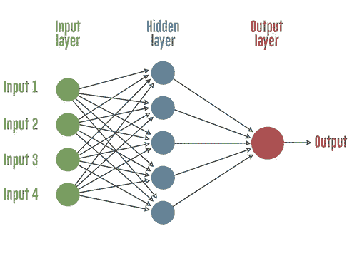

每个圆形节点代表一个人工神经元，一个箭头代表从一个神经元的输出到另一个神经元的输入的连接。

如果我们使用神经网络来寻找各种资产类别之间的相互依赖关系，而不是试图预测购买或出售选择，神经网络可能会更有用。

**3 —递归神经网络(RNN)**

你知道 Siri 和谷歌助手在编程中使用了 RNN 吗？rnn 本质上是一种神经网络，其具有连接到每个节点的存储器，这使得处理顺序数据变得容易，即一个数据单元依赖于前一个数据单元。

解释 RNN 优于普通神经网络的一种方式是，我们应该一个字符一个字符地处理一个单词。如果单词是“trading ”,正常的神经网络节点在移动到“d”时会忘记字符“t ”,而递归神经网络会记住该字符，因为它有自己的记忆。

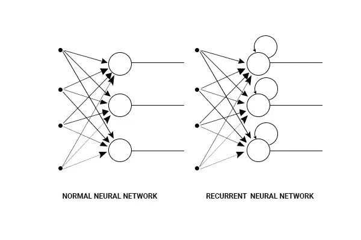

## 强化机器学习算法

强化学习是一种机器学习，其中机器需要在特定的上下文中确定理想的行为，以最大化其回报。它的工作原理是奖惩原则，也就是说，对于机器做出的任何决定，它要么受到奖励，要么受到惩罚。因此，它将理解决定是否正确。这就是机器将如何学习采取正确的决策，以从长远来看最大化回报。

对于强化算法，可以对机器进行调整和编程，使其更关注长期回报或短期回报。当机器处于一个特定的状态，并且必须为下一个状态采取行动以实现奖励时，这个过程被称为马尔可夫决策过程。

强化学习问题的更技术性的解释可以探索如下:

环境被建模为具有输入(从代理发送的动作)和输出(发送给代理的观察和奖励)的随机有限状态机:

*   状态转移函数 P(X(t)|X(t-1)，A(t))
*   观察(输出)函数 P(Y(t) | X(t)，A(t))
*   奖励函数 E(R(t) | X(t)，A(t))
*   状态转移函数:S(t) = f (S(t-1)，Y(t)，R(t)，A(t))
*   策略/输出函数:A(t) = pi(S(t)))

代理的目标是找到一个策略和状态更新函数，以便最大化折扣奖励的期望总和

e[r _ 0+g r _ 1+g r _ 2+…]= e sum_{t=0}^infty gamma^t r _ t

其中，0 <= gamma <= 1 是折扣因子，它模拟了未来奖励的价值低于即时奖励的事实。

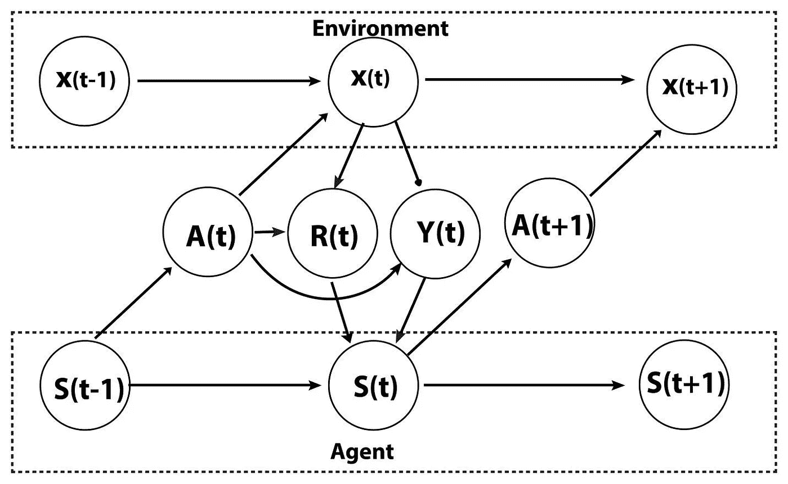

强化学习问题需要巧妙的探索机制。需要仔细参考事件发生的概率来选择行动，以便获得期望的结果。此外，其他缺点也使强化学习成为从业者的挑战。首先，存储每个状态的值会耗费大量内存，因为问题可能非常复杂。而且，问题一般也是非常模块化的；类似的行为经常重现。此外，有限的感知会导致强化学习的局限性。

我们现在已经涵盖了今天使用的大多数流行的机器学习算法。正如你已经理解的那样，我们必须经历一些术语，以确保我们精通机器学习的基础知识。

# 机器学习基础知识中的常用术语

这里有几个机器学习基础术语，在你开始机器学习算法的旅程时会有帮助。

## 偏见

如果机器学习模型的可预测性水平高，则称其具有低偏差。换句话说，它在处理数据集时犯的错误更少。

当我们必须对同一问题陈述比较两种机器学习算法时，偏差起着重要的作用。

## 交叉验证偏差

机器学习中的交叉验证是一种提供机器学习模型性能的精确测量的技术。当模型用于未来未知的数据集中时，这种性能将更接近您的预期。

机器学习模型的应用是从现有数据中学习，并使用这些知识来预测未来的未知事件。机器学习模型中的交叉验证需要彻底完成，以便在实时交易中获利。

通过阅读本文，您可以了解如何在机器学习模型上执行交叉验证。

## 欠拟合

如果一个机器学习模型不能以相当高的准确度进行预测，那么我们说这个模型在它的控制之下。这可能是由于各种原因，包括没有为预测选择正确的特征，或者只是问题陈述对于所选择的机器学习算法来说太复杂。

## 过度拟合

在机器学习和统计学中，当模型与数据拟合得太好时，或者简单地说，当模型太复杂时，就会发生过度拟合。过度拟合模型学习训练数据中的细节和噪声，以至于对新数据/测试数据的模型性能产生负面影响。

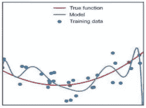

过拟合问题可以通过减少特征/输入的数量或者通过增加训练样本的数量来解决，以使机器学习算法更加通用。解决过拟合问题的更常见的方法是通过正则化。

这些是我们在《机器学习基础》中讨论过的几个术语。上面提到了大部分流行的机器学习算法。虽然我们可以在这里结束这篇文章，但我们想到了更详细地讨论当今的热门话题之一，即深度学习。通常，神经网络由三层组成，输入层、隐藏层和输出层。虽然传统的神经网络足以解决大量的问题陈述，但研究人员意识到，增加更多的隐藏层可以帮助我们建立复杂的模型，以解决不同类型的复杂问题。简而言之，这就是深度学习。

# 机器学习和深度学习的区别

机器学习模型缺乏识别错误的机制，在这种情况下，程序员需要介入来调整模型以做出更准确的决策，而深度学习模型可以识别不准确的决策，并在没有人工干预的情况下自行纠正模型。

但要做到这一点，深度学习模型需要大量的数据和信息，不像机器学习模型。

## 研究深度神经网络

深度神经网络因网络中的层数较多而得名。现在让我们通过参考下面给出的图表来理解这些层是什么，以及它们如何在深度神经网络中使用，以给出最终输出:

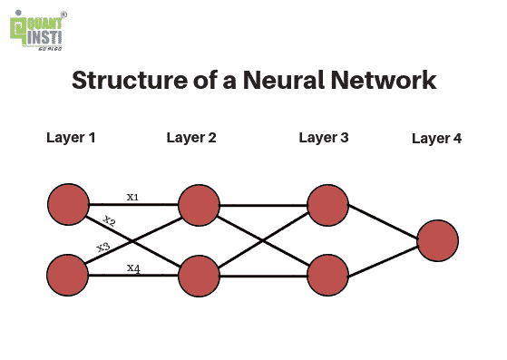

## 深层神经网络中的层

通过查看该图，我们看到在这个深度神经网络中存在 4 层，即第 1 层、第 2 层、第 3 层和第 4 层。每个深度神经网络由三种类型的层组成，它们是:

输入层(第 1 层):这一层是深度神经网络中的第一层，它提供处理信息所需的输入参数。它只是将这些参数传递给下一层，而不在这一层进行任何计算。

隐藏层(第 2 层和第 3 层):深度神经网络中的这些层对从前一层接收的输入执行必要的计算，并将结果传递给下一层。为了提高深度神经网络的效率，决定层的数目和每层中神经元的数目是至关重要的。隐藏层数越多，网络越深。

输出层(第 4 层):深度神经网络中的这一层，在接收到前几层的结果后，给我们最终的输出。

现在我们已经了解了网络中存在的层的类型，让我们了解这些层实际上是如何工作的，并给出输出数据。

每个神经元都连接到下一层中的所有神经元，并且所有这些连接都具有与其相关联的一些权重。但是这些砝码是什么，为什么要用？

## 深度神经网络中的权重

权重，顾名思义，是用来给某个特性附加一定的权重。为了获得所需的输出，某些功能可能比其他功能更重要。

例如，在预测第二天的股票价格时，前几天的收盘价和 SMAs 将被视为比高或低价格更重要的特征，这将影响这些参数的权重。

这些权重用于计算每个神经元的加权和。x1、x2、x3 和 x4 表示与深度神经网络中的相应连接相关联的权重。

除了权重，每个隐藏层都有一个与之关联的激活函数。

## 深度神经网络中的激活函数

激活函数根据神经元的加权和来决定是否激活神经元。它们还通过使用 sigmoid 和 tanh 等函数引入非线性，从而允许对更复杂的任务进行计算。如果没有激活函数，深度神经网络将充当简单的线性回归模型。

以下是一些使用的激活功能的示例:

*   Tanh:避免梯度偏差
*   校正线性单元(ReLU):用于图像处理
*   Softmax:保留离群值的相关性

除此之外，我们还为每一层添加了一个“偏置”神经元，以便能够沿 x 轴向左或向右移动激活函数，从而使我们能够更好地拟合激活函数。当输入为绝对零时，作为常数项的偏置项也作为输出。

## 深度神经网络的处理

该处理开始于使用从输入层接收的输入来计算第一隐藏层中每个神经元的加权和。加权和是输入与每个连接的相应权重的乘积之和。

对应于每一层的激活函数然后作用于这些加权和，以给出最终输出。这个过程也称为转发传播。

处理完成后，将预测输出与实际输出进行比较，以确定误差或损失。为了使深度神经网络准确工作，必须最小化该损失函数，以使预测输出尽可能接近实际输出。当我们最初为深度神经网络中的连接选择随机权重时，它们可能不是最佳选择。

因此，为了最小化损失函数，我们需要调整权重和偏差以获得准确的结果。反向传播是用于调整权重和偏差的过程，以便我们获得权重和偏差的最佳值，从而使我们的结果更准确。

# 深度学习应用

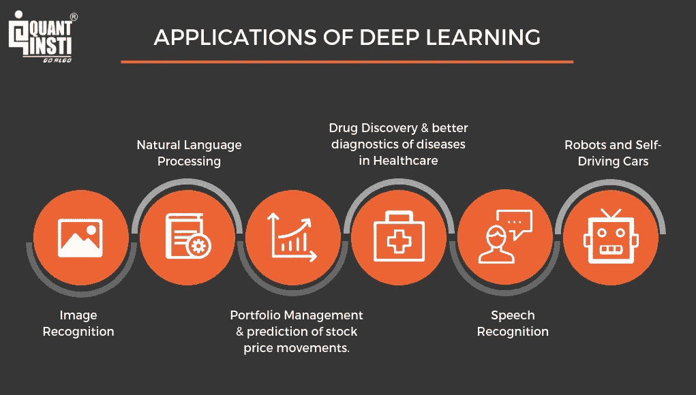

我们必须记住，深度学习实际上是机器学习的一个子集，因此当涉及到它们的应用时，两者之间会有重叠。

# 机器学习的应用

我们已经涵盖了大多数机器学习基础知识，这些知识将明确机器学习的基础知识、机器学习过程、机器学习概念以及对机器学习初学者来说必不可少的机器学习示例。

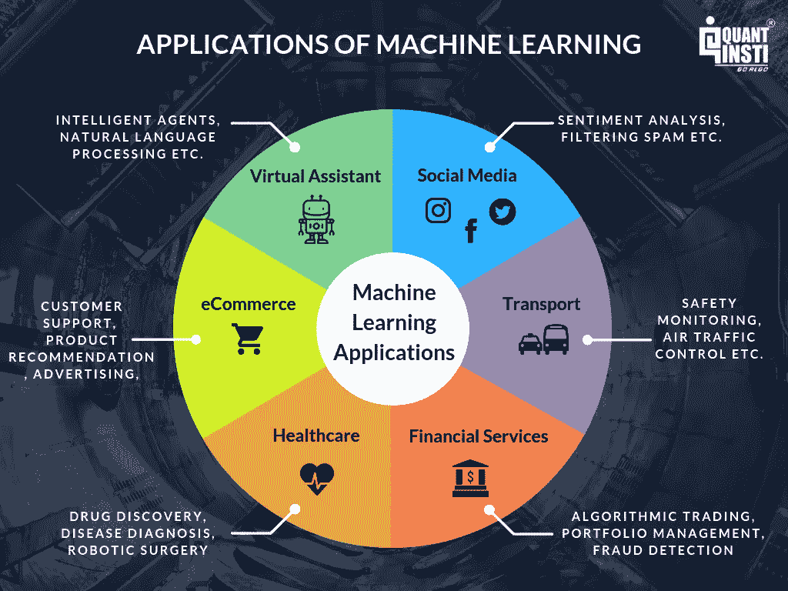

## 交易的机器学习

从上图中我们可以看到，机器学习有着无数的应用，并且正在几乎所有的主要领域得到应用。同样，机器学习在交易领域获得了巨大的牵引力，算法交易等领域也出现了指数增长。交易中的机器学习最终会使交易过程自动化，其中机器本身能够从以前的数据中学习，并做出决策，以最大化利润或最小化损失。

交易策略也可以通过机器学习算法来优化交易过程。使用的一些开源机器学习技术包括 TensorFlow、Keras、Scikit-learn、微软认知工具包等。

如果你想了解机器学习如何用于交易，那么这里有一个关于交易机器学习的综合课程，涵盖了交易机器学习的基础知识，它不仅包括视频讲座，还提供了一个练习编码的互动平台，从机器学习基础知识到机器学习的高级概念。

# 机器学习的发展和未来

机器学习正在以惊人的速度增长，我们很快就能看到它在所有主要领域的应用。关于机器学习的各种报告都指出了这个领域的向上增长曲线。根据 IFI 声称专利服务公司(Patent Analytics)的数据，2017 年至 2018 年，机器学习专利的 CAGR 增长了 116%，其中主要的专利生产商包括 IBM、微软、英特尔、三星、谷歌等公司。

麻省理工学院和谷歌云的一项调查表明，60%的组织已经在使用机器学习策略，其中三分之一处于早期开发阶段。Forrester 的这份报告预测了机器学习的巨大增长，预测分析和机器学习(PAML)市场将在 2021 年前以 21%的 CAGR 速度增长。

根据 Preqin 的一项研究，已知有 1，360 只量化基金在其交易过程中使用计算机模型，占所有基金的 9%。像 Quantopian 这样的公司会为个人的机器学习策略组织现金奖励，如果它在测试阶段赚钱，事实上，在现场交易阶段投入自己的钱。因此，在领先竞争对手一步的竞赛中，每个人，无论是十亿美元的对冲基金还是个人交易，都试图在他们的交易策略中理解和实现机器学习。公司鼓励他们的员工开始学习机器学习基础知识。

商业和其他主要领域不仅采用新技术，还采用新的机器学习技术来自动化许多帮助他们提高生产力的过程。我们现在正在进入人工智能和机器学习的时代，因此，这是一个不容忽视的领域，有很多东西需要探索！

# 结论

在这篇文章中，我们已经了解了机器学习的基础知识，以及专业交易者在 Python 中使用的不同类型的机器学习算法。我们还知道，机器学习对交易世界来说变得不可或缺，并将在未来几年成为交易者工作生活中不可或缺的一部分。