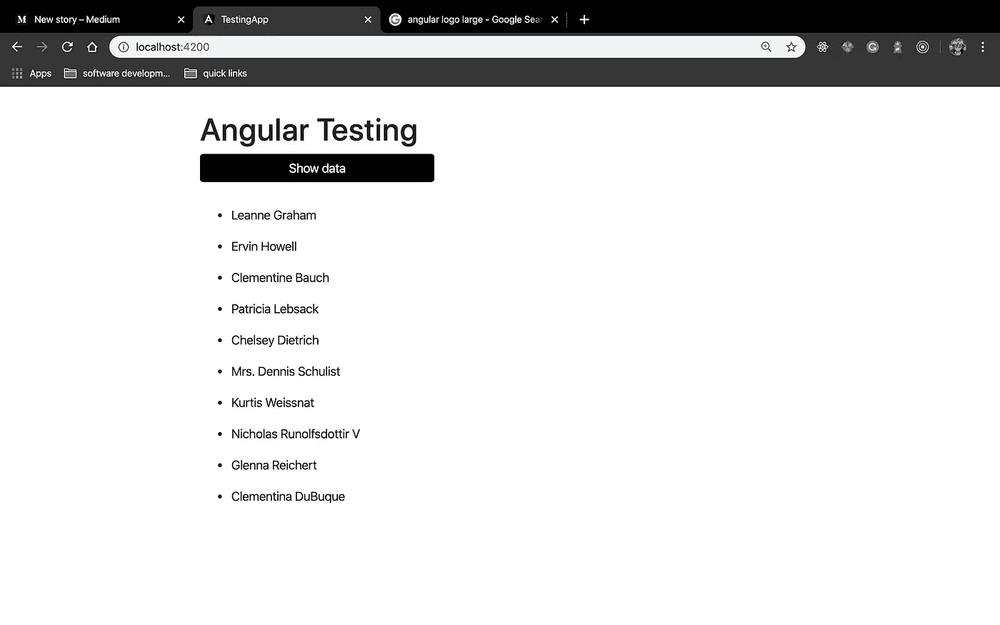

# 角度和单位测试的基础

> 原文：<https://medium.com/analytics-vidhya/fundamentals-of-angular-and-unit-testing-538116afe8bf?source=collection_archive---------18----------------------->

入门指南

如果你是一个前端开发人员，我猜你已经接触或听说过 Angular。Angular 是一个 TypeScript 支持的 MVC 框架，用于构建移动和 web 应用程序。目前，它由谷歌维护。

与其写一篇很长的文章，我认为最好的办法是将每个概念模块化到文章中，并把它们作为一个系列来展示。在这个系列中，我们将构建一个简单的 Angular 应用程序，并浏览 Angular 中 Angular 和单元测试的一些基本概念。

在我们开始之前，我想指出，本文假设了一些编程知识。了解 JavaScript、TypeScript、单页应用程序以及熟悉单元测试将有助于您理解我们将在这里讨论的概念，因为我不打算深入讨论它们。我们这个系列的重点将是从角度来看测试，在这个过程中，我们将重温角度的概念。你会问为什么？嗯，因为 Angular 是最好的前端框架。我刚才说了吗？是的，我做了

继续，在我们开始之前，让我们深入到我们将要构建的实际应用程序中。这是一个简单的应用程序，但它足以展示我们需要的一切。

*P . S——我想在这里提一下，我确实试着创建了一个. GIF 文件，但最终工作量太大了，所以我就用截图了*

首次加载时的应用程序视图

该应用程序有一个标题和一个按钮。当按钮被点击时，它从一个实时服务器获取一个用户列表并显示他们的名字

单击显示数据按钮时的应用程序

现在，我们已经解决了这个问题，让我们深入了解一下我们要研究的概念:

1.  Angular 的基本构件——组件、指令和服务
2.  角度 CLI
3.  用 Angular 编写测试——测试组件和服务，使用模拟数据，创建和使用间谍，检查本机元素、事件处理程序和测试覆盖范围
4.  测试驱动的开发——我们还将顺便提及 TDD 的哲学以及为什么它如此重要

好吧，让我们现在就让这艘船起航。我们将在第二部分见面，我们将讨论 Angular 的构建模块

更新:

第二部分——https://tinyurl.com/sg9dlmh

第三部分—[https://medium . com/@ Henry . ony ango/角度和单位测试基础-part-3-ce101392064d](/@henry.onyango/fundamentals-of-angular-and-unit-testing-part-3-ce101392064d)