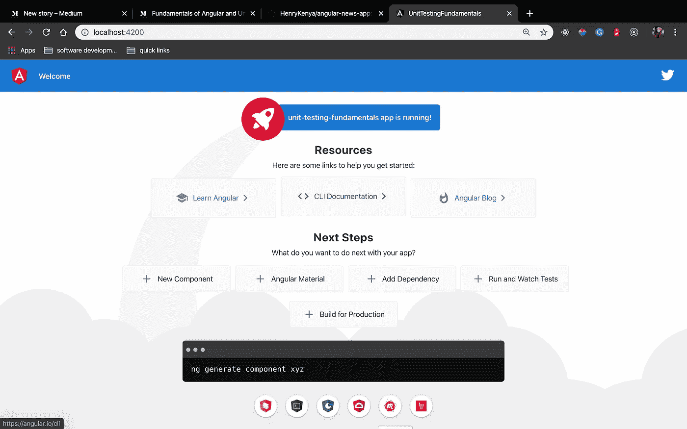
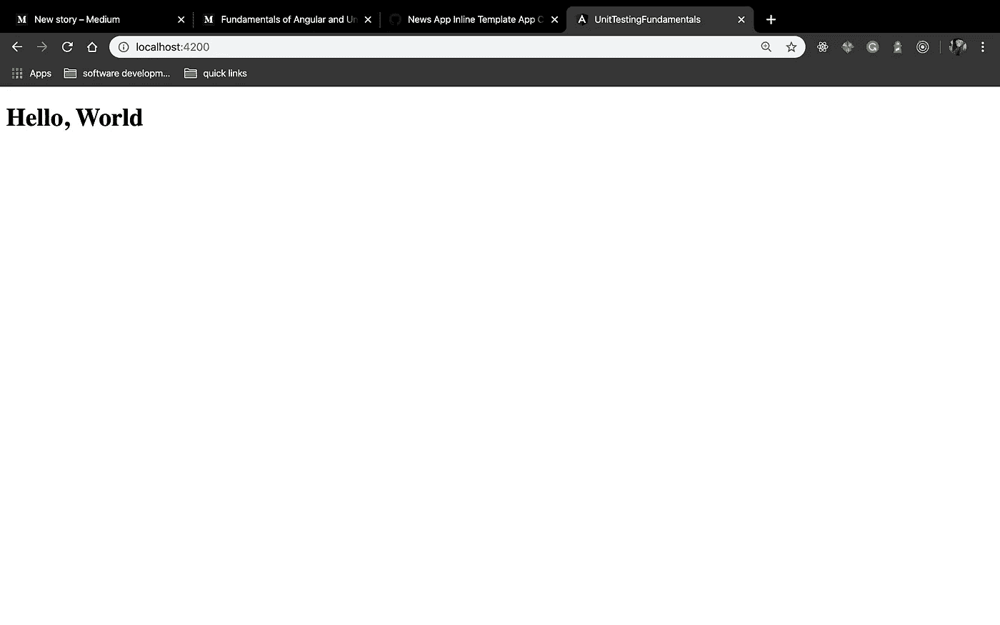
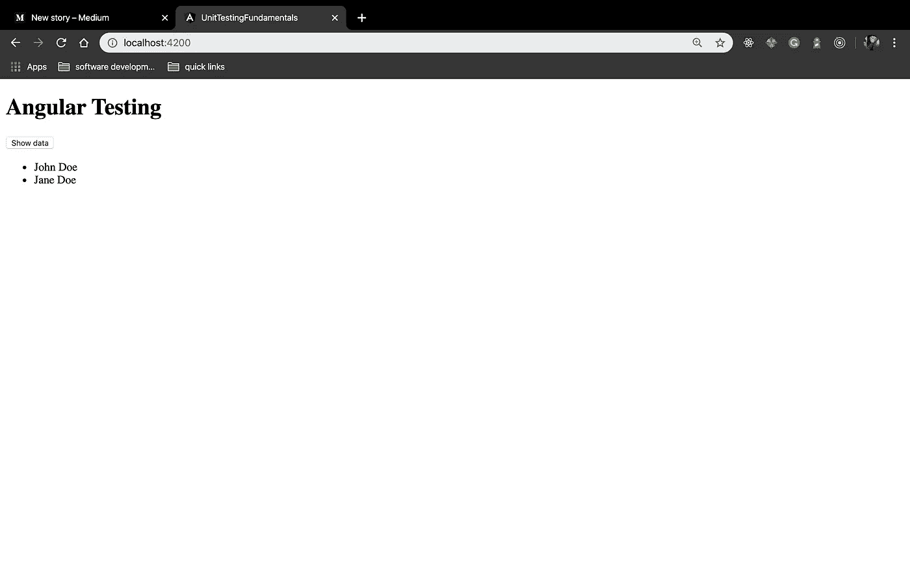
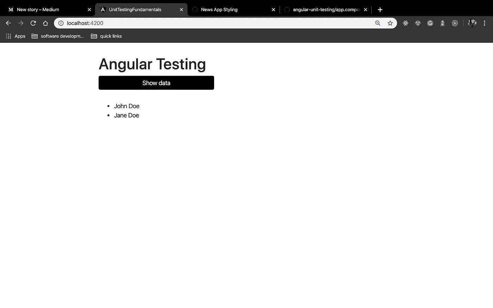

# 角度和单位测试基础—第 3 部分

> 原文：<https://medium.com/analytics-vidhya/fundamentals-of-angular-and-unit-testing-part-3-ce101392064d?source=collection_archive---------24----------------------->

成分

在本系列的前一篇文章第 2 部分中，我们讨论了 Angular 的一些构建块。在第 3 部分中，我们将开始实现我们的应用程序并编写一些代码。在此期间，我将重点介绍 Angular 中的一些最佳实践，并解释一些代码。

## 对我们申请的审查

核心上，我们的应用程序具有:

*   一个标题
*   名单
*   纽扣

我们将开始为这些特定的部分创建 HTML 框架。

要创建新的角度应用程序，请运行以下命令

```
ng new application-name
```

其他的设置应该很容易完成。在我们的例子中，我将应用程序命名为 news-app，因为最终，当我们完成这个系列时，我们将把它移植到一个成熟的应用程序中。

现在还需要注意的是，您可以在创建新应用程序时添加标志，例如，如果您想要包含路由，您可以像这样添加路由标志:

```
ng new application-name --routing
```

现在，让我们通过运行命令来确认应用程序工作正常

```
ng s or ng serve
```

这为默认端口 4200 上的应用程序提供服务。现在转到浏览器并导航到 *localhost:4200。*您应该:



角度默认起始页

现在我们已经确认一切正常，在您最喜欢的 IDE 上打开应用程序。我使用的是 Visual Studio 代码。导航到 src >应用程序。这是我们要进行大部分改变的地方。打开 app.component.ts，让我们探索一下:

**代码分解**

首先要注意的是，Angular 使用了 es6 新的类语法，使得我们的代码可读性很高，尽管它是语法糖，但它允许我们采用 OOP 的一些原则。

组件由 component decorator @Component 标识，这是一个接受对象的函数。该对象包含以下内容:

*   **选择器** —我们的组件可以引用的标签名。假设我们想在别处使用我们的组件，我们将使用标签< app-root >来引用它
*   **templateUrl** —描述包含我们的 HTML 模板的路径。这可以被一个内联模板代替，这就是我们在这个例子中要做的。当用作内联模板时，在这种情况下我们不需要 HTML 文件
*   **styleUrl** —一个数组，包含我们的应用程序使用的样式表的路径。注意，我们的组件可以使用多个样式表

现在，让我们重构代码，使用内联模板。

注意，对于内联模板，我们使用**反勾号``**,反勾号内包含 HTML 元素

如果你的服务器还在运行，Angular 的热重装应该已经发生，你的应用应该如下。否则，您可以再次运行服务器。



我们带有内嵌模板的应用

我们现在可以继续对代码进行编辑，以包含适当的标题、列表和按钮

app.component.html

太好了。我已经将上面的代码添加到 app.component.html 中，并恢复使用外部模板而不是内联模板(内联模板只是向您展示它是如何完成的)。我还添加了几个类，我们将使用它们来设计我们的应用程序和一些虚拟数据。

您的应用程序现在应该如下所示:



我们的应用程序包含所需的元素

现在，我们已经创建了应用程序的基本结构，我们可以开始设计它了。我们将使用 Boostrap4 进行造型。

要安装 bootstrap 和 JQuery(bootstrap 所需的依赖项)，请运行以下命令

```
npm i --save boostrap jquery
```

安装后，有多种方法可以使用引导程序。在我们的例子中，我们将简单地导入 src 文件夹中的 styles.css 中的样式。然而，由于我只对引导程序风格感兴趣，一个简单的解决方法是简单地使用引导程序 CDN 并将风格添加到 index.html，也可以在 src 目录中找到

> *提示—避免直接使用 CDN，而使用 NPM。这有明显的优势，但最大的优势是你不需要手动更新引导程序*

一旦您设置了 bootstrap，我们就可以继续在 app.component.css 中添加我们的样式，这是我们的组件使用的样式表

我们的应用程序现在应该如下所示:



一些样式规则，我们的应用程序已经开始运行了。如果你已经做到了这一步，你的应用看起来也是这样，给自己一个“自我五分”


尽管在这一点上，我们仍然有一个静态的应用程序。让我们把它变得更加动态，写一些类型脚本代码。让我们为按钮添加一个点击功能，在可见和隐藏之间切换数据状态。

app.component.html

应用程序组件

**我们做了什么**

*   只有当“isVisible”为真时，我们的数据才可见。我们已经使用结构指令*ngIf 实现了这一点
*   我们在按钮上附加了一个点击监听器来改变“isVisible”的状态。当单击按钮时，调用函数 fetchData
*   在我们的组件上，函数 fetchData 将变量的状态从 true 变为 false，如果它为 true，反之亦然

这是我们将用来获取数据的逻辑。当我们的按钮被点击时，它调用函数 fetchData，该函数又调用我们的服务来获取我们的数据。

在这一点上，我们已经做了很多。在下一节中，让我们创建我们的服务并从一个活动服务器获取数据。

快速链接

*   第一部分—[https://medium . com/@ Henry . ony ango/角度和单位测试基础-538116afe8bf](/@henry.onyango/fundamentals-of-angular-and-unit-testing-538116afe8bf)
*   第二部分—[https://medium . com/@ Henry . ony ango/角度和单位测试基础—第二部分—736 AC 87 e 2 ff 5](/@henry.onyango/fundamentals-of-angular-and-unit-testing-part-two-736ac87e2ff5)
*   GitHub 知识库—[https://github.com/HenryKenya/angular-news-app](https://github.com/HenryKenya/angular-news-app)