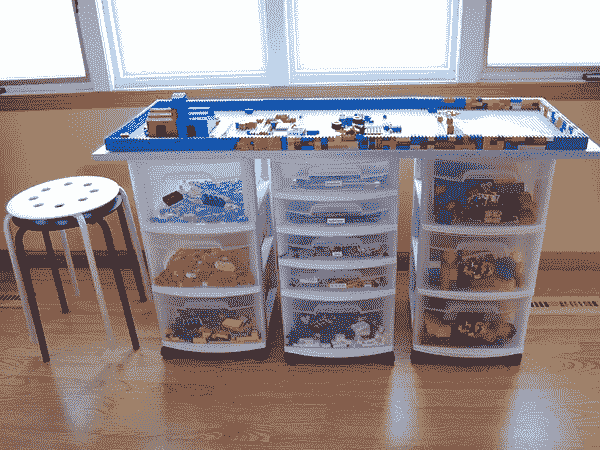

# 角度和单位测试基础—第二部分

> 原文：<https://medium.com/analytics-vidhya/fundamentals-of-angular-and-unit-testing-part-two-736ac87e2ff5?source=collection_archive---------15----------------------->

积木


本文是该系列第一部分的继续。如果你没有从那里开始，你可以点击这里的阅读之前的文章。

在这一部分，我们将会看到 Angular 的一些构建模块。我们将特别关注以下内容:

*   成分
*   指令
*   服务
*   模块

虽然我们不会详细讨论这些问题，但我们也会简要提及:

*   管道
*   路线

## Angular 使用基于组件的架构

面向对象编程和一般编程的基本原则之一是模块化。使用这种设计技术，系统的功能被分解成更小的、独立的和可互换的模块。这一点通过[封装](https://en.wikipedia.org/wiki/Encapsulation_(computer_programming))和松耦合组件得到了强调。

Angular 就是建立在这个范式之上的。结果是，应用程序的 UI 由一个组件树组成，这些组件“结合”在一起，形成整体的设计布局。

以我们的应用程序为例:


假设我们在顶部添加了一个导航栏。然后，我们可以决定将应用程序分成不同的部分，如下所示:

*   将保存导航的导航组件
*   用户组件，它将是按钮的父级，另一个组件用于保存用户列表
*   将保存用户列表的 UserList 组件

这样做的结果将是嵌套的组件，然后将这些组件组合起来以给出整体设计。就表现形式而言，它应该是这样的:

```
...
<root-component>
 <navbar-component></navbar-component>
 <users-component>
    <h1>Some title goes here></h1>
    <users-list-component></users-list-component>
 </users-component>
</root-component>
...
```

这种方法的一些明显优点是:

*   **可重用性**——在需要时重用代码变得非常容易。例如，这些组件中的任何一个都可以在我们代码的其他地方使用，而不需要重新编写
*   **可测试性** —测试代码更容易，因为它被分解成更小的代码片段，也因为单一责任原则(每个代码/类只做一项工作)
*   **可扩展性** —在不破坏现有代码基础的情况下，更容易添加更多功能
*   **可维护性** —代码更容易维护，因为它是高度模块化的(分解成更小的部分)


现在，我知道这是很多，你们中的一些人可能正在看这篇文章，想知道发生了什么。让我们后退一步，用乐高来看它，看看我们是否可以用它来理解我们刚才在上面所说的东西。

**组件**


组件是 Angular 的基石。当建造乐高房子时，我们拿不同的积木，把它们连接在一起，然后 *viola* ！我们有一个乐高房子。这差不多就是组件，乐高积木。

有一个警告。为了让房子变成我们想象的样子，每个乐高积木都必须放在它应该去的地方。

他们在 Angular 中有两个基本角色:

*   视图表示—每个组件都需要一个 HTML 模板，它可以是内联的或 HTML 文件。这用于渲染视图
*   从数据源获取数据并将其提供给视图——该组件还负责从我们的数据源接收数据，然后将其传递给 HTML 视图进行显示

在这方面，我们已经看了 Angular 的 MVC 架构的两个部分，即 HTML(视图)和组件(控制器)

**模块**



还在乐高房子上。显然，我们不能把乐高积木到处乱扔。我们需要一个合适的地方来组织它们，比如一个容器。这就是模块的用武之地。

模块是保存和组织内聚或相关代码的容器。通常，模块被分组为特性、工作流或域。在 Angular 中，模块包含组件、指令、服务、管道甚至其他模块(子模块)。

Angular 应用程序必须至少有一个模块，通常称为根模块，通常命名为 AppModule，可以在 app.module.ts 文件中找到

**服务业**

服务也是另一组特殊的乐高积木。它们用于存储应用程序需要的业务逻辑、值或功能。

Angular 利用服务来增加模块化和单一责任原则。服务应该是狭窄的和定义明确的。这意味着他们应该做一件事，并且做好。

因此，组件将其他不必要的逻辑委托给服务，以便组件可以专注于用户体验，如数据绑定。这种逻辑包括:

1.  从服务器获取数据
2.  验证用户输入
3.  前端计算
4.  登录和注销用户

虽然我们所熟悉的服务最常见的用途是获取数据，但是服务可以做更多的事情。例如，假设您正在开发一个电子商务 web 应用程序，您需要计算某人在您的平台上购物时下的订单总数。它们可以被转移到一个单独的服务中，而不是在组件上进行这样的计算。

在大多数情况下，我们的服务是 MVC 架构中的模型，因为它们通常是数据源。

**指令**

在这一点上，我不确定该把指令比作乐高积木中的什么，所以如果我只是直接试图解释它们是什么，请原谅我。

Angular 中的指令是用来扩展 HTML 的函数。他们允许 Angular 操作 DOM 并赋予它新的语法。

Angular2X 中有不同类型的指令，即:

*   属性指令—更改 DOM 元素的外观或行为。例如，它可以将类从隐藏改为显示。一种更简单的方式认为它们改变了 HTML 元素的属性。用方括号标识，例如[隐藏]、[显示]
*   结构化指令—通过在 DOM 中添加或删除元素来更改 DOM 布局。通常在它们前面用星号来标识，例如*ngFor，*ngIf
*   组件—是的，组件是指令的一部分。唯一的区别是他们有一个模板

*提示——当考虑使用指令隐藏按钮时，我们可以选择使用[hidden]或*ngIf。这里的要点是,[hidden]将按钮的 visibility 属性设置为 hidden。然而，按钮仍然存在于 DOM 中，这可以使用检查工具来查看。然而，一个*ngIf 将它从 DOM 中完全删除*

**管道和路由**

管道用于转换显示的数据，即格式数据。例如，可以将日期从" ***1 January 2020，00:00:00 UTC*** "格式化为类似于" ***1/01/2020*** "的格式。

当用户执行应用程序任务时，路由用于从一个视图导航到另一个视图。Angular 中内置的应用程序是 spa(单页应用程序)。因此，我恳求你进一步阅读路由是如何做的，以及什么是温泉。

以下是一些您可以探索的资源的链接:

1.  [https://scrimba.com/g/gyourfirstangularapp](https://scrimba.com/g/gyourfirstangularapp)
2.  [https://scrimba.com/g/gyourfirstangularapp](https://scrimba.com/g/gyourfirstangularapp)
3.  [https://medium . com/@ NeotericEU/single-page-application-vs . multi-page-application-2591588 EFE 58](/@NeotericEU/single-page-application-vs-multiple-page-application-2591588efe58)

该系列的其他部分可以在这里找到:

1.  第一部分——https://tinyurl.com/vuprd3t
2.  第三部分—[https://medium . com/@ Henry . ony ango/角度和单位测试基础—part-3-ce 101392064d](/@henry.onyango/fundamentals-of-angular-and-unit-testing-part-3-ce101392064d)

现在我们已经有了定义，在下一部分，让我们开始构建我们的应用程序

