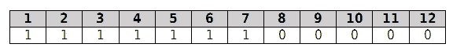
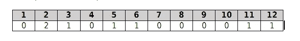
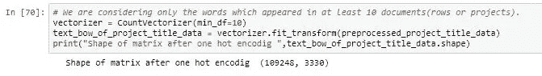
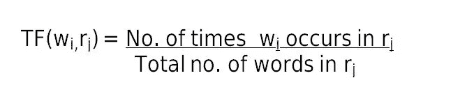
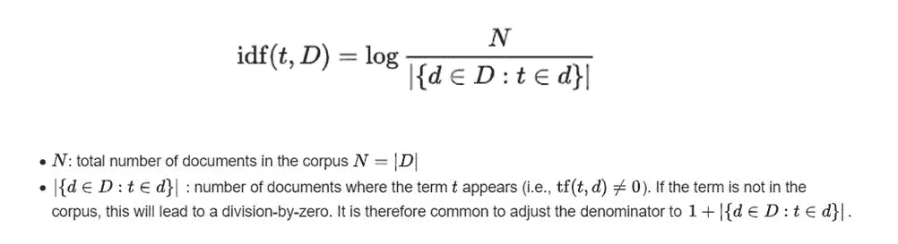
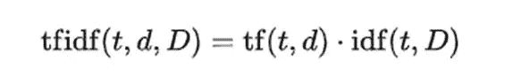
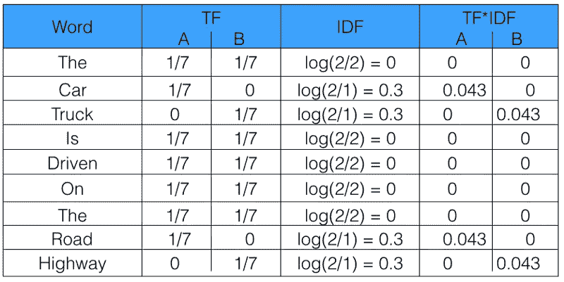
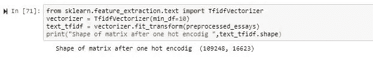

# 单词袋和 TF-IDF 的基础

> 原文：<https://medium.com/analytics-vidhya/fundamentals-of-bag-of-words-and-tf-idf-9846d301ff22?source=collection_archive---------0----------------------->

这篇文章将带你了解机器如何检查两个句子是否有相似意思的基本概念。涉及到 NLP 的一些基本概念。

自然语言处理 ( **NLP** )是计算机科学和人工智能的一个领域，涉及计算机和人类(自然)语言之间的交互，特别是如何对计算机进行编程，以有效地处理大量自然语言数据。

简单来说，自然语言处理(NLP)是计算机理解人类说话的能力。NLP 有助于以一种聪明而有用的方式分析、理解和从人类语言中获取意义。

# **为什么我们需要这样的模型来检查句子之间的相似性？**

对文本建模的一个问题是它很混乱，像机器学习算法这样的技术更喜欢定义良好的固定长度输入和输出。

机器学习算法不能直接处理原始文本；文本必须转换成数字。具体来说，数字的向量。

**概念:相似的文本必须产生更接近的向量。**

> 在语言处理中，向量 x 来自文本数据，以反映文本的各种语言特性

当前使用利用文本数据进行特征提取的流行且简单的方法是:

1.  词汇袋
2.  TF-IDF
3.  Word2Vec

# 包话(鞠躬):

**词袋模型**是在[自然语言处理](https://en.wikipedia.org/wiki/Natural_language_processing)和[信息检索](https://en.wikipedia.org/wiki/Information_retrieval) (IR)中使用的简化表示。在这个模型中，一个文本(比如一个句子或者一个文档)被表示为它的单词的[包(multiset)](https://en.wikipedia.org/wiki/Multiset) ，不考虑语法甚至词序，但是保持[多样性](https://en.wikipedia.org/wiki/Multiplicity_(mathematics))。

单词袋模型通常用于[文档分类](https://en.wikipedia.org/wiki/Document_classification)的方法中，其中每个单词的(出现频率)被用作用于训练[分类器](https://en.wikipedia.org/wiki/Statistical_classification)的[特征](https://en.wikipedia.org/wiki/Feature_(machine_learning))。

单词袋模型易于理解和实现，并在诸如语言建模和文档分类等问题上取得了巨大成功。

它涉及两件事:

1.  **已知单词的词汇表:**这一步围绕着构建一个文档语料库，该语料库由所提供的数据中出现的整个文本中的所有唯一单词组成。这有点像一本字典，每个索引对应一个单词，每个单词是一个不同的维度。

> 例如:如果我们对一道意大利面食有 4 条评价。
> 
> 点评 1:这种面食很好吃，价格也实惠。
> 
> 点评 2:这个面食不好吃，价格实惠。
> 
> 点评 3:这种面食好吃又便宜。
> 
> 点评 4:面食好吃，面食好吃。

现在，如果我们计算所有四篇评论中的独特词的数量，我们将总共得到 12 个独特词。以下是 12 个独特的单词:

1.  “这”
2.  意大利面
3.  '是'
4.  “非常”
5.  “美味”
6.  和'
7.  “负担得起”
8.  “不是”
9.  “美味”
10.  “便宜”
11.  “口味”
12.  很好

**2。已知单词存在的度量:**现在，如果我们对下表中的每个单词进行第一次检查和绘图计数，我们将得到，其中第 1 行对应于唯一单词的索引，第 2 行对应于单词在检查中出现的次数。(此处回顾 1)

我们将生成一个 d-unique 单词的稀疏向量，对于每个文档(review ),我们将填充相应单词在文档中出现的次数。

**点评 4:面食好吃，面食味道好。**

例如，在评论 4 中,“意大利面”具有计数 2，而在评论 1 中它是 2。

在将评论转换成这样的向量后，我们可以比较不同的句子并计算它们之间的欧几里德距离，从而检查两个句子是否相似。如果没有共同的词汇，距离就会大得多，反之亦然。

当我们使用的术语有小的变化时，BOW 不能很好地工作，因为这里我们有意思相似但单词不同的句子。

这会产生一个有很多零分数的向量，称为稀疏向量或稀疏表示。

稀疏向量在建模时需要更多的内存和计算资源，并且大量的位置或维度会使建模过程对于传统算法来说非常具有挑战性。

因此，在使用单词袋模型时，有减少词汇量的压力。

第一步可以使用简单的**文本清理技术**，例如:

> 忽略大小写
> 
> 忽略标点符号
> 
> 忽略不包含太多信息的常用词，称为停用词，如“a”、“of”等。
> 
> 修复拼错的单词。
> 
> 使用词干算法将单词缩减为其词干(例如，从“播放”到“播放”)。

# **N 元模型:**

一个更复杂的方法是创建一个分组单词的词汇表。这既改变了词汇表的范围，又允许单词包从文档中获取更多的含义。

在这种方法中，每个单词或标记被称为一个“**克**”。创造一个由两个单词组成的词汇表，又被称为**二元模型**。同样，只有出现在语料库中的二元模型被建模，而不是所有可能的二元模型。

> *一个 N-gram 是一个 N-token 单词序列:一个 2-gram(通常称为 bigram)是一个两个单词的单词序列，如“请转”、“转你的”或“你的作业”，一个 3-gram(通常称为三元模型)是一个三个单词的单词序列，如“请转你的”或“转你的作业”。*

**弓的代码:**

# TF-IDF:

**TF–IDF**或 **TFIDF** ，是**词频-逆文档频率**的简称，是一个数字统计量，意在反映一个词对于集合中的[文档](https://en.wikipedia.org/wiki/Document)或[语料库](https://en.wikipedia.org/wiki/Text_corpus)的重要性。TF–IDF 值与单词在文档中出现的次数成比例地增加[,并被语料库中包含该单词的文档数量所抵消，这有助于调整某些单词通常更频繁出现的事实。TF–IDF 是当今最流行的术语加权方案之一；数字图书馆中 83%的基于文本的推荐系统使用 TF–IDF。](https://en.wikipedia.org/wiki/Proportionality_(mathematics))

这一概念包括:

> **数数**。计算每个单词在文档中出现的次数。
> 
> **频率**。计算文档中所有单词中每个单词出现的频率。

# **词频:**

术语频率(TF)与信息检索结合使用，并显示表达式(术语、单词)在文档中出现的频率。术语频率表示特定术语在整个文档中的重要性。它是单词 wi 相对于评论 rj 中的总单词数在评论 rj 中出现的次数。

TF 可以说是在文档中找到一个单词的概率是多少(review)。

# 反向文档频率:

逆文档频率是对单词提供多少信息的度量，即它在所有文档中是常见的还是罕见的。它用于计算语料库中所有文档中稀有词的权重。在语料库中很少出现的单词具有高 IDF 分数。它是包含该词的文档的对数比例倒数(通过将文档总数除以包含该词的文档数，然后取该商的对数获得):

# **词频-逆文档频率:**

TF–IDF 计算如下

TF-IDF 中的高权重是通过高术语[频率](https://en.wikipedia.org/wiki/Frequency_(statistics))(在给定文档中)和该术语在整个文档集合中的低文档频率来实现的；因此，权重倾向于过滤掉常见术语。由于 IDF 的对数函数中的比率总是大于或等于 1，因此 IDF(和 TF–IDF)的值大于或等于 0。随着一个术语出现在更多的文档中，对数内部的比率接近 1，使 IDF 和 TF–IDF 更接近 0。

TF-IDF 为文档语料库中不太常用的词提供了较大的值。当 IDF 和 TF 值都很高时，TF-IDF 值也很高，即该词在整个文档中很少见，但在文档中很常见。

TF-IDF 也不接受单词的语义。

**让我们举个例子来更清楚地了解一下。**

第一句话:汽车在路上行驶。

句子 2:卡车在高速公路上行驶。

在这个例子中，每个句子都是一个单独的文档。

我们现在将计算代表我们的语料库的上述两个文档的 TF-IDF。

从上表可以看出，常用词的 TF-IDF 为零，说明它们不显著。另一方面，“汽车”、“卡车”、“公路”和“高速公路”的 TF-IDF 不为零。这些话有更多的意义。

**复习**——tfi df 是本学期 TF 和 IDF 分数的乘积。

**TF** =术语在文档中出现的次数/文档中的总字数

**IDF** = ln(文档数/该术语出现的文档数)

TFIDF 得分越高，该术语越稀有，反之亦然。

TFIDF 被像 Google 这样的搜索引擎成功地用作内容的排名因素。

整个想法是降低频繁出现的术语的权重，同时增加不常用的术语。

**TF-IDF 的代码:**

TFIDF 被像 Google 这样的搜索引擎成功地用作内容的排名因素。

整个想法是降低频繁出现的术语的权重，同时增加不常用的术语。

# Word2Vec:

Word2Vec 模型用于学习单词的向量表示，称为“单词嵌入”。这通常是作为预处理步骤完成的，在此之后，学习到的向量被输入到判别模型(通常是 RNN)中，以生成预测并执行各种有趣的事情。它需要单词的语义。我将在我的下一篇博客中详尽地介绍这个 Word2Vec。—[https://medium . com/analytics-vid hya/deep-dive-into-word 2 vec-7 fcefa 765 c 17](/analytics-vidhya/deep-dive-into-word2vec-7fcefa765c17)

*参考文献:*

 [## tf-idf

### 在信息检索中，tf-idf 或 TFIDF 是词频-逆文档频率的缩写，是一种数值型词频。

en.wikipedia.org](https://en.wikipedia.org/wiki/Tf%E2%80%93idf)  [## 单词袋模型简介

### 词袋模型是在用机器学习算法对文本建模时表示文本数据的一种方式。的…

machinelearningmastery.com](https://machinelearningmastery.com/gentle-introduction-bag-words-model/)